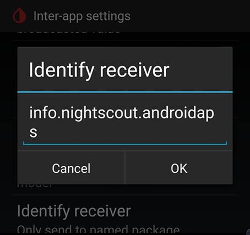

# Nejčastější otázky uživatelů APS

How to add questions to the FAQ: Follow the these [instructions](../SupportingAaps/HowToEditTheDocs.md)

## General

### Can I just download the AAPS installation file?

Ne. APK soubor obsahující AAPS volně ke stažení neexistuje. You have to [build](../SettingUpAaps/BuildingAaps.md) it yourself. Zde je odůvodnění:

AAPS je určen k ovládání Vaší pumpy a podávání inzulinu. Podle současných předpisů jsou v Evropě všechny systémy klasifikované zdravotnickými zařízeními jako IIa nebo IIb, vyžadují regulační schválení (označení CE) a potřebují různé studie a schválení. Distribuce neregulovaných zařízení je nezákonná. Podobná nařízení platí také v ostatních částech světa.

Toto nařízení se netýká pouze prodeje (ve smyslu získat za něco peníze), ale platí pro jakýkoli způsob distribuce (i kdyby byla zdarma). Sestavit si zdravotnické zařízení sám pro sebe je jediným způsobem, jak se tomuto nařízení vyhnout.

Proto nejsou soubory APK k dispozici.

(FAQ-how-to-begin)=

### How to begin?

Za prvé, musíte si **opatřit kompatibilní hardwarové komponenty**:

- A [supported insulin pump](../Getting-Started/CompatiblePumps.md), 
- an [Android smartphone](../Getting-Started/Phones.md) (Apple iOS is not supported by AAPS - you can check [iOS Loop](https://loopkit.github.io/loopdocs/)) and
- a [continuous glucose monitoring system](../Getting-Started/CompatiblesCgms.md). 

Secondly, you have to **setup your software components**: [AAPS](../SettingUpAaps/BuildingAaps.md), [CGM/FGM source](../Getting-Started/CompatiblesCgms.md) and a [reporting server](../SettingUpAaps/SettingUpTheReportingServer.md).

Thirdly, you have to learn and **understand the OpenAPS reference design to check your treatment factors**. The founding principle of closed looping is that your [basal rate and carb ratio](../SettingUpAaps/YourAapsProfile.md) are accurate. Všechna doporučení smyčky předpokládají, že vaše potřeba bazálního inzulínu je pokrytá a všechny vrcholy nebo propady, které vidíte na grafu glykémie, jsou výsledkem jiných faktorů vyžadujících určité jednorázové úpravy (cvičení, stres atd.). Úpravy, které uzavřená smyčka může provést, byly z důvodu bezpečnosti omezené (viz maximální povolená dávka dočasného bazálu v [OpenAPS Reference Design](https://openaps.org/reference-design/)), což znamená, že nechcete plýtvat změnou v dávkováním dočasného bazálu, abyste opravili špatně nastavený bazál. Pokud jste například často příliš nízko ještě před jídlem, pak pravděpodobně vaše bazální dávky potřebují upravit. You can use [Autotune](https://openaps.readthedocs.io/en/latest/docs/Customize-Iterate/autotune.html#phase-c-running-autotune-for-suggested-adjustments-without-an-openaps-rig) to consider a large pool of data to suggest whether and how basals and/or ISF need to be adjusted, and also whether carb ratio needs to be changed. Or you can test and set your basal the [old-fashioned way](https://integrateddiabetes.com/basal-testing/).

### What practicalities of looping do I have?

#### Password protection

Pokud nechcete, aby někdo mohl snadno upravit vaše nastavení, pak můžete celé menu nastavení ochránit heslem tak, že vyberete v menu Nastavení "Heslo do nastavení" a zadáte své zvolené heslo. Při příštím vstupu do menu nastavení po vás bude heslo vyžadováno, abyste mohli pokračovat dál. Pokud budete později chtít odstranit ochranu heslem, pak běžte v menu do "Heslo do nastavení" a odstraňte text.

#### Android Wear Smartwatches

Pokud máte v úmyslu používat Android wear aplikaci pro posílání bolusů nebo změnu parametrů, je třeba zajistit aby nebyla blokovaná oznámení od AAPS. Potvrzení akce přichází prostřednictvím oznámení.

(FAQ-disconnect-pump)=

#### Disconnect pump

Pokud odpojujete inz. pumpu z důvodu sprchování, koupání, plavání, sportu nebo jiných aktivit, musíte AAPS informovat o přerušení dávkování inzulinu, aby IOB bylo vypočítáno správně.

The pump can be disconnected using the Loop Status icon on the [AAPS Home Screen](#AapsScreens-loop-status).

#### Recommendations not only based on one single CGM reading

Z důvodu bezpečnosti nejsou doporučení založena na jediné hodnotě ze senzoru CGM, ale opírají se o průměrnou změnu glykémie. Proto pokud nebyla některá měření ze senzoru zachycena, může trvat nějakou dobu, než AAPS nasbírá potřebná nová data a pak znovu smyčku spustí.

#### Further readings

Existuje několik blogů s dobrými tipy, které vám nabídnou další zásady a praktická doporučení pro provoz smyčky:

- [Fine-tuning Settings](https://seemycgm.com/2017/10/29/fine-tuning-settings/) See my CGM
- [Why DIA matters](https://seemycgm.com/2017/08/09/why-dia-matters/) See my CGM
- [Limiting meal spikes](https://diyps.org/2016/07/11/picture-this-how-to-do-eating-soon-mode/) #DIYPS
- [Hormones and autosens](https://seemycgm.com/2017/06/06/hormones-2/) See my CGM

### What emergency equipment is recommended to take with me?

Je potřeba, abyste u sebe měli stejné nouzové vybavení, jako všichni ostatní DM1 pacienti s inzulínovou pumpou. Pokud používáte smyčku systému AAPS, je důrazně doporučeno mít u sebe, nebo v dosahu, následující vybavení:

- Náhradní baterie a nabíjecí kabely pro nabití Vašeho chytrého telefonu nebo hodinek (je-li to potřeba). BT čtečku nebo zařízení na propojení.
- Baterie do pumpy
- Current [apk](../SettingUpAaps/BuildingAaps.md) and [preferences files](../Maintenance/ExportImportSettings.md) for AAPS and any other apps you use (e.g. xDrip+, BYO Dexcom) both locally and in the cloud (Dropbox, Google Drive).

### How can I safely and securely attach the CGM/FGM?

Můžete ho přelepit. K dispozici je několik předperperforovaných "přelepů" pro běžné CGM systémy (najdete na Google, eBay nebo Amazonu). Někteří uživatelé používají levnější standardní kineziologické tejpy nebo Rocktape.

Můžete to opravit. Můžete si zakoupit speciální náramky na paži, které upevňují CGM/FGM pomocí pásku (hledejte na Googlu, eBay nebo Amazonu).

## APS algorithm

### Why does it show "dia:3" in the "OPENAPS AMA"-tab even though I have a different DIA in my profile?

V AMA režimu ve skutečnosti DIA neznamená „doba působnosti inzulínu“. Je to parametr, který dříve souvisel s DIA. Parametr nyní znamená, „do kdy by měla být korekce dokončená“. Nemá to žádnou souvislost s výpočtem IOB. V režimu OpenAPS SMB již tento parametr není vůbec potřebný.

## Other settings

### Nightscout settings

#### AAPSClient says 'not allowed' and does not upload data. What can I do?

In AAPSClient check 'Connection settings'. Možná zrovna nejste na povolené síti WLAN nebo jste aktivovali možnost 'Pouze při nabíjení' a nabíjecí kabel není připojen.

### CGM settings

#### Why does AAPS say 'BG source doesn't support advanced filtering'?

If you do use another CGM/FGM than Dexcom G5 or G6 in xDrip native mode, you'll get this alert in AAPS OpenAPS-tab. See [Smoothing blood glucose data](../CompatibleCgms/SmoothingBloodGlucoseData.md) for more details.

### Pump

#### Where to place the pump?

Existuje bezpočet možností, kam pumpu umístit. Nezáleží na tom, zda používáte smyčku nebo ne.

#### Batteries

Smyčka může vybíjet baterii rychleji než v normálním režimu. Je to proto, že systém s pumpou komunikuje přes bluetooth mnohem víc, než by toto uživatel dělal ručně. Nejlepší je vyměnit baterii už při 25%, jinak už může být komunikace s pumpou nespolehlivá. Můžete si k tomu nastavit varovný alarm pro vybití baterie pumpy tak, že nastavíte proměnnou PUMP_WARN_BATT_P své Nightscout stránky. Mezi triky, jak zvýšit životnost baterie, patří:

- Zkraťte časový interval pro podsvícení LCD displeje (v menu nastavení pumpy).
- Zkraťte časový interval pro podsvícení (v menu nastavení pumpy).
- Nastavte upozorňování tak, aby se namísto vibrace ozýval zvukový signál (v menu nastavení pumpy).
- only press the buttons on the pump to reload, use AAPS to view all history, battery level and reservoir volume.
- AAPS app may often be closed to save energy or free RAM on some phones. When AAPS is reinitialized at each startup it establishes a Bluetooth connection to the pump, and re-reads the current basal rate and bolus history. To vybíjí baterii. Abyste zjistili, jestli k tomu dochází, běžte do Nastavení > NSClient a zapněte 'Logovat spuštění aplikace do NS'. Nightscout will receive an event at every restart of AAPS, which makes it easy to track the issue. To reduce this happening, whitelist AAPS app in the phone battery settings to stop the app power monitor closing it down.
    
    Chcete-li například zakázat úsporu energie na telefonu Samsung se systémem Android Pie:
    
    - Přejděte do Nastavení -> Údržba zařízení -> Baterie 
    - Scroll until you find AAPS and select it
    - Zrušte označení možnosti „Přepnout aplikaci do režimu spánku“
    - ROVNĚŽ přejděte do nabídky Nastavení -> Aplikace -> (Tři tečky v pravém horním rohu) vyberte „zvláštní přístup“ -> Optimalizovat využití baterie
    - Scroll to AAPS and make sure it is de-selected.

- očistěte póly baterie alkoholem, aby na nich nezůstala případná mastnota/nečistota z výroby.

- for [Dana R/RS pumps](../CompatiblePumps/DanaRS-Insulin-Pump.md) the startup procedure draws a high current across the battery to purposefully break the passivation film (prevents loss of energy whilst in storage) but it doesn't always work to break it 100%. Buďto baterie 2krát až 3krát vyjměte a znovu vložte (než se na obrazovce ukáže 100%), anebo před vložením baterií použijte bateriový klíč ke chvilkovému zkratu (přiložením k oběma pólům baterie na zlomek sekundy).
- see also more tips for [particular types of battery](#Accu-Chek-Combo-Tips-for-Basic-usage-battery-type-and-causes-of-short-battery-life)

#### Changing reservoirs and cannulas

The change of cartridge cannot be done via AAPS but must be carried out as before directly via the pump.

- Long press on "Open Loop"/"Closed Loop" on the Home tab of AAPS and select 'Suspend Loop for 1h'
- Now nnect the pump and change the reservoir as per pump instructions.
- Doplňování a plnění hadičky a kanyly můžete udělat také přímo na pumpě. In this case use [PRIME/FILL button](#screens-action-tab) in the actions tab just to record the change.
- Jak budete mít pumpu znovu připojenou, obnovte smyčku dlouhým stiskem na 'Pozastaveno (X min)'.

Při výměně kanyly nicméně nepoužívejte "plnění infuzního setu" na pumpě, ale pro plnění infuzního setu a/nebo kanyly použijte bolus, který se neobjeví v historii bolusů. To znamená, že se nepřeruší běžící dočasná bazální dávka. On the Actions (Act) tab, use the [PRIME/FILL button](#screens-action-tab) to set the amount of insulin needed to fill the infusion set and start the priming. Pokud množství není dostatečné, opakujte plnění. Můžete si nastavit výchozí množství pro plnění v Nastavení > Jiné > Hodnoty plnění/doplňování. Podívejte se do příbalového letáku kanyly, kolik jednotek je nutné do kanyly naplnit podle délky jehly a hadičky.

### Wallpaper

You can find the AAPS wallpaper for your phone on the [phones page](#Phones-phone-wallpaper).

### Daily usage

#### Hygiene

##### What to do when taking a shower or bath?

Při sprchování a koupání si můžete pumpu sundat. Na tak krátkou dobu to sice není třeba dělat, ale měli byste AAPS dát vědět že jste pumpu odpojili, aby byly výpočty IOB správné. See [description above](#FAQ-disconnect-pump).

#### Work

V závislosti na druhu vaší práce se můžete rozhodnout, že v pracovních dnech budete mít jiné nastavení. As a looper you should consider a [profile switch](../DailyLifeWithAaps/ProfileSwitch-ProfilePercentage.md) for your typical working day. Například, můžete přepnout na profil větší než 100% v případě, že vaše práce spočívá v sezení za kancelářským stolem, nebo naopak nižší než 100%, jste-li aktivní a celý den na nohou. You could also consider a high or low temporary target or a [time shift of your profile](#ProfileSwitch-ProfilePercentage-time-shift-of-the-circadian-percentage-profile) when working much earlier or later than regular, of if you work different shifts. Můžete si také vytvořit druhý profil (např. "doma" nebo "pracovní den"), a přepnout se na ten, který momentálně potřebujete.

### Leisure activities

(FAQ-sports)=

#### Sports

Budete muset změnit své staré sportovní návyky z doby, kdy jste ještě nepoužívali smyčku. Pokud budete při sportu dokrmovat sacharidy jako dříve, systém uzavřené smyčky to pozná a bude se snažit je korigovat.

Takže byste sice měli více zkonzumovaných sacharidů, ale smyčka by na ně zároveň vydala inzulin.

Při používání smyčky byste měli vyzkoušet tyto kroky:

- Make a [profile switch](../DailyLifeWithAaps/ProfileSwitch-ProfilePercentage.md) < 100%.
- Set an [activity temp target](#TempTargets-activity-temp-target) above your standard target.
- If you are using SMB make sure ["Enable SMB with high temp targets"](#Open-APS-features-enable-smb-with-high-temp-targets) and ["Enable SMB always"](#Open-APS-features-enable-smb-always) are disabled.

Provedení změn před sportem a po sportu je velmi důležité. Proveďte změny v čase před sportem a zvažte vliv svalového plnění.

If you do sports regularly at the same time (i.e. sports class in your gym) you can consider using [automation](../DailyLifeWithAaps/Automations.md) for profile switch and TT. Bylo by možné použít automatizaci na základě polohy, ale obtížně se pak kontroluje včasné provedení změny nastavení.

Procentuální hodnota přepnutí profilu, hodnota pro váš dočasný cíl Aktivita a optimální čas pro změnu nastavení jsou velmi individuální. Při zjišťování správných hodnot se v zájmu bezpečnosti držte při zdi (začněte raději s nižší procentuální hodnotou a vyšším dočasným cílem).

#### Sex

You can remove the pump to be 'free', but you should tell AAPS so that the IOB calculations are correct. See [description above](#FAQ-disconnect-pump).

#### Drinking alcohol

Požívání alkoholu je v režimu uzavřené smyčky poměrně riskantní, protože algoritmus uzavřené smyčky nedokáže správně předpovědět, jak bude glykémie alkoholem ovlivněna. You have to check out your own method for treating this using the following functions in AAPS:

- Vypnout režim uzavřené smyčky a provést nezbytné zásahy ručně nebo
- nastavit vyšší dočasný cíl a vypnout funkci UAM, aby smyčka nezvyšovala váš IOB kvůli neoznámenému jídlu nebo
- provést přepnutí profilu a nastavit profil na výrazně nižší hodnoty než 100 % 

Jestliže požíváte alkohol, je nezbytné průběžně sledovat CGM a ručně předcházet hypoglykemii příjmem sacharidů.

#### Sleeping

##### How can I loop during the night without mobile and WIFI radiation?

Mnoho uživatelů zapíná v noci telefon v režimu letadlo. If you want the loop to support you when you are sleeping, proceed as follows (this will only work with a local BG-source such as xDrip+ or ['Build your own Dexcom App'](#DexcomG6-if-using-g6-with-build-your-own-dexcom-app), it will NOT work if you get the BG-readings via Nightscout):

1. Zapněte na mobilu režim letadlo.
2. Počkejte dokud není režim aktivní.
3. Zapněte Bluetooth.

Nebudete schopni přijímat telefonní hovory ani nebudete mít přístup na internet. Ale smyčka poběží.

Objevily se problémy s lokálním odesíláním dat (AAPS nepřijímal nové hodnoty BG z xDrip+) v případě, že byl zapnutý mód letadlo. Jděte do Nastavení > Komunikace mezi zařízeními > Identify receiver, a vložte hodnotu `info.nightscout.androidaps`.

#### Travelling

##### How to deal with time zone changes?

S DanouR a korejskou verzí DanyR nemusíte dělat nic. For other pumps see [time zone travelling](../DailyLifeWithAaps/TimezoneTraveling-DaylightSavingTime.md) page for more details.

### Medical topics

#### Hospitalization

If you want to share some information about AAPS and DIY looping with your clinicians, you can print out the [guide to AAPS for clinicians](../UsefulLinks/ClinicianGuideToAaps.md).

#### Medical appointment with your endocrinologist

##### Reporting

Můžete ukázat své výkazy z Nightscoutu (https://ADRESA-VAŠEHO-NS.com/report) nebo vyzkoušet nástroj [Nightscout Reporter](https://nightscout-reporter.zreptil.de/).

## Frequent questions on Discord and their answers...

### My problem is not listed here.

[Informace pro získání pomoci.](../GettingHelp/WhereCanIGetHelp.md)

### My problem is not listed here but I found the solution

[Informace pro získání pomoci.](../GettingHelp/WhereCanIGetHelp.md)

**Dejte nám vědět, abychom přidali vaše řešení do tohoto seznamu!**

### AAPS stops everyday around the same time.

Vypněte Google Play Protect. Zkontrolujte zda nemáte aktivní "čistící" aplikace (např. CCleaner atd.), a odinstalujte je. AAPS / 3 tečky menu / O / klikněte na odkaz "Ponechat aplikaci běžet na pozadí", abyste zrušili všechny optimalizace baterie.

### How to organize my backups ?

Nastavení exportujte pravidelně: po každé změně podu, po úpravě profilu, pokud jste splnili cíl, když změníte pumpu… A i když nedojde k žádným změnám, exportujte jednou měsíčně. Vždycky si ponechávejte několik starších exportů.

Nahrajte si na cloudové úložiště (Dropbox, Google etc) všechny apk soubory, které jste použili pro instalaci aplikací do telefonu (AAPS, xDrip, BYODA, Patched LibreLink…), a také exportované soubory s nastavením ze všech vašich aplikací.

### I have problems, errors building the app.

Prosím

- check [Troubleshooting Android Studio](../GettingHelp/TroubleshootingAndroidStudio) for typical errors and
- tipy na [krok za krokem](https://docs.google.com/document/d/1oc7aG0qrIMvK57unMqPEOoLt-J8UT1mxTKdTAxm8-po).

### I'm stuck on an objective and need help.

Udělejte screenshot obrazovky s otázkou a odpovědí. Pošlete ho na Discord do kanálu AAPS. Nezapomeňte napsat, které možnosti jste vybral (nebo ne), a proč. Následně dostanete tipy a pomoc, ale odpovědi si budete muset najít sami.

### How to reset the password in AAPS v2.8.x ?

Otevřete hamburger menu, spusťte průvodce nastavením, a když budete vyzváni, zadejte nové heslo. Průvodce můžete ukončit po fázi hesla.

### How to reset the password in AAPS v3.x

You find the documentation [here](#Update3_0-reset-master-password).

### My link/pump/pod is unresponsive (RL/OL/EmaLink…)

With some phones, there are Bluetooth disconnects from the Links (RL/OL/EmaL...).

Some also have non responsive Links (AAPS says that they are connected but the Links can't reach or command the pump.)

The easiest way to get all these parts working together is : 1/ Delete Link from AAPS 2/ Power off Link 3/ AAPS 3 dot menu, quit AAPS 4/ Long press AAPS icon, Android menu, info on app AAPS, Force stop AAPS and then Delete cache memory (Do not delete main memory !) 4bis/ Rarely some phones may need a reboot here. You can try without reboot. 5/Power on Link 6/Start AAPS 7/Pod tab, 3 dot menu, search and connect Link

### Build error: file name too long

Při pokusu o sestavení dostávám chybu, že název souboru je příliš dlouhý. Možná řešení: Přesuňte své zdrojové soubory do adresáře blíže ke kořenovému adresáři vaší jednotky (např. "c:\src\AndroidAPS").

Z Android Studio: Ujistěte se, že "Gradle" po otevření projektu a stažení z GitHubu dokončil synchronizaci a indexování. Před Rebuild Project proveďte Build->Clean Project. Spusťte File->Invalidate Caches, a následně restartujte Android Studio.

### Alert: Running dev version. Closed loop is disabled

AAPS is not running in "developer mode". AAPS zobrazí následující zprávu: "běží dev verze. Uzavřená smyčka je zakázána".

Make sure AAPS is running in "developer mode": Place a file named "engineering_mode" at the location "AAPS/extra". Dokud bude libovolný správně pojmenován, bude to fungovat. Make sure to restart AAPS for it to find the file and go into "developer mode".

Tip: Vytvořte su kopii existujícího souboru s logy, a přejmenujte ho na "engineering_mode" (poznámka: bez přípony souboru!).

### Where can I find settings files?

Soubory s nastavením jsou uloženy v interním úložišti telefonu v adresáři "/AAPS/preferences". VAROVÁNÍ: Ujistěte se, že znáte své heslo, protože bez něj nebudete moci šifrovaný soubor s nastavením naimportovat!

### How to configure battery savings?

Properly configuring Power Management is important to prevent your Phone's OS to suspend AAPS and related app's and services when your phone is not being used. As a result AAPS can not do its work and/or Bluetooth connections for sensor and Rileylink (RL) may be shut down causing "pump disconnected" alerts and communication errors. On the phone, go to settings->Apps and disable battery savings for: AAPS xDrip or BYODA/Dexcom app The Bluetooth system app (you may need to select for viewing system apps first) Alternatively, fully disable all battery savings on the phone. As a result your battery may drain faster but it is a good way to find out if battery savings is causing your problem. The way battery savings is implemented greatly depends on the phone's brand, model and/or OS version. Because of this it is almost impossible to give instructions to properly set battery savings for your setup. Experiment on what settings work best for you. For additional information, see also Don't kill my app

### Pump unreachable alerts several times a day or at night.

Your phone may be suspending AAPS services or even Bluetooth causing it to loose connection to RL (see battery savings) Consider configuring unreachable alerts to 120 minutes by going to the top right-hand side three-dot menu, selecting Preferences->Local Alerts->Pump unreachable threshold [min].

### Where can I delete treatments in AAPS v3 ?

3 dots menu, select treatements, then 3 dots menu again and you have different options available.

### Configuring and Using the AAPSClient remote app

AAPS can be monitored and controlled remotely via the AAPSClient app and optionally via the associated Wear app running on Android Wear watches. Note that the AAPSClient (remote) app is distinct from the NSClient configuration in AAPS, and the AAPSClient (remote) Wear app is distinct from the AAPS Wear app--for clarity the remote apps will be referred to as 'AAPSClient remote' and 'AAPS remote Wear' apps.

To enable AAPSClient remote functionality you must: 1) Install the AAPSClient remote app (the version should match the version of AAPS being used) 2) Run the AAPSClient remote app and proceed through the configuration wizard to grant required permissions and configure access to your Nightscout site. 3) At this point you may want to disable some of the Alarm options, and/or advanced settings which log the start of the AAPSClient remote app to your Nightscout site. Once this is done, AAPSClient remote will download Profile data from your Nightscout site, the 'Overview' tab will display CGM data and some AAPS data, but but may not display graph data, and will indicate that a profile isn't yet set. 4) To activate the profile:

- Enable remote profile synchronization in AAPS > NSClient > Options
- Activate the profile in NSClient remote > Profile After doing so, the profile will be set, and AAPSClient remote should display all data from AAPS. Hint: If the graph is still missing, try changing the graph settings to trigger an update. 5) To enable remote control by the AAPSClient, selectively enable the aspects of AAPS (Profile changes, Temp Targets, Carbs, etc.) that you would like to be able to control remotely via AAPS > NSClient > Options . Once these changes are made, you'll be able to remotely control AAPS via either Nightscout or AAPSClient remote.

If you'd like to monitor/control AAPS via the AAPSClient remote Wear App, you'll need both AAPSClient remote and the associated Wear app to be installed. To compile the AAPSClient remote Wear app, follow the standard instructions for installing/configuring the AAPS wear app, except when compiling it, choose the AAPSClient variant.

### I have a red triangle / AAPS won't enable closed loop / Loops stays in LGS / I have a yellow triangle

The red and yellow triangles are a security feature in AAPS v3.

Red triangle means that you have duplicate BGs and AAPS can't calculate precisely the deltas. You can't close the loop. You need to delete one BG of each duplicated value in order to clear the red triangle. Go to BYODA or xDRIP tab, long press one line you want to delete, check one of each lines that are doubled (or via 3 dots menu and Delete, depending on your AAPS version). You may need to reset the AAPS databases if there are too many double BGs. In this case, you'll also loose stats, IOB, COB, selected profile.

Possible origin of the problem: xDrip and/or NS backfilling BGs.

The yellow triangle means unstable delay between each BG reading. You don't receive BGs every 5 min regularly or missing BGs. It is often a Libre problem. It also happens when you change G6 transmitter. If the yellow triangle is related to the G6 tansmitter change, it will go away by itself after several hours (around 24h). In case of Libre, the yellow triangle will stay. The loop can be closed and works correctly.

### Can I move an active DASH Pod to other hardware?

This is possible. Note that as moving is "unsupported" and "untested" there is some risk involved. Best to try the procedure when your Pod is about to expire so when things go wrong not much is lost.

Critical is that pump "state" (which includes it's MAC address) in AAPS and DASH match on reconnecting

### Procedure I follow in this:

1) Suspend the DASH pump. This makes sure there are no running or queued commands active when DASH loses connection 2) Put the phone into airplane mode to disable BT (as well as WiFi and Mobile data). This way it is guaranteed AAPS and DASH can not communicate. 3) Export settings (which includes the DASH state) 4) Copy the settings file just exported from the phone (as it is in airplane mode and we do not want to change that, easiest way is using USB cable) 5) Copy the settings file to the alternate phone. 6) Import settings on the alternate phones AAPS. 7) Check the DASH tab to verify it is seeing the Pod. 8) Un-suspend the Pod. 9) Check the DASH tab and confirm it is communicating with the Pod (use the refresh button)

Congratulations: you did it!

*Wait!* You still have the main phone thinking it can reconnect to the same DASH:

1) On the main phone choose "deactivate". This is safe because the phone has no way of communicating with DASH to actually deactivated the Pod (it is still in airplane mode) 2) Deactivation will result in a communications error - this is expected. 3) Just hit "retry" a couple of times until AAPS offers the option to "Discard" the Pod.

When Discarded, verify AAPS is reporting "No Active Pod". You can now safely disable airplane mode again.

### How do I import settings from earlier versions of AAPS into AAPS v3 ?

You can only import settings (in AAPS v3) that were exported using AAPS v2.8x or v3.x. If you were using a version of AAPS older than v2.8x or you need to use setting exports older than v2.8x, then you need to install AAPS v2.8 first. Import the older settings of v2.x in v2.8. After checking that all is OK, you can export settings from v2.8. Install AAPS v3 and import v2.8 settings in v3.

If you use the same key to build v2.8 and v3, you won't even have to import settings. You can install v3 over v2.8.

There were some new objectives added. You'll need to validate them.