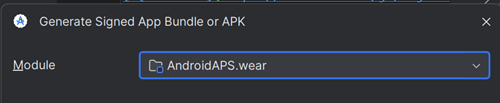
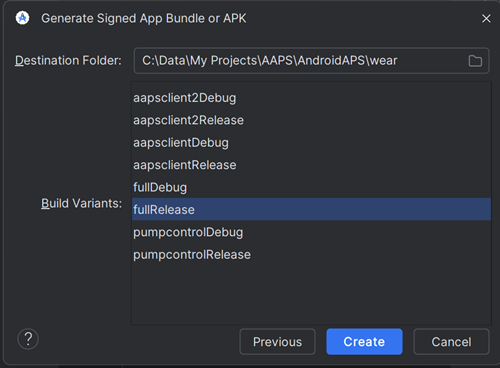

# Building the Wear AAPS app

Aplikace Wear OS **AAPS**  („Wear OS apk“), která je potřebná pro chytré hodinky, byla oddělena od "full" **AAPS** sestavení pro Android telefony. Proto musíte vygenerovat druhý instalační nebo apk soubor, abyste mohli instalovat **AAPS** na hodinky (což se prováděno načtením z telefonu (side-loading)). Důrazně se doporučuje vytvořit **AAPS** Wear apk soubor okamžitě po sestavení full apk verze pro telefon. Not only is this very quick to do if you are [building **AAPS** for the first time](../SettingUpAaps/BuildingAaps.md), but it will avoid any potential compatibility issues when you try to set up the watch-phone communication. **AAPS** wear apk na hodinkách bude pravděpodobně nekompatibilní s **AAPS** full apk na telefonu, pokud byly sestaveny v různých verzích Android Studia nebo pokud uplynuly měsíce od úvodního sestavení aplikace.

Pokud již používáte **AAPS** na telefonu a nevytvořili jste zároveň **AAPS** pro telefon i hodinky, pro zajištění úspěchu je nejlepší řešení sestavit obě aplikace znovu ve stejný čas. Build the AAPS phone and watch apks at the same time, using the same **keystore file**.

## Supported Wear OS versions

AAPS requires at least Wear OS API level 28 (Android 9).

```{warning}
AAPS Watchfaces are available for Wear OS smartwatches with API level 28 to 33.<br>
Wear OS 5 has [limitations](BuildingAapsWearOs-WearOS5).
```

## Sestavení **AAPS** Wear apk

The build process for the Wear apk is similar to that for the "full" phone apk.

- Follow the instructions for [Building AAPS](../SettingUpAaps/BuildingAaps.md).
- When you reach [module selection](#Building-APK-wearapk) in "Build the AAPS signed apk", make sure to select **`AndroidAPS.wear`**.



Select "**fullRelease**" to generate the **AAPS** Wear apk file.



Pokud chcete, můžete místo toho vybrat **"pumpcontrolRelease"** z drop-down menu, což vám umožní vzdáleně ovládat pumpu, ale bez možnosti spuštění smyčky.

## Troubleshooting

V procesu vytváření plné **AAPS** aplikace verze 3.2 (a vlastně jakékoli podepsané aplikace) Android Studio vygeneruje ve stejném adresáři soubor s příponou .json. This then causes errors with [uncommitted changes](#troubleshooting_androidstudio-uncommitted-changes) when you try to build the next signed app, like the **AAPS** wear app. Nejrychlejší způsob, jak to vyřešit, je přejít do složky, kde byla sestavena plná aplikace AAPS. Vaše složka je pravděpodobně na adrese:

`C:\Users\Your Name\AndroidStudioProjects\AndroidAPS\app\aapsclient\release.`

Buď odstraňte nebo přesuňte nepotřebný .json soubor z této složky. Potom zkuste znovu vytvořit **AAPS** wear aplikaci. If that doesn't work, the more detailed [troubleshooting guide](../GettingHelp/TroubleshootingAndroidStudio.md) will help you to identify the specific file causing the issue, which could also be your keystore file. 