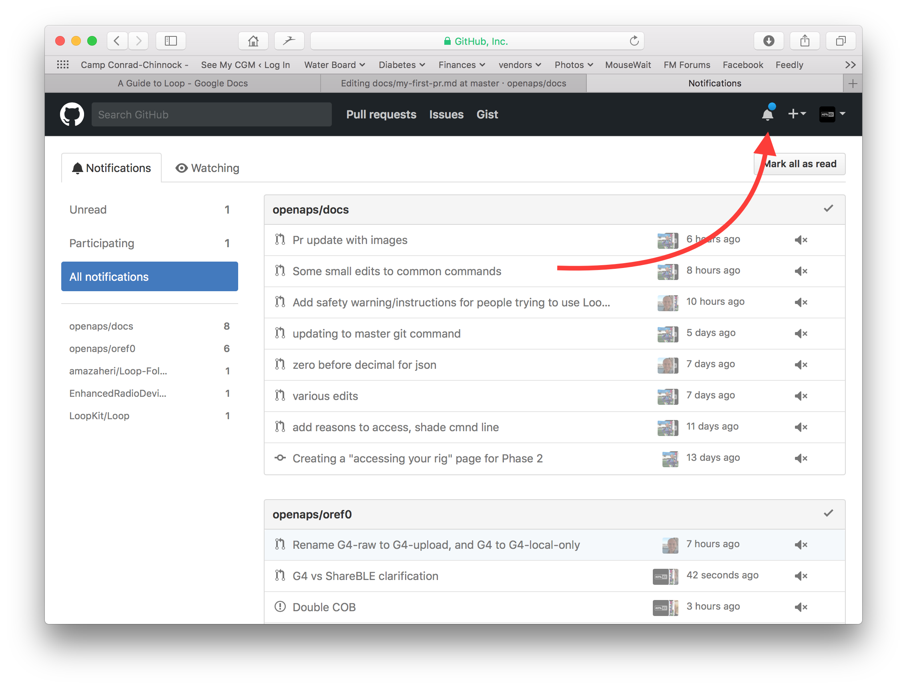

# How to edit the docs

**Tento popis je pouze pro editaci anglické dokumentace. Všechny nové informace musí být přidány nejdřív v angličtině. Pokud chcete přeložit wiki do jiných jazyků (děkujeme), použijte prosím [crowdin](https://crowdin.com/project/androidapsdocs).**

For hints how to format text (headline, bold...) and set links please see the ["code syntax"](#code-syntax) section of this page.

## Obecné

For any questions, feedback or new ideas you can contact the documentation team via [discord](https://discord.gg/4fQUWHZ4Mw). Vytvoření PR není obtížné, ale můžeme vám pomoci editovat dokumentaci.

V určitém okamžiku bude doporučeno, abyste udělali PR. PR je zkratka pro pull request a je to způsob, jak přidat nebo editovat informace uložené v GitHubu. Ve skutečnosti není příliš těžké udělat takový krok a je to skvělý způsob, jak přispět. Tato dokumentace je zde proto, že lidé, jako jste vy, udělali svůj PR. Nebojte se, že uděláte chybu nebo nějak editujete špatné dokumenty. Před sloučením změn do „formálního“ repositáře dokumentace AndroidAPS je zde vždy proces přezkumu. Nějakou chybou nemůžete originál poškodit. Obecný proces je:

* Edituje a vylepšuje kód nebo dokumentaci editací stávajícího obsahu.
* Zkontrolujte, že vaše úpravy vypadají dobře.
* Udělejte několik poznámek o tom, co je změněno, aby lidé mohli porozumět editacím.
* Vytvořte PR, která žádá správce, aby se tyto změny použily.
* Ten provede přezkum a buď (1) sloučí vaše změny, (2) přidá komentář k vašim změnám, nebo (3) založí nový dokument s vašimi změnami.

(Poznámka: Pokud se učíte spíše vizuálně, existuje YouTube video [zde](https://youtu.be/4b6tsL0_kzg) ukazující, jak PR funguje.)

Například: chystáme se upravit AndroidAPSdocs. To není nutné dělat v linuxovém prostředí. To lze udělat na jakémkoli Windows PC, Mac atd. (libovolném počítači s připojením k internetu).

1. Jděte na https://github.com/openaps/AndroidAPSdocs a kliněte na Fork v horním rohu, abyste si vytvořili vlastní kopii repozitáře.

2. Go to any page and navigate to the page you want to edit. Klikněte na černou oblast dole na stránce se zeleným slovem "v: latest" nebo podobné. In the pop up window that appears, click the word "edit" for editing in GitHub. 

     Or you can click on the "Edit in GitHub" link in the upper right corner, and then click the pencil icon that appears in the top bar of the page contents to be edited.
    

3. One or the other of the options in Step 2 will create a new branch in YOUR repository where your edits will be saved. Make your edits to the file.

We are using markdown for the docs pages. The file have got the suffix ".md".The Markdown specification is not fixed and we use at the moment the myst_parser for our markdown files. Take care to use the correct syntax as [described below](./make-a-PR.md#code-syntax).

4. Pracujete v záložce "<>Edit file". Vyberte záložku "Preview changes" pro nový náhled, abyste zjistili, že vše, co jste změnili, je to, co jste chtěli. Pokud vidíte, že je potřeba další zlepšení, vraťte se zpět na záložku editace a pokračujte. 

5. Když jste dokončili své úpravy, přesuňte se do dolní části stránky. V obdélníku dole napište komentář do textového pole "Add an optional extended description...". Výchozí název má jméno souboru. Zkuste přidat větu s vysvětlením **důvodu** změny. Pomůže to při kontrole, o jakou změnu se pokoušíte.

6. Klikněte na zelené tlačítko "Propose file changes" nebo "Commit changes". Na stránce se pak objeví tlačítko "Create Pull Request" a znovu na další stránce klepněte na tlačítko "Create Pull Request".

7. Tím dokončíte žádost PR. GitHub přiděluje PR číslo, které se nachází za názvem a hashovou značkou. Return to this page to check for feedback (or, if you have GitHub notifications emailed to you, you will get emails notifying you of any activity on the PR). Žádost o změnu bude nyní na seznamu PR, který bude tým přezkoumávat a případně poskytne zpětnou vazbu před tím, než začlení změnu do hlavní dokumentace pro AndroidAPS! Pokud chcete zkontrolovat pokrok ve zpracování PR, můžete kliknout na symbol zvonku v horním pravém rohu svého účtu na GitHub a uvidíte všechny své PR.

PS: Your fork and branch will still be sitting on your own personal GitHub account. After you get a notification that your PR has been merged, you can delete your branch if you are done with it (Step 8's notification area will provide a link to delete the branch once it has been closed or merged). For future edits, if you follow this procedure the edits will always start with an updated version of the AndroidAPSdocs repositories. If you choose to use another method to start a PR request (e.g., editing starting from your forked repo's master branch as the starting point), you will need to ensure your repo is up-to-date by performing a "compare" first and merging in any updates that have happened since you last updated your fork. Since people tend to forget to update their repos, we recommend using the PR process outlined above until you get familiar with performing "compares".

(code-syntax)=

## Code syntax

We are using markdown for the docs pages. The files have got the suffix ".md".

(image-size)=

### Image size

If using images please use reasonable sizes. Screenshot images should be up to **1050 pixels wide**.

### Text format

* bold: `**text**`
* italic: `*text*`
* Headline 1: `# headline`
* Headline 2: `## headline`
* Headline 3: `### headline`

### ordered list

    1. first
    1. second
    1. third
    

1. first
2. second
3. third

### unordered list

    - one element
    - another element
    - and another element
    

* one element
* another element
* and another element

### multi level list

You can insert lists in lists by indenting the nect level with 4 more spaces to the right than the one before.

    1. first
    1. second
    1. third
      1. one element
      1. another element
      1. and another element
    1. four
    1. five
    1. six
    

1. first
2. second
3. third 1. one element 1. another element 1. and another element
4. four
5. five
6. six

### Images

* images: ``

### Links

* external link: `[alt text](www.url.tld)`
* internal link to .md page: `[alt text](../folder/file.md)`
* internal link to headline: `[alt text](../folder/file.html#headline)`

### Internal links

If you want to set an internal link within the AndroidAPS documentation, please only use **relative links**. Only this will make the link work in the other languages (Czech, German...) as well.

* `[text](../Usage/Test.md)` will set an internal hyperlink one directory up from where you are and then into the subdirectory /Usage. Ending of the target file must be .md or .rst (not .html)
* `[text](./Usage/Test.md)` will set an internal hyperlink from where you are into /Usage. Ending of the target file must be .md
* To set the link to an **anchor** (i.e. a headline) you let the file extension .md in place! 
  * `[text](../Usage/Test.md#anchor)`

### Notes

    :::{admonition} Friendly Note
    :class: note
    
    This is a note.
    :::
    

:::{admonition} Friendly Note :class: note

This is a note. :::

### Warnings

    :::{admonition} Strong Warning
    :class: warning
    
    This is a warning.
    :::
    

:::{admonition} Strong Warning :class: warning

This is a warning. :::

## Adding multiple images to the documentation

If you are planning to make a lot of edits, including adding images to help illustrate parts of the documentation (thank you!), you may want to take the following approach:

* As you go and save screenshots, rename the screenshots to a descriptive name - but try not to use spaces as that confuses GitHub. Instead, use underscores. I.e. Example_batch_images_upload.png rather than "Example batch images upload.png". 
* Please use reasonable sizes. Screenshot images should be up to **1050 pixels wide**.
* You can upload images in batches easily by:
  
  1. Navigate to the images folder (https://github.com/openaps/AndroidAPSdocs/tree/master/docs/EN/images - but make sure you are in your fork/copy of the docs Images folder to be able to do this (replace "openaps" in the URL with your GitHub username)).
  
  2. Click in the upper right corner where it says "Upload files"
  
  3. Drag and drop your images into the screen
  
  4. Commit these to your branch
  
  5. Now, you can look for the URL/relative path of each file and use that to refer to when adding images into a page in the documentation.
  
  6. To see examples of how to add the images, you can look at the "raw" code of a page to see an example from a page that already has the images embedded successfully. Make sure you use the [correct code](./make-a-PR.html#code-syntax) for the page type you are on (.md or .rst). The main thing is to have a plain text description, followed by a link with a relative path to the image, like this:
    
    * For .md pages: `` (That code is exactly how the image below is embedded to be displayed.)
    * For .rst pages: `.. image:: ../images/Example_batch_images_upload.png`  
      `:alt: Example of uploading images in batches`

7. After adding images or making adjustments, you can submit a PR to the master branch of AndroidAPSdocs.