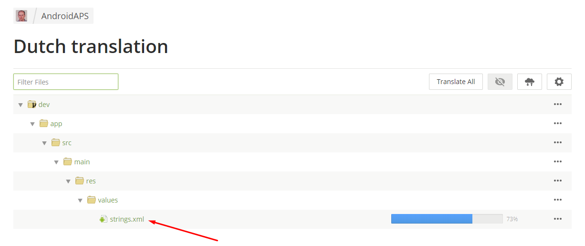

# Jak překládat AndroidAPS a dokumentaci

* Jděte na <https://translations.androidaps.org> nebo <https://wikitranslations.androidaps.org> a přihlaste se Vaším Github účtem

* Odešlete žádost o připojení k Wiki týmu. Klikněte na vlajku požadovaného jazyka a poté na tlačítko "Join" vpravo nahoře na následující stránce. Specifikujte prosím svůj jazyk, uveďte nějaké informace o sobě a svých zkušenostech s AAPS a zda chcete být překladatel nebo korektor (pouze osoby se zkušeností s překlady + pokročilí uživatelé AndroidAPS).

* Jakmile vás schválíme, klikněte na vlajku 

## Překlad stringů pro aplikaci AndroidAPS

* Klikněte na strings.xml
    
    

* Překládejte věty v levé části přidáváním nového přeloženého textu nebo použijte navrhovaný překlad a upravte ho
    
    

* Korektoři se musí přepnout do režimu Proofreading
    
    
    
    a schválit přeložené texty
    
    

Když korektor schválí překlad, tak bude přidaný do příští verze AndroidAPS. Na úvod by také bylo dobré projít existující překlady, které ještě nebyly schválené, a ověřit v nich chyby nebo je schválit, pokud byly správné.

## Překlad stránek Wiki

* Klikněte na název stránky wiki, kterou chcete překládat
    
    

* Překládejte větu za větou
    
    1 Nepřeložené texty jsou zobrazeny vlevo a mají červené podbarvení.
    
    2 Kliknutím na návrh překladu můžete tento návrh zkopírovat a dále jej upravit.
    
    3 Upravte návrh překladu nebo vepište svůj překlad.
    
    4 Klikněte na tlačítko Save.
    
    

* A translated page will not be published in wiki before the translation is proofread.

### Translate headline links

* When an internal link leads only to a certain page (i.e. ../Usage/Profiles.html) no translation is necessary.
* Internal links to a certain headline (i.e. ..//Usage/Profiles.html#percentage) must be translated as the headline in the other language is different from the English original.
* If you create a new headline you can transform this into the anchor link (part after # - i.e. #percentage) by turning all letters to lower case, transforming special characters to standard characters and skipping punctuation marks.
    
    Here are some examples:
    
    * Was ist ein Closed Loop System mit AndroidAPS? \---> #was-ist-ein-closed-loop-system-mit-androidaps
    * Wiki Updates & Änderungen \---> #wiki-updates-anderungen
    * AAPS-.apk Datei \---> #aaps-apk-datei

#### Link translation in Markdown files (.md)

At the moment two [markup languages](./make-a-PR#code-syntax) are used in wiki. Whereas files written in reStructuredText syntax (.rst) always show link address, for files in Markdown syntax (.md) you might have to activate HTML tag displaying in order to translate the link address.

If links are displayed like this in your browser

click on the cogwheel to open settings, select "Show" and click "Save".

Links will then be shown in standard HTML format and can be translated considering the rules mentioned [above](./translations#translate-headline-links).

## Proofreading

* Korektoři se musí přepnout do režimu Proofreading
    
    
    
    a schválit přeložené texty
    
    

* When a proofreader approves a translation it will be added to the next wiki build. To speed process you can inform wiki team about new translations.