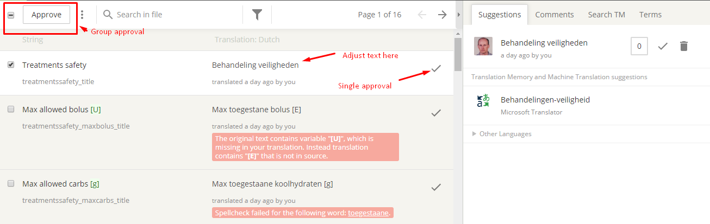

# Jak překládat AndroidAPS a dokumentaci

* Jděte na <https://crowdin.com/project/androidaps> nebo <https://crowdin.com/project/androidapsdocs> a přihlaste se vaším Github účtem

* Odešlete žádost o připojení k Wiki týmu. Klikněte na vlajku požadovaného jazyka a poté na tlačítko "Join" vpravo nahoře na následující stránce. Specifikujte prosím svůj jazyk, uveďte nějaké informace o sobě a svých zkušenostech s AAPS a zda chcete být překladatel nebo korektor (pouze osoby se zkušeností s překlady + pokročilí uživatelé AndroidAPS).

* Jakmile vás schválíme, klikněte na vlajku 

## Překlad stringů pro aplikaci AndroidAPS

* Klikněte na strings.xml
    
    

* Překládejte věty v levé části přidáváním nového přeloženého textu nebo použijte navrhovaný překlad a upravte ho
    
    

* Korektoři se musí přepnout do režimu Proofreading
    
    
    
    a schválit přeložené texty
    
    

Když korektor schválí překlad, tak bude přidaný do příští verze AndroidAPS. Na úvod by také bylo dobré projít existující překlady, které ještě nebyly schválené, a ověřit v nich chyby nebo je schválit, pokud byly správné.

## Překlad stránek Wiki

* Klikněte na název stránky wiki, kterou chcete překládat
    
    

* Překládejte větu za větou
    
    1 Nepřeložené texty jsou zobrazeny vlevo a mají červené podbarvení.
    
    2 Kliknutím na návrh překladu můžete tento návrh zkopírovat a dále jej upravit.
    
    3 Upravte návrh překladu nebo vepište svůj překlad.
    
    4 Klikněte na tlačítko Save
    
    

* Přeložená stránka nebude publikována na Wiki dříve, než bude překlad potvrzen.

### Překlad odkazů v nadpisech

* Pokud interní odkaz vede pouze na konkrétní stránku (tj. ../Usage/Profiles.html), je nutné odkaz nepřekládat.
* Pokud interní odkaz vede na konkrétní nadpis (tj. ..//Usage/Profiles.html#percentage) musí být odkaz přeložen, protože titulek v jiném jazyce se liší od anglického originálu.
* Pokud překládáte nadpis, můžete jej přeměnit na odkaz na kotvu (část za # - tj. #procenta) otočením všech písmen na malá písmena, transformací speciálních znaků na standardní znaky, nahrazením mezer znamínkem - (minus znaménko) a přeskočením interpunkčních znamének.
    
    Zde je několik příkladů:
    
    * Co je systém uzavřené smyčky AndroidAPS? \---> #co-je-system-uzavrene-smycky-androidaps
    * Aktualizace Wiki & Změny \---> #aktualizace-wiki-zmeny
    * Soubor AAPS-.apk --> #soubor-aaps-apk

* Zkontrolujte, že vámi vytvořený odkaz funguje správně. Pokud je to odkaz na nově přeložený nadpis, budete muset počkat, až bude možné po potvrzení překladu zkontrolovat správnost odkazu. V tom případě si nezapomeňte udělat upomínku do vašeho kalendáře / úkolníčku.

#### Překládání odkazů v Markdown souborech (.md)

At the moment two [markup languages](./make-a-PR#code-syntax) are used in docs. Whereas files written in reStructuredText syntax (.rst) always show link address in Crowdin, for files in Markdown syntax (.md) you might have to activate HTML tag displaying in order to translate the link address.

* * *

**Mějte na paměti, že nesmíte používat mezeru v HTML tagu na jeho začátku nebo konci!**

* * *

If links are displayed like this in Crowdin

click on the cogwheel to open settings, select "Show" and click "Save".

Links will then be shown in standard HTML format and can be translated considering the rules mentioned [above](./translations#translate-headline-links).

## Proofreading

* Korektoři se musí přepnout do režimu Proofreading
    
    
    
    a schválit přeložené texty
    
    

* When a proofreader approves a translation it will be added to the next docs build. To speed process you can inform docs team about new translations.