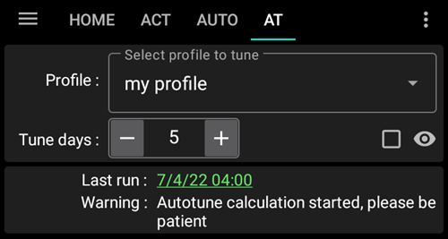
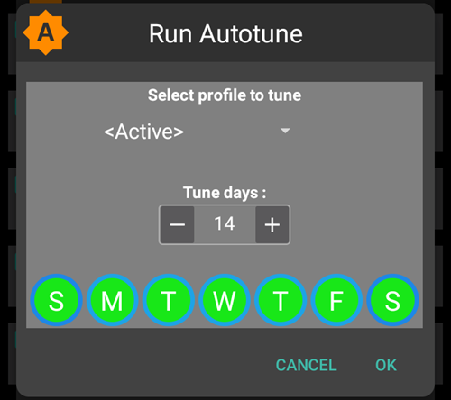

# Autotune Plugin verwenden (nur dev)

Die Beschreibung des Autotune-Algorithmus findest Du in der [OpenAPS Dokumentation](https://openaps.readthedocs.io/en/latest/docs/Customize-Iterate/autotune.html).

Das Autotune-Plugin ist die Umsetzung des OpenAPS Autotune-Algorithmus in AAPS.

**Aktuell ist das Autotune-Plugin nur im „dev branch“ (noch in Entwicklung befindliche Version) bei aktiviertem „Engineering Mode“ verfügbar.**

## Autotune Dialogbox

- In der Profil-Auswahlliste kannst Du das Profil auswählen, das Du automatisch überarbeiten (autotune) lassen möchtest (Dein aktives Profil ist voreingestellt)
  - Hinweis: Sobald Du ein neues Profil auswählst werden, bestehende Ergebnisse gelöscht und der Parameter 'Anpassungstage' auf den Standardwert zurückgesetzt
- 'Anpassungstage' legt fest, wie viele Tage in der Berechnung und der Überarbeitung Deines Profils berücksichtigt werden sollen. Der kleinste Wert ist 1 und der größte Wert ist 30 Tage. Um korrekte wiederholbare und geglättete Ergebnisse zu bekommen, sollte der Wert nicht zu klein gewählt werden (idealerweise sollten sieben oder mehr Tage berücksichtigt werden)
  - Hinweis: Bei jeder Änderung der 'Anpassungstage' werden die Ergebnisse zurückgesetzt
- 'Last Run' ruft die Ergebnisse Deines letzten gültigen Durchlaufs auf. Wenn Du „Autotune“ nicht am selben Tag gestartet haben solltest oder Ergebnisse der vorherigen Durchläufe durch die Änderung der Parameter zurückgesetzt wurden, kannst Du so die letzten Parameter und Ergebnisse zurückholen.
- 'Warnung' zeigt Dir im Fehlerfall Informationen zu Deinem gewählten Profil an (falls es z. B. mehrere KH- oder Korrekturfaktoren (IC/ISF) geben sollte)
  - Hinweis: Die Autotune-Berechnungen funktionieren nur mit einem einzigen KH-Faktor und einem einzigen Korrekturfaktor. Zur Zeit gibt es keinen Autotune-Algorithmus, der mit zirkadianen KH-Faktoren oder Korrekturfaktoren umgehen kann. Wenn Dein Profil mehrere Werte haben sollte, wird Dir im Abschnitt 'Warnung' der für die Berechnung genutzte (gemittelte) Wert angezeigt.
- Durch das Tippen auf 'Eingabeprofil überprüfen' öffnet sich die Profilansicht mit der Du wichtige Parameter Deines Profils überprüfen kannst (Einheiten, Wirkdauer (DIA), KH- und Korrekturfaktoren, Basalrate, Zielwert)
  - Hinweis: 'Autotune' wird nur Deinen KH-Faktor (Einzelwert), den Korrekturfaktor (Einzelwert) und Deine Basalrate (zirkadian verteilt) korrigieren bzw. anpassen. Einheiten, DIA und Zielwert werden im vorgeschlagenen Profil nicht verändert.

- 'Autotune ausführen' startet den Autotune-Durchlauf mit dem ausgewählten Profil und den zu berücksichtigenden Tagen ('Anpassungstage')
  - Hinweis: Die Autotune-Berechnung kann einige Zeit in Anspruch nehmen. Sobald 'Autotune' gestartet wurde, kannst zu anderen Ansichten (Startbildschirm, ...) wechseln und später zum Autotune-Plugin zurückkehren, um die Ergebnisse zu prüfen

- Während 'Autotune' läuft, wirst Du Zwischenergebnisse angezeigt bekommen

  - Hinweis: Während die Berechnungen laufen sind sowohl die Auswahl des Profils, als auch die 'Anpassungstage' vorübergehend gesperrt. Der aktuelle Durchlauf muss abgeschlossen sein, bevor Du einen neuen Berechnungsdurchgang mit geänderten Parametern starten kannst.

  

- Sind die Autotune-Berechnungen abgeschlossen, bekommst Du das angepasste Profil und vier Schaltflächen angezeigt.

- Wichtig ist, dass Du das Eingangsprofil (Spalte 'Profil') mit dem Ergebnisprofil (Spalte 'Angepasst') und die Abweichungen der Einzelwerte (Spalte '%') vergleichst.

- Für die Basalrate wird auch die Anzahl der nicht berücksichtigten Tage ('missing days') ausgegeben. 'Fehlend' tritt immer dann auf, wenn 'Autotune' nicht genügend Daten, die eindeutig einer Basalrate zugeordnet werden können, in der gewählten Periode zur Verfügung hat (z.B. in Phasen nach Mahlzeiten wenn, die KH-Aufnahme läuft). In der Nacht oder am späten Nachmittag sollten diese Effekte selten auftreten, da dort im Regelfall überwiegend das Basal wirksam sein sollte.

- Die Schaltfläche "Profile vergleichen" öffnet die Profilvergleichsansicht. Das Eingangsprofil ist blau und das Ergebnisprofil 'Angepasst' ist rot dargestellt.

  - Hinweis: im Beispiel unten hat das Eingangsprofil zirkadianisch angepasste Werte für IC und ISF, aber das Ergebnisprofil hat jeweils nur einen Wert. If it's important for you to get a circadian output profile see [Circadian IC or ISF profile](#autotune-circadian-ic-or-isf-profile) below.

  

- Wenn Du mit den Ergebnissen zufrieden bist (geringe Abweichungen zwischen dem Eingangsprofil und dem erzeugten Profil), kannst Du auf 'Aktiviere Profil' und 'OK' zur Bestätigung drücken.

  - Wenn Du das erzeugte Profil aktivierst, wird ein neues Profil 'Angepasst' in den Tab PROFIL geschrieben.
  - Sollte es das Profil mit dem Namen schon geben, wird es mit dem erzeugten Profil aktualisiert, bevor es aktiviert wird.

  

- Wenn Du denkst, dass das angepasste/berechnete Profil verändert werden muss (z.B. wenn Du findest, dass einige Abweichungen zu gravierend sind), dann kannst Du auf 'In lokales Profil kopieren' klicken.

  - Ein neues Profil mit dem Präfix 'Angepasst' und dem Erstelldatum und der Erstellzeit wird in das Profil-Plugin geschrieben.

- Du kannst dann Dein lokales Profil auswählen, um das Ergebnisprofil zu bearbeiten (es wird vorausgefüllt, sobald Du das lokales-Profil-Plugin öffnest

  - Die Werte werden, je nachdem welchen Einstellungen Deine Pumpe zulässt, entsprechend gerundet

  

- Wenn Du Dein Eingabeprofil durch die Autotune-Ergebnis ersetzen möchtest, tippe auf 'Eingabeprofil anpassen' und bestätige die Dialogbox 'OK'

  - Hinweis: Wenn Du nach 'Eingabeprofil anpassen' auf 'Profil aktivieren' tippst, aktivierst Du das gerade aktualisierte Profil und nicht das durch Autotune berechnete Profil (Ergebnisprofil)

  

- Wenn Du Dein Eingagebeprofil angepasst hast, wird der Button durch den Button 'Eingabeprofil zurücksetzen' ersetzt (wie auf dem Screenshot unten zu sehen). Daran kannst Du sofort erkennen, ob Dein lokales Profil die berechneten Anpassungen bereits enthält oder noch nicht. Mit diesem Button kannst Du auch Dein Eingabeprofil ohne die Autotune-Ergebnisse wiederherzustellen

  

## Autotune Einstellungen

(autotune-plugin-settings)=

### Autotune Einstellungen

- Automation Switch Profile (default Off): see [Run Autotune with an automation rule](#autotune-run-autotune-with-an-automation-rule) below. Wenn Du diese Einstellung auf AN änderst, wird in einer Automatisierungsregel das Eingabeprofil automatisch durch das berechnete Profil aktualisiert und anschliessend darauf gewechselt.
  - **Sei vorsichtig und prüfe in den kommenden Tagen sehr genau, ob sich das Loop-Verhalten nach der Anpassung und Aktivierung des Profils verbessert.**

- UAM als Basal kategorisieren (voreingestellt: EIN): Diese Einstellung ist für Nutzende gedacht, die AAPS ohne Eingabe der Kohlenhydrate einsetzen (vollständiges UAM). Wenn die Option deaktiviert ist, werden UAM nicht als Basal bewertet.
  - Hinweis: Wenn mindestens eine Stunde eines Tages erkannt wird, in der KH-Aufnahme stattgefunden hat, werden alle als "UAM" kategorisierte Daten, als Basal gewertet. Das ist unabhängig davon, ob Du die Option aktiviert hast oder nicht (AN oder AUS)
- Anzahl der Tage an Daten (voreingestellt: 5): Hier kannst Du den Standardwert festlegen. Jedes Mal, wenn Du ein neues Profil im Autotune-Plugin auswählst, wird der Parameter 'Anpassungstage' durch diesen Standardwert ersetzt.
- Apply average result in circadian IC/ISF (default Off): see [Circadian IC or ISF profile](#autotune-circadian-ic-or-isf-profile) below.

### Andere Einstellungen

- Autotune nutzt „Max. Autosens-Faktor“ und „Min Autotsens-Faktor“, um die Variabilität zu begrenzen. Die Werte können in KONFIGURATION > Sensititivtätserkennung > Einstellungen > Erweiterte Einstellungen eingesehen und geändert werden

  

## Erweiterte Funktionen

(autotune-circadian-ic-or-isf-profile)=

### Zirkadiane Profile für KH- und Korrekturfaktoren (IC/ISF)

- Wenn Du große Abweichungen in IC- und/oder ISF-Werten Deines Profils hast und Du von der zirkadianen Verteilung und Variabilität überzeugt bist, kannst Du „Apply average result in circadian IC/ISF“ auswählen

  - Es ist wichtig zu wissen, dass die Autotune-Berechnungen immer mit einem fixen Wert erfolgt. Autotune wird keine zirkadiane Verteilung erstellen. Diese Einstellung berücksichtigt lediglich berechnete Durchschnittswerte Deiner zirkadianen Werte für IC und/oder ISF

- Auf dem Screenshot unten siehst Du links das angepasste Profil mit der abgeschalteten Funktionen 'Durchschnittsresultat im zirkadianen IC/ISF anwenden' (AUS) und rechts mit der eingeschalteten Funktion (AN)

  

### Bestimmte Tage der Woche anpassen

- If you click on the checkbox with the eye on the right of "Tune days" parameter, you will see the day selection. Du kannst festlegen, welche Wochentage in der Autotune-Berechnung berücksichtigt werden sollen (im Screenshot unten ist ein Beispiel zu sehen, in dem nur die "Arbeitstage" berücksichtigt werden und Samstag und Sonntag von der Berechnung ausgeschlossen werden)
  - Wenn die Anzahl der Tage, die in der Autotune-Berechnung berücksichtigt werden sollen, kleiner ist als die unter "Anpassungstage" angegeben wurde, wird die tatsächlich zu berücksichtigenden Tage daneben angezeigt (im Beispiel unten sind es 10 Tage)
  - Diese Einstellung ergibt nur dann ein gutes Ergebnis, wenn die Anzahl der verbleibenden Tage groß genug ist (wenn beispielsweise ein Wochenend-Profil (nur Samstag und Sonntag) überarbeitet werden soll, solltest Du 21 oder 28 Anpassungstage angeben, damit am Ende 6 bzw. 8 Tage in der Autotune-Berechnung berücksichtigt werden)

- Während der Autotune-Berechnung wird der Berechnungs-Fortschritt angezeigt ("Zwischenergebnis Tag 3 / 10 tuned" im Beispiel unten)

  

(autotune-run-autotune-with-an-automation-rule)=

## Autotune mit einer Automatisierungsregel starten

Der erste Schritt besteht darin, den richtigen Auslöser für eine Automatisierungsregel mit Autotune zu definieren:

Hinweis: Details zum Setzen einer Automatisierungsregel, findest Du [hier](../DailyLifeWithAaps/Automations.md).

- Als Auslöser sollte „Wiederholungszeit“ ausgewählt werden: Starte Autotune nur einmal täglich. Autotune ist so konzipiert, dass es einmal am Tag läuft und vorgeschlagene Profilanpassungen am Folgetag durch Autotune erneut geprüft werden können. Bei regelmäßiger Ausführung (täglich) sind die dann notwendigen Profilanpassungen nur gering bzw. klein

  

- Um die Ergebnisse unmittelbar überprüfen zu können, hat sich am Anfang bewährt Autotune am Tag auszuführen. Bei einer geplanten Ausführung in den Nachtstunden, wähle 04:00h oder später. Damit wird der aktuelle Tag in der nächsten Autotune-Berechnung berücksichtigt.

  

- Nun kannst Du 'Autotune ausführen' unter 'Aktion' auswählen.

  

- Durch tippen auf 'Autotune Profil', kannst Du die Parameter für den Autotune-Lauf anpassen. Vorausgefüllt sind '<Aktiv>' als das anzupassende Profil und unter 'Anpassungstage' der Wert, den Du in den 'Autotune Einstellungen' hinterlegt hast.

  

- Wenn Du nach einigen Tagen mit den Autotune-Ergebnissen zufrieden bist und die vorgeschlagenen prozentualen Anpassungen nur noch sehr gering sind, kannst Du in den [Autotune Einstellungen](#autotune-plugin-settings) die Option 'Automation Profilwechsel' aktivieren. Damit wird das Profil nach einer Autotune-Berechnung automatisch mit den Ergebnissen aktualisiert und anschliessend aktiviert.

Hinweis: Wenn Du automatisch Profile für einzelne Wochentage (z. B. ein Profil fürs Wochenende und eines für Wochentage) überarbeiten lassen möchtest, erstelle eine Regel je Profil und wähle den gleichen Tag als Auslöser und "Autotune ausführen" als Aktion. Die Anpassungstage müssen so hoch eingestellt werden, dass die Berechnung am Ende mit mindestens 6 oder 8 Tagen durchgeführt wird, und vergiss nicht den Auslösezeipunkt nach 4 Uhr morgens zu setzen ...

- Unten ist ein Regel-Beispiel, in dem "myprofile" überarbeitet werden soll und dabei nur "Arbeitstage" bei 14 Anpassungstagen berücksichtigt werden sollen (sodass am Ende nur 10 Tage in der Berechnung werden).

## Tipps und Tricks

Autotune arbeitet den Informationen in Deiner Datenbank. Wenn Du AAPS gerade erst frisch auf Deinem Smartphone installiert hast, musst Du einige Tage warten, bevor Autotune mit genügend Informationen gestartet werden kann und sinnvolle Ergebnisse zurückliefert.

Autotune ist nur ein Hilfsmittel. Es ist wichtig, dass Du das berechnete Profil überprüfst und die Einzelwerte bewusst hinterfragst. Wenn Du an irgendeiner Stelle Zweifel haben solltest, passe die Autotune-Einstellungen (z.B. die Anpassungstage) an oder kopiere die Ergebnisse in ein lokales Profil, um dort notwendige Änderungen vorzunehmen, bevor Du diese verwendest.

Autotune sollte immer einige Tage manuell ausgeführt werden, damit Du die Möglichkeit hast die Ergebnisse zuerst zu prüfen, bevor Du sie übernimmst. Eine vollautomatisches 'Autotunen' darf nur dann (und wirklich nur dann!) begonnen werden, wenn Du den bisherigen Ergebnissen voll vertraust, und die vorgeschlagenen Anpassungen zwischen Eingangsprofil und berechnetem Profil nur noch sehr gering ausfallen.

- Autotune funktioniert für einige von uns sehr gut, für andere allerdings auch nicht. **Solltest Du am Autotune-Ergebnis zweifeln, nutze es nicht**

Wichtig ist auch, sich die Autotune-Ergebnise sehr genau anzuschauen, um zu verstehen, aus welchem Grund Autotune welche Anpassungen vorschlägt.

- Es kann eine vollständige Erhöhung oder Abschwächung Deines Profils geben (z.B. Anhebung des Basalprofils, um ISF- und IC-Werte abzuschwächen). Das kann die Folge von längeren Phasen (mehrere Tage) mit einer Autosens-Korrektur über 100% (höhere Aggressivität notwendig) oder unter 100% (Abschwächung notwendig) sein
- Sometimes Autotune proposes a different balance between basal rates and IC/ISF (for ex lower basal and more aggressive IC/ISF)

In folgenden Situationen wird von einer Autotune-Nutzung abgeraten:

- Du gibst nicht alle Kohlenhydrate ein
  - If you don't enter carbs correction for hypoglycemia, Autotune will see an unexpected increase of your BG value and will increase your basal rates 4 hours earlier, it could be the opposite of what you need to avoid hypo, especially if it's in the middle of the night. That's why it's important to enter all carbs, especially correction for hypo.
- You have a lot of periods with UAM detected during the day.
  - Do you have entered all your carbs and correctly estimated your Carbs?
  - Alle Abschnitte mit nicht angekündigten Mahlzeiten (UAM), werden der Basalrate zugerechnet, sodass eine erhebliche Anhebung (mehr als notwendig) der Basalrate als Folge vorgeschlagen werden wird. Ausnahme: Du hast die Option 'UAM als Basal kategorisieren' deaktiviert

- Deine KH-Aufnahme ist deutlich verlangsamt: Die Berechnung der aktiven Kohlenhydrate (COB) kann falsch sein und in der Folge zu falschen Ergebnissen führen. Die verlangsamte Aufnahme kannst Du an kleinen orangenen Punkten oberhalb der COB-Kurve erkennen. Als Referenz wird der Parameter 'min_5m_carbimpact' in den 'Resorptions-Einstellungen' genutzt.
  - Während Du Sport treibst, bist Du durchweg insulinempfindlicher und Dein Glukosewert steigt nur leicht. Es ist daher völlig normal während und nach dem Sport Phasen mit langsamer KH-Aufnahme zu sehen. Solltest Du aber häufiger unerwartet Phasen mit langsamer KH-Aufnahme haben, kann eine Profilanpassung sinnvoll sein. In diesem Fall kann eventuell eine Erhöhung des KH-Faktors (IC) oder eine Reduktion des 'min_5m_carbimpact'-Parameters helfen.
- You have "very bad days", for example stuck several hours in hyperglycemia with a huge amount of insulin to be able to go down within the range, or after a sensor change you have long periods of wrong BG values. If during the past weeks you only have one or 2 "bad days", you can disable manually these days in autotune calculation to exclude them from calculation, and again **check carefully if you can trust the results**
- Wenn die vorgeschlagenen prozentualen Anpassungen zu gravierend sind
  - Eine bessere Glättung kannst Du eventuell über eine Erhöhung der zu berücksichtigenden Tage (Anpassungstage) erreichen
