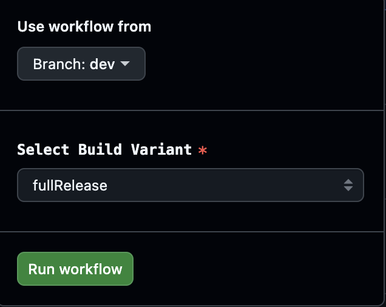

# Entwickler-Version (dev branch)

```{warning}
Der Dev Branch ist ausschließlich für die Weiterentwicklung von AAPS gedacht. Er darf nur auf einem separaten Smartphone zu Testzwecken, <font color="#FF0000">**nicht für das tatsächliche Loopen**</font> verwendet werden.
```

Die stabilste AAPS-Version ist die im [Master Branch](https://github.com/nightscout/AndroidAPS/tree/master). Es wird dringend empfohlen, nur den Master Branch für das tatsächliche Loopen zu verwenden.

Achtung: Die AAPS-Entwicklungsversion (Dev Branch) ist für Entwickler sowie Tester bestimmt, die mit Stacktraces, Log-Dateien und dem Debugger umgehen können, um Fehlerberichte erstellen zu können, die Entwicklern beim Beheben der Fehler helfen (kurzum: Personen, die wissen, was sie tun und eigentverantwortlich arbeiten können). Aus diesem Grunde sind unfertige Features deaktiviert. Um dieses Feature zu aktivieren, aktiviere den **Engineering Mode** indem Du eine leere Datei mit dem Namen `engineering_mode` im Verzeichnis /AAPS/extra auf dem Smartphone anlegst. Das Aktivieren dieser Features kann dazu führen, dass der Loop überhaupt nicht mehr funktioniert.

Im Dev Branch sieht man, welche Funktionen gerade getestet werden. Damit können Fehler ausgebügelt und Feedback dazu gegeben werden, wie die neuen Funktionen in der Praxis funktionieren. Meist wird die Entwicklerversion auf einem alten Smartphone mit einer separaten Pumpe so lange getestet bis sie stabil läuft. Jede Benutzung des Dev Branch erfolgt auf eigene Gefahr! Sei Dir beim Ausprobieren neuer Funktionen im Klaren, dass Du Funktionen verwendest, die sich noch in Entwicklung befinden und nicht final freigegeben sind. Um Deine eigene Sicherheit zu gewährleisten, tue dies auf eigene Gefahr und mit der gebotenen Sorgfalt.

Wenn Du einen Fehler gefunden hast oder glaubst, dass etwas nicht richtig funktioniert, sieh im [Issues Tab](https://github.com/nightscout/AndroidAPS/issues) nach, um zu sehen, ob schon jemand diesen Fehler gefunden hat. Falls nicht, kannst Du ein neues Issue eröffnen. Je mehr Informationen Du dabei mitlieferst, desto besser/schneller kann der Fehler reproduziert und behoben werden. Vergiss nicht, die [Protokolldateien](../GettingHelp/AccessingLogFiles.md) anzufügen. Die neuen Funktionen können auch auf [Discord](https://discord.gg/4fQUWHZ4Mw) diskutiert werden.

Eine Entwicklerversion hat ein Ablaufdatum. Das scheint unpraktisch, wenn es zufriedenstellend genutzt wird, aber es dient einem Zweck. Wenn nur eine Entwicklerversion im Umlauf, ist es einfacher, die gemeldet Fehler nachzuverfolgen. Die Entwickler wollen nicht in die Lage geraten, dass drei verschiedene Entwicklerversionen m Umlauf sind, in denen parallel Fehler behoben werden müssen und Testuser Fehler, die schon behoben wurden, in der neuesten Entwicklerversion, (in guter Absicht) noch einmal melden.

(branch-ci-test)=

## Einen bestimmten Zweig testen (branch-ci)

Um einen Test Branch zu erstellen, wähle branch-ci aus. Das ermöglicht Dir einen bestimmten Zweig für die APK-Erstellung auszuwählen. Diese Methode ist insbesondere für das Testen des Dev Branch zu empfehlen.




(github-pr-test)=

## Testelemente in einem Pull-Request (GitHub CI-Aktionen bereitstellen)

Verfügbar ab 3.3.2.1. Dev

- Geeignet für Tester oder für diejenigen, die beim Testen helfen.

```{eval-rst}
.. raw:: html

    <!--crowdin: exclude-->
    <div align="center" style="max-width: 360px; margin: auto; margin-bottom: 2em;">
      <div style="position: relative; width: 100%; aspect-ratio: 9/16;">
        <iframe
          src="https://www.dailymotion.com/embed/video/x9rdx1q"
          style="position: absolute; top: 0; left: 0; width: 100%; height: 100%;"
          frameborder="0"
          allowfullscreen>
        </iframe>
      </div>
    </div>
```


- PR-Nummer: Bitte gib die zu testende PR-Nummer ein.

- PR-Referenztypen: PR-Referenztypen haben zwei Optionen:
    
    - head:
    - Ruft den tatsächlichen Inhalt aus dem Branch des PR-Autors ab (d. h. die ursprüngliche Commit-Historie ohne Merge-Operationen).
    - Dies entspricht dem ursprünglichen Zustand des PR-Zweigs, als wäre er direkt aus einem Fork- oder Feature-Zweig abgerufen worden.
    
    - merge:
    
    - Ruft das Ergebnis der von GitHub vorab simulierten Zusammenführung des PR in den Zielzweig (z. B. Dev) ab.
    - Dies ist ein virtueller Merge-Commit, der automatisch von GitHub erstellt wurde.
    - Dieser Commit existiert nur, wenn die PR keine Konflikte hat und zusammenführbar ist.
    
    - variant:
    
    - Bitte beachte hierzu den Abschnitt [Variante](#browserbuild-variant) (variant)