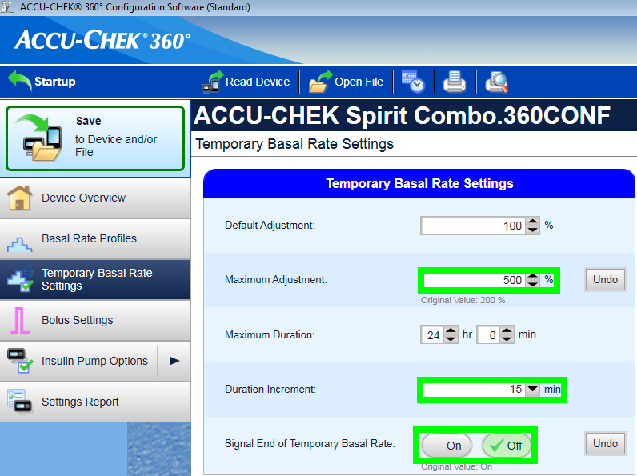

- - -
orphan: true
- - -

# Accu-Chek Combo

**Die Software ist Teil einer DIY-Lösung (Do It Yourself = Eigenbau) und kein kommerzielles Produkt. Daher bist DU gefordert. DU musst lesen, lernen und verstehen, was das System macht und wie du es bedienst. Das System wird Dir nicht alle Schwierigkeiten Deiner Diabetestherapie abnehmen, aber wenn Du willens bist, die nötige Zeit zu investieren, dann kann es die Ergebnisse Deiner Therapie verbessern und die Lebensqualität erhöhen. Überstürze nichts. Nimm dir Zeit zum Lernen. Du bist ganz alleine dafür verantwortlich, was Du mit dem System machst. Du bist ganz alleine dafür verantwortlich, was Du mit dem System machst.**

## Hard- und Softwareanforderungen

* Eine Roche Accu-Chek Combo (jede Firmware funktioniert).
* Einen Smartpix oder Realtyme Adapter und die Accu-Chek 360°-Konfigurationssoftware um die Pumpe zu konfigurieren. (Kunden von Roche können die Software beim Kundendienst anfordern.)
* Ein kompatibles Telefon. Android 9 (Pie) oder neuer ist ein Muss. Bei Verwendung von LineageOS ist die minimale unterstützte Version 16.1. Details findest Du in den [Release Notes](#maintenance-android-version-aaps-version).
* AndroidAPS muss auf Deinem Smartphone installiert sein.

Einige Telefone funktionieren vielleicht besser als andere je nach Qualität der Bluetooth-Unterstützung und ob sie eine zusätzliche, sehr aggressive Energiesparlogik haben oder nicht. Eine Liste mit Smartphones findest Du im Abschnitt [Smartphones](#Phones-list-of-tested-phones). Die Liste ist nicht abschließend und spiegelt nur die persönliche Erfahrung der Benutzer wieder. Bitte trage Deine Erfahrung in die Liste ein und hilf damit anderen. Die ganzen DIY-Projekte funktionieren nur, wenn jeder etwas zurückgibt.

(combov2-before-you-begin)=
## Bevor du startest

**SICHERHEITEN** - Versuche diesen Prozess nicht in einer Umgebung, in der Du Dich nicht von einem Fehler erholen kannst. Halten Sie Ihr Smartpix / Realtyme Gerät bereit, zusammen mit der 360 Configuration Software. Plane ungefähr eine Stunde, um alles einzurichten und zu überprüfen, ob alles richtig funktioniert.

Beachte folgende Einschränkungen:

* Verzögerter Bolus und Multiwave-Bolus werden nicht unterstützt. (Als Alternative schau Dir [Verzögerte Kohlenhydrate](../DailyLifeWithAaps/ExtendedCarbs.md) an.)
* Nur ein basales Profil (das erste Profil) wird unterstützt.
* Der Loop ist deaktiviert, wenn das aktuell aktive Profil der Pumpe nicht Profil Nr. 1 ist. Dies geht bis das Profilnr. 1 aktiviert wird; wenn das erledigt ist, wird beim nächsten Verbindungsaufbau von AAPS (entweder allein nach einer Weile oder weil der Benutzer den Refresh Button in der Combov2 Benutzeroberfläche drückt), erkennen, dass Profil Nr. 1 das aktuell ist und den Loop wieder aktivieren.
* Wenn der Loop eine laufende Basalrate abbrechen will, wird stattdessen die Basalrate für 15 min. auf 90% oder 110% gesetzt. Das liegt daran, dass das Abbrechen eines TBR eine Warnung auf die Pumpe verursacht, die viele Vibrationen verursacht, und diese Vibrationen können nicht deaktiviert werden.
* Die Stabiltät der Bluetooth-Verbindung variiert je nach verwendetem Telefon stark, dies kann zu “pump unreachable”-Alarmen führen und verhindern, dass die Verbindung zur Pumpe hergestellt werden kann. Wenn dieses Verhalten auftritt, prüfe ob a) BT auf dem Telefon eingeschaltet ist b) “Aktualisieren” im Combo Tab von AAPS die Verbindung wieder herstellt. Versuche das Telefon neu starten, wenn die Schritte a) und b) nicht erfolgreich waren.
* Es gibt ein anderes Problem, bei dem ein Neustart nicht hilft, sondern eine Taste auf der Pumpe gedrückt werden muss (welcher den Bluetooth-Stack der Pumpe zurücksetzt), bevor die Pumpe wieder Verbindungen vom Telefon annimmt.
* Das Setzen einer TBR direkt auf der Pumpe ist im Closed Loop Betrieb nicht nötig und sollte möglichst nicht vorgenommen werden. Das Erkennen einer manuell gesetzten Basalrate kann bis zu 20 Minuten dauern und wird bei der Berechnung auch erst ab dem Zeitpunkt berücksichtigt, zu dem die TBR von AAPS eingelesen wird. Das führt dazu, dass die im Körper befindliche Insulinmenge (IOB) falsch berechnet wird.

Wenn du den alten Combop-Treiber verwendet hast, der von der separaten Ruffy-App abhängig ist und zu dieser neuen wechseln möchtest Beachten Sie, dass die Paarung wieder durchgeführt werden muss - Ruffy und der neue Combopreiber können keine Paarinformationen teilen. Stelle bitte sicher, dass Ruffy _nicht_ läuft. Im Zweifelsfall drücke lange das Ruffy-App-Symbol, um ein Kontextmenü anzuzeigen. Klicke in diesem Menü auf "App-Info". In der gerade geöffneten Benutzeroberfläche drücke "Force Stop". Auf diese Weise wird sichergestellt, dass eine aktive Ruffy-Instanz den neuen Treiber nicht stören kann.

Außerdem, wenn Du von dem alten Treiber migrierst, beachte, dass der neue Treiber einen Bolus Befehl auf eine andere Weise zur Combo kommuniziert, welcher viel schneller bearbeitet wird, Sei also nicht zu überrascht, wenn ein Bolus sofort beginnt, unabhängig von der Dosierung. Außerdem gelten die allgemeinen Anregungen, Tipps und Tricks etc. über den Umgang mit dem Ruffy Paarungs- und Verbindungsproblemen hier nicht, da dies ein komplett neuer Treiber ist, der keinen Code mit dem alten Treiber teilt.

Dieser neue Treiber ist im Moment in folgenden Sprachen der Combo verfügbar. (Dies hat nichts mit der Sprache in AAPS zu tun - hier ist die auf dem Bildschirm der Combo verwendete Sprache gemeint.)

* English
* Spanish
* Französisch
* Italienisch
* Russisch
* Türkisch
* Polnisch
* Tschechisch
* Ungarisch
* Slovakisch
* Rumänisch
* Kroatisch
* Dutch
* Greek
* Finnisch
* Norwegisch
* Portugiesisch
* Schwedisch
* Dänisch
* German
* Slowenisch
* Lithuanian

**Wichtig**: Wenn Deine Combo eine Sprache verwendet, die nicht auf der Liste steht, kontaktiere das Entwickler-Team und setze die Pumpensprache auf eine Sprache aus der Liste. Andernfalls funktioniert der Treiber nicht richtig.

## Telefon einrichten

Es ist sehr wichtig sicherzustellen, dass die Batterieoptimierung ausgeschaltet wird. AAPS erkennt automatisch, wenn es diesen Optimierungen unterliegt und fragt in seiner Benutzeroberfläche an, dass diese abgeschaltet werden. Aber auf modernen Android-Telefonen ist Bluetooth _selbst_ eine App (eine System-App). Und im Allgemeinen läuft die "Bluetooth app" mit _eingeschalteter Batterie Optimierung im Standard_. Infolgedessen kann Bluetooth es ablehnen, zu reagieren, wenn das Telefon darauf abzielt, Strom zu sparen, da es die Bluetooth-App einfach beendet. Das bedeutet, dass in den Einstellungen der Bluetooth-System-App auch die Batterieoptimierungen ausgeschaltet werden müssen. Unglücklicherweise kann man feststellen, dass die Bluetooth-System-App sich zwischen den Telefonen unterscheidet. In unverändertem Android gehe zu Einstellungen -> Apps -> Alle N-Apps anzeigen (N = Anzahl der Apps auf Ihrem Handy). Öffnen Sie dann das Menü in der oberen rechten Ecke, klicken Sie auf "System anzeigen" oder "System-Apps anzeigen" oder "Alle Apps". Jetzt in der erweiterten Liste der Apps nach einer "Bluetooth"-App suchen. Wähle es aus und tippe auf "App-Informationen" und dann auf "Batterie". Dort deaktiviere die Batterieoptimierung (manchmal auch als "Batterieverbrauch" bezeichnet) .

## Combo Setup

* Konfiguriere die Pumpe mit der Accu-Chek 360 Konfigurationssoftware. Falls du die Software nicht hast wende dich an die Accu-Chek Hotline. Sie senden registrierten Benutzern normalerweise eine CD mit der 360º Konfigurations-Software und einen SmartPix USB-Infrarotempfänger. (Das Realtyme Gerät funktioniert auch falls du dieses besitzt.)

  - **Erforderliche Einstellungen** (in Screenshots grün markiert):

     * Setze/Lasse das Benutzermenü auf “Standard”. Dadurch werden nur die benötigten Menüs/Aktionen auf der Pumpe angezeigt und solche versteckt, die nicht unterstützt werden (verzögerter Bolus, Multiwave Bolus, mehrere Basalprofile), die die Loop-Funktionalität einschränken würden, da der Loop nicht sicher laufen würde, wenn diese Aktionen Verwendung fänden.
     * Stelle sicher, dass der _Quick Info Text_ auch wirklich “QUICK INFO” heißt (ohne Anführungszeichen, zu finden unter _Anzeige-/Kommunikationseinstellungen_).
     * Stelle die _Maximale Anpassung_ der Temporären Basalrate auf 500%.
     * Deaktiviere _Ende der temporären Basalrate signalisieren_.
     * Setze die _Schrittweitendauer_ der Temporären Basalrate auf 15 min.
     * Bluetooth aktivieren

  - **Empfohlene Einstellungen** (in Screenshots blau markiert)

     * Stelle den Restmenge bei Alarm “Amp. fast leer” ein, wie es für dich passt.
     * Konfiguriere eine maximale Bolusmenge passend zu deiner Therapie, um dich gegen Fehler in der Software zu schützen.
     * Lege gleichermaßen die maximale Dauer einer temporären Basalrate als Sicherheitsmaßnahme fest. Erlaube mindestens 3 Stunden, da die Option die Pumpe für 3 Stunden abzulegen, 0% über 3 Stunden setzt.
     * Aktiviere die Tastensperre an der Pumpe, um die Bolusabgabe über die Pumpe zu verhindern, insbesondere wenn die Pumpe vorher schon verwendet wurde und die schnelle Bolusabgabe eingerichtet war.
     * Stelle die Anzeigedauer und das Menü-Timeout auf das Minimum (5,5 bzw. 5). Das erlaubt AndroidAPS in Fehlerzuständen schneller wieder fortzusetzen und verringert die Anzahl an Vibrationen die während so einem Fehler auftreten können.

  

  

  

  

## Aktivierung des Treibers und Kopplung mit der Combo

* Wähle unter [Konfiguration > Pumpe](../SettingUpAaps/ConfigBuilder.md) die "Accu-Chek Combo" aus. **Wichtig**: Es ist auch der alte Treiber, genannt "Accu-Chek Combo (Ruffy)", in dieser Liste. Wähle diesen _nicht_ aus.

  

* Tippe auf das Zahnrad, um die Treibereinstellungen zu öffnen.

* Tippe in den Einstellungen oben auf den Button 'Pumpe verbinden'. Damit öffnet sich die Dialogbox zum Verbinden (pairing). Folge den einzelnen Schritten, wie sie auf dem Bildschirm angezeigt werden, um das Pairing abzuschließen. Wenn Android nach der Berechtigung das Smartphone für andere Bluetooth-Geräte sichtbar zu machen fragt, tippe auf 'zulassen'. Die Combo wird einen 10-stelligen Pairing-PIN anzeigen, den AAPS (der Combo-Treiber) benötigt. Gebe diese PIN in das entsprechende Feld ein.

  

  

  

  

  

* Wenn der 10-stellige PIN, der auf der Combo angezeigt wird, falsch eingegeben wurde, erscheint folgende Fehlermeldung: 

* Sobald die Koppelung abgeschlossen ist, kann die Dialogbox, die die erfolgreiche Koppelung bestätigt, mit OK geschlossen werden. Nach dem Schließen der Dialogbox kehrst Du zur Einstellungsseite zurück. Die Option 'Mit Pumpe verbinden' sollte ausgegraut und deaktiviert sein.

  Der Accu-Chek Combo-Reiter sollte nach der erfolgreichen Koppelung wie folgt aussehen:

  

  Sollte der Koppelungsversuch - aus welchen Gründen auch immer - fehlgeschlagen sein, sieht der Reiter so aus:

  

* **Trenne die Pumpe** zum Testen der Konfiguration. Setze mit AAPS eine temporäre Basalrate von 500% für 15 Min. und gib einen Testbolus ab. Die Pumpe sollte nun die TBR anzeigen und einen Bolus-Eintrag in der Historie haben. AAPS sollte ebenfalls die TBR und den Bolus anzeigen.

* Die Tastensperre der Combo sollte aktiviert werden, um eine versehentliche Bolusabgabe - insbesondere wenn die Combo vorher klassisch auch mit der 'Quick-Bolus'-Funktion genutzt wurde, zu verhindern.

## Notizen zum Pairing

Die Accu-Chek Combo wurde knapp ein Jahr nachdem die erste Android-Version veröffentlicht wurde und bevor Bluetooth 4.0 verfügbar war, entwickelt. Aus diesem Grund weicht der Koppelungsprozess vom heute üblichen Weg ab. Um dies zu umgehen, würde AAPS Berechtigungen auf Systemebene benötigen, die nur für Systemanwendungen vergeben werden. Diese Systemanwendungen werden von den Herstellern vorinstalliert. Diese können von Dir nicht (nachträglich) installiert werden.

Die Folge ist, dass das Pairing nie ganz problemlos sein wird, auch wenn der neue Treiber diese deutlich reduziert hat. Insbesondere während des eigentlichen Android-Pairings kann es passieren, dass die Bluetooth-PIN nur sehr kurz zu sehen ist und dann wieder verschwindet. In einigen Fällen, bleibt das Dialogfeld sichtbar und es wird nach einer 4-stelligen PIN gefragt werden. (Nicht zu verwechseln mit der 10-stelligen Combo-Pairing-PIN.) Bitte gib hier nichts ein und tippe auf 'abbrechen' (cancel). Sollte der Pairing-Vorgang nicht weiter vorangehen, folge den auf dem Bildschirm gezeigten Anweisungen, um es erneut zu versuchen.

(combov2-tab-contents)=
## Accu-Chek Combo tab Inhalt

Wenn eine Pumpe verbunden wurde, zeigt dieser Tab die folgenden Informationen (Elemente werden von oben nach unten gelistet):

1. _Treiberstatus_: Der Treiber kann in einem der folgenden Zustände sein:
   - "Getrennt": Keine Bluetooth-Verbindung vorhanden; der Treiber ist die meiste Zeit in diesem Zustand und verbindet sich nur bei Bedarf mit der Pumpe - dies spart Strom
   - "Verbinden"
   - "Prüfe Pumpe": Die Pumpe ist verbunden, aber der Treiber führt Sicherheitsprüfungen aus, um sicherzustellen, dass alles OK ist
   - "Bereit" : Der Treiber ist bereit Befehle von AAPS zu erhalte
   - "Unterbrochen": Die Pumpe ist 'suspended' (wird als 'gestoppt' in der Combo angezeigt)
   - "Befehl wird ausgeführt": Ein AAPS-Befehl wird ausgeführt
   - "Fehler" : Ein Fehler ist aufgetreten; die Verbindung wurde unterbrochen, alle laufenden Befehle wurden abgebrochen
2. _Letzte Verbindung_: Vor wie vielen Minuten bestand die letzte Verbindung zwischen dem Treiber und der Combo; überschreitet der Wert 30 Minuten, wird er in Rot dargestellt
3. _Aktivität_: Zusätzliche Details darüber, was die Pumpe gerade macht; an der Stelle wird ggf. ein dünner Balken gezeigt, der den Fortschritt eines laufenden Befehls anzeigen kann (z. B. Setzen eines Basalprofils)
4. _Batterie_: Batteriestand; die Combo zeigt nur "voll", "niedrig", "leer" an. Es werden nur diese drei Abstufungen gezeigt und eine feinere Unterteilung (z.B. eine Prozentzahl) gibt es nicht
5. _Reservoir_: Wie viele Insulin-Einheiten noch im Reservoir der Combo sind
6. _Letzter Bolus_: Wie viele Minuten die letzte Bolusgabe her ist; wenn nach dem Start von AAPS noch kein Bolus abgegeben wurde ist das Feld leer
7. _TBR_: Details zur aktuell laufenden temporären Basalrate; das Feld ist leer, wenn keine temporäre Basalrate aktiv ist
8. _Basis-Basalrate_: Aktuell laufende Basis-Basalrate (d. h. die im Profil hinterlegte Basalrate in diesem Zeitfenster ohne temporäre Änderungen)
9. _Seriennummer_: Seriennummer der Combo, wie sie auch auf der Rückseite der Pumpe angegeben ist
10. _Bluetooth-Adresse_: Die 6-byte-Bluetooth-Adresse der Combo, die im Format `XX:XX:XX:XX:XX:XX` angezeigt wird

Die Combo kann über Bluetooth im _Remote-Terminal_-Modus oder im _Befehls_-Modus (command) genutzt werden. Der Remote-Terminal-Modus ähnelt dem "Fernbedienungsmodus" auf dem Combo-Messgerät, das das LCD-Display und die vier Knöpfe simuliert. Einige Befehle müssen vom Treiber in diesem Modus ausgeführt werden, da sie im Befehlsmodus kein passendes Gegenstück haben. Dieser letztgenannte Modus ist viel schneller, aber, wie beschrieben, begrenzt. Wenn der Remote-Terminal-Modus aktiv ist, wird auf dem Bildschirm des Remote-Terminals ein Feld angezeigt, das sich direkt über dem Combo-Bild am unteren Rand befindet. Wenn der Treiber in den Befehlsmodus wechselt, wird dieses Feld leer gelassen.

(Du kannst das nicht beeinflussen. Der Treiber entscheidet selbständig über den zu verwendenden Modus. Das ist eine Erklärung, warum manchmal 'Combo-Frames' in diesem Feld zu sehen sein können.)

Ganz unten befindet sich der Button AKTUALISIEREN. Damit wird sofort der aktuelle Pumpenstatus abgefragt. It also is used to let AAPS know that a previously discovered error is now fixed and that AAPS can check again that everything is OK (more on that below in [the section about alerts](#combov2-alerts)).

## Einstellungen

Diese Einstellungen sind für den Combotreiber verfügbar (Elemente sind von oben nach unten aufgeführt):

1. _Pumpe koppeln_: Dieser Button wird genutzt, um die Koppelung mit der Combo zu starten. Es ist deaktiviert, wenn bereits eine Pumpe gekoppelt ist.
2. _Pumpe entkoppeln_: Hebt die Koppelung mit der Combo auf. Es ist das genaue Gegenteil zur ersten Option (1). Es ist deaktiviert, wenn noch keine Pumpe gekoppelt ist.
3. _Sichtbarkeit (in Sekunden)_: Während des Koppelungsvorgangs macht der Treiber das Smartphone für die Pumpe sichtbar. Dies beinflusst die Dauer der Sichtbarkeit. Das Maximum (300 Sekunden = 5 Minuten) ist voreingestellt. Android erlaubt keine permanente Sichtbarkeit, sodass eine Dauer ausgewählt werden muss.
4. _Ampullenwechsel automatisch erkennen und eintragen_: Vermerkt den Ampullenwechsel, der normalerweise händisch über den Tab AKTIONEN > Katheterwechsel > Insulinreservoir-Wechsel eingetragen wird. This is explained [in further detail below](#combov2-autodetections).
5. _Batteriewechsel automatisch erkennen und eintragen_: Vermerkt den Batteriewechsel, der normalerweise händisch auf dem AKTIONEN Tab über den Button 'Pumpenbatterie-Wechsel' eingetragen wird. This is explained [in further detail below](#combov2-autodetections).
6. _Aktiviere erweitertes Combo-Logging_: Dies erhöht die Anzahl der Log-Einträge durch den Treiber. **ACHTUNG**: Aktiviere diese Option nur, wenn Du von einem Entwickler oder einer Entwicklerin dazu aufgefordert wirst. Ansonsten kann dies die AAPS-Logs überfluten und sie unübersichtlich machen und den Nutzen reduzieren.

Die meisten Benutzer nutzen nur die beiden ersten Elemente: die _Pumpe koppeln_ und _Pumpe entkoppeln_ Buttons.

(combov2-autodetections)=
## Automatische Erkennung und automatische Eingabe von Akku- und Reservoir-Änderungen

Der Treiber kann, Batterie- und Ampullenwechsel erkennen, indem er den Batterie- und den Ampullenstand überwacht. Wenn die Combo bei der letzten Abfrage einen niedrigen Batteriestand zurückgemeldet hat, und bei der erneuten Abfrage ('aktualisieren') ein normaler Batteriestand übermittelt bekommt, geht der Treiber davon aus, dass ein Batteriewechsel erfolgt ist. Die gleiche Logik wird einen Ampullenwechsel genutzt: Ist der Ampullenfüllstand bei der zweiten Abfrage höher als bei der ersten, wird angenommen, dass in der Zwischenzeit ein Ampullenwechsel stattgefunden hat.

Dies funktioniert nur, wenn Batterie- und Reservoirstände zuvor als 'niedrig' gemeldet wurden _und_ dann wieder vollgefüllt sind.

Diese automatische Erkennung kann in den Einstellungen deaktiviert werden.

(combov2-alerts)=
## Alarme (Warnungen und Fehler) und wie sie behandelt werden

The Combo shows alerts as remote-terminal screens. Warnungen werden mit einem "Wx"-Code (x ist eine Zahl) zusammen mit einer kurzen Beschreibung angezeigt. Ein Beispiel ist "W7", "TBR ABGELAUFEN". Fehler sind ähnlich, werden aber stattdessen mit einem "Ex"-Code angezeigt.

Bestimmte Warnungen werden automatisch vom Treiber verworfen. Diese sind:

- W1 "Ampulle fast leer": der Treiber macht daraus eine "niedriges Reservoir"-Warnung, die auf dem AAPS-Startbildschirm angezeigt wird
- W2 "Batterie fast leer": der Treiber macht daraus eine "low battery"-Warnung, die auf dem AAPS-Startbildschirm angezeigt wird
- W3, W6, W7, W8: Sind alle rein informativ, daher ist es OK, dass der Treiber diese Meldungen automatisch verwirft/bestätigt

Andere Warnungen werden _nicht automatisch_ verworfen/bestätigt. Fehlermeldungen werden ebenfalls _niemals automatisch_ verworfen/bestätigt. Beide werden gleich behandelt: Sie führen dazu, dass der Treiber einen Warndialog auf der AAPS-Oberfläche anzeigt und der laufende Befehl abgebrochen wird. The driver then switches to the "error" state (see [the Accu-Chek Combo tab contents description above](#combov2-tab-contents)). In diesem Zustand können keine weiteren Befehle ausgeführt werden. Du musst den Fehler auf der Pumpe lösen (z.B. kann ein Verstopfungs-Fehler einen Kanülenwechsel erfordern). Sobald der Fehler korrigiert wurde, kann der normale Betrieb wieder aufgenommen werden. Tippe dazu auf den Button 'Aktualisieren' auf dem Tab 'Accu-Chek Combo'. Der Treiber verbindet sich dann mit der Combo und aktualisiert den Status und prüft, ob noch andere Fehler bestehen. Der Treiber aktualisiert den Pumpenstatus in regelmäßigen Abständen automatisch. Ein manuelles Aktualisieren ist also nicht unbedingt erforderlich.

Einen Bolus abzugeben ist ein Sonderfall. Dies wird über den Befehlsmodus, der während der Bolusabgabe keine Alarme bzw. Fehlermeldungen weitergibt, umgesetzt. Deshalb kann der Treiber Warnungen während der Bolusabgabe _nicht automatisch_ verwerfen bzw. bestätigen. Leider bedeutet das, dass die Combo in dieser Situation bis zum Ende des Bolus piepen wird. Der Alarm, der am häufigsten während einer Bolusabgabe auftritt, ist W1 'Ampulle fast leer'. Bestätige während eines laufenden Bolus **auf keinen Fall** Warnungen händisch direkt auf der Combo. Du riskierst sonst, den Bolus zu unterbrechen. Der Treiber wird sich um die Warnungen kümmern, sobald der Bolus durchgelaufen ist.

Alarme, die auftreten, während der Treiber nicht mit der Combo verbunden ist, kennt der Treiber nicht. Die Combo hat keine Möglichkeit, diese Alarme automatisch an das Smartphone weiterzureichen; es ist immer das Smartphone, das die Verbindung aufbauen muss. Damit bleibt der Alarm so lange aktiv, bis der Treiber sich wieder mit der Pumpe verbunden hat. Mit dem Button 'Aktualisieren' kannst Du einen sofortigen Verbindungsaufbau auslösen, so dass der Treiber sich sofort um den Alarm kümmern kann (und nicht auf den automatischen AAPS -Verbindungsaufbau gewartet werden muss).

**WICHTIG**: Sollten Fehler oder Warnungen auftreten, die nicht automatisch verworfen/bestätigt werden können, wird der Treiber in einen Fehlerzustand (error state) gehen. In diesem Fehlerzustand wird der Loop **BLOCKIERT**, bis der Pumpenstatus aktualisiert bzw. aufgelöst ist! Die Blockade wird aufgehoben, wenn nach dem Aktualisieren des Pumpenstatus (entweder durch manuelles 'Aktualisieren' oder durch die automatische Aktualisierung durch den Treiber) keine Fehler mehr angezeigt werden.

## Dinge, auf die Du bei der Verwendung der Combo achten solltest

* Beachten Sie, dass dies kein 'Produkt' ist. Besonders am Anfang musst Du das System überwachen und verstehen wo seine Grenzen sind und es versagen kann. Es wird dringend empfohlen, dieses System NICHT zu verwenden, wenn die Person, die es benutzt, nicht in der Lage ist, es vollständig zu verstehen.
* Aufgrund der Art wie die Fernbedienung der Combo funktioniert, sind einige Aktionen im Vergleich zu anderen Pumpen (insbesondere das Setzen eines Basalprofils) langsam. Leider ist das eine Beschränkung der Combo, die nicht überwunden werden kann.
* Gib keine TBR an der Pumpe ein und lösche dort auch keine. Der Loop übernimmt die Verwaltung der TBR. Sollte manuell eingegriffen werden, kann der Loop z.B. die Startzeit einer TBR nicht ermitteln und wird somit nicht zuverlässig funktionieren können.
* Drücke keine Tasten an der Pumpe während AAPS mit der Pumpe kommuniziert (erkennbar am Bluetooth Logo, das auf dem Display der Pumpe angezeigt wird). Durch einen Knopfdruck wird die Bluetooth-Verbindung unterbrochen. Only do that if there are problems with establishing a connection (see [the "Before you begin" section above](#combov2-before-you-begin)).
* Drücke keine Tasten während eines laufenden Bolus. Versuche insbesondere nicht, Alarme durch Drücken von Tasten zu verwerfen/bestätigen. See [the section about alerts](#combov2-alerts) for a more detailed explanation why.

## Checkliste für den Fall, dass keine Verbindung mit der Combo hergestellt werden kann

Der Treiber tut sein Bestes, um sich mit der Combo zu verbinden und wendet einige Tricks an, um die Zuverlässigkeit zu maximieren. Trotzdem kann manchmal keine Verbindung aufgebaut werden. Hier sind einige mögliche Schritte, um diese Situation zu beheben.

1. Drücke eine Taste auf der Combo. Manchmal reagiert der Bluetooth-Stack der Combo nicht mehr und akzeptiert keine Verbindungen mehr. Durch den Tastendruck wird auf dem LCD-Display etwas angezeigt und der Bluetooth-Stack damit zurückgesetzt. Meist reicht dieser Schritt schon aus, um das Verbindungsproblem zu lösen.
2. Starte Dein Smartphone neu. Bei Problemen mit dem Bluetooth-Stack des Smartphones selber, kann das notwendig werden.
3. Wenn die Batteriekappe der Combo alt ist, sollte sie eventuell getauscht werden. Alte Batteriekappen können die Stromversorgung der Combo beeinträchtigen und so Einfluss auf die Bluetooth-Verbindung haben.
4. Wenn der Verbindungsversuch immer noch fehlschlägt, kannst Du versuchen die Pumpe zu entkoppeln und dann wieder neu zu koppeln.
