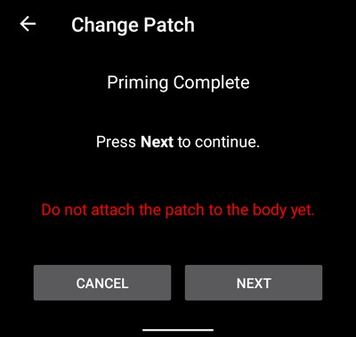
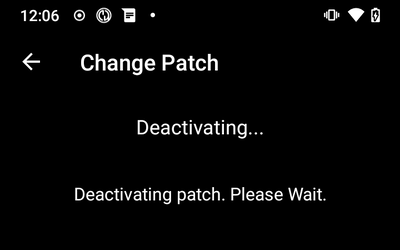
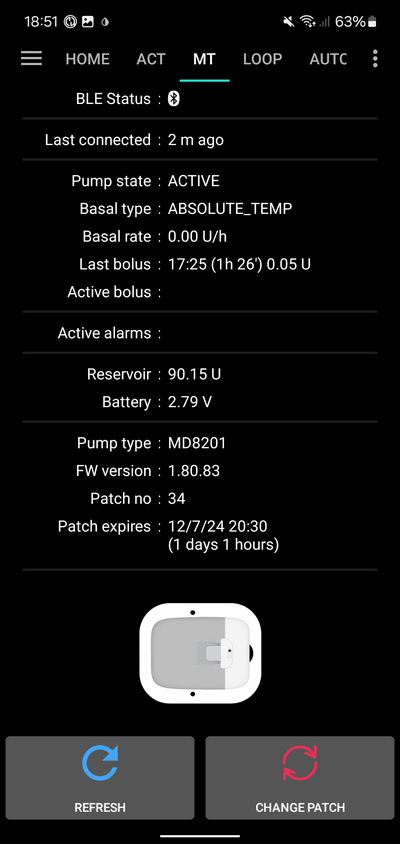
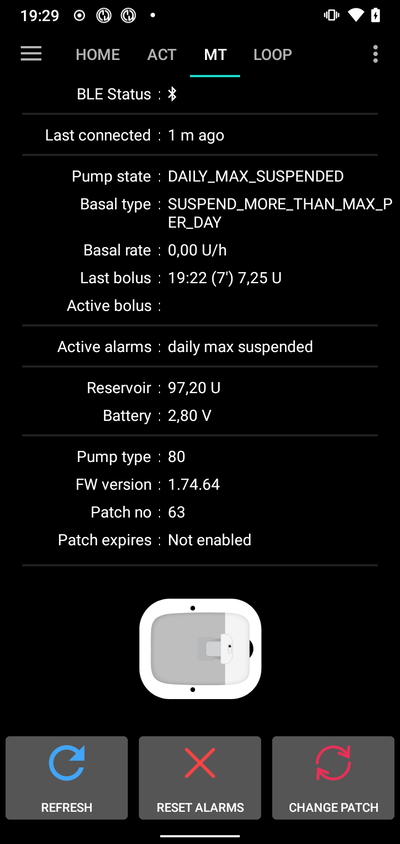

# Medtrum Nano / 300U

Diese Anleitung beschreibt die Konfiguration der Medtrum Insulinpumpe.

Diese Software ist Teil einer DIY-Lösung (Do It Yourself = Eigenbau) und kein kommerzielles Produkt. Daher bist DU gefordert. DU musst lesen, lernen und verstehen, was das System macht und wie du es bedienst. Du bist ganz alleine dafür verantwortlich, was Du mit dem System machst.

```{contents} Table of contents
:depth: 1
:local: true
```

## Funktionalitäten bei der Nutzung mit AAPS
* Alle Loop-Funktionen werden unterstützt (SMB, TBR usw.)
* Automatischer Zeitzonenwechsel und Sommer-/Winterzeitumstellung
* Verlängerter/verzögerter Bolus wird nicht unterstützt

## Hardware- und Software-Anforderungen
* **Kompatible Medtrum Pumpenbasen und Reservoir-Patches**
    - Aktuell werden unterstützt:
        - Medtrum TouchCare Nano mit Pumpenbasis Ref.: **MD0201** und **MD8201**.
        - Medtrum TouchCare 300U mit Pumpenbasis Ref.: **MD8301**.
        - Wenn Du ein bisher nicht unterstütztes Modell hast und bereit bist es zu spenden oder Du beim Testen helfen möchtest, kontaktiere uns über den Discord-Kanal [hier](https://discordapp.com/channels/629952586895851530/1076120802476441641).
* **AAPS Version 3.2.0.0 oder neuer erstellt und installiert** nach den [AAPS erstellen](../SettingUpAaps/BuildingAaps.md)-Anweisungen.
* **Kompatibles Android Smartphone** mit Bluetooth-Verbindung (Bluetooth Low Energy, BLE)
    - Siehe dazu auch die AAPS [Release Notes](../Maintenance/ReleaseNotes.md)
* [**Kontinuierliche Glukosemessung (CGM)**](../Getting-Started/CompatiblesCgms.md)

## Bevor du startest

**Sicherheit geht vor** - Stelle sicher, dass Du auf eventuell auftretende Fehler reagieren kannst, bevor Du diesen Prozess beginnst: zusätzliche Patches, Insulin und Smartphone mit vollem Akku sind unbedingt notwendig).

**Die PDM- und Medtrum-App wird nicht mit einem Patch funktionieren, der durch AAPS aktiviert wurde.** Vorher hast Du möglicherweise den PDM oder die Medtrum App verwendet, um Befehle an die Patchpumpe zu senden. Aus Sicherheitsgründen kannst einen aktivierten Patch nur mit dem Gerät oder der App verwenden, die zu dessen Aktivierung verwendet wurde.

*Das heißt NICHT, dass Du Deinen PDM wegwerfen solltest. Verwahre ihn an einem sicheren Ort als Backup für einen Notfall (z.B. Verlust Deines Smartphones oder AAPS Probleme).*

**Deine Pumpe wird auch dann Insulin abgeben, wenn es sie nicht mit AAPS verbunden ist**. Die Basalrate des aktiven AAPS Profils ist in der Patch-Pumpe hinterlegt. Eine funktionsfähiges AAPS, sendet Basalraten-Befehle, die maximal 120 Minuten abdecken. Sollte die Pumpe aus irgendeinem Grund keine neuen Befehle erhalten (z.B. weil die Pumpe und das Smartphone zu weit voneinander entfernt sind), wird die Pumpe auf die in der Pumpe hinterlegte Standardbasalrate zurückfallen, sobald die temporäre Basalrate endet.

**Basalraten-Profile mit 30-Minuten-Schritten werden in AAPS NICHT unterstützt.** Wenn Du AAPS als Neuling nutzt und zum ersten Mal Dein Basalprofil einrichtest, beachte bitte, dass Deine Basalraten im Profil nur zur vollen Stunde starten und 60 Minuten dauern. Basalraten, die zu einer halben Stunde beginnen und/oder 30 Minuten dauern, werden nicht unterstützt und führen zu Fehlern. Wenn Du zum Beispiel eine Basalrate von 1,1 Einheiten hast, die um 9:30 Uhr startet und zwei Stunden bis 11:30 Uhr läuft, wird dies nicht funktionieren. Du muss diese 1,1 IE Basalrate auf einen Zeitraum von entweder 9:00 - 11:00 Uhr oder 10:00 - 12:00 Uhr einstellen. Der in AAPS verwendete Algorithmus kann halbstündige Basalraten nicht verarbeiten, auch wenn die Hardware der Medtrum-Pumpe dies unterstützen könnte.

Gleiches gilt auch für 'Null-Basalraten'. **Basalraten mit 0 IE/h werden in AAPS NICHT unterstützt**. AAPS benutzt Vielfache der im Profil hinterlegten Basalrate, um die benötigte Insulinmenge zu berechnen. Mit 'Null-Basalraten' funktioniert diese Berechnungn nicht, auch wenn die Metrum-Pumpe diese unterstützen könnte. Eine temporäre Null-Basalrate kann durch die Funktion PUMPE TRENNEN oder durch eine Kombination aus LOOP DEAKTIVIEREN/TEMP BASALRATE oder LOOP PAUSIEREN/TEMP BASALRATE erreicht werden.

## Einrichtung

ACHTUNG: Wenn ein Patch mit AAPS mit aktiviert wird, **MÜSSEN** alle anderen Geräte, die mit der Medtrum Pumpenbasis sprechen könnten, deaktiviert werden. z.B. ein aktiver PDM und die Medtrum-App. Vergewissere Dich, dass Du Deine Pumpenbasis und deren Seriennummer für die Aktivierung eines neuen Patches bereit hast.

### Schritt 1: Wähle die Medtrum-Pumpe aus

#### Option 1: Neue Installation

Wenn Du AAPS erstmals installierst, führt Dich der **Einrichtungsassistent** durch die AAPS-Installation. Wenn Du das Pumpenauswahlmenü erreichst, wähle "Medtrum" aus.

Falls Du Dir nicht sicher bist, kannst Du auch zunächst die „Virtuelle Pumpe“ auswählen und nachdem AAPS fertig eingerichtet ist, später dann auf „Medtrum“ wechseln (siehe Option 2).


#### Option 2: Der Konfigurations-Generator

Bei einer bestehenden Installation kannst Du die **Medtrum**-Pumpe unter [Konfiguration > Pumpe](#Config-Builder-pump) auswählen:

Das **Hamburger-Menü** in der oberen linken Ecke antippen und **Konfiguration**\ ➜\ **Pumpe**\ ➜\ **Medtrum**\ durch **Aktivieren** des Optionsfelds vor dem Namen **Medtrum** auswählen.

Wenn Du das **Kontrollkästchen** neben dem **Zahnrad** auswählst, wird die Medtrum-Übersicht als Registerkarte **MEDTRUM**> in der AAPS-Menüleiste sichtbar werden. Wenn Du dieses Kästchen aktivierst, hast Du beim Nutzen von AAPS einen einfachen Zugriff auf die Medtrum-Befehle und es wird deshalb sehr empfohlen.


### Schritt 2: Ändern der Medtrum-Einstellungen

Öffne die Medtrum-Einstellungen, in dem Du unter KONFIGURATION/Pumpe das auf das **Zahnrad** neben dem Eintrag für die Medtrum tippst.


#### Seriennummer:

Gib die Seriennummer Deiner Pumpen-Basis so ein, wie sie dort abgebildet ist. Stell sicher, dass die Seriennummer richtig eingegeben ist und keine Leerzeichen enthält (Du kannst sowohl Groß- als auch Kleinbuchstaben verwenden).

HINWEIS: Diese Einstellung kann nur dann geändert werden, wenn kein Patch aktiv ist.

#### Alarm-Einstellungen

***Voreingestellt: Piepton.***

Diese Einstellung ändert die Art und Weise, wie die Pumpe Dich im Falle einer Warnung oder eines Fehlers alarmiert.

- Piepton > Der Patch wird bei Alarmen oder Warnungen piepen
- Stumm > Der Patch wird Dich nicht alarmieren und auch keine Warnungen abgeben

Hinweis: Im Stumm-Modus gibt AAPS je nach Lautstärkeeinstellungen Deines Smartphones immer noch den Alarm aus. Wenn Du auf den Alarm nicht reagierst, wird der Patch irgendwann piepen.

#### Notification on pump warning (Benachrichtung bei Pumpenwarnung)

***Voreingestellt: Aktiviert.***

Diese Einstellungen ändern die Art und Weise, wie AAPS Benachrichtigungen bei nicht kritischen Pumpenwarnungen anzeigt. Wenn die Option aktiviert ist, wird beim Auftreten einer Pumpenwarnung eine Benachrichtigung auf dem Smartphone angezeigt. Das betrifft auch:
    - Niedriger Akkustand
    - Reservoir fast leer (20 IE)
    - Patch-Ablaufwarnung

In jedem Fall werden diese Warnungen auch auf der Medtrum-Übersichtsseite unter [Aktive Alarme](#medtrum-active-alarms) angezeigt.

(medtrum-patch-expiration)=
#### Patch Ablaufdatum

***Voreingestellt: Aktiviert.***

Diese Einstellung ändert das Verhalten des Patches. Wenn aktiviert, läuft der Patch nach 3 Tagen ab und gibt, sofern die Lautstärkeeinstellungen entsprechend gesetzt sind, eine hörbare Warnung. Nach 3 Tagen und 8 Stunden wird der Patch nicht mehr funktionieren.

Wenn diese Einstellung deaktiviert ist, wird der Patch keine Warnung abgeben und läuft weiter, bis die Patch-Batterie oder das Reservoir leer sind.

#### Pump expiry warning \[hours\] (Patch Ablaufwarnung)

***Voreingestellt: 72 Stunden.***

Diese Einstellung ändert, wenn das [Patch Ablaufdatum](#medtrum-patch-expiration) aktiviert ist, den Zeitpunkt (in Stunden nach der Aktivierung) zu dem AAPS eine Benachrichtigung anzeigen wird.

#### Stündliches Maximum Insulin

***Voreingestellt: 25 IE.***

Diese Einstellung begrenzt die maximal in einer Stunde abzugebende Insulinmenge. Beim Überschreiten des Limits, wird der Patch die Insulinlieferung unterbrechen und einen Alarm auslösen. The alarm can be reset by pressing the reset button on in the overview menu see [Reset alarms](#nano-reset-alarms).

Setze den Wert auf eine für Deine speziellen Insulin-Anforderungen vernünftigen Wert.

#### Tägliches Maximum Insulin

***Voreingestellt: 80 IE.***

Diese Einstellung begrenzt die maximal an einem Tag abzugebende Insulinmenge. Beim Überschreiten des Limits, wird der Patch die Insulinlieferung unterbrechen und einen Alarm auslösen. The alarm can be reset by pressing the reset button on in the overview menu see [Reset alarms](#nano-reset-alarms).

Setze den Wert auf eine für Deine speziellen Insulin-Anforderungen vernünftigen Wert.

#### Scannen bei Verbindungsfehler

***Standard: Aus.***

Zu finden unter **Erweiterte Einstellungen**.

Aktiviere diese Option nur, wenn Du Verbindungsprobleme hast. Bei aktivierter Option wird vor dem erneuten Verbindungsaufbau zur Pumpe eine Suche (sog. Scan) gestartet. Stelle sicher, dass Du die Standortberechtigung auf "Immer zulassen" gesetzt hast.

### Schritt 2b: AAPS Alarm-Einstellungen

Öffne die Einstellungen

#### Pumpe:

##### BT Watchdog

Gehe in den Einstellungen zum Abschnitt **Pumpe**:


##### BT Watchdog

Diese Einstellung wird versuchen, alle BLE-Probleme zu umgehen. Es wird versuchen, bei einer verlorenen Verbindung, sich wieder mit der Pumpe zu verbinden. Es wird auch versuchen, sich wieder mit der Pumpe zu verbinden, wenn die Pumpe für einige Zeit nicht erreichbar war.

Aktiviere diese Einstellung, wenn Du häufig Verbindungsprobleme mit Deiner Pumpe hast.

#### Lokale Alarme:

Gehe in die Einstellungen und wähle **Lokale Alarme**:


##### Alarm, wenn die Pumpe nicht erreichbar ist

***Voreingestellt: Aktiviert.***

Diese Einstellung ist für Medtrum-Pumpen aktiviert und kann nicht geändert werden. Sollte die Pumpe nicht erreichbar sein, wirst Du alarmiert werden. Dies kann passieren, wenn sich die Pumpe außerhalb der Bluetooth-Reichweite befindet oder wenn die Pumpe aufgrund eines defekten Patches oder einer defekten Pumpenbasis nicht reagiert (z. B. wenn Wasser zwischen Pumpenbasis und den Patch geraten ist).

Aus Sicherheitsgründen kann diese Einstellung nicht deaktiviert werden.

##### Grenzwert Pumpe ist nicht erreichbar [min]

***Voreingestellt: 30 Minuten.***

Diese Einstellung verändert den Zeitraum, nach dem AAPS Dich benachrichtigt, wenn die Pumpe nicht erreichbar ist. Dies kann passieren, wenn sich die Pumpe außerhalb der Bluetooth-Reichweite befindet oder wenn die Pumpe aufgrund eines defekten Patches oder einer defekten Pumpenbasis nicht reagiert (z. B. wenn Wasser zwischen Pumpenbasis und den Patch geraten ist).

Diese Einstellung kann für eine Medtrum-Pumpe geändert werden. Aus Sicherheitsgründen wird empfohlen diese auf 30 Minuten eingestellt zu lassen.

### Schritt 3: Patch aktivieren

**Bevor Du weiter machst:**
- Habe Deine Medtrum Nano Pumpenbasis und ein Reservoir-Patch zur Hand.
- Stell sicher, dass AAPS korrekt eingerichtet und ein [Profil aktiviert ist](../DailyLifeWithAaps/ProfileSwitch-ProfilePercentage.md).
- Andere Geräte, die sich mit der Medtrum-Pumpe verbinden könnten, sind deaktiviert (PDM und Medtrum-App)

#### Patch über den Medtrum Übersichts-Reiter aktivieren

Navigate to the [Medtrum TAB](#nano-overview) in the AAPS interface and press the **Change Patch** button in the bottom right corner.

Wenn ein Patch bereits aktiv ist, wirst Du aufgefordert, diesen aktiven Patch zuerst zu deaktivieren. see [Deactivate Patch](#nano-deactivate-patch).

Befolge die Anweisungen, um den neuen Patch zu befüllen und zu aktivieren. Bitte beachten Sie, dass es wichtig ist, die Pumpbase nur an den Patch des Reservoirs anzuschließen, wenn Sie dazu aufgefordert werden. **Du darfst die Pumpe nur dann auf Deinem Körper anbringen und die Kanüle einführen, wenn Du während des Aktivierungsvorgangs dazu aufgefordert wirst (nachdem die Befüllung der Pumpe abgeschlossen ist).**

##### Aktivierung starten


Überprüfe bei diesem Schritt noch einmal die Seriennummer und stelle sicher, dass die Pumpenbasis noch nicht mit dem Patch verbunden ist.

Drücke **Weiter**, um fortzufahren.

##### Patch füllen


Sobald der Patch erkannt und mit mindestens 70 IE Insulin gefüllt ist, erscheint die **Weiter**-Taste auf der Seite.

##### Patch entlüften


Entferne nicht die Sicherheitssperre und drücke auf die Nadel-Taste am Patch.

Drücke **Weiter**, um das Entlüften zu starten




Sobald das Entlüften abgeschlossen ist, drücke **Weiter**, um fortzufahren.

##### Patch setzen


Reinige die Haut, entferne alle Aufkleber und befestige den Patch an Deinem Körper. Entferne die Sicherheitssperre und drücke die Nadel-Taste auf dem Patch, um die Kanüle zu setzen.

Drücke **Weiter**, um den Patch zu aktivieren.

(medtrum-activate-patch)=
##### Patch aktivieren


Wenn die Aktivierung abgeschlossen ist, wird Folgendes angezeigt


Drücke **OK** um zum Hauptbildschirm zurückzukehren.

(nano-deactivate-patch)=

### Patch deaktivieren

To deactivate a currently active patch, go to the [Medtrum TAB](#nano-overview) in the AAPS interface and press the **Change Patch** button.


Du wirst gebeten zu bestätigen, dass Du den aktuellen Patch deaktivieren möchtest. **Bitte beachte, dass diese Aktion nicht rückgängig gemacht werden kann.** Wenn die Deaktivierung abgeschlossen ist, kannst Du auf **Weiter** tippen, um einen neuen Patch zu aktivieren. Wenn Du nicht bereit bist, einen neuen Patch zu aktivieren, tippe auf **Abbrechen**, um zum Hauptbildschirm zurückzukehren.



Falls AAPS den Patch nicht deaktivieren kann (zum Beispiel, weil die Pumpenbasis bereits vom Reservoir-Patch getrennt wurde), kannst Du **Verwerfen** drücken, um die aktuelle Patch-Sitzung zu löschen und damit eine Aktivierung eines neuen Patches zu ermöglichen.


Sobald die Deaktivierung abgeschlossen ist, tippe auf **OK**, um zum Hauptbildschirm zurückzukehren oder tippe auf **Weiter**, um einen neuen Patch zu aktivieren zu können.

(nano-resume-interrupted-activation)=

### Unterbrochene Aktivierung fortsetzen

If a patch activation is interrupted, for instance because the phone battery runs out, you can resume the activation process by going to the [Medtrum TAB](#nano-overview) in the AAPS interface and press the **Change Patch** button.


Tippe auf **Weiter**, um den Aktivierungsprozess fortzusetzen. Drücke auf **Verwerfen**, um die aktuelle Patch-Sitzung zu löschen und damit eine Aktivierung eines neuen Patches zu ermöglichen.


AAPS wird versuchen, den aktuellen Status der Patch-Aktivierung zu bestimmen. Wenn das erfolgreich war, wird in den Aktivierungsfortschritt übergegangen.

(nano-overview)=

## Übersicht

Die Übersicht enthält den aktuellen Status des Medtrum Patches. Sie enthält auch Schaltflächen zum Wechseln des Patches, Zurücksetzen von Alarmen und zur Status-Aktualisierung.



### BLE Status:

Zeigt den aktuellen Status der Bluetooth-Verbindung zur Pumpenbasis an.

### Zuletzt verbunden:

Zeigt den Zeitpunkt, an dem die Pumpenbasis das letzte Mal mit AAPS verbunden war, an.

### Pumpenstatus:

Dies zeigt den aktuellen Zustand der Pumpe. Zum Beispiel:
    - ACTIVE: Die Pumpe ist aktiviert und läuft normal
    - STOPPED: Der Patch ist nicht aktiviert

### Basaltyp:

Das zeigt den aktuellen Basaltyp an.

### Basalrate:

Dies zeigt die aktuelle Basalrate an.

### Letzter Bolus:

Dies zeigt den letzten abgegebenen Bolus an.

### Active bolus (Aktiver Bolus):

Dies zeigt den derzeit abgegebenen (laufenden) Bolus an.

(medtrum-active-alarms)=
### Aktive Alarme:

Dies zeigt alle derzeit aktiven Alarme an.

### Reservoir:

Dies zeigt den aktuellen Reservoir-Stand an.

### Batterie:

Dies zeigt die aktuelle Batterie-Spannung des Patches an.

### Pumpentyp:

Zeigt die aktuelle Pumpentyp-Nummer an.

### FW-Version:

Dies zeigt die aktuelle Firmware-Version des Patches an.

### Patch Nr.:

Dies zeigt die laufende Nummer des aktivierten Patches an. Diese Nummer wird jedes Mal um eins erhöht, wenn ein neuer Patch aktiviert wird.

### Patch läuft ab:

Hier wird das Datum und die Uhrzeit angezeigt, an dem der Patch ablaufen wird.

### Aktualisieren:

Diese Schaltfläche aktualisiert den Patch-Status.

### Wechsele Patch:

Diese Schaltfläche startet den Prozess zum Wechseln des Patches. Weitere Informationen findest Du unter [Patch aktivieren](#medtrum-activate-patch).

(nano-reset-alarms)=

### Alarme zurücksetzen

Die Alarmtaste wird auf der Übersicht angezeigt, wenn es einen aktiven Alarm, der zurückgesetzt werden kann, gibt. Durch Drücken dieser Taste werden die Alarme zurückgesetzt und die Insulinabgabe fortgesetzt, sofern die Abgabe aufgrund des Alarms unterbrochen wurde. z.B. wenn aufgrund eines "maximale tägliche Insulinmenge"-Alarms die Abgabe unterbrochen wurde.



Tippe auf **Alarme zurücksetzen**, um die Alarme zurückzusetzen und den normalen Betrieb fortzusetzen.

## Smartphone wechseln, Export/Import-Einstellungen

Falls Du das Smartphone wechselst, sind die folgenden Schritte erforderlich:
* [Exportiere die Einstellungen](../Maintenance/ExportImportSettings.md) auf Deinem alten Smartphone
* Übertrage die Einstellungen vom alten auf das neue Smartphone und importiere sie in AAPS

Die importierte Einstellungsdatei muss in der gleichen Patch-Session, die aktuell aktiv ist, exportiert worden sein. Ist dem nichts so, wird sich der Patch nicht verbinden lassen.

Nach dem Import der Einstellungen erfolgt eine Synchronisierung der Pumpenhistorie. Je nach Alter der Einstellungsdatei kann das eine Weile dauern.

Ab AAPS Version 3.3.0.0 wird der Synchronisations-Fortschritt auf dem Startbildschirm angezeigt: 

## Problembehandlung

### Verbindungsprobleme

Wenn Du Verbindungsabbrüche oder andere Verbindungsprobleme hast:
- In den Android-Anwendungseinstellungen für AAPS: Standortberechtigung auf "Immer zulassen" setzen.

### Aktivierung unterbrochen

Wenn der Aktivierungsprozess beispielsweise durch einen leeren Smartphone-Akku oder einen Smartphone-Absturz unterbrochen wird. The activation process can be resumed by going to the change patch screen and follow the steps to resume the activation as outlined here: [Resume interrupted activation](#nano-resume-interrupted-activation)

### Patch-Fehler verhindern

Der Patch kann eine Vielzahl von Fehlern verursachen. Um häufige Fehler zu vermeiden:
- Vergewissere Dich, dass die Pumpenbasis richtig im Patch sitzt und keine Spalten und Lücken sichtbar sind.
- Übe beim Befüllen des Patches keinen übermäßigen Druck auf den Kolben aus. Befülle den Patch nicht über das für Dein Modell gültige Maximum hinaus.

## Wo ich Hilfe bekomme

Die gesamte Entwicklungsarbeit rund um das Medtrum-Modul wird von der Community auf **freiwilliger** Basis geleistet. Wir bitten Dich daher um einen respektvollen Umgang darum und die folgenden Prinzipien zu befolgen, bevor Du um Unterstützung bittest:

-  **Level 0:** Lies den entsprechenden Abschnitt dieser Dokumentation um sicherzustellen, dass du verstehst, wie die Funktion, mit der Du Schwierigkeiten hast, funktionieren soll.
-  **Level 1:** Solltest Du trotz dieses Dokuments ein Problem nicht lösen können, tritt dem *#Medtrum* **Discord**-Channel bei, indem Du auf diesen [Einladungs-Link](https://discord.gg/4fQUWHZ4Mw) klickst.
-  **Level 2:** Vorhandene 'Issues' durchsuchen um zu sehen, ob Dein Problem bereits in den [Issues](https://github.com/nightscout/AAPS/issues) gemeldet wurde. Falls vorhanden, bitte bestätige/kommentiere/ergänze Informationen zu Deinem Problem. Wenn nicht, erstelle bitte ein [neues Issue](https://github.com/nightscout/AndroidAPS/issues) und füge [Deine Protokolldateien](../GettingHelp/AccessingLogFiles.md) (Logs) hinzu.
-  **Sei geduldig - die meisten Mitglieder unserer Community sind gutmütige Freiwillige und die Lösung von Problemen erfordert oft Zeit und Geduld von Nutzern und Entwicklern.**