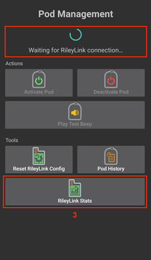
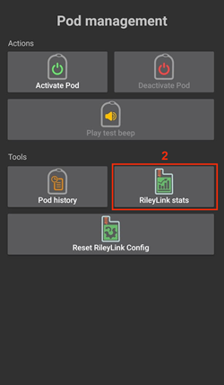

- - -
orphan: true
- - -

# Dokumentation zum AndroidAPS Omnipod Insulinpumpen-Treiber

Diese Anleitung ist für die Konfiguration der Omnipod Eros Pumpe (**NICHT Omnipod Dash**). Der Omnipod-Treiber ist ab Version 2.8 als Teil von AAPS (AAPS) verfügbar.

**Diese Software ist Teil einer DIY-Lösung (Do It Yourself = Eigenbau) und kein kommerzielles Produkt. Daher bist DU gefordert. DU musst lesen, lernen und verstehen, was das System macht und wie du es bedienst. Du bist ganz alleine dafür verantwortlich, was Du mit dem System machst.**

```{contents}
:backlinks: entry
:depth: 2
```

## Hardware- und Software-Anforderungen

- **Pod-Kommunikationsgerät**

> Komponente, die die Kommunikation von deinem AAPS-Gerät zu Deinen Pods der Eros Generation ermöglicht.
> 
> > -   [OrangeLink Website](https://getrileylink.org/product/orangelink)
> > -  [433MHz RileyLink](https://getrileylink.org/product/rileylink433)
> > -   [Emalink Website](https://github.com/sks01/EmaLink) - [Kontakt:](mailto:getemalink@gmail.com)
> > -   DiaLink - [Kontakt:](mailto:Boshetyn@ukr.net)
> > -   [LoopLink Website](https://www.getlooplink.org/) - [Kontakt:](https://jameswedding.substack.com/) - nicht getestet

-   **Smartphone**

> Komponente, die AAPS betreibt und Steuerbefehle an das Pod-Kommunikationsgerät sendet.
> 
> > - Unterstützt [Omnipod Treiber für Android-Smartphone](#Phones-list-of-tested-phones) mit einer AAPS-Version 2.8 und dem zugehörigen Komponenten-Setup.

-   **Insulin-Pumpe**

> Komponente, die vom Pod-Kommunikationsgerät empfangene Befehle interpretiert, die von Deinem Smartphone mit aktiviertem AAPS stammen.
> 
> > - Ein neuer Omnipod-Pod (Eros-Generation - **NICHT DASH**)

Diese Anleitung geht davon aus, dass Du eine neue Pod-Sitzung startest. Falls dies nicht der Fall ist, habe bitte Geduld und beginne diesen Prozess erst bei Deinem nächsten Starten eines neuen Pods.

## Bevor Du anfängst

**Sicherheit geht vor** - Stelle sicher, dass Du auf eventuell auftretende Fehler reagieren kannst, bevor Du diesen Prozess beginnst: zusätzliche Pods, Insulin, geladener RileyLink und Smartphone mit vollem Akku sind unbedingt notwendig.

**Dein Omnipod PDM funktioniert nicht mehr, wenn der AAPS Omnipod Treiber Deinen Pod aktiviert hat**. Bisher hast Du Deinen Omnipod PDM verwendet, um Befehle an Deinen Omnipod Eros Pod zu senden. Ein Omnipod Eros Pod kann sich nur mit einem einzigen Gerät verbinden. Das Gerät, das den Pod erfolgreich aktiviert, ist das einzige Gerät, das von diesem Zeitpunkt an mit ihm kommunizieren darf. Dies bedeutet, dass, sobald Du einen Omnipod Eros Pod mit Deinem RileyLink über den AAPS Omnipod Treiber aktiviert hast, **wirst Du Deinen PDM nicht mehr mit diesem Pod** verwenden können. Der AAPS Omnipod Treiber mit dem RileyLink ist dann Dein aktiver PDM. *Dies bedeutet NICHT, dass Du Deinen PDM wegwerfen solltest. Es wird empfohlen, ihn als Backup zu behalten und für Notfälle, falls AAPS nicht korrekt funktioniert.*

**Du kannst mehrere RileyLinks konfigurieren, aber nur ein RileyLink kann gleichzeitig mit einem Pod kommunizieren.** Der AAPS Omnipod Treiber unterstützt die Möglichkeit, mehrere RileyLinks in der RileyLink-Konfiguration hinzuzufügen, jedoch kann nur ein RileyLink gleichzeitig für das Senden und Empfangen der Kommunikation ausgewählt werden.

**Dein Pod wird nicht abgeschaltet, wenn der RileyLink außerhalb der Reichweite liegt.** Dein Pod wird weiterhin Basal-Insulin liefern, wenn Dein RileyLink außerhalb der Reichweite ist oder die Kommunikation mit dem aktiven Pod geblockt wird. Beim Aktivieren eines Pods wird das in AAPS definierte Profil in den neuen Pod programmiert. Wenn du den Kontakt zum Pod verlierst, wird er auf dieses zurückgesetzt. Du kannst keine neuen Befehle senden, solange der RileyLink nicht wieder in Reichweite kommt und die Verbindung wiedergeherstellt ist.

**Basalraten-Profile mit 30-Minuten-Schritten werden in AAPS NICHT unterstützt.** Wenn Du neu bei AAPS bist und zum ersten Mal Dein Basalprofil einrichtest, beachte bitte, dass Basalprofile, die mit einer halben Stunde beginnen, nicht unterstützt werden und Du Dein Basalprofil anpassen musst. Wenn Du zum Beispiel eine Basalrate von 1,1 Einheiten hast, die um 9:30 Uhr startet und zwei Stunden bis 11:30 Uhr läuft, wird dies nicht funktionieren.  Du muss diese 1,1 IE Basalrate auf einen Zeitraum von entweder 9:00 - 11:00 Uhr oder 10:00 - 12:00 Uhr einstellen.  Obwohl die Omnipod-Hardware selbst Basalratenwechsel zur halben Stunde unterstützt, ist AAPS derzeit nicht in der Lage, dies mit seinen Algorithmen zu berücksichtigen.

## Aktivieren des Omnipod-Treibers in AAPS

Du kannst den Omnipod-Treiber in AAPS auf **zwei Wegen** aktivieren:

### Option 1: Der Einrichtungsassistent

Nach der Installation einer neuen Version von AndroidAPS startet der **Einrichtungsassistent** automatisch.  Dies wird auch nach einem Upgrade geschehen.  Wenn du die Einstellungen von einer vorherigen Installation exportiert hast, kannst du den Einrichtungsassistenten beenden und deine alten Einstellungen importieren.  Für Neuinstallationen fahre unten fort.

Über den **AAPS Setup Wizard (2)** , der oben rechts im **Drei-Punkt-Menü (1)** zugänglich ist und weiter durch das Assistentenmenüs (Setup Wizard) gelangst Du bis zum Bildschirm **Pump**. Dann wähle den **Omnipod Radio Button (3)**.

>   

Auf dem gleichen Bildschirm werden unter der Pumpenauswahl die **Omnipod-Treibereinstellungen** angezeigt. Füge unterhalb der **RileyLink Konfiguration** Dein RileyLink Gerät hinzu, indem Du den **Nicht gesetzt** Text drückst.

Drücke auf dem Bildschirm **RileyLink Auswahl** die **Scan-Schaltfläche (4)** um einen Bluetooth Scan zu starten. Wenn Du alles richtig ausgewählt hast, wirst Du auf den Bildschirm der Pumpentreiberauswahl (unter Omnipod Treibereinstellungen) zurückgeleitet. Dort sollte die MAC-Adresse Deines gewählten RileyLink anzeigt werden.

Drücke den **Weiter** Button, um mit dem Rest des **Setup-Assistenten fortzufahren.**  Es kann bis zu einer Minute dauern, bis der gewählte RileyLink initialisiert wird und der **Weiter** Button aktiviert wird.

Die Details zur Einrichtung des Pod-Kommunikationsgeräts finden sich weiter unten im Bereich [RileyLink Setup](#rileylink-setup).

**ODER**

### Option 2: Der Konfigurations-Generator

Über das **Hamburger Menü** oben links unter **Konfigurations-Assistent (1)** \<unk> **Pumpe**\<unk> **Omnipod** indem Du das **Auswahlfeld (2)** mit dem Titel **Omnipod** wählst. Wenn du das **Kontrollkästchen (4)** neben dem **Einstellungsrädchen (3)** wählst, wird das Omnipod-Menü als Registerkarte im AAPS-Interface mit dem Titel **POD** angezeigt. Dies wird in dieser Dokumentation als Registerkarte **Omnipod (POD)** bezeichnet.

> **HINWEIS:** Eine schnellere Möglichkeit auf die **Omnipod-Einstellungen** zuzugreifen, findest Du unten in der Rubrik [Omnipod-Einstellungen](#omnipod-settings) dieses Dokuments.
> 
>  

### Überprüfung der Omnipod-Treiberauswahl

*Hinweis: Wenn Du den Setup-Assistenten vorzeitig verlassen hast, ohne Deinen RileyLink auszuwählen, ist der Omnipod Treiber aktiviert, aber Du musst trotzdem Deinen RileyLink noch auswählen.  Dann erscheint bei dir der Omnipod (POD) Tab wie unten zusehen*

Um zu überprüfen, ob Du den Omnipod-Treiber in AAPS aktiviert hast, **wische nach links** vom Tab **Übersicht** wo du nun einen Reiter **Omnipod** oder **POD** siehst.


## Omnipod-Konfiguration

Bitte **wische nach links** zur **Omnipod (POD)** Registerkarte, wo Du alle Pod und RileyLink Funktionen verwalten kannst (einige dieser Funktionen sind ohne aktive Pod Sitzung nicht aktiviert oder nicht sichtbar):

>  Aktualisiere Pod-Verbindung und Status
> 
>  Pod-Management (Aktivieren, Deaktivieren, Testsignal, RileyLink Statistik und Pod-Historie)

(OmnipodEros-rileylink-setup)=

### RileyLink-Setup

Wenn Du Deinen RileyLink bereits erfolgreich im Setup-Assistenten oder wie oben beschrieben verbunden hast, fahre mit dem Abschnitt [Aktivieren eines Pod](#activating-a-pod) fort.

*Hinweis: Ein guter visueller Hinweis dafür, dass der RileyLink nicht angeschlossen ist, ist, dass die Tasten Insulin und Bolusrechner auf der Startseite fehlen. Dies passiert auch in den ersten 30 Sekunden nach dem Start von AAPS, da AAPS sich erst mit dem RileyLink verbinden muss.*

1. Stelle sicher, dass Dein RileyLink voll geladen und eingeschaltet ist.

2. Nach der Auswahl des Omnipod-Treibers identifiziere und wähle Deinen RileyLink im **Config Builder (1)** <unk>**Pumpe**<unk>**Omnipod**<unk>**Getriebesymbol (Einstellungen) (2)** <unk>**RileyLink Konfiguration (3)** indem Du die **Nicht setzen** oder **MAC-Adresse (falls vorhanden)** drückst.

   > Damit AAPS den RileyLink an seiner MAC-Adresse erkennen kann, stelle sicher, dass Dein RileyLink-Akku geladen ist und sich [in unmittelbarer Nähe Deines Smartphones befindet](#optimal-omnipod-and-rileylink-positioning) (näher als 30 cm). Einmal ausgewählt, kannst Du Deine erste Pod Session aktivieren. Benutze die Zurück-Taste auf Deinem Handy, um zum AAPS-Haupt-Bildschirm zurückzukehren.
   > 
   >  

3. Drücke die **Weiter** Taste, um mit dem Rest des **Einrichtungsassistenten** fortzufahren. **Wählen Sie Ihren RileyLink (5)**  aus der Liste der verfügbaren Bluetooth-Geräte aus.

   >  

4. Nach erfolgreicher Auswahl wirst Du zu den Omnipod Einstellungen zurückgeleitet, welche die **MAC-Adresse Deines aktuell ausgewählte RileyLinks auflisten (6).**

   > 

5. Vergewissere Dich, dass im Tab **Omnipod (POD)** der **RileyLink-Status (1)** als **verbunden erscheint.** Das **Pod Status (2)** Feld sollte **Kein aktiver Pod**anzeigen; Falls nicht, versuchen Sie bitte den vorherigen Schritt oder verlassen Sie AAPS, um zu sehen, ob dies die Verbindung aktualisiert.

   > 

(OmnipodEros-activating-a-pod)=

### Einen Pod aktivieren

Bevor Du einen Pod aktivieren kannst, stelle sicher, dass Du Deine RileyLink-Verbindung in den Omnipod-Einstellungen richtig konfiguriert und verbunden hast

*HINWEIS: Für die Verbindung mit dem Pod steht aus Sicherheitsgründen nur ein kleinerer Kommunikationsbereich zur Verfügung. Vor dem Pairing des Pods ist das Funksignal schwächer, aber nachdem es verbunden wurde, wird es mit voller Signalleistung funktionieren. Stelle sicher, dass Dein Pod während dieser Prozedur *[in unmittelbarer Nähe](#optimal-omnipod-and-rileylink-positioning) (näher als 30 cm) ist, aber nicht direkt auf oder neben dem RileyLink liegt.\*

01. Navigiere zur Registerkarte **Omnipod (POD)** und klicke auf den **POD MGMT (1)** Button und dann auf **Pod aktivieren (2)**.

    >  

02. Der **Pod füllen** Bildschirm wird angezeigt. Fülle deinen neuen Pod mit mindestens 80 Einheiten Insulin und achte auf zwei Signaltöne, die anzeigen, dass der Pod bereit ist, gestartet zu werden. Beachte bei der Berechnung der gesamt Insulinmenge, welche Du in 3 Tagen benötigst, dass zum Füllen des Pod 12 bis 15 IE benötigt werden.

    > 
    > 
    > Stelle sicher, dass der neue Pod und RileyLink in der Nähe von einander liegen (~ 30cm oder weniger), und klicke auf den Button **Weiter**.

03. Der Bildschirm **Initialisiere Pod** wird angezeigt und der Pod beginnt zu entlüften. (Du wirst ein Klicken hören, gefolgt von einer Reihe tickender Sounds, der Pod entlüftet sich selbst). Wenn RileyLink außerhalb des zulässigen Bereichs des aktiven Pods aktiviert wurde, erhälst Du eine Fehlermeldung **Keine Antwort von Pod**. Wenn dies geschieht, [hole den RileyLink näher ran](#optimal-omnipod-and-rileylink-positioning) (näher als 30 cm), lege ihn aber nicht auf die Oberseite oder direkt neben den Pod und klicke dann auf den Button **Erneut versuchen (1)**.

    >  

04. Bei erfolgreicher Befüllung wird ein grünes Häkchen angezeigt und der **Weiter** Button wird aktiviert. Klicke auf den **Weiter** Button, um die Initialisierung des Pods abzuschließen; anschließend wird der **Pod anlegen** Bildschirm angezeigt.

    > 

05. Bereite anschließend die Infusionsstelle des neuen Pods vor. Entferne die Nadelkappe aus Kunststoff und den weißen Papierträger von der Klebefläche und setze den Pod auf die ausgewählte Stelle Deines Körpers auf. Wenn du fertig bist, klicke auf den **Weiter** Button.

    > 

06. Das **Pod anlegen** Dialogfenster wird nun angezeigt. **NUR auf OK klicken, wenn du bereit bist, die Kanülen einzuführen.**

    > 

07. Nach dem Drücken von **OK** dauert es eventuell etwas, bevor der Omnipod antwortet und die Kanüle setzt (1-2 Minuten maximal) also habe Geduld.

    > Wenn RileyLink außerhalb des zulässigen Bereichs des aktiven Pods aktiviert wurde, erhälst Du eine Fehlermeldung **Keine Antwort von Pod**. Wenn dies geschieht, hole den RileyLink näher ran (~ 30 cm weg oder weniger), aber nicht auf die Oberseite oder direkt neben den Pod und klicke auf den Button **Erneut versuchen**.
    > 
    > Wenn der RileyLink sich außerhalb der Bluetoothreichweite befindert oder keine aktive Verbindung zum Smartphone hat, bekommst Du eine Fehlermeldung **Keine Antwort von RileyLink**. Wenn diese Fehlermeldung auftritt, verringere die Distanz vom RileyLink und dem Smartphone und klicke auf den Button **Erneut versuchen**.
    > 
    > *HINWEIS: Bevor die Kanüle eingesetzt wird, ist es ratsam, die Haut in der Nähe des Kanülensetzpunktes etwas zusammenzukneifen. Dies sorgt für eine sanfte Einführung der Nadel und verringert die Gefahr einer Verstopfung.*
    > 
    > 
    > 
    >  

08. Es wird ein grünes Häkchen angezeigt, und der Button **Weiter** wird bei erfolgreicher Kanüleneinführung aktiviert. Klicke auf den **Weiter** Button.

    > 

09. Der **Pod aktiviert** Bildschirm wird angezeigt. Klicke auf den grünen **Beenden** Button. Glückwunsch! Du hast jetzt eine neuen Pod aktiviert.

    > 

10. Der Menübildschirm **Pod Management** sollte nun den **Aktiviere Pod (1)** Button als *deaktiviert* und den **Deaktiviere Pod (2)** Button als *aktiviert* anzeigen. Dies liegt daran, dass jetzt ein Pod aktiv ist und du keinen zusätzlichen Pod aktivieren kannst, ohne zuerst den aktuell aktiven Pod zu deaktivieren.

    Klicke auf den Zurück-Knopf auf deinem Smartphone, um zum Tab-Bildschirm **Omnipod (POD)** zurückzukehren, auf dem jetzt Informationen zu deiner aktiven Pod-Sitzung angezeigt werden, einschließlich der aktuellen Basalrate, Pod Reservoir Level, abgegebenes Insulin, Pod Fehler und Warnungen.

    Weitere Details zu den angezeigten Informationen findest du im Tab [Omnipod (POD)](#omnipod-pod-tab) dieses Dokuments.

     

### Deaktiviere einen Pod

Unter normalen Umständen beträgt die Lebensdauer eines Pods drei Tage (72 Stunden) und zusätzlich 8 Stunden nach der Pod-Ablaufwarnung und somit insgesamt 80 Stunden.

Gehe wie folgt vor, um einen Pod zu deaktivieren (entweder vor dem Ablaufen der Nutzungsdauer oder wegen eines Pod-Fehlers):

1. Navigiere zur Registerkarte **Omnipod (POD)** und klicke auf den **POD MGMT (1)** Button und dann im **Pod Management** Screen klicke auf den **Pod deaktivieren (2)** Button.

   >  

2. Im **Deaktiviere Pod** Screen stelle zuerst sicher, dass sich der RileyLink in unmittelbarer Nähe zum Pod befindet, aber nicht direkt darauf oder direkt neben dem Pod liegt. Dann klicke auf den **Weiter** -Button, um den Prozess zur Deaktivierung des Pods zu starten.

   > 

3. Der **Deaktiviere Pod** Bildschirm erscheint und du erhältst einen Bestätigungspiepton, dass die Deaktivierung erfolgreich war.

   > 
   > 
   > **WENN die Deaktivierung scheitert** und du keinen Bestätigungspiepton erhältst, kommt evlt. die Meldung **Keine Antwort von RileyLink** oder **Keine Antwort vom Pod**. Bitte klicke auf den Button **Erneut versuchen (1)**, um die Deaktivierung erneut zu versuchen. Wenn die Deaktivierung weiterhin fehlschlägt, klicke bitte auf die **Verwerfen (2)** -Schaltfläche, um den Pod zu verwerfen. Du kannst nun deinen Pod entfernen, da die aktive Sitzung beendet wurde. Falls Dein Pod einen dauerhaften Alarm hat, musst Du ihn mit einem Pin oder einer Büroklammer manuell ausschalten. Die **Verwerfe Pod(2)** Schaltfläche wird ihn nicht still stellen.
   > 
   > >   

4. Nach erfolgreicher Deaktivierung wird ein grünes Häkchen angezeigt. Klicke auf **Weiter** um die Deaktivierung des Pods abzuschließen. Du kannst nun deinen Pod entfernen, da die aktive Sitzung beendet wurde.

   > 

5. Klicke auf den grünen Button, um zum Bildschirm **Pod Management** zurückzukehren.

   > 

6. Du bist nun zurück zum Menü **Pod Management** und drückst die Zurück-Taste auf Deinem Telefon, um zum Tab **Omnipod (POD)** zurückzukehren. Überprüfe, dass der **RileyLink Status:** Feldberichte **Verbunden** und das **Pod Status:** Feld eine **Kein aktiver Pod** Nachricht anzeigt.

   >   

### Insulinlieferung stoppen und fortsetzen

Die folgenden Schritte zeigen Dir, wie Du die Insulinzufuhr aussetzen und fortsetzen kannst.

*HINWEIS - wenn Du keinen Button 'Unterbrechen' siehst*, ist dessen Anzeige im Register Omnipod (POD) nicht aktiviert. Aktiviere **Button „Insulinabgabe unterbrechen“ im Omnipod Tab anzeigen** in den [Omnipod-Einstellungen](#omnipod-settings) in der Rubrik **Andere**.

#### Insulinabgabe unterbrechen

Verwende diesen Befehl, um den aktiven Pod in den Status 'unterbrochen' zu versetzen. In diesem suspendiertem Zustand wird der Pod kein Insulin mehr liefern. Dieser Befehl ahmt die Suspend-Funktion nach, die der originale Omnipod PDM an einen aktiven Pod sendet.

1. Gehe auf die Registerkarte **Omnipod (POD)** und klicke auf den **SUSPEND (1)** Button. Der Suspend-Befehl wird vom RileyLink an den aktiven Pod gesendet und die Taste **SUSPEND (3)** wird ausgegraut. Der **Pod Status (2)** zeigt **SUSPEND DELIVERY** an.

   >  

2. Wenn der Befehl zum Suspendieren erfolgreich durch den RileyLink bestätigt wurde, zeigt ein Bestätigungsdialog die Nachricht **Alle Insulinlieferungen wurden ausgesetzt** an. Klicke **OK** um zu bestätigen und fortzufahren.

   > 

3. Dein aktiver Pod hat jetzt alle Insulinabgabe unterbrochen. Die **Omnipod (POD)** Registerkarte aktualisiert den **Pod Status (1)** auf **unterbrochen**. Der **Unterbrechen**-Button ändert sich zu **Abgabe fortsetzen (2)**.

   > 

#### Insulinabgabe fortsetzen

Use this command to instruct the active, currently suspended pod to resume insulin delivery. Nachdem der Befehl erfolgreich verarbeitet wurde, wird die normale Insulinabgabe mit der aktuellen Basalrate fortgesetzt. Grundlage dafür ist das aktive Basalprofil zur aktuellen Uhrzeit. Der Pod akzeptiert wieder Befehle für Bolus, TBR und SMB.

1. Gehe zum Tab **Omnipod (POD)** und stelle sicher, dass das **Pod Status (1)** Feld zeigt **Suspended**, drücke dann den **Weiterlieferung (2)** Button, um den Prozess zu starten und den aktuellen Pod anzuweisen, die normale Insulinlieferung wieder fortzusetzen. Eine Nachricht **RESUME DELIVERY** wird im Feld **Pod Status (3)** angezeigt und signalisiert, dass der RileyLink den Befehl aktiv an den suspendierten Pod sendet.

   >  

2. Wenn der Befehl zum Fortsetzen erfolgreich durch den RileyLink bestätigt wurde, zeigt ein Bestätigungsdialog die Nachricht **Insulinabgabe wieder aufgenommen** an. Klicke **OK** um zu bestätigen und fortzufahren.

   > 

3. Die **Omnipod (POD)** Registerkarte aktualisiert das Feld **Pod Status (1)** um **LAUFEND** und die Schaltfläche **Lieferung fortsetzen** wird nun zu **UNTERBRECHEN (2)** geändert.

   > 

### Pod-Alarme bestätigen

*HINWEIS - Wenn Du keine ACK ALERTS Schaltfläche siehst, liegt es daran, dass diese nur auf der Registerkarte Omnipod (POD) angezeigt wird, wenn der Pod-Ablauf oder der niedrige Reservoir-Alarm ausgelöst wurden.*

In dem folgenden Prozess wird gezeigt, wie Warntöne bestätigt und quittiert werden können, die auftreten, wenn die aktive Pod-Zeit den Grenzwert für die Warnung vor dem Ablauf von 72 Stunden (3 Tage) erreicht hat. Dieser Grenzwert für die Zeitbegrenzung ist in den Einstellungen für **Stunden vor dem Herunterfahren** in den Omnipod Warnungen definiert. Die maximale Nutzungsdauer eines Pods beträgt 80 Stunden (3 Tage und 8 Stunden), dennoch empfiehlt der Hersteller, 72 Stunden (3 Tage) nicht zu überschreiten.

*HINWEIS - Wenn die Einstellung "Benachrichtigungen automatisch bestätigen" in den Omnipod-Alarmen aktiviert wurde, wird diese Benachrichtigung nach dem ersten Auftreten automatisch bearbeitet und der Alarm muss nicht NICHT manuell abgebrochen werden.*

1. Wenn die definierte **Stunden bis zum Podende** Vorwarnzeit erreicht ist, gibt der Pod Warnungen aus, um Dir mitzuteilen, dass er sich seiner Ablaufzeit nähert und bald ein Wechsel des Pods erforderlich sein wird. Sie können dies auf der Registerkarte **Omnipod (POD)** überprüfen, das Feld **Pod läuft ab: (1)** zeigt die genaue Zeit an, zu welcher der Pod abläuft (72 Stunden nach der Aktivierung) und der Text wird **rot**, nachdem diese Zeit abgelaufen ist, in dem Feld **Active Pod Alarme (2)** wird die Statusnachricht **Pod wird bald bald ablaufen** angezeigt. Dieser Trigger veranlasst die Anzeige des **ACK ALERTS (3)** Buttons. Eine **Systembenachrichtigung (4)** informiert Dich ebenfalls über das bevorstehende Ende des Pods

   >  

2. Gehe zum Tab **Omnipod (POD)** und drücke den **ACK ALERTS (2)** Button (Bestätigungsbenachrichtigungen). Der RileyLink sendet den Befehl an den Pod, um die Ablaufwarnung des Pods zu deaktivieren und aktualisiert das Feld **Pod Status (1)** mit **ACKNOWLEDGE ALERTS**.

   > 

3. Nach **erfolgreicher Deaktivierung** der Benachrichtigungen, **2 Töne** werden vom aktiven Pod ausgegeben und ein Bestätigungsdialog zeigt die Nachricht **Aktivierungsbenachrichtigungen wurden bestätigt**. Drücke **OK**, um den Dialog zu bestätigen und zu schließen.

   > 
   > 
   > Wenn sich der RileyLink außerhalb des Bereichs des Pods befindet, während der Befehl zum Bestätigen des Alarms gerade verarbeitet wird, werden 2 Optionen angezeigt. **Mute (1)** wird die aktuelle Warnung stummschalten. **OK (2)** bestätigt die aktuelle Warnung und ermöglicht es dem Nutzer nochmals die erhaltenen Alarme zu bestätigen.
   > 
   > 

4. Gehe zur Registerkarte **Omnipod (POD)** unter dem Menüpunkt **Aktive Pod Warnungen**. Die Warnmeldung wird dort nicht mehr angezeigt und der aktive Pod erzeugt keine Signale mehr, die vor dem Ablauf des Pods warnen.

(OmnipodEros-view-pod-history)=

### Anzeige Pod-Historie

In diesem Abschnitt wird gezeigt, wie Du Deine Pod-Historie überprüfen und nach verschiedenen Aktionskategorien filtern kannst. Das Podhistory-Werkzeug erlaubt es, die Aktionen und Ergebnisse Ihres aktuell aktiven Pods während seines dreitägigen Lebens (72 - 80 Stunden) anzusehen.

Diese Funktion ist hilfreich bei der Überprüfung von Boli, Temporären Basalraten (TBRs) und Basaländerungen, die erfolgt sind, bei denen Du aber nicht sicher bist, ob sie abgeschlossen wurden. Die übrigen Kategorien sind im Allgemeinen hilfreich bei der Problembehebung und zur Bestimmung der Reihenfolge von Ereignissen, die zu einem Fehler geführt haben.

*HINWEIS:* **Unsichere** Befehle erscheinen in der Pod-Historie, aber für deren Genauigkeit gibt es aufgrund deren natürlichen Unsicherheit keine Garantie.

1. Gehe zur Registerkarte **Omnipod (POD)**, klicke auf den Button **POD MGMT (1)** und dann auf dem Bildschirm **Pod Management** auf den Button **Pod Historie (2)**, um die Pod Historie anzusehen.

   >  

2. In der Anzeige **Pod-Historie** wird die Standardkategorie **Alle (1)** angezeigt, die **Datum und Uhrzeit (2)** aller Pods **Aktionen (3)** und **Ergebnisse (4)** in umgekehrter chronologischer Reihenfolge darstellt. Drücke zweimal die **Zurück-Taste deines Telefons** um zur **Omnipod (POD)** Registerkarte  zurückzukehren.

   >  

### Zeige RileyLink Einstellungen und Historie an

Dieser Abschnitt zeigt, wie die Einstellungen des aktiven Pods und RileyLinks zusammen mit der Kommunikationshistorie der beiden überprüft werden können. Diese Funktion wird nach dem Aufrufen in zwei Abschnitte unterteilt: **Einstellungen** und **Historie**.

Hauptsächlich wird diese Funktion verwendet, wenn der RileyLink außerhalb des Bluetooth-Bereichs des Smartphones ist und der **RileyLink-Status** nach einer bestimmten Zeit **RileyLink nicht erreichbar** meldet. Der Button **REFRESH** auf der Registerkarte **Omnipod (POD)** wird manuell versuchen die Bluetooth-Kommunikation mit dem derzeit in den Omnipod-Einstellungen konfigurierten RileyLink erneut herzustellen.

Für den Fall dass der **REFRESH** Button im **Omnipod (POD)** Tab die Verbindung zum Rileylink nicht wiederherstellen kann, folge den zusätzlichen Hinweisen weiter unten zur manuellen Wiederherstellung der Verbindung.

#### Bluetooth-Kommunikation für Pod-Kommunikationsgerät manuell wiederherstellen

1. Wenn im **Omnipod (POD)** Tab der **RileyLink-Status: (1)** **RileyLink nicht erreichbar** meldet, drücke den **POD MGMT (2)** Knopf, um zur **Pod-Verwaltung** zu kommen. Wenn im Menü **Pod Management** eine Benachrichtigung zur aktiven Suche nach einer RileyLink-Verbindung erscheint, drücke auf **RileyLink Statistiken (3)**, um die **RileyLink Einstellungen** Seite aufzurufen.

   >  

2. Auf dem Bildschirm **RileyLink-Einstellungen (1)** unter **RileyLink (2)** kannst du sowohl den Bluetooth-Verbindungsstatus als auch den Fehler in den Feldern **Verbindungsstatus und Fehler: (3)** bestätigen. Ein *Bluetooth-Fehler* und *RileyLink nicht erreichbar* Status sollten angezeigt werden. Starte das manuelle Wiederverbinden der Bluetooth-Verbindung, indem du auf den **refresh (4)** Button in der unteren rechten Ecke drückst.

   > 
   > 
   > Wenn der RileyLink nicht reagiert oder außer Reichweite des Smartphones ist, während der Bluetooth-Aktualisierungsbefehl gerade verarbeitet wird, erscheint eine Warnmeldung, die 2 Optionen ermöglicht.

   - **Mute (1)** wird die aktuelle Warnung stummschalten.
   - **OK (2)** bestätigt diese aktuelle Warnung und ermöglicht es dem Nutzer zu versuchen die Bluetooth-Verbindung erneut wieder herzustellen.

   > 

3. Wenn die **Bluetooth-Verbindung** nicht wieder hergestellt wird, dann versuche die Bluetooth-Funktion auf deinem Smartphone manuell **aus-** und dann wieder **anzuschalten**.

4. Nach einer erfolgreichen RileyLink Bluetooth-Wiederverbindung sollte das Feld **Verbindungsstatus: (1)** **RileyLink bereit** anzeigen. Herzlichen Glückwunsch, Du hast jetzt erneut Deinen konfigurierten RileyLink mit AAPS verbunden!

   > 

#### Pod-Kommunikationsgerät und Aktive Pod-Einstellungen

Dieser Bildschirm liefert Informationen, Status und Einstellungen zur Konfiguration sowohl für den aktuell konfigurierten Rileylink als auch für den aktuell aktiven Pod.

1. Gehe zum Tab **Omnipod (POD)** und drücke den **POD MGMT (1)** Button, um das **Pod Management** Menü aufzurufen, drücke dann den **RileyLink Statistiken (2)** Button, um die Einstellugnen des derzeit konfigurierten **RileyLink (3)**als auch des aktiven Pod **Geräts (4)** anzuzeigen.

   >  
   > 
   > 

##### RileyLink (3) Felder

> - **Adresse:** MAC-Adresse des gewählten Pod-Kommunikationsgeräts, die in den Omnipod-Einstellungen definiert wurde.
> - **Name:** Bluetooth-Identifikationsname des in den Bluetooth-Einstellungen deines Smartphones definierten Pod-Kommunikationsgeräts.
> - **Akkustand:** Zeigt den aktuellen Batterieladestand des angeschlossenen Pod-Kommunikationsgeräts an
> - **Verbundenes Gerätemodell:** Modell des Omnipod-Pods, der derzeit mit dem Pod-Kommunikationsgerät kommuniziert
> - **Verbindungsstatus:**: Der aktuelle Status der Bluetooth-Verbindung zwischen dem Pod-Kommunikationsgerät und dem Smartphone, auf dem AAPS läuft.
> - **Verbindungsfehler:** Wenn es einen Fehler mit dem Pod-Kommunikationsgerät gibt, werden hier die Details der Bluetooth-Verbindung angezeigt.
> - **Firmware-Version:** Aktuelle Firmware-Version, die auf dem aktiv verbundenen Pod-Kommunikationsgerät installiert ist.

##### Gerät (4) Felder - Mit einem aktiven Pod

> - **Geräte-Typ:** Der Geräte-Typ, der mit dem Pod-Kommunikationsgerät verbunden ist (Omnipod-Pod-Pumpe)
> - **Gerätemodell:** Das Modell des aktiven Geräts, das mit dem Pod-Kommunikationsgerät verbunden ist (der Modellname des Omnipod-Pods, also Eros)
> - **Seriennummer der Pumpe:** Seriennummer des aktuell aktivierten Pods
> - **Pumpenfrequenz:** Funkfrequenz, die das Pod-Kommunikationsgerät eingestellt hat, um die Kommunikation zwischen sich und dem Pod zu ermöglichen.
> - **Zuletzt verwendete Frequenz:** Letzte bekannte Funkfrequenz, die der Pod zur Kommunikation mit dem Pod-Kommunikationsgerät verwendet hat.
> - **Letzter Gerätekontakt:** Datum und Uhrzeit des letzten Kontakts vom Pod mit dem Pod-Kommunikationsgerät.
> - **Aktualisieren Button:** Durch Klicken manuell die Einstellungen auf dieser Seite aktualisieren.

(omnipod-eros-rileylink-and-active-pod-history)=
#### Historie des RileyLink und aktiven Pods

Dieser Bildschirm gibt in umgekehrter chronologischer Reihenfolge Auskunft über jeden Zustand oder jede Maßnahme des RileyLink und des aktuell verbundenen Pods. Die gesamte Historie ist nur für den gerade aktiven Pod verfügbar. Nach einem Podwechsel wird diese Historie gelöscht und nur die Ereignisse des neu aktivierten Pods werden aufgezeichnet und angezeigt.

1. Geh zur Registerkarte **Omnipod (POD)** und drücke den Button **POD MGMT (1)**, um auf das Menü **Pod-Management** zuzugreifen, dann drücke den **Pod Histiorie (2)** Button, um die **Einstellungen** als auch die **Historie** anzusehen. Drücke dann auf die Schaltfläche **Pod-Historie(3)**, um die gesamte Historie des RileyLink und der aktuell aktiven Pos Session anzusehen.

   >  
   > 
   > 

##### Felder

> - **Datum & Uhrzeit**: In umgekehrter chronologischer Reihenfolge der Zeitstempel der einzelnen Ereignisse.
> - **Gerät:** Das Gerät, auf das sich die aktuelle Aktion oder der aktuelle Zustand bezieht.
> - **Zustand oder Aktion:** Der aktuelle Zustand oder die Aktion, die das Gerät durchgeführt hat.

(OmnipodEros-omnipod-pod-tab)=

## Omnipod (POD) Tab

Im Folgenden werden die Anordnung und die Bedeutung der Symbole und Statusfelder auf der Registerkarte **Omnipod (POD)** des AAPS-Hauptbildschims erläutert.

*HINWEIS: Wenn in den Statusfeldern der Registerkarte Omnipod (POD) eine Meldung erscheint (unsicher), musst Du die Schaltfläche Aktualisieren drücken, um sie zu löschen und den Pod-Status zu aktualisieren.*

> 

### Felder

- **RileyLink Status:** Zeigt den aktuellen Verbindungsstatus des RileyLink an

- *RileyLink nicht erreichbar* - Das Pod-Kommunikationsgerät befindet sich entweder nicht in Bluetooth-Reichweite des Smartphones, ist ausgeschaltet oder hat einen Fehler, der die Bluetooth-Kommunikation verhindert.
- *RileyLink bereit* - Das Pod-Kommunikationsgerät ist eingeschaltet und initialisiert gerade die Bluetooth-Verbindung.
- *Verbunden* - Das Pod-Kommunikationsgerät ist eingeschaltet, verbunden und aktiv in der Lage, über Bluetooth zu kommunizieren.

- **Pod Adresse:** Zeigt die aktuelle Adresse an, in der der aktive Pod referenziert wird

- **LOT:** Zeigt die LOT-Nummer des aktiven Pods an

- **TID:** Zeigt die Seriennummer des Pods an.

- **Firmware-Version:** Zeigt die Firmware-Version des aktiven Pods an.

- **Zeit auf dem Pod:** Zeigt die aktuelle Uhrzeit auf dem aktiven Pod an.

- **Pod läuft ab:** Zeigt das Datum und die Uhrzeit an, zu der der aktive Pod abläuft.

- **Pod-Status:** Zeigt den Status des aktiven Pods an.

- **Letzte Verbindung:** Zeigt an, wann zum letzten Mal eine Kommunikation mit dem aktiven Pod stattgefunden hat.

- *gerade eben* vor weniger als 20 Sekunden.
- *vor weniger als einer Minute* vor mehr als 20 Sekunden, aber weniger als 60 Sekunden.
- *vor 1 Minute* vor mehr als 60 Sekunden, aber weniger als 120 Sekunden (2 min).
- *vor XX Minuten* vor mehr als 2 Minuten, definiert durch den Wert von XX.

- **Letzter Bolus:** Zeigt die Dosierung des letzten Bolus an, der an den aktiven Pod gesendet wurde, und in Klammern, wie lange es her ist, dass er abgegeben wurde.

- **Basis-Basalrate:** Zeigt die Basalrate an, die für den aktuellen Zeitpunkt im Basalratenprofil programmiert wurde.

- **Temporäre Basalrate:** Zeigt die aktuell laufende temporäre Basalrate im folgenden Format an

- Einheiten / Stunde zum Zeitpunkt der Erstellung der TBR (gelaufene Minuten / Gesamtminuten, in denen die TBR läuft)
- *Beispiel:* 0,00 IE/h @18:25 ( 90/120 min.)

- **Reservoir:** Zeigt 50+ IE übrig an, wenn mehr als 50 Einheiten im Reservoir vorhanden sind. Unterhalb dieses Wertes werden die genauen Einheiten in gelber Schrift angezeigt.

- **Insgesamt abgegeben:** Zeigt die Gesamtzahl der aus dem Reservoir abgegebenen Insulineinheiten an. *Beachte, dass es sich hierbei um einen Näherungswert handelt, da das Befüllen des Pods nicht absolut exakt geschieht.*

- **Fehler:** Zeigt den letzten Fehler an. Überprüfe die [Pod Historie](#view-pod-history), [RileyLink Historie](#omnipod-eros-rileylink-and-active-pod-history) und die Protokolldateien auf aufgetretene Fehler und Detailinformationen.

- **Aktive Pod-Warnungen:** Zeigt jeweils aktuelle Warnungen auf dem aktiven Pod. Wird normalerweise verwendet, wenn das Pod-Ablaufdatum nach 72 Stunden erreicht ist und native Pieptöne vom Pod ausgegeben werden.

### Icons

- **AKTUALISIEREN:**

  > 
  > 
  > Sendet einen Befehl an den aktiven Pod, um die Kommunikation zu aktualisieren
  > 
  > Verwende diese Option, um den Pod-Status zu aktualisieren und die Statusfelder zu erneuern, die den Text 'unsicher' enthalten.
  > 
  > Weitere Informationen zur [Problembehandlung](#troubleshooting) findest Du im Abschnitt unten.

- **POD MGMT:**

  > 
  > 
  > Navigiert zum Pod Management Menü

- **ACK ALERTS:**

  > 
  > 
  > Durch Drücken dieser Taste werden die Signaltöne und Benachrichtigungen zum Ablauf des Pods deaktiviert.
  > 
  > Der Button wird nur angezeigt, wenn die aktuelle Zeit des Pods nach dem Pod-Ablaufdatum liegt Nach erfolgreicher Bestätigung wird dieses Symbol nicht mehr angezeigt.

- **ZEIT EINSTELLEN:**

  > 
  > 
  > Durch Drücken dieser Taste wird die Uhrzeit auf dem Pod mit der aktuellen Uhrzeit des Smartphones aktualisiert.

- **UNTERBRECHEN:**

  > 
  > 
  > Unterbricht den aktiven Pod

- **ABGABE FORTSETZEN:**

  > 
  > 
  > > Setzt den derzeit angehaltenen, aktiven Pod fort

### Pod Management Menu

Im Folgenden werden die Darstellung und die Bedeutung der Symbole im Menü **Pod Management** erläutert, das über die Registerkarte **Omnipod (POD)** aufgerufen wird.

> 

- **Pod aktivieren**

  > 
  > 
  > Startet und aktiviert einen neuen Pod

- **Pod deaktivieren**

  > 
  > 
  > * Deaktiviert den aktuell aktiven Pod.
  > 
  > * Ein unvollständig verbundener Pod ignoriert diesen Befehl.
  > 
  > * Verwende diesen Befehl, um einen heulenden Pod zu deaktivieren (Fehler 49).
  > 
  > Wenn der Knopf deaktiviert ist (grau ausgegraut) verwenden Sie die Schaltfläche Pod verwerfen.

- **Testton abspielen**

  > 
  > 
  > Gibt beim Drücken einen einzelnen Testton auf dem Pod wieder.

- **Pod verwerfen**

  > 
  > 
  > Durch Drücken wird der Pod-Status eines nicht reagierenden Pods deaktiviert und verworfen.
  > 
  > Die Schaltfläche wird nur in ganz bestimmten Fällen angezeigt, da eine ordnungsgemäße Deaktivierung nicht mehr möglich ist:
  > 
  > > - Ein **Pod ist nicht vollständig verbunden** und ignoriert daher die Befehle zum Deaktivieren.
  > > - Ein **Pod hängt** während des Kopplungsvorgangs zwischen den Schritten fest
  > > - Ein **Pod lässt sich überhaupt nicht verbinden.**

- **Pod Historie**

  > 
  > 
  > Zeigt den Aktivitätsverlauf des aktiven Pods an

- **RileyLink Status:**

  > 
  > 
  > Navigiert zum Bildschirm "RileyLink Status", der die aktuellen Einstellungen und den Verlauf der RileyLink-Verbindung anzeigt
  > 
  > > - **Einstellungen** - zeigt Informationen zum RileyLink und aktive Pod-Einstellungen an
  > > - **Historie** - zeigt den Verlauf der RileyLink- und Pod-Kommunikation an

- **RileyLink-Konfiguration zurücksetzen**

  > 
  > 
  > Durch Drücken dieser Taste wird die Konfiguration des aktuell angeschlossenen Pod-Kommunikationsgeräts zurückgesetzt.
  > 
  > > - Wenn die Kommunikation gestartet wird, werden bestimmte Daten an das Pod-Kommunikationsgerät gesendet und dort eingestellt > - Speicherregister werden gesetzt > - Kommunikationsprotokolle werden eingestellt > - Eingestellte Funkfrequenz wird gesetzt 
  > > - Siehe hierzu auch die [Zusatzinformationen](#OmnipodEros-reset-rileylink-config-notes) am Ende der Tabelle

- **Pulse-Log lesen:**

  > 
  > 
  > > Sendet das Pulse-Log des aktiven Pods in die Zwischenablage

(OmnipodEros-reset-rileylink-config-notes)=

#### *Hinweise zum Zurücksetzen der RileyLink-Konfiguration*

- Diese Funktion wird in erster Linie verwendet, wenn das derzeit aktive Pod-Kommunikationsgerät nicht antwortet und die Kommunikation in einem festgefahrenen Zustand ist.
- Wenn das Pod-Kommunikationsgerät aus- und wieder eingeschaltet wird, muss die Taste **RileyLink-Konfiguration zurücksetzen** gedrückt werden, damit diese Kommunikationsparameter in der Konfiguration des Pod-Kommunikationsgeräts eingestellt werden.
- Wird dies NICHT getan, muss AAPS neu gestartet werden, nachdem das Pod-Kommunikationsgerät aus- und wieder eingeschaltet wurde.
- Diese Taste **muss NICHT** gedrückt werden, wenn zwischen verschiedenen Pod-Kommunikationsgeräten gewechselt wird.

(OmnipodEros-omnipod-settings)=

## Omnipod-Einstellungen

Die Omnipod Treibereinstellungen sind aus der oberen linken Ecke **Hamburger Menü** unter **Config Builder**<unk>**Pumpe**<unk>**Omnipod**<unk>**Einstellungen Geräte (2)** über die **Optionsschaltfläche (1)** mit dem Titel **Omnipod** konfigurierbar. Wenn du das **Kontrollkästchen (3)** neben dem Einstellungsrädchen (2) wählst, wird das Omnipod-Menü als Registerkarte mit der Bezeichnung **OMNIPOD** oder **POD** in der AAPS-Oberfläche angezeigt. Dies wird in dieser Dokumentation als Registerkarte **Omnipod (POD)** bezeichnet.


**HINWEIS:** Eine schnellere Möglichkeit, auf die **Omnipod Einstellungen** zuzugreifen, besteht darin, das **Drei-Punkte-Menü (1)** in der oberen rechten Ecke der Registerkarte **Omnipod (POD)** aufzurufen und **Omnipod Einstellungen (2)** aus dem Dropdown-Menü auszuwählen.


Die Einstellungen sind nach Gruppen sortiert unten aufgelistet. Du kannst die meisten der Einstellungen über einen Kippschalter aktivieren oder deaktivieren:


*HINWEIS: Ein Sternchen (\*) bedeutet, dass "aktiviert" der Standardwert für eine Einstellung ist.*

### RileyLink

Ermöglicht das Scannen eines Pod-Kommunikationsgeräts. Der Omnipod-Treiber kann nicht mehr als ein Pod-Kommunikationsgerät auf einmal ansteuern.

- **Akkustand von OrangeLink/EmaLink/DiaLink anzeigen:** Meldet den aktuellen Batteriestand des OrangeLink/EmaLink/DiaLink. Es wird **dringend empfohlen**, dass alle OrangeLink/EmaLink/DiaLink-Benutzer diese Einstellung aktivieren.

- Funktioniert NICHT mit dem originalen RileyLink.
- Funktioniert möglicherweise nicht mit RileyLink-Alternativen.
- Aktiviert - Meldet den aktuellen Batteriestand für unterstützte Pod-Kommunikationsgeräte.
- Deaktiviert - Meldet einen Wert von n/a.

- **Aktiviere die Protokollierung des Akkuwechsels im Aktionen-Tab/Menü:** Im Menü "Aktionen" ist die Schaltfläche "Batteriewechsel protokollieren" aktiviert, WENN Du diese Einstellung UND die obige Einstellung zum Anzeigen des Akkustands aktiviert hast.  Einige Pod-Kommunikationsgeräte können inzwischen mit normalen Batterien betrieben werden, die ausgewechselt werden können.  Diese Option ermöglicht es Dir, dies zu protokollieren und den Timer für das Batteriealter zurückzusetzen.

### Bestätigungstöne

Bestätigt mit Signaltönen des Pods die Abgabe und Änderung von Bolus, Basalrate, SMB und TBR.

- **\*Bolus-Töne aktiviert:** Aktiviert oder deaktiviert Bestätigungstöne, wenn ein Bolus abgegeben wird.
- **\*Basal-Töne aktiviert:** Aktiviert oder deaktiviert die Bestätigungstöne, wenn eine neue Basalrate eingestellt wird, eine aktive Basalrate abgebrochen oder die aktuelle Basalrate geändert wird.
- **\*SMB-Töne aktiviert:** Aktiviert oder deaktiviert Bestätigungstöne, wenn ein SMB abgegeben wird.
- **TBR-Piep aktiviert:** Aktiviert oder deaktiviert Bestätigungstöne, bei Setzen oder Abbruch einer TBR.

### Alarme

Bietet AAPS-Warnungen und Nightscout-Ankündigungen für den Ablauf eines Pods, die Abschaltung oder einen niedrigen Füllstand basierend auf den definierten Schwellenwerten.

*Beachte, dass eine AAPS-Benachrichtigung IMMER für jeden Alarm nach der ersten Kommunikation mit dem Pod ausgegeben wird, da der Alarm ausgelöst wurde. Wenn Du die Benachrichtigung löschst, wird der Alarm NICHT gelöscht, AUSSER wenn die automatische Bestätigung von Pod-Alarmen aktiviert ist. Um den Alarm MANUELL zu deaktivieren, musst du die Registerkarte Omnipod (POD) aufrufen und die Schaltfläche AKK ALERTS drücken.*

- **\*Ablauferinnerung aktiviert:** Aktiviere oder deaktiviere die Pod-Ablauferinnerung, die ausgelöst wird, wenn die festgelegte Anzahl von Stunden vor dem Herunterfahren erreicht ist.
- **Stunden bis zum Podende:** Legt die Anzahl der Stunden vor der Abschaltung des aktiven Pods fest, die den Alarm zur Pod-Ablauferinnerung auslöst.
- **\*Niedrige Reservoir-Alarm aktiviert:** Aktivieren oder deaktivieren Sie eine Warnung, wenn die verbleibenden Einheiten niedriger Reservoir-Limit erreicht ist, wie im Feld Anzahl der Einheiten definiert.
- **Anzahl der Einheiten:** Die Anzahl der verbleibenden Einheiten, bei denen der Alarm für den niedrigen Reservoirstand ausgelöst werden soll.
- **Automatisch Pod Benachrichtigungen bestätigen:** Wenn aktiviert, wird eine Benachrichtigung unmittelbar nach dem ersten Pod Kommunikationskontakt seit der Warnung automatisch bestätigt und die Warnung wird verworfen.

### Benachrichtigungen

Meldet AAPS-Benachrichtigungen und akustische Telefonwarnungen, wenn unsicher ist, ob TBR-, SMB- oder Bolus-Ereignisse erfolgreich waren.

*HINWEIS: Dies sind nur Benachrichtigungen, es werden keine akustischen Signale ausgegeben.*

- **Ton für unsichere TBR-Benachrichtigung aktiviert:** Aktiviere oder deaktiviere diese Einstellung, um einen akustischen Alarm und eine visuelle Benachrichtigung auszulösen, wenn AAPS unsicher ist, ob eine TBR erfolgreich gesetzt wurde.
- **\*Ton für Benachrichtigung bei unsicheren SMB-Ereignis aktiviert:** Aktiviere oder deaktiviere diese Einstellung, um einen akustischen Alarm und eine visuelle Benachrichtigung auszulösen, wenn AAPS unsicher ist, ob eine SMB erfolgreich zugestellt wurde.
- **\*Ton für Benachrichtigung bei unsicheren Bolus-Ereignis aktiviert:** Aktiviere oder deaktiviere diese Einstellung, um einen akustischen Alarm und eine visuelle Benachrichtigung auszulösen, wenn AAPS unsicher ist, ob ein Bolus erfolgreich abgegeben wurde.

### Andere

Bietet erweiterte Einstellungen zur Unterstützung bei der Fehlersuche.

- **Schaltfläche "Zustellung aussetzen" in der Registerkarte Omnipod anzeigen:** Blende die Schaltfläche "Zustellung aussetzen" in der Registerkarte **Omnipod (POD)** aus oder zeige sie an.
- **Pulse Log-Schaltfläche im Menü Pod-Verwaltung anzeigen:** Blende die Pulse Log-Schaltfläche im Menü **Pod-Verwaltung** aus oder zeige sie an.
- **Schaltfläche RileyLink-Statistiken im Menü Pod-Verwaltung anzeigen:** Verstecke oder zeige die Schaltfläche RileyLink-Statistiken im Menü **Pod-Verwaltung**.
- \* **\*Sommerzeit/Zeitzonenerkennung aktiviert:** Ermöglicht die automatische Erkennung von Zeitzonenänderungen, wenn das Telefon in einem Gebiet verwendet wird, in dem die Sommerzeit gilt.

### Wechseln oder Entfernen eines aktiven Pod-Kommunikationsgeräts (RileyLink)

Da es viele alternative Modelle zum originalen RileyLink gibt (z.B. OrangeLink oder EmaLink) oder mehrere Backup-Versionen desselben Pod-Kommunikationsgeräts (RileyLink) benötigt werden, ist es notwendig, das ausgewählte Pod-Kommunikationsgerät (RileyLink) aus der Omnipod-Einstellungskonfiguration zu wechseln oder zu entfernen.

Die folgenden Schritte zeigen dir, wie du ein bestehendes Pod-Kommunikationsgerät (RileyLink) **entfernst** und ein neues Pod-Kommunikationsgerät **hinzufügst**.  Wenn du die beiden Schritte **Entfernen** und **Hinzufügen** ausführst, wird dein Gerät gewechselt.

1. Rufe das Menü **RileyLink-Auswahl** auf, indem du das **3-Punkte-Menü (1)** in der oberen rechten Ecke der **Omnipod (POD)**-Registerkarte auswählst und im Dropdown-Menü **Omnipod-Einstellungen (2)** auswählst. Drücke im Menü **Omnipod-Einstellungen** unter **RileyLink-Konfiguration (3)** auf den Text **Nicht eingestellt** (wenn kein Gerät ausgewählt ist) oder **MAC-Adresse** (wenn ein Gerät vorhanden ist), um das Menü **RileyLink-Auswahl** zu öffnen.

   >  

### Aktuell ausgewähltes Pod-Kommunikationsgerät entfernen (RileyLink)

Dieser Vorgang zeigt Dir, wie Du das aktuell ausgewählte Pod-Kommunikationsgerät (RileyLink) aus den Einstellungen des Omnipod-Treibers entfernst.

1. Drücke unter **RileyLink-Konfiguration** auf den Text **MAC-Adresse (1)**, um das Menü **RileyLink-Auswahl** zu öffnen.

   > 

2. Drücke im Menü **RileyLink-Auswahl** die Taste **Entfernen (2)**, um **deinen aktuell ausgewählten RileyLink (3)** zu entfernen

   > 

3. Drücke bei der Bestätigungsaufforderung **Ja (4)**, um das Entfernen deines Geräts zu bestätigen.

   > 

4. Du gelangst zurück zum Menü **Omnipod-Einstellungen**, wo du unter **RileyLink-Konfiguration** jetzt siehst, dass das Gerät **Nicht eingestellt (5)** ist.  Herzlichen Glückwunsch, Du hast dein ausgewähltes Pod-Kommunikationsgerät nun erfolgreich entfernt.

   > 

### Aktuell ausgewähltes Pod-Kommunikationsgerät hinzufügen (RileyLink)

Dieser Vorgang zeigt Dir, wie Du ein neues Pod-Kommunikationsgerät zu den Einstellungen des Omnipod-Treibers hinzufügst.

1. Drücke unter **RileyLink-Konfiguration** den Text **Nicht gesetzt (1)**, um das Menü **RileyLink-Auswahl** zu öffnen.

   > 

2. Drücke die Taste **Scan (2)**, um die Suche nach allen verfügbaren Bluetooth-Geräten zu starten.

   > 

3. Wähle **deinen RileyLink (3)** aus der Liste der verfügbaren Geräte aus und Du kehrst zum Menü **Omnipod-Einstellungen** zurück, wo die **MAC-Adresse (4)** Deines neu ausgewählten Geräts angezeigt wird.  Herzlichen Glückwunsch, Du hast Dein Pod-Kommunikationsgerät erfolgreich ausgewählt.

   >  

## Aktionen (AKT) Tab

Diese Registerkarte ist in der AAPS-Hauptdokumentation gut dokumentiert, aber es gibt einige Punkte auf dieser Registerkarte, die sich speziell darauf beziehen, wie sich der Omnipod-Pod von schlauchbasierten Pumpen unterscheidet, insbesondere nach dem Anbringen eines neuen Pods.

1. Gehe zur Registerkarte **Aktionen (AKT)** im AAPS-Hauptinterface.
2. Im Abschnitt **Careportal (1)** werden das Alter nachfolgenden Felder **nach jedem Podwechsel** auf 0 Tage und 0 Stunden zurückgesetzt: **Insulin** und **Kanüle**. Das liegt daran, wie die Omnipod-Pumpe gebaut ist und funktioniert. Die **Pumpenbatterie** und das **Insulinreservoir ** sind immer im Pod enthalten. Da der Pod die Kanüle direkt in die Haut am Ort der Pod-Anwendung einführt, wird bei Omnipod-Pumpen kein herkömmlicher Schlauch verwendet. *Nach einem Podwechsel wird das Alter jedes dieser Werte daher automatisch auf Null zurückgesetzt.* **Das Alter der Pumpenbatterie** wird nicht angegeben, da die Batterie im Pod immer länger hält, als die Lebensdauer des Pods (maximal 80 Stunden).

> 

### Füllstände

**Insulin Level**

Die Angabe der Insulinmenge im Omnipod Eros Pod ist nicht genau.  Das liegt daran, dass nicht genau bekannt ist, wie viel Insulin in den Behälter gefüllt wurde, sondern nur, dass beim Befüllen des Reservoirs 2 Pieptöne ertönen und mehr als 85 Einheiten gespritzt wurden. Ein Pod kann maximal 200 Einheiten aufnehmen. Auch das Priming kann zu Abweichungen führen, da es kein exakter Prozess ist.  Mit diesen beiden Faktoren wurde der Omnipod-Treiber so geschrieben, dass er die beste Annäherung an das im Reservoir verbleibende Insulin liefert.

> - **Über 50 Einheiten** - Meldet einen Wert von 50+U, wenn sich mehr als 50 Einheiten im Reservoir befinden.
> - **Unter 50 Einheiten** - Meldet einen ungefähren berechneten Wert des im Reservoir verbleibenden Insulins.
> - **SMS** - Aus dem Pod übernommener Wert oder 50+ IE für SMS-Antworten
> - **Nightscout** - Lädt den Wert 50 hoch, wenn mehr als 50 Einheiten angezeigt werden (Nightscout Version 14.07 und älter).  Neuere Versionen melden einen Wert von 50+, wenn sich mehr als 50 Einheiten im Reservoir befinden.

**Akkustand**

Die Batteriestandsmeldung ist eine Einstellung, die aktiviert werden kann, um den aktuellen Batteriestand von Pod-Kommunikationsgeräten wie dem OrangeLink, EmaLink oder DiaLink anzuzeigen.  Die RileyLink-Hardware ist nicht in der Lage, ihren Batteriestand zu melden.  Der Batteriestand wird nach jeder Kommunikation mit dem Pod gemeldet, so dass beim Aufladen möglicherweise kein linearer Anstieg zu beobachten ist.  Durch eine manuelle Aktualisierung wird der aktuelle Batteriestand aktualisiert.  Wenn ein unterstütztes Pod-Kommunikationsgerät nicht angeschlossen ist, wird ein Wert von 0% gemeldet.

> - **Die RileyLink-Hardware ist NICHT in der Lage ihren Batteriestand zu melden**
> - **"Zeige den von OrangeLink/EmaLink/DiaLink gemeldeten Akkustand" MUSS in den Omnipod-Einstellungen aktiviert werden, um den Akkustand zu melden**
> - **Batteriestandsmeldung funktioniert NUR für OrangeLink-, EmaLink- und DiaLink-Geräte**
> - **Batteriestandsmeldung KANN für andere Geräte funktionieren (außer RileyLink)**
> - **SMS** - Gibt den aktuellen Akkustand als Antwort zurück, wenn ein aktueller Wert existiert, ein Wert von n/a wird nicht zurückgegeben
> - **Nightscout** - Akkustand wird gemeldet, wenn ein aktueller Wert existiert, ein Wert von n/a wird nicht gemeldet

(OmnipodEros-troubleshooting)=

## Problembehandlung

### Pod Fehler

Pods fallen gelegentlich aus unterschiedlichen Gründen aus, u. a. wegen Hardwareproblemen mit dem Pod selbst. Am besten ist es, diese nicht bei Insulet anzugeben, da AAPS kein zugelassener Anwendungsfall ist. Eine Liste an Fehlercodes findest du [hier](https://github.com/openaps/openomni/wiki/Fault-event-codes), um die Ursache zu ermitteln.

### Verhindere Pod Fehler 49

Dieser Fehler hängt mit einem fehlerhaften Pod-Status für einen Befehl oder einem Fehler während der Insulinabgabe zusammen. Wir empfehlen Benutzern, in den Nightscout-Client Einstellungen *nur hochladen (Sync-deaktivieren)* auszuwählen, um mögliche Fehler zu vermeiden.

### Pumpe nicht erreichbar Alarme

Es wird empfohlen, Alarme für unerreichbare Pumpen auf **120 Minuten** zu konfigurieren, indem du im Drei-Punkte-Menü oben rechts **Einstellungen** ➜ **Lokale Alarme** ➜ **Schwellenwert für unerreichbare Pumpen \[min\]** auswählst und diesen auf **120** setzt.

(OmnipodEros-import-settings-from-previous-aaps)=
### Importieren von Einstellungen aus früherem AAPS

Bitte beachte, dass beim Importieren von Einstellungen die Möglichkeit besteht, dass ein veralteter Pod-Status importiert wird. Infolgedessen kannst Du einen aktiven Pod verlieren. Es wird daher dringend empfohlen, **keine Einstellungen während einer aktiven Pod-Sitzung zu importieren**.

1. Deaktiviere deine Pod-Sitzung. Stelle sicher, dass keine aktive Pod-Sitzung läuft.
2. Exportiere deine Einstellungen und bewahre eine Kopie an einem sicheren Ort auf.
3. Deinstalliere die vorherige Version von AAPS und starte dein Smartphone neu.
4. Installiere die neue Version von AAPS und stelle sicher, dass Du keine aktive Pod-Sitzung hast.
5. Importiere deine Einstellungen und aktiviere einen neuen Pod.

### Omnipod-Treiberwarnungen

Bitte beachte, dass der Omnipod-Treiber auf der Registerkarte **Übersicht** eine Vielzahl einzigartiger Warnungen anzeigt. Die meisten davon sind informativ und können ignoriert werden, während einige dem Benutzer eine Aktion vorschlagen, um die Ursache für die ausgelöste Warnung zu beheben. Im Folgenden findest du eine Zusammenfassung der wichtigsten Warnmeldungen, die dir begegnen können:

#### Kein aktiver Pod

Keine aktive Pod-Sitzung erkannt. Dieser Alarm kann vorübergehend durch Drücken von **Schlummern** deaktiviert werden, wird aber weiterhin ausgelöst, solange kein neuer Pod aktiviert wurde. Einmal aktiviert, wird dieser Alarm automatisch ausgeschaltet.

#### Pod angehalten

Hinweis, dass der Pod ausgesetzt wurde.

#### Setzen des Basal-Profils fehlgeschlagen. Die Abgabe könnte ausgesetzt sein! Bitte aktualisiere den Pod-Status manuell auf der Registerkarte Omnipod und setze die Übertragung bei Bedarf fort.

Hinweis, dass die Einstellung des Pod-Basalprofils fehlgeschlagen ist und Du auf der Registerkarte DASH auf *Aktualisieren* drücken musst.

#### Es kann nicht überprüft werden, ob der SMB-Bolus erfolgreich war. Wenn du sicher bist, dass der Bolus nicht erfolgreich war, solltest du den SMB-Eintrag manuell auf der Registerkarte Behandlungen entfernen.

Im Falle einer Nachricht, das die Abgabe eines SMB Bolus nicht verifiziert werden konnte, musst Du das Feld *Letzter Bolus* auf der Registerkarte Omnipod überprüfen, um zu sehen, ob der SMB-Bolus erfolgreich war, und wenn nicht, den Eintrag auf der Registerkarte Behandlungen entfernen.

#### Unsicher, ob die "Ereignis Bolus/TBR/SMB" abgeschlossen wurde. Bitte überprüfe manuell, ob sie erfolgreich war.

Aufgrund der Art und Weise, wie RileyLink und Omnipod miteinander kommunizieren, kann es zu Situationen kommen, in denen es *unsicher* ist, ob ein Befehl erfolgreich verarbeitet wurde. Es war notwendig, den Nutzer über diese Unsicherheit zu informieren.

Im Folgenden findest du einige Beispiele dafür, wann eine unsichere Meldung auftreten kann.

- **Bolus** - Unsichere Boli können nicht automatisch überprüft werden. Die Benachrichtigung bleibt bis zum nächsten Bolus bestehen, aber eine manuelle Pod-Aktualisierung löscht die Meldung. *Standardmäßig sind bei dieser Benachrichtigungsart die Warntöne aktiviert, da der/die Nutzer/in sie manuell bestätigen muss.*
- **TBRs, Pod-Status, Profilwechsel, Zeitänderungen** - eine manuelle Pod-Aktualisierung löscht die Meldung. In der Voreinstellung sind die Signaltöne für diesen Benachrichtigungstyp deaktiviert.
- **Pod-Zeitabweichung -** Wenn die Zeit auf dem Pod und die Zeit auf Deinem Telefon zu sehr voneinander abweichen, ist es für die AAPS-Loop schwierig, zu funktionieren und genaue Vorhersagen und Dosierungsempfehlungen zu machen. Wenn die Zeitabweichung zwischen dem Pod und dem Telefon mehr als 5 Minuten beträgt, meldet AAPS unter Pod-Status, dass sich der Pod im suspendierten Zustand befindet, und gibt eine Meldung aus, die eine Behandlung der Zeitdifferenz anfordert. Ein zusätzliches Symbol **Zeit einstellen** erscheint am unteren Rand der Registerkarte Omnipod (POD). Wenn Du auf Zeit einstellen klickst, wird die Zeit auf dem Pod mit der Zeit auf dem Telefon synchronisiert und dann kannst Du auf die Schaltfläche ZUSTELLUNG WIEDERAUFNEHMEN klicken, um den normalen Pod-Betrieb fortzusetzen.

## Best Practices

(OmnipodEros-optimal-omnipod-and-rileylink-positioning)=

### Optimale Positionierung von Omnipod und RileyLink

Die Antenne, die auf dem RileyLink zur Kommunikation mit einem Omnipod-Pod verwendet wird, ist eine 433 MHz-Wendelspiralantenne. Aufgrund seiner Konstruktion strahlt er ein omnidirektionales Signal wie ein dreidimensionaler Donut ab, wobei die Z-Achse die vertikal stehende Antenne darstellt. Das bedeutet, dass es optimale Positionen für die Platzierung des RileyLink gibt, insbesondere bei der Pod-Aktivierung und Deaktivierung.


> *(Bild 1. Graphische Darstellung einer Wendelspiralantenne in einem Rundstrahldiagramm*)

Aus Sicherheitsgründen muss die *Aktivierung* des Pods in einem *geringeren Abstand (~30 cm oder weniger)* als andere Vorgänge erfolgen, wie z. B. die Verabreichung eines Bolus, das Setzen eines TBR oder das einfache Aktualisieren des Pod-Status. Aufgrund der Art und Weise der Signalübertragung der RileyLink-Antenne ist es NICHT empfehlenswert, den Pod direkt auf oder neben dem RileyLink zu platzieren.

Die Abbildung unten zeigt die optimale Positionierung des RileyLink während der Pod-Aktivierung und Deaktivierung. Der Pod kann zwar auch in anderen Positionen aktiviert werden, jedoch wirst Du mit der unten gezeigten Position den größten Erfolg haben.

*Hinweis: Wenn trotz optimaler Positionierung des Pods die Kommunikation mit dem RileyLink fehlschlägt, kann dies an einer schwachen Batterie liegen, da diese den Sendebereich der RileyLink-Antenne verringert. Um dieses Problem zu vermeiden, stelle sicher, dass der RileyLink während dieses Vorgangs ordnungsgemäß geladen oder direkt an ein Ladekabel angeschlossen ist.*


## Wo bekomme ich Hilfe für den Omnipod-Treiber?

Die gesamte Entwicklungsarbeit für den Omnipod-Treiber wird von der Community auf freiwilliger Basis geleistet. Wir bitten dich, rücksichtsvoll zu sein und die folgenden Richtlinien zu befolgen, wenn du um Unterstützung bittest:

- **Level 0:** Lies den entsprechenden Abschnitt dieser Dokumentation um sicherzustellen, dass du verstehst, wie die Funktion, mit der Du Schwierigkeiten hast, funktionieren soll.
- **Level 1:** Wenn Du immer noch Probleme hast, die du mit diesem Dokument nicht lösen kannst, dann gehe bitte in den *#androidaps* Channel auf **Discord**, indem du [diesen Einladungslink <https://discord.gg/4fQUWHZ4Mw>](https://discord.gg/4fQUWHZ4Mw) benutzt.
- **Stufe 2:** Gehe durch die bestehenden Probleme, um zu sehen, ob Dein Problem bereits bekannt ist; Falls nicht, eröffne ein neues [Issue](https://github.com/nightscout/AndroidAPS/issues) und hänge Deine [Protokolldateien](../GettingHelp/AccessingLogFiles.md) (engl. logs) an.
- **Sei geduldig - die meisten Mitglieder unserer Community sind gutmütige Freiwillige und die Lösung von Problemen erfordert oft Zeit und Geduld von Nutzern und Entwicklern.**
