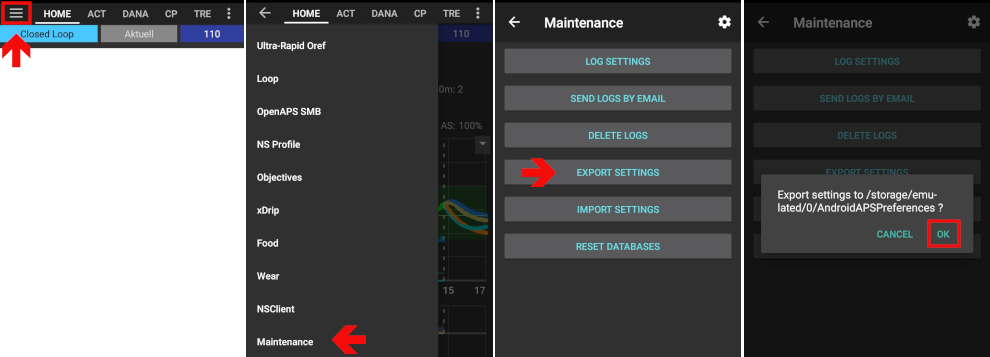

# DanaRS Insulinpumpe

*Diese Anleitung beschreibt die Einrichtung der App und Deiner Pumpe, wenn du eine Dana RS (ab 2017) verwendest. Gehe zu [DanaR Insulinpumpe](./DanaR-Insulin-Pump) wenn du die Original DanaR benutzt.*

**Die neue Dana RS Firmware v3 wird ab AAPS-Version 2.7 unterstützt.**

* Bei der DanaRS wird das Basalprofil "BASAL A" von AAPS verwendet. Eventuell in der Pumpe vorhandene Einträge in diesem Profil werden überschrieben.

* Gehe in AndroidAPS zu "KONFIGURATION".

* Klicke auf die drei Punkte rechts oben, um das Menü zu öffnen. Klicke auf Einstellungen.

* Klicke im Abschnitt "DanaRS" auf "Verbinde neue Pumpe" und wähle die Seriennummer deiner DanaRS aus. Diese findest Du auf Unterseite der Pumpe gegenüber dem Reservoir- und Batteriedeckel.
  
  

* Wähle "Pumpen-Passwort" und gib das Passwort ein.
  
  * Für die DanaRS mit Firmware v1 und v2 ist das Standard-Passwort 1234.
  * Für die DanaRS mit Firmware v3 wird das Standard-Passwort durch die Kombination von Produktionsmonat und Produktionsdatum gebildet (z.B. Monat 01 und Tag 24). ==> Öffne auf Deiner Pumpe Hauptmenü -> Prüfen -> Geräteinfo. Nummer 3 ist das Produktionsdatum.

* **Du musst die Verbindung auf der Pumpe bestätigen!** Das funktioniert genau gleich wie Du es von der Verbindung Deines Smartphones mit anderen Bluetooth-Geräten wie z.B. Bluetooth-Kopfhörern kennst.
  
  

* Klicke auf "Bolus-Geschwindigkeit" um die gewünschte Abgabegeschwindigkeit (12 s/1 IE, 30 s/1 IE oder 60 s/1 IE) einzustellen.

* Starte dein Smartphone neu.

* Stelle im Arztmenü auf der Pumpe (siehe Bedienungsanleitung der DanaRS) die Basalschritte auf 0,01 IE/h.

* Erlaube die Verwendung von verlängerten Boli auf der Pumpe

## Dana RS spezifische Fehler

### Fehler bei der Insulinabgabe

Falls die Verbindung zwischen AAPS und der Dana RS während der Insulinabgabe abbricht (z.B. weil du dich vom Smartphone entfernst, während die Dana RS Insulin abgibt) wird die folgende Meldung angezeigt und ein Alarmton abgegeben.

* In den meisten Fällen handelt es sich nur um ein Kommunikationsproblem und es wurde tatsächlich die korrekte Insulinmenge abgegeben.
* Prüfe in der Historie der Dana RS (entweder direkt in der Pumpe oder über den Dana Tab > Pumpen-Speicher > Boli), ob die korrekte Bolusmenge abgegeben wurde.
* Den Fehler kannst Du bei Bedarf im [Behandlungs-Tab](..Getting-Started/Screenshots#kohlenhydrat-korrektur) löschen.
* Die tatsächlich abgegebene Insulinmenge wird bei der nächsten Verbindung zwischen AAPS und Dana RS ausgelesen. Um eine Verbindung manuell herzustellen, drücke das Bluetooth Icon auf dem Dana Tab oder warte einfach auf die nächste Verbindung.

## Wichtiger Hinweis beim Wechsel des Smartphones

Falls du das Smartphone wechselst, sind die folgenden Schritte erforderlich:

* **Exportiere die Einstellungen** auf Deinem alten Smartphone
  
  * Hamburger Menü (drei Striche oben links am Bildschirm)
  * Wartung
  * Exportiere die Einstellungen
    
    

* **Übertrage** die exportierten Einstellungen vom alten auf das neue Smartphone

* **Manuelle Kopplung** die Dana RS und das neue Smartphone manuell (Bluetooth-Verbindung) 
  * Da die Verbindungseinstellungen zusammen mit den anderen Einstellungen in AAPS importiert werden, "kennt" AAPS deine Pumpe bereits und startet daher keinen Bluetooth-Scan. Daher müssen das neue Smartphone und die Pumpe manuell verbunden werden.
* **Installiere AndroidAPS** auf dem neuen Smartphone.
* **Importiere die Einstellungen** auf Deinem neuen Smartphone 
  * Hamburger Menü (drei Striche oben links am Bildschirm)
  * Wartung
  * Einstellungen importieren

## Mit der Dana RS Pumpe über Zeitzonen hinweg reisen

Für allgemeine Informationen siehe die Seite [Mit der Pumpe über Zeitzonen hinweg reisen](../Usage/Timezone-traveling#danarv2-danars).