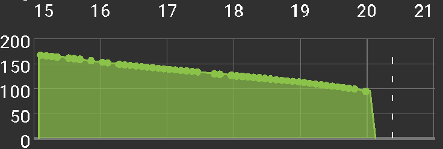

# Empfindlichkeitserkennung

## Sensitivitäts-Algorithmus

Aktuell gibt es drei Modelle zur Empfindlichkeitserkennung:

* Sensitivität Oref0
* Sensitivität AAPS
* Durchschnittliche Sensitivität
* Sensitivität Oref1

### Sensitivity Oref0

Grundsätzlich wird die Sensitivität auf Basis der Daten der vorangegangenen 24 Stunden berechnet. Kohlenhydrate (falls noch nicht absorbiert) werden nach einer bestimmten Zeit, die man einstellen kann, einfach abgeschnitten. Der Algorithmus ähnelt OpenAPS Oref0, beschrieben in der [OpenAPS Oref0 Dokumentation](https://openaps.readthedocs.io/en/2017-05-21/docs/walkthrough/phase-4/advanced-features.html).

### Sensitivity AAPS

Die Empfindlichkeit wird wie bei Oref0 berechnet, aber du kannst einstellen wie weit der Algorithmus in die Vergangenheit "schaut". Die minimale Kohlenhydrat-Absorption wird ausgehend von der maximalen Kohlenhydrat-Absorption berechnet, die in den Einstellungen festgelegt werden kann

### Durchschnittliche Sensitivität

Die Empfindlichkeit wird als gewichtetes Mittel der Schwankungen berechnet. Neuere Schwankungen haben ein größeres Gewicht. Die minimale Kohlenhydrat-Absorption wird ausgehend von der maximalen Kohlenhydrat-Absorption berechnet, die in den Einstellungen festgelegt werden kann. Dieser Algorithmus berücksichtigt Empfindlichkeitsveränderungen am schnellsten.

### Sensitivität Oref1

Die Sensitivität wird auf Basis der Daten der vergangenen 8 Stunden oder seit dem letzten Katheterwechsel berechnet, falls er weniger als 8 Stunden her ist Kohlenhydrate (falls noch nicht absorbiert) werden nach der in den Einstellungen festgelegten Zeit abgeschnitten. Nur der Oref1 Algorithmus unterstützt un-announced Meals (UAM). Das heißt, Zeiten mit erkannten UAM werden bei der Sensitivitätsberechnung nicht berücksichtigt. Wenn du also SMB mit UAM verwendest, dann musst du den Oref1 Algorithmus auswählen, damit es gut läuft. Für weitere Informationen lies die [OpenAPS Oref1 Dokumentation](https://openaps.readthedocs.io/en/latest/docs/Customize-Iterate/autosens.html).

## Simultaneous carbs

There is significant difference while using AAPS, WeightedAverage vs Oref0, Oref1. Oref plugins expects only one meal decaying at time. It means 2nd meal starts decaying after 1st meal is completely decayed. AAPS+Weighted average starts decaying immediately when you enter the carbs. If there is more than one meal on board, the minimum carb decay will adjust according to meal size and max absorption time. The minimum absorption accordingly will be higher in comparation to Oref plugins.

## COB Examples

Oref0 / Oref1 - unabsorbed carbs are cut off after specified time

AAPS, WeightedAverage - absorption is calculated to have `COB == 0` after specified time

If minimal carbs absorption is used instead of value calculated from deviations, a green dot appears on COB graph