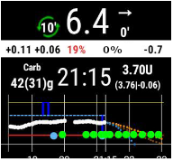

# Smartwatch-Integration

AndroidAPS kann mit einer Android Wear Smartwatch *gesteuert* werden. Wenn du Boli etc. von der Smartwatch aus abgeben willst, aktiviere "Steuerung durch die Uhr".

Die nachfolgenden Funktionen kannst Du von der Uhr aus starten:

* temporäres Ziel setzen
* Bolus abgeben
* eCarbs eintragen
* Bolusrechner verwenden (Welche Variablen bei der Berechnung berücksichtigt werden, lässt sich in den [Einstellungen](../Configuration/Config-Builder#wear) auf dem Smartphone festlegen.)
* Loop- und Pumpenstatus prüfen
* TDD (Total daily dose = Bolus + Basal pro Tag) anzeigen

Dafür musst du beim [Erstellen der APK](../Installing-AndroidAPS/Building-APK.md) die Build Variante "fullRelease" auswählen (alternativ erlaubt "pumpRelease" die Fernsteuerung der Pumpe ohne loopen). Im Konfigurations-Generator von AAPS musst du [Wear erlauben](../Configuration/Config-Builder#wear).

Es gibt mehrere Ziffernblätter zur Auswahl, die das durchschnittliche Delta, IOB, die derzeit aktive TBR und Basalraten sowie die Kurve der CGM-Werte anzeigen können.

Stelle sicher, dass AndroidAPS die Erlaubnis hat, Benachrichtigungen auf der Uhr anzuzeigen. Die Eingaben werden aktiviert, indem man die Benachrichtigung auf der Uhr öffnet, einmal wischt und bestätigt.

Um schneller zu AndroidAPS zu kommen, kannst du den angezeigten CGM-Wert auf der Uhr doppelt anklicken. Klicke doppelt auf die BZ-Kurve um den Zeitraum zu ändern.

## Watchfaces available

## Legend AAPSv2 watchface

A - time since last loop run

B - CGM reading

C - minutes since last CGM reading

D - change compared to last CGM reading (in mmol or mg/dl)

E - average change CGM reading last 15 minutes

F - phone battery

G - basal rate (shown in U/h during standard rate and in % during TBR)

H - BGI (blood glucose interaction) -> the degree to which BG “should” be rising or falling based on insulin activity alone.

I - carbs (carbs on board | e-carbs in the future)

J - insulin on board (from bolus | from basal)

## Settings (in wear watch)

To access to the watchface settings, double tap on your BG, slide up and select "Settings".

### AAPS companion parameters

Vibrate on Bolus (default On):

Units for Actions (default mg/dl): if "On" units for actions is mg/dl, if "Off" unit is mmol/l. Used when setting a TT from watch.

### Watchface settings

* Show Date (default Off): note, date is not available on all watchfaces
* Show IOB (default On): Display or not IOB value (setting for detailed value is in AAPS wear parameters)
* Show COB (default On): Display or not COB value
* Show Delta (default On): Display or not the BG variation of the last 5 minutes
* Show AvgDelta (default On): Display or not the average BG variation of the last 15 minutes
* Show Phone Battery (default On): Phone battery in %. Red if below 30% .
* Show Rig Battery (default Off): Rig battery is a synthesis of Phone battery, pump battery and sensor battery (generally the lowest of the 3 values)
* Show Basal Rate (default On): Display or not current basal rate (in U/h or in % if TBR)
* Show Loop Status (default On): show how many minutes since last loop run (arrows around value turn red if above 15').
* Show BG (default On): Display or not last BG value
* Show Direction Arrow (default On): 
* Show Ago (default On): show how many minutes since last reading.
* Dark (default On): You can switch from black background to white background (except for Cockpit and Steampunk watch face)
* Highlight Basals (default Off): Improve the visibility of basal rate and temp basals
* Chart Timeframe (default 3 hours): you can select in the sub menu the max time frame of your chart between 1 hour and 5 hours.

### User Interface setting

Input Design: with this parameter, you can select the position of "+" and "-" buttons when you enter commands for AAPS (TT, Insulin, Carbs...)

### Specific watchface parameters

#### Steampunk watchface

Delta Granularity (default Medium)

#### Circle WF

Big Numbers: Increase text size to improve visibility

Ring History: View graphically BG history with gray rings inside the hour's green ring

Light Ring History: Ring history more discreet with a darker gray

Animations:

### Commands settings

Wizard in Menu (default On): Allow wizard interface in main menu to input Carbs and set Bolus from watch

Prime in Menu (default Off): Allow Prime / Fill action from watch

Single Target (default On):

* On: you set a single value for TT
* Off: you set Low target and high target for TT

Wizard Percentage (default Off): Allow bolus correction from wizard (value entered in percentage before confirmation notification)

## Troubleshooting the wear app:

* On Android Wear 2.0 the watch screen does not install by itself anymore. You need to go into the playstore on the watch (not the same as the phone playstore) and find it in the category apps installed on your phone, from there you can activate it. Also enable auto update. 
* Sometimes it helps to re-sync the apps to the watch as it can be a bit slow to do so itself: Android Wear > Cog icon > Watch name > Resync apps.
* Enable ADB debugging in Developer Options (on watch), connect the watch via USB and start the Wear app once in Android Studio.

## View Nightscout data

If you are using another looping system and want to *view* your looping detail on an Android Wear watch, or want to watch your child's looping, then you can build/download just the NSClient APK. To do this follow the [build APK instructions](../Installing-AndroidAPS/Building-APK.md) selecting the build variant "NSClientRelease". Es gibt mehrere Ziffernblätter zur Auswahl, die das durchschnittliche Delta, IOB, die derzeit aktive TBR und Basalraten sowie die Kurve der CGM-Werte anzeigen können.

## Pebble

Pebble users can use the [Urchin watchface](https://github.com/mddub/urchin-cgm) to *view* looping data (if uploaded to nightscout), but you will not be able to interact with AndroidAPS through the watch. You can choose fields to display such as IOB and currently active temp basal rate and predictions. If open looping you can use [IFTTT](https://ifttt.com/) to create an applet that says if Notification received from AndroidAPS then send either SMS or pushover notification.