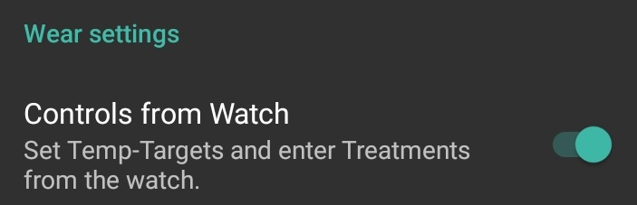

# AAPS auf einer Smartwatch mit Wear OS

Du kannst AndroidAPS auf Deiner Smartwatch mit **Wear OS** installieren. Mit der Watch-Version von AAPS kannst Du:

* **Werte auf Deiner Uhr anzeigen**: Mit individuellem Ziffernblatt (watchface), [Standardziffernblatt](Watchfaces-aaps-watchfaces) oder mit [Komplikationen](Watchfaces-complications) (complications) im Standardziffernblatt
* **AAPS steuern**: Bolus abgeben, temporäres Ziel setzen, etc.

### Bevor Du Dir eine Uhr kaufst...

* Manche Funktionen wie *Komplikationen* erfordern Wear OS Version 2.0 oder höher.
* Google hat *Android Wear 1.x* ab Version 2.0 in *Wear OS* umbenannt. Wenn die Uhr also mit *Android Wear* angepriesen wird, kann das auf eine ältere Version 1.x hinweisen.
* Wenn die Smartwatch nur als mit *Android* und *iOS* kompatibel beschrieben wird, **bedeutet dies nicht**, dass sie *Wear OS* nutzt. Es kann sich auch um ein herstellerspezifisches Betriebssystem handeln, das **nicht mit AAPS Wear kompatibel ist!**
* Ob Deine Uhr die Werte anzeigen kann, kannst Du in der [Liste der geprüften Telefone und Uhren](Phones-list-of-tested-phones) oder durch fragen in der [Community](../Where-To-Go-For-Help/Connect-with-other-users.md) herausfinden.

### Wear OS Version von AAPS erstellen

Die Wear OS App von AAPS wurde von der AAPS-Version für das Android Smartphone getrennt. Daher musst Du eine zweite signierte APK generieren. Wähle als Modul "AndroidAPS.wear" und als Build-Variante "fullRelease" und eine zweite apk Datei für die Wear OS Uhr wird generiert, wenn [die APK Build](../Installing-AndroidAPS/Building-APK.md) (oder "pumpcontrolRelease", die es dir erlaubt, einfach die Pumpe ohne Loop zu steuern).

Ab März 2021 musst Du AAPS mittels sogenanntem Sideload auf die Uhr übertragen. Dies kann nicht mehr über den Google Play Store der Uhr erfolgen. Verwende dazu am besten einen [Wear Installer](https://youtu.be/8HsfWPTFGQI). Diesen musst Du sowohl auf Deinem Smartphone als auch Deiner Uhr installieren. Die Wear Installer App kann aus dem Google Play Store heruntergeladen werden. Das verlinkte Video von Malcolm Bryant, dem Entwickler von Wear Installer gibt Dir detaillierte Anweisungen um a) die apk auf Dein Smartphone herunterzuladen b) den Android Debugger auf der Uhr einzurichten c) den Wear Installer auf dem Smartphonezu verwenden und die AAPS-Wear-App auf das Smartphone zu laden. Sobald Du AndroidAPS wear version auf der Uhr ausgewählt hast, kannst Du Watchfaces und Komplikationen nutzen und AAPS teilweise über die Uhr steuern.

### Einrichten auf dem Smartphone

In AndroidAPS auf Deinem Smartphone musst Du im Konfigurations-Generator das [Wear Plugin](Config-Builder-wear) aktivieren.

## AAPS von der Uhr aus steuern

AndroidAPS kann mit einer Android Wear Smartwatch *gesteuert* werden. Wenn Du Deinen Loop von der Uhr aus steuern willst (z.B. Bolus abgeben), aktiviere "Steuerung durch die Uhr".

Die nachfolgenden Funktionen kannst Du von der Uhr aus starten:

* temporäres Ziel setzen
* Bolusrechner verwenden (Welche Variablen bei der Berechnung berücksichtigt werden, lässt sich in den [Einstellungen](Config-Builder-wear) auf dem Smartphone festlegen.)
* eCarbs eintragen
* Bolus (Insulin + Kohlenhydrate) abgeben
* Uhreinstellungen
* status 
    * pumpenstatus überprüfen
    * Pumpenstatus überprüfen
    * Profil prüfen und ändern, CPP (Circadian Percentage Profile = Zeitverschiebung + Prozentsatz)
    * TDD (Total daily dose = Bolus + Basal pro Tag) anzeigen

(Watchfaces-aaps-watchfaces)=

## AAPS Watchfaces

Es gibt mehrere Ziffernblätter zur Auswahl, die das durchschnittliche Delta, IOB, die derzeit aktive TBR und Basalraten sowie die Kurve der CGM-Werte anzeigen können.

Stelle sicher, dass Benachrichtigungen von AAPS nicht auf der Uhr blockiert sind. Die Eingaben werden aktiviert, indem man die Benachrichtigung auf der Uhr öffnet, einmal wischt und bestätigt.

Um schneller zu AndroidAPS zu kommen, kannst du den angezeigten CGM-Wert auf der Uhr doppelt anklicken. Klicke doppelt auf die BZ-Kurve um den Zeitraum zu ändern.

## Verfügbare Watchfaces

(Watchfaces-new-watchface-as-of-AAPS-2-8)=

### Neue Watchface ab AAPS 2.8

* Farbe, Linien und der Kreis sind im Einstellungsmenü (Zahnradsymbol) des Watchface-Auswahl-Menüs konfigurierbar.

## AAPSv2 Watchface - Legende

A - Zeit seit der letzten Loop-Aktivität

B - CGM Wert

C - Minuten seit dem letzten CGM-Wert

D - Veränderung zwischen letztem und vorletztem CGM-Wert (in mmol oder mg/dl)

E - Durchschnittliche Änderung der CGM-Werte in den letzten 15 Minuten

F - Batteriestatus des Smartphones

G - Basalrate (Anzeige in IE/Std. bei Standard-BR und in % während einer TBR)

H - BGI (blood glucose interaction) -> erwartete BZ-Änderung allein auf Basis des aktiven Insulins.

I - Kohlenhydrate (carbs on board | e-carbs in der Zukunft)

J - Insulin on board (aus Boli | aus Basal)

## Zugriff auf das Hauptmenü von AAPS

Um auf das Hauptmenü von AAPS zuzugreifen, kannst Du eine der folgenden Möglichkeiten verwenden:

* Doppeltippen auf Deinen BZ-Wert
* AAPS Icon im App-Menü der Uhr auswählen
* Tipp auf die AAPS Komplikation (falls entsprechend konfiguriert)

## Einstellungen (in der Watch-App)

Um auf die Watchface-Einstellungen zuzugreifen, gehe ins AAPS-Hauptmenü, wische nach oben und wähle "Einstellungen" aus.

Ein gefüllter Stern (**Ein**) zeigt an, dass die Option ausgewählt wurde und ein leerer Stern (**Aus**), dass die Option deaktiviert ist:

### AAPS Companion Parameters

* **Vibrieren beim Bolus** (Standard: `Ein`):
* **Einheiten** (Standard: `mg/dl`): Falls auf **Ein** gestellt, werden `mg/dl` verwendet, bei **Aus** `mmol/l`. Wird beim Setzen eines temporären Ziels von der Uhr aus verwendet.

(Watchfaces-watchface-settings)=

### Watchface-Einstellungen

* **Show Date** (Standard: `Off`): Anzeige Datum, nicht auf allen Watchfaces verfügbar
* **Show IOB** (Standard: `On`): Anzeige aktives Insulin (Details werden in den Wear-Einstellungen in AAPS vorgenommen)
* **Show COB** (Standard: `On`): Anzeige aktive Kohlenhydrate
* **Show Delta** (Standard: `On`): Anzeige BZ-Änderung der letzten fünf Minuten
* **Show AvgDelta** (Standard: `On`): Anzeige der BZ-Änderung der letzten 15 Minuten
* **Show Phone Battery** (Standard: `On`): Anzeige Akkuladestand Smartphone in % Rot, wenn unter 30%.
* **Show Rig Battery** (Standard: `Off`): Anzeige niedrigster Wert der Ladestände von Smartphone, Pumpe und Transmitter
* **Show Basal Rate** (Standard: `On`): Anzeige der aktuellen Basalrate (in IE/Std. oder in % bei temporärer Basalrate)
* **Show Loop Status** (Standard: `On`): Anzeige der Minuten seit letzter Loop-Aktion (Pfeile um den Wert werden rot, wenn dieser über 15 Minuten liegt.)
* **Show BG** (Standard: `On`): Anzeige des letzten CGM-Werts
* **Show Direction Arrow** (Standard: `On`): Anzeige Trendpfeil
* **Show Ago** (Standard: `On`): Anzeige Minuten seit letztem CGM-Wert
* **Dark** (Standard: `On`): Wechsel zwischen schwarzem und weißem Hintergrund (außer Cockpit und Steampunk Watchface)
* **Highlight Basals** (Standard: `Off`): verbesserte Sichtbarkeit der Basalrate und von temporären Basalraten
* **Matching divider** (Standard: `Off`): nur für die AAPS, AAPSv2 und AAPS(Large) Watchfaces: kontrastreiche Anzeige des Querbalkens (**Off**) oder Anzeige in Hintergrundfarbe (**On**)
* **Chart Timeframe** (Standard: `3 Std.`): Anzeigezeitraum des Diagramms zwischen einer und fünf Stunden

### Einstellungen für die Benutzeroberfläche

* **Input Design**: Position der Schaltflächen "+" und "-" für Kommandos an AAPS (TT, Insulin, Kohlenhydrate ...)

### Watchface-spezifische Parameter

#### Steampunk Watchface

* **Delta Granularity** (Standard: `Medium`): Genauigkeit der Anzeige der CGM-Werte (siehe Screenshot)

#### Circle Watchface

* **Big Numbers** (Standard: `Off`): größere Schrift
* **Ring History** (Standard: `Off`): Graphische Darstellung der BZ-Historie mit grauen Ringen innerhalb des grünen "Stundenrings"
* **Light Ring History** (Standard: `On`): Ring history dezenter mit dunklerem Grau
* **Animations** (Standard: `On`): Animation des Kreises im Watchface - Voraussetzung: Funktion wird von der Uhr unterstützt und diese ist nicht im Energiesparmodus

### Kommando-Einstellungen

* **Wizard in Menu** (Standard: `On`): Bolus Assistent im Hauptmenü, um direkt an der Uhr Boli und Kohlenhydrate zu erfassen.
* **Prime in Menu** (Standard: `Off`): Katheter- und Kanülenbefüllung über die Uhr
* **Single Target** (Standard: `On`):
    
    * `On`: Zielwert für temporäre Ziele (TT)
    * `Off`: Zielbereich für temporäre Ziele (TT)

* **Wizard Percentage** (Standard: `Off`): Boluskorrektur über den Assistenten (Wert wird in Prozent eingegeben, bevor die Insulinabgabe bestätigt wird)

(Watchfaces-complications)=

## Komplikationen

*Komplikation* ist ein Begriff aus der traditionellen Uhrmacherei und beschreibt Zusätze zur eigentlichen Zeitanzeige - als ein weiteres kleines Fenster o.ä. um Datum, Wochentag, Mondphase, etc. anzuzeigen. Mit Wear OS 2.0 können solche Zusatzinformationen (Wetter, Benachrichtigungen, Fitness Tracker etc.) zu jedem Watchface hinzugefügt werden, das Komplikationen unterstützt.

Die AndroidAPS Wear OS App unterstützt Komplikationen ab Build `2.6` und erlaubt damit jedem beliebigen Watchface, das Komplikationen unterstützt, die Anzeige von AAPS Daten wie BZ mit Trendpfeil, IOB, COB etc.

Dabei können die Komplikationen auch als **Shortcut** zu AAPS Funktionen genutzt werden. Durch antippen der AAPS-Komplikation kannst Du - abhängig vom Komplikations-Typ und den Einstellungen - AAPS-spezifische Menüs und Dialoge aufrufen.

### Komplikationstypen

Die AAPS Wear OS App liefert nur Rohdaten in entsprechend vordefinierten Formaten. Die Drittanbietern der Watchfaces legen fest, wo und wie Komplikationen - einschließlich des Layouts, Rahmen, Farben und Schriftarten - wiedergegeben werden sollen. Von den vielen zur Verfügung stehenden Wear-OS-Komplikations-Typen verwendet AAPS:

* `SHORT TEXT` - Enthält zwei Textzeilen mit jeweils 7 Zeichen, die manchmal als Wert und Beschriftung bezeichnet werden. Diese werden in der Regel in einem Kreis oder einer "Pill" unter- oder nebeneinander angezeigt. Es handelt sich um eine Komplikation mit sehr begrenztem Platz. AAPS versucht, unnötige Zeichen zu entfernen und rundet Werte, entfernt führende oder abschließende Nullen etc.
* `LONG TEXT` - Enthält zwei Textzeilen, jeweils ca. 20 Zeichen. Normalerweise werden diese in einem Rechteck oder einer "long pill" untereinander dargestellt. Er wird für weitere Details und den Statusangaben in Textform verwendet.
* `RANGED VALUE` - für Werte aus einem vordefinierten Bereich, z.B. Prozentsätze. Beinhaltet ein Icon, eine Beschriftung und wird meist als Kreis-Fortschritts-Diagramm angezeigt.
* `LARGE IMAGE` - Benutzerdefiniertes Hintergrundbild, das verwendet werden kann, wenn es vom Watchface unterstützt wird.

### Konfiguration der Komplikation

Um eine Komplikation zu einem Watchface hinzuzufügen, konfiguriere es durch langes Drücken auf die Komplikation und anschließendem Klicken auf das Zahnrad-Symbol. Je nach dem wie das einzelne Watchface die Komplikationen behandelt musst Du entweder auf die Platzhalter klicken oder das Setup für Komplikationen des Watchfaces aufrufen. AAPS-Komplikationen werden unter dem AAPS-Menü-Eintrag gruppiert.

Bei der Konfiguration von Komplikationen passt Wear OS die Auswahl an und führt nur die Komplikationen auf, die an der gewünschten Stelle angezeigt werden können. Wenn Du also eine bestimmte Komplikation nicht in der Liste findest, passt sie wahrscheinlich nicht an den gewünschten Platz innerhalb des Watchfaces.

### AAPS-Komplikationen

AAPS stellt folgende Komplikationen zur Verfügung:

* **BR, CoB & IoB** (`SHORT TEXT`, öffnet das *Menü*): Zeigt die *Basalrate* in der ersten Zeile sowie *Carbs on Board* und *Insulin on Board* in der zweiten Zeile.
* **Blood Glucose** (`SHORT TEXT`, öffnet das *Menü*): Zeigt den *BZ-Wert* und *Trendpfeil * in der ersten Zeile und *das Alter des Werts* sowie das *BZ Delta* in der zweiten Zeile.
* **CoB & IoB** (`SHORT TEXT`, öffnet das *Menü*): Zeigt *Carbs on Board* in der ersten Zeile und *Insulin on Board* in der zweiten Zeile an.
* **COB Detailed** (`SHORT TEXT`, öffnet den *Bolusassistenten*): Zeigt die aktuell aktiven *Carbs on Board* in der ersten und geplante eCarbs in der zweiten Zeile an.
* **CoB Icon** (`SHORT TEXT`, öffnet den *Bolus-Assistenten*): Zeigt *Carbs on Board* mit einem statischen Icon an.
* **Full Status** (`LONG TEXT`, öffnet das *Menü*): Zeigt den Großteil der Daten auf einmal an: *BZ-Wert* und *Trendpfeil*, *BZ Delta* und *Alter des Werts* in der ersten Zeile. In der zweiten Zeile: *Carbs on Board*, *Insulin on Board* und die *Basalrate*.
* **Full Status (flipped)** (`LONG TEXT`, öffnet das *Menü*): Die gleichen Daten wie beim Standard *Full Status*, aber die Zeilen sind vertauscht. Kann z.B. in Watchfaces verwendet werden, die eine der beiden Zeilen in `LONG TEXT` ignorieren.
* **IoB Detailed** (`SHORT TEXT`, öffnet *Bolus*): Zeigt das gesamte *Insulin on Board* in der ersten Zeile und in der zweiten Zeile aufgeteilt nach *Bolus* und *Basal*.
* **IoB Icon** (`SHORT TEXT`, öffnet *Bolus*): Zeigt *Insulin on Board* mit einem statischen Icon.
* **Uploader/Phone Battery** (`RANGED VALUE`, öffnet den *Status*): Zeigt den Akkuladestand des AAPS Smartphones (uploader). Wird als prozentualer Wert mit einem Akkusymbol angezeigt, das den gemeldeten Wert widerspiegelt. Wird ggf. nicht sofort aktualisiert, aber spätestens wenn sich andere wichtige AAPS-Daten ändern (normalerweise alle ~5 Minuten mit neuen *CGM-Daten*).

Darüber hinaus gibt es drei Komplikationen vom Typ `LARGE IMAGE` Art: **Dark Wallpaper**, **Gray Wallpaper** und **Light Wallpaper**, mit statischem AAPS Hintergrundbild.

### Einstellungen zu den Komplikationen

* **Complication Tap Action** (Standard-Einstellung: `Default`): Legt fest, welcher Dialog nach Tippen der Komplikation geöffnet wird: 
    * *Default*: Abhängig vom Komplikations-Typ *(siehe Liste oben)*
    * *Menu*: AAPS Hauptmenü
    * *Wizard*: Bolus Assistent
    * *Bolus*: direkte Boluseingabe
    * *eCarb*: eCarb Dialog
    * *Status*: Status-Menü
    * *None*: Deaktiviert den Menüaufruf bei Tippen der Komplikation
* **Unicode in Complications** (Standard: `On`): Wenn `On` gewählt ist, nutzt die Komplikation Unicode Zeichen für Symbole wie `Δ` Delta, `⁞` vertikaler Punkttrenner oder `⎍` Basalraten-Symbol. Die Anzeige hängt von der Schriftart ab und kann sich je nach Watchface unterscheiden. Mit dieser Option können die Unicode-Zeichen bei Bedarf ausgeschaltet werden (`Off`), wenn der Font des Watchfaces diese Zeichen nicht unterstützt. Anzeigefehler können so vermieden werden.

## Wear OS Kacheln

Wear OS Kacheln bieten einfachen Zugriff auf die Informationen der Benutzer und Aktionen zum Ausführen. Die Kacheln sind nur auf Android Smartwatches mit Wear Os Version 2.0 und höher verfügbar.

Kacheln ermöglichen den schnellen Zugriff auf Aktionen der AAPS-Anwendung, ohne über das Menü im Watchface gehen zu müssen. Die Kacheln sind optional und können vom Benutzer hinzugefügt und konfiguriert werden.

Die Kacheln werden auf jeglichen Watchfaces zusätzlich funktionieren. Um auf eine Kachel zuzugreifen, wische von rechts nach links auf dem Watchface, um sie anzuzeigen.

Bite beachte, dass die Kacheln nicht den aktuellen Status aus der AAPS App auf dem Smartphone halten. Sie stellen jediglich eine Anfrage an die Smartphone App und diese muss auf der Watch bestätigt werden, bevor sie ausgeführt wird.

## Wie man Kacheln hinzufügt

Bevor die Kacheln verwendet werden können, musst du "Control from Watch" in den "Wear Einstellungen" einschalten.

Abhängig von Deiner Wear-OS-Version, Marke und Smartphone gibt es zwei Möglichkeiten die Kacheln zu aktivieren:

1. Auf Deiner Uhr von Deinem Watchface; 
    * Wische so oft von rechts nach links, bis du "+ Kacheln hinzufügen" erreichst 
    * Wähle eine der Kacheln aus.
2. Öffne auf deinem Smartphone die Begleit-App für Ihre Uhr. 
    * Für Samsung öffne "Galaxy Wearable" oder für andere Marken "Wear OS"
    * Mit dem Klick auf den Abschnitt "Kacheln", gefolgt von "+ Hinzufügen" Button
    * Entscheide Dich für die Kachel, die Du hinzufügen möchtest, indem Du sie auswählst.  Die Reihenfolge der Kacheln kann durch Ziehen und Ablegen geändert werden

Der Inhalt der Kacheln kann angepasst werden, indem Du lange auf eine Kachel drückst und auf den Button "Bearbeiten" oder "gear icon" tippst.

### APS(Aktionen) Kachel

Die Aktions-Kachel kann mit 1 bis 4 benutzerdefinierte Buttons für Aktionen bestückt werden. Zum konfigurieren, lange auf die Kachel drücken, um die Konfigurationsoptionen anzuzeigen. Ähnliche Aktionen sind auch über das Standardmenü der Uhr verfügbar.

Aktionen aus der Aktions-Kachel können folgendes aus der AAPS-Telefon-App anfordern:

* **Calc**; Führe eine Bolusberechnung durch, basierend auf Kohlenhydrateingabe und (optional) einem Prozentsatz [1]
* **Insulin**; fragt Insulinabgabe an indem man die Einheiten eingibt
* **Behandlung**; Fragt Insulinabgabe als auch hinzufügen von Kohlenhydrate an
* **Carbs**; füge (erweiterte) Kohlenhydrate hinzu
* **TempT**; Setze ein benutzerdefiniertes temporäres Ziel und Dauer

[1] Über das Wear-OS-Menü, setze die Option "Rechner Prozentsatz" auf "AN", um die prozentuale Eingabe im Bolus-Rechner anzuzeigen. Der voreingestellte Prozentsatz basiert auf den Einstellungen in der Aaps-Smartphone-App im Abschnitt "Übersicht" ["Diesen Teil des bolus Wizard-Ergebnisses liefern"](Config-Builder.html#advanced-settings) Wenn keinen Prozentsatz angegeben wird, wird der Standardwert vom Telefon verwendet. Konfiguriere die anderen Parameter für den Bolus-Rechner in der Smartphone-App über "Einstellungen" "Assistenteneinstellungen".

### AAPS (Temp Target) Kachel

Die Temp Target Kachel kann ein temporäres Ziel basierend auf AAPS-Smartphone-Voreinstellungen anfordern. Konfiguriere die voreingestellte Zeit und Ziele über die Telefon-App-Einstellungen, indem Du zu "Einstellungen", "Überblick" gehen ["Standard Temp-Targets"](Config-Builder.html#default-temp-targets) und die Dauer und Ziele für jede Voreinstellung festlegst. Konfiguriere die sichtbaren Aktionen auf der Kachel durch die Kachel-Einstellungen. Um die Konfigurationsoptionen anzuzeigen, halte die Kachel lange gedrückt und wähle dann 1 bis 4 Optionen:

* **Aktivität**; für Sport
* **Hypo**; um das Ziel während der Hypo Behandlung zu erhöhen
* **bald Essen**; um das Ziel zu senken und das Insulin an Bord zu erhöhen
* **Manuell**; benutzerdefiniertes temporäres Ziel und Dauer festlegen
* **Abbrechen**; um das aktuelle temporäre Ziel zu stoppen

### AAPS (QuickWizard) Kachel

Die QuickWizard-Kachel kann 1 bis 4 Schnellassistenten-Aktionstasten halten, die in der Smartphone-App[2] definiert sind. Siehe [QuickWizard](Config-Builder.html#quickwizard-settings). Du kannst Standard-Mahlzeiten (Kohlenhydrate und Berechnung für den Bolus) setzen, die Du abhängig von der Tageszeit auf der Uhr anzeigen lassen kannst. Ideal für die gängigsten Mahlzeiten/Snacks, die Du tagsüber isst. Du kannst angeben, ob die Schnell-Assistenten-Tasten auf dem Smartphone, Uhr oder auf beiden angezeigt werden sollen. Hinweis: Das Smartphone kann immer nur eine Schnellassistenten-Aktionstaste gleichzeitig anzeigen. In den Einstellungen des Schnellassistenten kannst Du auch festlegen, wie viel Prozent des berechneten Bolus abgegeben werden soll. Mit der Einstellung kannst Du bestimmen, dass z.B. für einen Snack 120%, für langsame aufgenommenes Frühstück 80% und für Hypo-Behandlungen mit schnellen Kohlenhydraten 0% des Insulins abgegeben werden soll.

[2] Die Kacheln können durch WearOS Beschränkungen nur alle 30 Sekunden aktualisiert werden. Wenn Änderungen auf Deinem Smartphone sich nicht auf in den Kacheln zeigen, warte 30 Sekunden ab, klicke auf "Alle Daten erneut senden" im Reiter "Uhr" von AAPS oder lösche die Kachel, um sie direkt danach wieder hinzuzufügen. Um die Reihenfolge der Schaltflächen zu ändern, "ziehe" sie in der Ansicht rauf oder runter.

## Always-on

Lange Akkulaufzeit für Android Wear OS Smartwatches ist eine Herausforderung. Einige Smartwatches halten bis zu 30 Stunden vor dem erneuten Aufladen. Das Display sollte ausgeschaltet werden, um bei Nichtverwendung optimal Energie zu sparen. Die meisten Uhren unterstützen das „Always On“-Display.

Seit AAPS Version 3 können wir „Simplify UI“ während des "Always-On-Modus" verwenden. Dieses UI enthält nur den Blutzucker, den Trend und die Zeit. Dieses UI ist leistungsoptimiert mit weniger häufigen Updates, die weniger Informationen zeigen und weniger Pixel nutzen, um Strom auf OLED-Bildschirmen zu sparen.

Der vereinfachte UI-Modus ist für diese Zifferblätter verfügbar: AAPS, AAPS V2, Home Big, Digital Style, Steampunk, Cockpit. Das vereinfachte UI ist optional und wird über die Einstellungen der Ziffernblätter konfiguriert. (Halte das Ziffernblatt lange gedrückt und klicke auf "Bearbeiten" oder auf das Zahnrad-Symbol) Wähle die Konfiguration "Einfache UI" und setze sie auf "Immer an" oder "Immer ein- und aufladen".

### Nachtmodus

Während des Ladens wäre es hilfreich, wenn das Display auf "always-on" bleibt und während der Nacht deinen Blutzuckerspiegel zeigen kann. Die Standard-Ziffernblätter sind jedoch zu hell und haben zu viele Informationen, und die Details sind mit verschlafenen Augen schwer zu lesen. Daher haben wir eine Option für das Ziffernblatt hinzugefügt, um das Interface nur während des Ladevorgangs zu vereinfachen, wenn es in der Konfiguration eingestellt ist.

Der vereinfachte UI-Modus ist für diese Zifferblätter verfügbar: AAPS, AAPS V2, Home Big, Digital Style, Steampunk, Cockpit. Das vereinfachte UI ist optional und wird über die Einstellungen der Ziffernblätter konfiguriert. (Halte das Ziffernblatt lange gedrückt und klicke auf "Bearbeiten" oder auf das Zahnrad-Symbol) Wähle die Konfiguration "Einfache UI" und setze sie auf "always-on" oder "always-on und aufladen"

Die Android-Entwickleroptionen ermöglichen es Deiner Uhr wach zu bleiben, während sie aufgeladen wird. Um die Entwickleroptionen zur Verfügung zu stellen, lesen Sie die [offizielle Dokumentation](https://developer.android.com/training/wearables/get-started/debugging). Setze in den Entwickleroptionen das "Bleib beim Aufladen" auf "an".

Hinweis: Nicht alle Displays können always-on gut handhaben. Es kann dazu führen, dass sich der Bildschirm einbrennt, insbesondere auf den älteren OLED-Displays. Die Uhren verdunkeln das Display im Allgemeinen, um das Einbrennen zu verhindern; bitte informiere Dich über das Handbuch , Angaben des Herstellers oder das Internet für Ratschläge.

### Tipps zur Performance und zur Akku-Laufzeit

Wear OS Uhren sind in der Leistung deutlich eingeschränkt. Durch die Größe des Uhrengehäuses wird die Kapazität des enthaltenen Akkus begrenzt. Trotz der neuesten Entwicklungen sowohl auf der Hardware- als auch auf der Software-Seite, müssen Wear OS Uhren immer noch tägliche geladen werden.

Falls die Akkulaufzeit unter einen Tag (vom Aufstehen bis zur Nachtruhe) sinkt, kannst Du folgende Tipps ausprobieren, um das Problem zu beseitigen.

Der Akku wird vor allem durch diese Komponenten belastet:

* Aktives Display mit aktivierter Hintergrundbeleuchtung (für LED) oder im Vollintensitätsmodus (für OLED)
* Wiedergabe / Darstellung auf dem Display der Uhr
* Bluetooth-Kommunikation

Da wir bei der Kommunikation keine Kompromisse eingehen können (wir brauchen aktuelle Daten) und die aktuellsten Daten dargestellt werden sollen, bietet die *Anzeigedauer* die meisten Optimierungspotentiale:

* Watchfaces des Herstellers sind meist deutlich besser optimiert als custom watchfaces.
* Es ist besser, Watchfaces zu nutzen, die die Menge der angezeigten Daten im gedimmten / inaktiven Modus reduzieren.
* Sei vorsichtig, wenn Du zusätzlich weitere Komplikationen, die externe Daten nutzen (z.B. Wetterdaten), verwendest.
* Beginne mit einem einfachen Watchface. Füge immer nur eine Erweiterung hinzu und beobachte, wie sich diese auf die Akku-Laufzeit auswirkt.
* Nutze **Dunkel** für AAPS Ziffernblätter und [**Querbalken farbgleich**](Watchfaces-watchface-settings). Auf OLED-Geräten wird die Anzahl der Pixel, die beleuchtet werden, begrenzt und der Burnout begrenzt.
* Prüfe, was auf Deiner Uhr besser funktioniert: Das Standard AAPS Watchface oder ein anderes Watchface mit Erweiterungen.
* Beobachte über mehrere Tage mit verschiedenen Aktivitätsprofilen. Die meisten Uhren aktivieren die Anzeige beim Draufschauen, bei Bewegung und anderen nutzungsbezogenen Auslösern.
* Überprüfe die globalen Systemeinstellungen, die sich auf die Leistung auswirken: Benachrichtigungen, das Zeitlimit für eine Hintergrundanzeige oder das aktive Anzeigezeitlimit, wenn Ortungsdienste aktiviert sind.
* Um von den Erfahrungen anderer Anwender (auch zur Batterlielaufzeit) zu lernen, schau' Dir die [Liste der geprüften Telefone und Uhren](Phones-list-of-tested-phones) an oder [ frage die Community](../Where-To-Go-For-Help/Connect-with-other-users.md).
* **Es kann nicht garantiert werden, dass die auf dem Watchface angezeigten Daten aktuell sind!** Am Ende entscheidet Wear OS, wann ein Watchface oder eine Erweiterung neue Daten erhält. Selbst wenn die AAPS-App die Aktualisierung anstößt, kann das System die Aktualisierung verschieben oder ignorieren, um die Akku-Laufzeit zu erhöhen. Im Zweifel und vor allem bei niedrigem Akku-Ladestand der Uhr solltest Du die Werte immer mit einem Blick auf AAPS auf Deinem Smartphone gegenprüfen.

(Watchfaces-troubleshooting-the-wear-app)=

## Fehlerbehebung der Smartwatch App:

* Manchmal hilft es, Apps erneut mit der Uhr zu synchronisieren, da es manchmal ein bisschen langsam sein kann, bis der Sync automatisch erfolgt: Wear Os > Zahnrad-Symbol (ganz unten) > Name deiner Uhr > Apps erneut synchronisieren.
* Schalte ADB Debuggen in den Entwickleroptionen der Uhr ein, verbinde die Uhr via USB mit dem PC und starte die Wear App einmal in Android Studio.
* Wenn die Daten in Komplikationen nicht aktualisiert werden, prüfe zuerst, ob AAPS-Watchfaces überhaupt funktionieren.

### Sony Smartwatch 3

* Die Sony Smartwach 3 ist eine der beliebtesten Uhren zu Verwendung mit AAPS.
* Leider hat Google die Unterstützung für Wear OS 1.5 Geräte im Herbst 2020 eingestellt. Dies führt zu Problemen bei der Verwendung von Sony SW3 mit AndroidAPS 2.7 und höher.
* Einen Workaround findest Du auf der Seite zur [Problembehandlung](../Usage/SonySW3.md).

## Nightscout Daten anzeigen

Falls Du ein anderes System zum Loopen verwendest und Deine Daten oder die Deines Kindes/Verwandten auf der Uhr *sehen* möchtest, kannst Du auch einfach nur die Watch APK kompilieren. Wähle dazu in Android Studio die Build Variante “nsclient”. Gehe wie unter [AndroidAPS installieren - App erstellen](../Installing-AndroidAPS/Building-APK.md) beschrieben vor und wähle die Build Variante "NSClientRelease". Es gibt mehrere Ziffernblätter zur Auswahl, die das durchschnittliche Delta, IOB, die derzeit aktive TBR und Basalraten sowie die Kurve der CGM-Werte anzeigen können.

# Pebble

Pebble Nutzer können das [Urchin watchface](https://github.com/mddub/urchin-cgm) nutzen um ihre Loop-Daten zu *sehen*. Mit dieser Methode ist es aber nicht möglich, die Pumpe und AndroidAPS zu steuern. Du kannst Felder wählen, um z. B. IOB, aktiver temp. Basalrate und Vorhersage anzeigen zu lassen. Falls Du open loopst, kannst du [IFTTT](https://ifttt.com/) benutzen, um ein kleines Programm zu erstellen, welches auftretende Benachrichtigungen von AndroidAPS per SMS versendet oder als Benachrichtigung anzeigt.