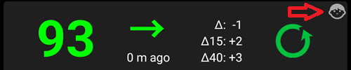
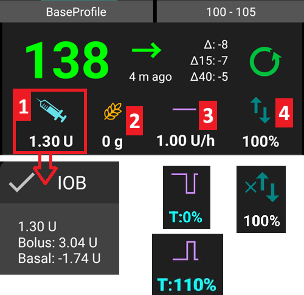
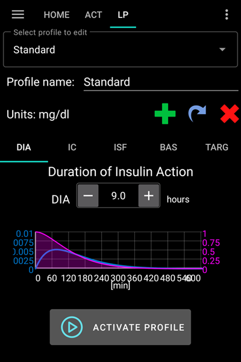
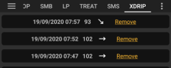

# AAPS-Bildschirme

```{contents}
:backlinks: entry
:depth: 2
```

(AapsScreens-the-homescreen)=

## Die Startseite


Wenn Du **AAPS** öffnest, ist dies die erste Ansicht. Sie enthält die meisten der täglich benötigten Informationen.

### Abschnitt A - Register

* Wechsele zwischen den verschiedenen **AAPS**-Modulen.
* Alternativ kannst Du die Bildschirme wechseln, indem Du nach links oder rechts wischst.
* Die anzuzeigenden Reiter können in der [Konfiguration](#Config-Builder-tab-or-hamburger-menu) ausgewählt werden.

(aaps-screens-profile--target)=

### Abschnitt B - Profil & Ziel

#### Aktuelles Profil

Das aktuelle Profil wird in der linken Schaltfläche angezeigt.

Tippe kurz auf die Profil-Schaltfläche, um die Profildetails anzuzeigen. Drücke lange auf die Profilschaltfläche, um [zwischen verschiedenen Profilen zu wechseln](../DailyLifeWithAaps/ProfileSwitch-ProfilePercentage.md).


1. Normale Anzeige mit einer Standardprofil-Aktivierung.
2. Profilwechsel mit einer Restdauer von 59 Minuten.
3. Profilwechsel mit einem Prozentsatz von 120 %.
4. Profilwechsel mit einem Prozentsatz von 80 % und einer Restdauer von 59 Minuten.
5. Profilwechsel mit einer Zeitverschiebung von -1 Stunde.
6. Profilwechsel mit einem Prozentsatz von 120 %, einer Zeitverschiebung von 1 Stunde und einer Restdauer von 59 Minuten.

#### Ziel


Das aktuelle BZ-Ziel wird in der rechten Schaltfläche angezeigt.

Drücke kurz auf die Zielwert-Schaltfläche, um ein **[temporäres Ziel](../DailyLifeWithAaps/TempTargets.md)** zu setzen.

Falls ein temporäres Ziel gesetzt ist, wird die Leiste gelb und die verbleibende Zeit in Minuten in Klammern angezeigt.

(AapsScreens-visualization-of-dynamic-target-adjustment)=

#### Anzeige der dynamischen Ziel-Anpassung


Wenn Du den [SMB-Algorithmus](#Config-Builder-aps) und [Autosens](#Open-APS-features-autosens) nutzt, kann **AAPS** Dein Ziel dynamisch auf Basis Deiner Insulin-Empfindlichkeit anpassen.

Aktiviere eine oder beide der folgenden Optionen in [Einstellungen > OpenAPS SMB Einstellungen](#Preferences-openaps-smb-settings):

* "Sensibilität erhöht den Zielwert" und/oder 
* "Resistenz senkt Zielwert" 

Falls **AAPS** Resistenz oder Sensibilität erkennt, wird das aus dem Profil vorgegebene Ziel angepasst. Falls das Ziel geändert wird, wechselt der Hintergrund der Zielschaltfläche auf grün.

(AapsScreens-section-c-bg-loop-status)=

### Abschnitt C - BZ & Loop-Status

#### Aktueller Blutzucker

Der neueste Glukosewert Deines CGM wird auf der linken Seite angezeigt.

Die Farbe des Glukosewertes zeigt wie sich der Wert zum definierten [Zielbereich](#Preferences-range-for-visualization) verhält.

* grün = innerhalb des Bereichs
* rot = unterhalb des Zielbereichs
* gelb = oberhalb des Zielbereichs 


Der Abschnitt in der Mitte zeigt:

1. wie alt der letzte Sensorwert (**CGM**-Wert) in Minuten ist
2. Änderungen zum letzten Sensorwert: Δ, und dem Durchschnitt der letzten 15 und 40 Minuten (Δ15 und Δ40).  
    "Lange Deltas" sind der Durchschnitt der vergangenen Deltas und zeigen wie die durchschnittliche Änderung war.

(AapsScreens-loop-status)=

#### Loop Status


Auf der rechten Seite zeigt ein Symbol den Loop-Status an:

1. Grüner Kreis = Loop läuft
2. Grüner Kreis mit gepunkteter Linie = [Low Glucose Suspend (LGS)](#objectives-objective6) (dt. Abschalten vor Niedrig)
3. Roter Kreis = Loop deaktiviert (dauerhaft)
4. Roter Kreis = Loop ausgesetzt (vorübergehend pausiert, aber Basalinsulin wird weiter abgegeben) - verbleibende Zeit wird unter dem Symbol angezeigt
5. Grauer Kreis = Pumpe getrennt (vorübergehend gar keine Insulinabgabe) - verbleibende Zeit wird unter dem Symbol angezeigt
6. orangener Kreis = Superbolus läuft - verbleibende Zeit wird unterhalb des Symbols angezeigt
7. Blauer Kreis mit gepunkteten Linien = Open Loop

Drücke kurz oder lang auf das Icon um den Dialog zum Wechsel des Loop-Modus (Close loop, Low Glucose Suspend [Reduzierung der Basalrate bei niedrigen Glukosewerten], Open Loop, Abschalten), zum Pausieren / wieder Einschalten des Loop oder zum Trennen / erneuten Verbinden der Pumpe.

* Wenn Du kurz drückst, muss die Auswahl im Loop-Dialog zusätzlich bestätigt werden.
    
    

(aaps-screens-bg-warning-sign)=

#### BG Warnzeichen

Falls aus irgendeinem Grund Probleme bei der Glukosewert-Messung, die **AAPS** erhält, auftreten, wird ein Warnsignal neben Deinem Glukosewert auf dem Hauptbildschirm angezeigt.

##### Rotes Warndreieck: Doppelte Glukosewert-Daten

Das rote Warndreieck signalisiert, dass Du sofort aktiv werden solltest: Du erhältst **doppelte Glukosewert-Daten**, die den Loop daran hindern seine Arbeit richtig zu machen. Daher wird der Loop so lange deaktiviert, bis das Problem gelöst ist.

    {admonition} Dein Loop ist gestoppt
    :class: note
    Dein Loop ist so lange gestoppt, bis Du das Problem behebst!


Du musst herausfinden, warum Du doppelte Glukosewert-Daten erhältst:

* Ist die Dexcom-Bridge auf Deiner Nightscout-Seite aktiviert? Deaktiviere die Bridge, indem Du in das Administrations-Menü Deiner Nightscout-Instanz gehst, bearbeite die „enable“-Variable und entferne dort den „bridge“-Teil. (Details zu heroku [findest Du hier](https://nightscout.github.io/troubleshoot/troublehoot/#heroku-settings).)
* Laden mehrere Quellen Deine Glukosewerte zu Nightscout hoch? Wenn Du die BYODA-App verwendest, aktiviere den Upload in **AAPS**, aber aktiviere ihn nicht in xDrip+, falls Du xDrip+ nutzt.
* Hast du Follower, die Deine Glukosewerte erhalten und die diese auch wieder auf deine NS-Seite hochladen?
* Letzte Möglichkeit: Gehe in **AAPS** zu [Einstellungen > Nightscout Client](#Preferences-nsclient), Wähle die Synchronisierungs-Einstellungen aus und deaktiviere die Option „Historische CGM Daten ergänzen".

Um die Warnung sofort zu löschen und den Loop wieder laufen zu lassen, musst Du ein paar Einträge aus dem Reiter Dexcom/xDrip+ manuell löschen.

Wenn es jedoch viele Duplikate gibt, könnte es einfacher sein,

* [Sichere Deine Einstellungen](../Maintenance/ExportImportSettings.md),
* setze deine Datenbank im Wartungsmenü zurück und
* [importiere Deine Einstellungen](../Maintenance/ExportImportSettings.md) erneut

##### Gelbes Warndreieck

Das gelbe Warnsignal weist darauf hin, dass Glukosewert-Daten in unregelmäßigen Zeitintervallen angekommen sind oder einige Glukosewerte fehlen. Beim Tippen auf das Warndreieck wird die Nachricht „Verwendete Daten neu berechnet“ angezeigt.


Normalerweise musst Du in diesem Falle nichts tun. Der closed loop funktioniert weiter!

Da ein Sensorwechsel den konstanten Fluss der Glukosewert-Daten unterbricht, ist ein gelbes Warndreieck nach dem Wechsel des Sensors normal und es gibt nichts zu befürchten.

Spezieller Hinweis für Libre-Nutzende:

* Alle Libre-Sensoren springen alle paar Stunden um ein oder zwei Minuten, was dazu führt, dass es nie zu einen perfekten Strom von regulären BG-Intervallen kommt.
* Auch sprunghafte Änderungen der Messwerte unterbrechen den kontinuierlichen Datenstrom.
* Daher bleibt das gelbe Warndreieck für Libre-Nutzende immer sichtbar.

*Hinweis*: Für die **AAPS-Berechnungen** werden bis zu 30 Stunden berücksichtigt. Daher kann es auch nach der Lösung des zugrunde liegenden Problems bis zu 30 Stunden dauern, bis das gelbe Dreieck nach dem letzten unregelmäßigen Intervall verschwunden ist.

#### Einfacher Modus

Ein Symbol mit einem Kindergesicht oben rechts in diesem Abschnitt zeigt, dass Du im [Einfachen Modus](#preferences-simple-mode) bist.



### Abschnitt D - IOB, COB, BR und AS



1. **Spritze**: Insulin an Bord (IOB) - Menge an aktivem Insulin im Körper  
    Das Insulin on Board wäre Null, wenn nur Deine Standardbasalrate liefe und kein Insulin mehr aus einem früheren Bolus wirken würde.
    
    * IOB kann negativ sein, wenn zuvor die Basalrate reduziert worden ist.
    * Ein Klick auf das Symbol zeigt die Aufteilung von Bolus und Basal-Insulin.

2. **Getreideähre**: [Kohlenhydrate an Bord (COB)](../DailyLifeWithAaps/CobCalculation.md) - bisher noch nicht verstoffwechselte Kohlenhydrate. Das Symbol pulsiert Rot, wenn Kohlenhydrate genommen werden müssen(siehe [unten](#aaps-screens-carbs-required))

3. **Lila Linie**: current basal rate. Das Symbol verändert sich, um eine temporäre Basalrate zu zeigen (Standard ist 100%) 
    * Klicke auf das Icon um Details zur Basalrate und einer eventuellen temporären Basalrate (inkl. verbleibende Dauer) angezeigt zu bekommen.
4. **Pfeile nach oben & unten**: zeigen den aktuellen [Autosens](#Open-APS-features-autosens)-Status bzw. den Status des [dynamischen ISF](#Open-APS-features-DynamicISF) (aktiviert oder deaktiviert) an. In diesem Abschnitt können mehrere Werte angezeigt werden: 
    * AS: Autosens-Wert. Wird auch dann angezeigt, wenn Autosens deaktiviert ist (rein informatorisch). Wird auch angezeigt, wenn DynISF aktiviert ist und ohne Wirkung ist.
    * Alg: Wert des dynamischen ISF (basierend auf TDD). Mehr Informationen dazu gibt es in den letzten Zeilen der [Dynamischer ISF (DynISF)](#Open-APS-features-DynamicISF)-Seite.

(aaps-screens-carbs-required)=

#### Kohlenhydrat-Vorschlag


Wenn der Algorithmus erkennt, dass Du etwas essen solltest, damit Dein BZ nicht zu tief fällt, wird die Menge der empfohlenen Kohlenhydrate angezeigt.

Dies ist der Fall, wenn der Algorithmus davon ausgeht, dass ein Absenken der Basalrate auf Null nicht ausreicht und Du daher Kohlenhydrate zu Dir nehmen solltest.

Diese Benachrichtigungen des Kohlenhydrat-Vorschlags sind deutlich ausgeklügelter als die Berechnungen des Bolusrechners. So kann es sein, dass Dir hier vorgeschlagen wird, etwas zu essen, obwohl der Bolus-Rechner keine fehlenden Kohlenhydrate anzeigt.

Auf Wunsch können die Kohlenhydrat-Vorschläge an Nightscout gesandt werden. In diesem Fall wird eine Ankündigung angezeigt und verteilt.

### Abschnitt E - Status Lights


Status Lights geben eine optische Warnung für

* Kanülenalter
* Insulinalter (Tage Reservoirverwendung)
* Reservoirstand (Einheiten)
* Sensoralter
* Batteriealter und Ladezustand (%)

Bei Überschreitung der Warnschwelle werden die Werte gelb angezeigt.

Wenn die kritische Schwelle überschritten wird, werden die Werte rot angezeigt.

Die Einstellungen können unter [Einstellungen > Übersicht > Statusanzeige](#Preferences-status-lights) geändert werden.

Abhängig von der verwendeten Pumpe, kann es sein, dass Du nicht alle diese Symbole angezeigt bekommst.

(aaps-screens-main-graph)=

### Abschnitt F - Hauptdiagramm


Die Grafik zeigt Deinen Blutzucker (BZ), so wie er von Deinem Sensor (CGM) gemessen wurde.

Notizen, die auf der Registerkarte "Aktion" eingegeben werden, wie z. B. die Kalibrierungen nach Messung am Finger, die Kohlenhydrat Einträge sowie die Profilwechsel werden hier angezeigt.

Nutze das Menü oben links im Diagramm oder drücke lange irgendwo im Diagramm, um den dargestellten Zeitraum zu ändern. Du kannst zwischen 6, 12, 18 oder 24 Stunden auswählen.

Der grüne Bereich spiegelt den Zielbereich wider.

Blaue Dreiecke zeigen [SMB](#Open-APS-features-super-micro-bolus-smb) - wenn sie unter [Einstellungen > OpenAPS SMB](#Preferences-openaps-smb-settings) aktiviert sind.

(AapsScreens-activate-optional-information)=

#### Aktiviere optionale Informationen

Im Hauptdiagramm kannst Du einige optionale Informationen anschalten:

* Predictions (Vorhersagen)
* Behandlungen
* Basal
* Aktivität - Insulin Aktivitätskurve

Um diese Informationen anzuzeigen, klicke auf der rechten Seite des Hauptdiagramms auf das Dreieck. Für das Haupt-Diagramm gibt es nur die vier Optionen oberhalb der Zeile "Diagramm 1 2 3 4".


(aaps-screens-prediction-lines)=

#### Vorhersage Kurven

* **Orangene** Linie: [COB](CobCalculation) (carbs on board - aktive Kohlenhydrate) (Die Farbe Orange wird generell genutzt, um COB und Kohlenhydrate darzustellen.)
    
    Die Prognosekurve zeigt, wohin sich der Glukosewert (nicht die COB selbst!) auf der Grundlage der aktuellen **Profil**-Einstellungen und unter der Annahme, dass die Abweichungen aufgrund der Kohlenhydratresorption konstant bleiben, entwickeln wird. Diese Linie erscheint nur, wenn es bekannte COB gibt.

* **Dunkelblaue** Linie: IOB (insulin on board - aktives Insulin) (Die Farbe Dunkelblau wird generell genutzt, um IOB und Insulin darzustellen.]
    
    Die Prognoselinie zeigt, was passieren würde, wenn nur der Einfluss des Insulins berücksichtigt wird. Zum Beispiel, wenn Du Insulin abgegeben hast und dann keine Kohlenhydrate zu Dir genommen hast.

* **Hellblaue** Linie: zero-temp (BZ-Vorhersage bei Annahme, dass eine temporäre Basalrate mit 0% gesetzt wäre)
    
    Die Prognoselinie (Vorhersagelinie) zeigt, wie sich der Glukosewert-Verlauf ändern würde, wenn die Pumpe die Insulinabgabe komplett stoppen würde (0 % TBR).
    
    *Diese Zeile ist nur zu sehen, wenn der [SMB](#Config-Builder-aps)-Algorithmus genutzt wird.*

* **Dunkelgelbe** Linie: [UAM](#SensitivityDetectionAndCob-sensitivity-oref1) (unangekündigte Mahlzeiten)
    
    Unannounced meals (nicht angekündigte Mahlzeiten) bedeutet, dass ein signifikanter Anstieg des Glukosespiegels durch Mahlzeiten, Adrenalin oder andere Einflüsse festgestellt wird. Die Prognoselinie ähnelt der **orangenen COB-Linie**, geht aber davon aus, dass die Abweichungen mit konstanter Rate abnehmen werden (durch Verlängerung der aktuellen Reduktionsrate).
    
    *Diese Zeile ist nur zu sehen, wenn der [SMB](#Config-Builder-aps)-Algorithmus genutzt wird.*

* **Dunkelorange** Linie: COB (beschleunigte Kohlenhydratabsorption)
    
    Ähnlich wie COB, aber unter Annahme einer festen Kohlenhydrat-Absorptionsrate von 10 mg/dL/5m (-0,555 mmol/l/5m). Veraltet und nur begrenzt nützlich.
    
    *Diese Linie ist nur sichtbar, wenn der ältere [AMA](#Config-Builder-aps)-Algorithmus genutzt wird.*

Deine tatsächliche BZ-Kurve wird normalerweise in der Mitte dieser Prognoselinien oder in der Nähe der Linie, die Annahmen macht, die Deiner Situation am nächsten kommen, liegen.

#### Basal

Die **durchgezogene blaue** Kurve zeigt die Basalabgabe Ihrer Pumpe an und spiegelt die tatsächliche Abgabe im Laufe der Zeit wider.

Die **gepunktete blaue** Kurve zeigt, was die Basalrate wäre, wenn es keine temporären basalen Anpassungen (TBRs) gäbe.

Die dunkelblaue Fläche unter der Kurve, zeigt, dass die Standard-Basalrate abgegeben wird. Wird die Basalrate vorübergehend angepasst (erhöht oder verringert), wird die Fläche unter der Kurve hellblau angezeigt.

#### Aktivität

Die **dünne gelbe** Linie zeigt die Insulinaktivität.

Sie basiert auf dem erwarteten Rückgang des BZ gemäß aktivem Insulin. Weitere Faktoren (wie z.B. Kohlenhydrate) werden NICHT berücksichtigt.

(AapsScreens-section-g-additional-graphs)=

### Abschnitt G - zusätzliche Diagramme

Sie können bis zu vier zusätzliche Grafiken unterhalb der Hauptgrafik aktivieren. Wenn [Einfacher Modus](#preferences-simple-mode) aktiviert ist, sind zusätzliche Diagramme voreingestellt und können nicht verändert werden. Wenn Du eine eigene Konfiguration in den zusätzlichen Diagrammen nutzen möchtest, deaktiviere zuerst den **Einfachen Modus**.

To open settings for additional graphs click the triangle on the right side of the [main graph](#aaps-screens-main-graph) and scroll down.


Um zusätzliche Diagramme zu konfigurieren, aktiviere die zu den von Dir auf dem jeweiligen Diagramm gewünschten Daten gehörende Kontrollkästchen.

Viele kommen mit der folgenden Konfiguration zusätzlicher Diagramme gut zurecht:

* Diagramm 1 mit „Aktives Insulin“, „Aktive Kohlenhydrate“, „Sensitivität“
* Diagramm 2 mit „Abweichungen“ und „Blutzuckerwirkung“.

#### Gesamtinsulin

Aktives Insulin einschließlich Boli **und Basal**.

#### Aktives Insulin (IOB)

Zeigt das Insulin, das an Bord ist (= aktives Insulin im Körper). Es enthält Insulin aus Bolus und temporärem Basal (** schließt aber Basalraten aus deinem Profil aus**).

Wenn es während der Insulinwirkdauer (DIA) keine [SMBs](#Open-APS-features-super-micro-bolus-smb), keine Boli und keine TBRs gäbe, wäre der Wert hier Null.

Das IOB kann negativ sein, wenn Sie längere Zeit keinen verbleibenden Bolus und keine oder nur niedrige Basalrate hatten.

Der errechnete Insulinabbau hängt davon ab, welchen [DIA Du eingestellt hast und welches Insulinprofil](../SettingUpAaps/YourAapsProfile.md) Du verwendest.

#### Aktive Kohlenhydrate

Zeigt die Kohlenhydrate, die Sie an Bord haben (= aktive, noch nicht resorbierte Kohlenhydrate in Ihrem Körper).

Der Abbau hängt davon ab, was der [Algorithmus anhand der Glukosewert-Abweichungen](../DailyLifeWithAaps/CobCalculation.md) erkennt.

Falls der Kohlenhydratabbau höher ausfällt als erwartet, wird Insulin abgegeben und dies erhöht Dein IOB (je nach Deinen Sicherheitseinstellungen mehr oder weniger).

#### Empfindlichkeitsänderung

Zeigt die Empfindlichkeit (Sensitivität) an, die [Autosens](#Open-APS-features-autosens) erkannt hat.

Die Sensitivität ist die Berechnung der Insulinempfindlichkeit, die auf Grund von Bewegung, Hormonen etc. schwankt.

Hinweis: Du musst im [Ziel 8](#objectives-objective8) sein, um durch die Empfindlichkeitserkennung [Autosens](#Open-APS-features-autosens) die abzugebende Insulinmenge automatisch anpassen zu lassen. Vor dem Erreichen dieses Ziels wird die Linie in Deiner Diagramm nur zur Information angezeigt.

### Variable Empfindlichkeit

Zeigt die Empfindlichkeit an, so wie sie der [dynamische ISF](../DailyLifeWithAaps/DynamicISF.md) berechnet hat. Sie wird nur angezeigt, wenn diese Funktion genutzt wird.

(screen-heart-rate-steps)=

#### Herzfrequenz & Schritte

Diese Informationen sind möglicherweise dann verfügbar, wenn Du eine [Wear Smartwatch](../WearOS/WearOsSmartwatch.md) verwendest. Aktiviere sie in der **AAPS**-Wear-App und erteile die Berechtigung für den Zugriff auf die Gesundheitsdaten.

#### Abweichungen

* **Graue** Balken zeigen eine Abweichung aufgrund von Kohlenhydraten. 
* **Grüne** Balken zeigen, dass der Glukosewert höher ist, als der Algorithmus es erwartet. Grüne Balken werden genutzt, um die Resistenz in [Autosens](#Open-APS-features-autosens) zu erhöhen.
* **Rote** Balken zeigen, dass der Glukosewert niedriger ist, als der Algorithmus es erwartet. Rote Balken werden genutzt, um die Empfindlichkeit in [Autosens](#Open-APS-features-autosens) zu erhöhen.
* **Gelbe** Balken zeigen eine Abweichung aufgrund von UAM an.
* **Schwarze** Balken zeigen kleine Abweichungen, die bei der Berechnung der Sensitivität nicht berücksichtigt werden.

#### Blutzuckerwirkung

Diese Linie zeigt den Grad an, in dem der Glukosewert nur aufgrund der Insulinaktivität steigen oder fallen sollte.


Es ergibt eine gute Kombination diese Linie zusammen mit den Balken für Abweichungen anzuzeigen. Beide haben die gleiche Skala, die für die anderen optionalen Daten eine andere ist. Daher sollten sie, wie unten dargestellt, in einem separaten Diagramm gezeigt werden. Die Linie der Blutzuckerwirkung (BGI) mit den Balken der Abweichungen zu vergleichen, ist ein weiterer Weg zu verstehen, wie und warum **Glukosewerte** schwanken. Hier, am mit **1** markierten Zeitpunkt, sind die Abweichungsbalken größer als die Blutzuckerwirkungslinie, was darauf hindeutet, dass der Glukosewert steigt. Später, an den Zeitpunkten, die mit **2** markiert sind, sind Blutzuckerwirkung und Abweichungen nahezu ohne Ausschläge. Das ist ein Zeichen dafür, dass der Glukosewert-Verlauf stabil ist.

### Abschnitt H - Schaltflächen


Die Schaltflächen für Insulin und Kohlenhydrate sind fast immer sichtbar. Wenn die Verbindung zur Pumpe unterbrochen ist, ist die Schaltfläche „Rechner“ nicht sichtbar.

Andere Schaltflächen können unter [Einstellungen > Übersicht > Schaltflächen](#Preferences-buttons) eingerichtet werden.

Zur Nutzung der Schaltflächen Insulin, Kohlenhydrate und Rechner: Du kannst, wenn es in [Einstellungen > Übersicht](#Preferences-show-notes-field-in-treatments-dialogs) aktiviert ist, im Feld **Notizen** Text eingeben, der im Hauptdiagramm angezeigt wird, und (abhängig von Deinem Einstellungen im Nightscout-Client) zu Nightscout hochgeladen werden kann.

(aaps-screens-buttons-insulin)=

#### Insulin


To give a certain amount of insulin without using the [bolus calculator](#aaps-screens-bolus-wizard).

Durch Anhaken des Kästchens **Starte Essens-TT**, kannst Du automatisch Dein [temporäres Ziel „Bald essen“](#TempTargets-eating-soon-temp-target) starten.

Wenn das Insulin nicht durch die Pumpe abgegeben werden soll, sondern Du die Insulinmenge nur erfassen willst (z. B. Insulin mit Pen gegeben), aktiviere das entsprechende Kästchen. Wenn Du das Kästchen aktivierst, bekommst Du ein weiteres Feld „Zeitversatz“ angezeigt, mit dem Du Insulingaben rückwirkend protokollieren kannst.

Du kannst die Buttons benutzen, um schnell die Insulinmengen zu erhöhen. Die Schrittweite kann in den [Einstellungen > Übersicht > Schaltflächen](#Preferences-buttons) geändert werden.

Die Insulinschaltfläche kann auch verwendet werden, wenn die Pumpe getrennt ist, um z. B. Insulingaben mit einem Pen zu protokollieren. In diesem Fall wird die Kopfzeile gelb angezeigt und das Kontrollkästchen „Bolus wird nur aufgezeichnet (Die Pumpe gibt kein Insulin ab!)“ kann nicht deaktiviert werden.


#### Kohlenhydrate


Kohlenhydrate ohne Bolus dokumentieren.

Bestimmte [vordefinierte temporäre Ziele](#TempTargets-hypo-temp-target) können direkt gesetzt werden, indem Du das Kästchen aktivierst.

**Zeitversatz**: Wann wirst Du/hast Du Kohlenhydrate gegessen (in Minuten).

**Dauer**: Wird für [„eCarbs“](ExtendedCarbs) (dt. verzögerte Kohlenhydrate) genutzt

Mit den Buttons kannst Du schnell die Kohlenhydratmengen erhöhen. Die Schrittweite kann in den [Einstellungen > Übersicht > Schaltflächen](#Preferences-buttons) geändert werden.

#### Bolus-Rechner

See Bolus Wizard [section below](#aaps-screens-bolus-wizard).

#### Kalibrierungen

Sendet eine Kalibrierung an xDrip + oder öffnet den Dexcom Kalibrierungsdialog.

Muss in [Einstellungen > Übersicht > Schaltflächen](#Preferences-buttons) aktiviert werden.

#### CGM

Öffnet xDrip+.

Zurück-Taste kehrt zu **AAPS** zurück.

Muss in [Einstellungen > Übersicht > Schaltflächen](#Preferences-buttons) aktiviert werden.

#### Quick Wizard

Einfache Eingabe von Kohlenhydraten und deren Berechnungsgrundlage.

Details werden in [Einstellungen > Übersicht > QuickWizard-Einstellungen](#Preferences-quick-wizard) konfiguriert.

(aaps-screens-bolus-wizard)=

## Bolus-Rechner


Ein Mahlzeiten-Bolus wird normalerweise über den Bolus-Rechner abgegeben.

### Abschnitt I

Zeigt den errechneten Bolus.

Falls IOB (Insulin on bord) den berechneten Bolus bereits übersteigt, wird nur die Menge der fehlenden Kohlenhydrate angezeigt.

(AapsScreens-section-j)=

### Abschnitt J

Das Feld BZ (BG) ist in der Regel mit dem letzten CGM-Wert vorbefüllt. Falls Du keine aktuellen CGM-Werte hast, ist das Feld leer.

Im Feld „**Kohlenhydrate**“ trägst Du Deine geschätzte Kohlenhydratmenge - oder deren Äquivalent - ein, für die gebolt werden soll.

Das Feld „**Korr**“ wird benutzt, wenn Du die vorgeschlagene Dosis ändern möchtest.

Das Feld „**KH-Zeit**“ ist für einen Spritz-Ess-Abstand gedacht, so dass Du dem System mitteilen kannst, dass die Kohlenhydrate erst später gegessen werden. Gib einen negativen Wert ein, wenn Du nach dem Essen spritzt, die Kohelnhydrate also schon zu Dir genommen hast.

**Essens-Erinnerung**: Für in der Zukunft liergende Kohlenhydrate, kann das Kästchen für Erinnerungen (Wecker-Symbol) aktiviert werden. Wenn eine Zeit in der Zukunft eingegeben wird, wird es standarmäßig aktiviert. Damit wirst Du zum gegebenen Zeitpunkt erinnert, die in **AAPS** eingegeben Kohlenhydrate zu essen.


### Abschnitt K

**Profil** erlaubt es Dir, ein anderes als das aktuelle Profil für die Berechnung des benötigten Insulin auszuwählen. Diese Profilauswahl wird nur für den aktuellen Bolus genutzt und ist kein Profilwechsel.

Beim **Superbolus** wird das Basalinsulin der kommenden zwei Stunden zum berechneten Bolus addiert und die Basalrate für die kommenden zwei Stunden auf Null gesetzt, um das extra Insulin wieder herauszunehmen. Diese Option wird nur dann angezeigt, „Aktiviere Superbolus im Bolus-Rechner“ in den [Einstellungen > Übersicht > Erweiterte Einstellungen](#Preferences-advanced-settings-overview) gesetzt ist. Damit soll kurzfristig mehr Insulin zur Verfügung stehen und dadurch hoffentlich Spitzen vermieden werden.

Weitere Informationen findest Du unter [diabetesnet.com](https://www.diabetesnet.com/diabetes-technology/blue-skying/super-bolus/).

### Abschnitt L

Details zum Bolus-Rechner.

Du kannst einzelne davon abwählen, wenn Du sie nicht berücksichtigen willst. Das wird aber eher selten vorkommen.

Aus Sicherheitsgründen muss, wenn der Bolus-Rechner ein vorhandenes temporäres Ziel berücksichtigen soll, das Feld **TT manuell aktiviert werden**.

#### Kombinationen von COB und IOB und deren Bedeutung

* Aus Sicherheitsgründen kann die IOB-Box nicht deaktiviert werden, wenn gleichzeitig die COB-Box aktiv ist. Es bestünde sonst das Risiko, dass bereits im Körper befindliches Insulin durch **AAPS** nicht berücksichtigt und daher zu viel Insulin abgegeben würde.
* Wenn Du COB und IOB aktivierst, werden noch nicht resorbierte Kohlenhydrate, die nicht bereits mit Insulin abgedeckt sind, sowie alles Insulin, das als TBR oder SMB geliefert wurde, berücksichtigt.
* Falls Du IOB ohne COB auswählst besteht das Risiko, dass zu wenig Insulin abgegeben wird, da der Anteil des IOB, der eigentlich für noch nicht komplett vom Körper aufgenommene Kohlenhydrate vorgesehen ist, durch **AAPS** von der neuen Insulinmenge abgezogen wird. Das kann auch zur "Fehlend x g" (fehlende Kohlenhydrate führen).
* Falls Du einen weiteren Bolus wegen **zusätzlichen Essens** kurz nach einem Mahlzeitenbolus abgeben willst (z.B. zusätzlicher Nachtisch), so kann es hilfreich sein, alle Häkchen rauszunehmen. Dadurch wird die Insulinmenge nur auf Basis der neuen Kohlenhydrate berechnet.


Mit dem Kästchen neben dem Auge kannst Du neben einer Detailansicht der in der Berechnung der Elemente verwendeten Werte, auch eine vereinfachte Ansicht mit Symbolen auswählen. Durch Tippen auf das Symbol, wird der entsprechende Eintrag in der Berechnung aktiviert/deaktiviert.

(AapsScreens-wrong-cob-detection)=

#### Fehlerhafte Erkennung der aktiven Kohlenhydrate (COB)


Wenn Du nach Verwendung des Bolus-Rechners, die oben gezeigte Warnung siehst, hat **AAPS** erkannt, dass die aktiven Kohlenhydrate (COB) möglicherweise falsch berechnet wurden. Wenn Du kurz nach einer vorangegangenen Mahlzeit (mit noch aktiven Kohlenhydraten) erneut einen Bolus abgeben willst, solltest Du Dir der Gefahr einer Überdosierung bewusst sein!

Für mehr Details, schaue bitte in den Hinweisen auf der Seite [Berechnung der aktiven Kohlenhydrate (COB)](#CobCalculation-detection-of-wrong-cob-values) nach.

(screens-action-tab)=

## Aktionen Tab


### Aktionen - Abschnitt M

Button **[Profile switch](../DailyLifeWithAaps/ProfileSwitch-ProfilePercentage.md)** as an alternative to pressing the [current profile](#aaps-screens-profile--target) on homescreen.

Button **[Temporary target](../DailyLifeWithAaps/TempTargets.md)** as an alternative to pressing the [current target](#aaps-screens-profile--target) on homescreen.

Button zum Starten oder Abbrechen einer temporären Basalrate. Beachte, dass sich die Bezeichnung der Schaltfläche von "TBR" zu "Abbrechen X%" ändert, wenn eine temporäre Basalrate abgegeben wird.

Even though [extended boluses](#extended-bolus-and-why-they-wont-work-in-closed-loop-environment) do not really work in a closed loop environment some people were asking for an option to use extended bolus anyway.

* Diese Option ist nur für Dana RS und Insight Pumpen verfügbar. 
    * Der Closed Loop wird automatisch gestoppt und für die Laufzeit des verzögerten Bolus zum Open Loop gewechselt.
    * Bitte lies, bevor Du die Option nutzt, die [Details](../DailyLifeWithAaps/ExtendedCarbs.md) dazu durch.

(aaps-screens-careportal)=

### Careporal - Abschnitt N

Zeigt Informationen zu:

* Sensoralter & -level (Batterieladestand in %)
* Insulinalter & Reservoirstand (Einheiten)
* Kanülenalter
* Alter & Ladestand (in %) der Pumpenbatterie

Wenn die **Darstellung in niedriger Auflösung** verwendet wird ([Einstellungen > Allgemein > Erscheinungsbild](#Preferences-skin)), werden weniger Informationen angezeigt.

(screens-sensor-level-battery)=

#### Sensor Level (Batterie)

Verfügbar für CGM-Systeme mit zusätzlichem Transmitter wie z.B. MiaoMiao 2. (Technisch gesehen muss der Sensor cat level Informationen an xDrip+ senden.)

Schwellenwerte können in [Einstellungen > Übersicht > Statusanzeige](#Preferences-status-lights) eingerichtet werden.

### Careporal - Abschnitt O

BG check, prime/fill, sensor insert and pump battery change are the base for the data displayed in [section N](#aaps-screens-careportal).

Mit dem Button 'Katheterwechsel' kannst Du sowohl einen Katheter- (Schlauch) als auch einen Kanülenwechsel (Nadel) aufzeichnen.

Abschnitt O spiegelt das Careportal aus Nightscout wider. Bewegung, Ankündigung und Frage sind daher spezielle Formen der Notiz.

### Tools - Abschnitt P

#### Historie

Zeigt die **AAPS**-[Historie](../Maintenance/Reviewing.md) (historische Verläufe) an.

#### TDD

Total daily dose = Bolus + Basal pro Tag

Einige Ärzte nutzen, gerade für neue Pumpenbenutzer, ein Basal-Bolus-Verhältnis von 50:50.

Daher berechnet sich das Verhältnis aus TDD / 2 * TBB (Total Base Basal = Summe der Basalraten innerhalb von 24 Stunden).

Andere bevorzugen einen Anteil von 32% bis 37% des Basalinsulins (TBB) am Gesamtinsulin (TDD).

Wie die meisten Faustregeln gilt, dass dies nicht allgemeingültig ist. Hinweis: Bei dir und deinem Diabetes kann es ganz anders sein!

(AapsScreens-insulin-profile)=

## Insulinprofil


Hier wird das Wirkprofil des Insulins angezeigt, das Du in der [Konfiguration > Insulin](#Config-Builder-insulin) ausgewählt hast. Diese Kurven variieren basierend auf der [DIA](#your-aaps-profile-duration-of-insulin-action) (Insulinwirkdauer) und dem zeitlichen Abstand zum Wirkmaximum.

Die **lila** Linie zeigt, wie viel Insulin seit der Injektion noch übrig ist (es baut sich mit der Zeit ab) und die **blaue** Linie zeigt, wie aktiv es ist.

Der Abschnitt [Dein AAPS-Profil > Insulinwirkdauer (DIA)](#your-aaps-profile-duration-of-insulin-action) bschreibt was das genau ist und Du es einstellst.

## Status der Pumpe


* Verschiedene Informationen über den Status Deiner Pumpe. Die angezeigten Informationen hängen von Deinem Pumpenmodell ab.
* Zu den Details schaue bitte auf die [Pumpen-Seite](../Getting-Started/CompatiblePumps.md).

## Loop, AMA / SMB

Diese Registerkarten enthalten Details zu den Berechnungen des Algorithmus und erklären, warum **AAPS** so und nicht anders gerechnet hat.

Die Berechnung erfolgt jedes Mal, wenn das System einen neuen CGM-Wert erhält.

Weitere Details findest Du im [APS-Abschnitt auf der Seite des Konfigurations-Generators (Konfiguration)](#Config-Builder-aps).

(aaps-screens-profile)=

## Profil



Das Profil enthält Informationen zu Deinen individuellen Diabetes-Einstellungen. Die eigene Seite zum Thema **[Profil](../SettingUpAaps/YourAapsProfile.md)** enthält tiefergehende Informationen dazu.

## Automatisierung

Schaue Dir die [eigene Seite](../DailyLifeWithAaps/Automations.md) hierzu an.

## Nightscout-Client


Diese Seite zeigt den Verbindungsstatus zu Deiner Nightscout.

Die Einstellungen können unter [Einstellungen > Nightscout-Client](#Preferences-nsclient) geändert werden.

Für die Fehlerbehebung schlage auf der [dieser Seite](../GettingHelp/TroubleshootingNsClient.md) nach.

## BZ-Quelle - xDrip+, BYODA...



Abhängig von Deiner BZ-Quelle wird diese Registerkarte unterschiedlich benannt.

Zeigt den Verlauf der CGM-Werte an und bietet die Möglichkeit, einzelne falsche Messwerte (z. B. doppelte Werte oder zu niedrige Werte wegen Kompression „compression low“) zu löschen.

(aaps-screens-treatments)=

## Behandlungen

Diese Ansicht kann durch Drücken auf die drei Punkte oben rechts im Menü und Auswahl der Behandlungen aufgerufen werden. Es kann nicht über die Konfiguration im Hauptmenü sichtbar gemacht werden. In dieser Ansicht kann der Behandlungsverlauf angesehen und geändert werden:

* Bolus & Kohlenhydrate
* [Verzögerter Bolus](#Extended-Carbs-extended-bolus-and-switch-to-open-loop-dana-and-insight-pump-only)
* Temporäre Basalrate (TBR)
* [Temporäres Ziel](../DailyLifeWithAaps/TempTargets.md)
* [Profilwechsel](../DailyLifeWithAaps/ProfileSwitch-ProfilePercentage.md)
* Careportal: Notizen aus dem Aktionen-Reiter und Notizen, die in Dialogen eingegeben wurden
* Benutzereintrag: Andere Notizen, die nicht an Nightscout gesendet werden

In der letzten Spalte wird die Datenquelle für jede Zeile in Blau angezeigt. Das kann sein:

* NS für Nightscout: Die Daten stammen von oder wurden in Nightscout aufgezeichnet
* PH für Pumpenhistorie: Die Daten wurden von der Pumpe verarbeitet

(screens-bolus-carbs)=

### Bolus & Kohlenhydrate


Auf diesem Reiter kannst Du die Bolus- und Kohlenhydrateingaben einsehen. Jeder Bolus (Zeile**1** und **4**) zeigt neben der Insulinmenge das verbleibende IOB an. Der Ursprung des Bolus kann entweder sein:

* Mahlzeit (manuell über die Schaltflächen Insulin, Schnellassistent oder Bolus-Rechner eingegeben)
* SMB, wenn die SMB-Funktionalität verwendet wird

Die Kohlenhydrate (Zeile **2**) werden nur in Nightscout gespeichert. If you have used the [Bolus Wizard](#aaps-screens-bolus-wizard) to calculate insulin dosage, you can press the “Calc” text (line **3**) to show the details of how the bolus was calculated.

Abhängig von der gewählten Pumpe werden Insulin und Kohlenhydrate in einer oder mehreren Zeilen angezeigt: eine Zeile für die Berechnungsdetails, eine für die Kohlenhydrate und eine für den eigentlichen Bolus.

Auf dem Reiter „Behandlungen“ können fehlerhafte Kohlenhydrat-Einträge korrigiert werden (*z. B.* wenn Du die KH-Menge über- oder unterschätzt hast). Einen existierenden Eintrag kannst Du darüber nicht bearbeiten. Dazu musst Du wie folgt vorgehen:

1. Prüfe und merke Dir die aktuelle COB- und IOB-Menge, die auf dem Startbildschirm angezeigt wird.
2. Je nach Pumpenmodell werden die Kohlenhydrate entweder zusammen mit dem Insulin in einer Zeile oder als separater Eintrag (z.B. bei der Dana RS) angezeigt.
3. Lösche den Eintrag mit der fehlerhaften KH-Menge. (Die aktuellen AAPS-Versionen haben das Papierkorb-Symbol auf dem Behandlungen-Tab oben rechts. Tippe auf das Papierkorb-Symbol und wähle die zu entfernenden Zeilen aus und tippe dann erneut auf das Papierkorb-Symbol um das Löschen abzuschliessen.)
4. Stelle sicher, dass die KH erfolgreich gelöscht wurden, indem Du COB auf dem Startbildschirm überprüfst.
5. Mache das gleiche für IOB falls bei Dir im Tab 'Behandlungen' KH und Insulin zusammen in einer Zeile angezeigt werden.
    
    → Falls die KH nicht wie vorgesehen gelöscht werden und Du dennoch zusätzliche Kohlenhydrate eingibst, wird mit einem zu hohen COB gerechnet und dies kann zu überhöhter Insulinabgabe führen.

6. Gib die korrekte Kohlenhydratmenge über den Kohlenhydrate-Button auf der Startseite ein und achte dabei auf die Auswahl des richtigen Zeitpunkts.

7. Falls bei Dir im Tab 'Behandlungen' KH und Insulin zusammen in einer Zeile angezeigt werden musst Du zusätzlich die Insulinmenge neu eingeben. Achte auch hier auf die Auswahl des richtigen Zeitpunkts und prüfe im Anschluss IOB auf dem Startbildschirm.

### Temporäre Basalrate


Die durch den Loop gesetzten **temporäre Basalraten** werden hier angezeigt. Wenn es noch IOB-Einfluss für einen Eintrag gibt, werden die Informationen grün angezeigt. Das können sein:

* Positives IOB, wenn das Temp-Basal höher war als das im Profil festgelegte Basal (Zeile **2**)
* Negatives IOB für ein Zero-Temp oder wenn das Temp-Basal niedriger als das im Profil eingestellte Basal war (Zeile **1**)

Das Löschen der Einträge wirkt sich nur auf Deine Berichte in Nightscout aus und wird wahrscheinlich Dein echtes IOB verfälschen - es wird nicht empfohlen.

Links von einer Zeile bedeutet ein rotes S „Suspend“: Das wird angezeigt, wenn aktuell kein Basal abgegeben wird. Dies ist eine ganz normale Situation, wenn beispielsweise ein Pod gewechselt wird.

### Temporäres Ziel


Hier kann die Historie der temporären Ziele eingesehen werden.

### Profilwechsel


Die Historie der Profilwechsel ist hier zu sehen. Hier können pro Profilwechsel mehrere Einträge zu sehen sein: Zeile **1**, in Nightscout gespeichert, aber nicht in der Pumpenhistorie. Hier wurde der Profilwechsel durch den Benutzer oder die Benutzerin angefordert. Zeile **2**, sowohl in NS als auch in der Pumpenhistorie gespeichert. Das zeigt den aktuellen Profilwechsel.

Das Löschen der Einträge wirkt sich nur auf die Nightscout-Berichte aus und niemals das aktuelle Profil verändern.

Mit dem Befehl **Klonen** in Zeile **1** kannst Du eine Kopie eines **Profilwechsels** erstellen. Mehr dazu erfährst Du im Abschnitt [Dein AAPS-Profil > Deine Profile verwalten](#your-aaps-profile-clone-profile-switch).

### Careportal (Behandlungen)


Auf dieser Registerkarte werden alle Notizen und Alarme angezeigt, die von Nightscout empfangen wurden.

## Historie

Diese Ansicht kann durch Drücken auf die drei Punkte oben rechts im Menü und Auswahl der Historie aufgerufen werden. Es kann nicht über die Konfiguration im Hauptmenü sichtbar gemacht werden. It can also be accessed through a button at the bottom of the [Action tab](#screens-action-tab).

Zeigt die **AAPS**-Historie (d. h. die historischen Verläufe) an. Siehe dazu auch [Deine Daten reviewen > AAPS-Historie](../Maintenance/Reviewing.md).

## Statistiken

Diese Ansicht kann durch Drücken auf die drei Punkte oben rechts im Menü und Auswahl der Statistiken aufgerufen werden. Es kann nicht über die Konfiguration im Hauptmenü sichtbar gemacht werden.

Stellt Dir Statistiken über „Time in Range“ (dt. Zeit im Zielbereich) und „Total Daily Dose“ (dt. täglicher Gesamtinsulinbedarf) zur Verfügung. Siehe dazu auch [Deine Daten reviewen > AAPS-Statistiken](#reviewing-statistics).

(aaps-screens-profile-helper)=

## Profile Helper

Diese Ansicht kann durch Drücken auf die drei Punkte oben rechts im Menü und Auswahl des Profil-Helfers aufgerufen werden. Es kann nicht über die Konfiguration im Hauptmenü sichtbar gemacht werden. Der Profil-Helfer kann Dir dabei helfen:

* [build a profile from scratch for a kid](#your-aaps-profile-profile-from-scratch-for-a-kid)
* [vergleiche zwei Profile](#your-aaps-profile-compare-profiles)