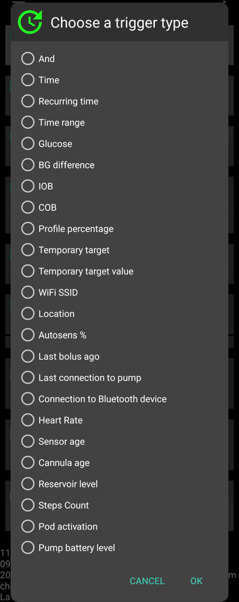

# Automatisierung

## Was ist eine Automatisierung?

„**Automatisierung**“ ist eine Funktionalität, mit der in AAPS-Aufgaben automatisiert werden können.

Automatisierungen führen definierte Aktionen basierend auf einer oder mehreren Bedingungen oder Auslösern aus. Auslöser können weniger häufige Situationen wie niedrige oder hohe Glukosewerte (BZ) oder eine bestimmte Menge negativen aktiven Insulins (Insulin on Bord - IOB) beinhalten. Automatisierungen können auch mit wiederkehrenden Ereignissen wie Mahlzeiten oder Sport zu bestimmten Tageszeiten umgehen oder wenn Du Dich innerhalb einer bestimmten Entfernung von einem GPS-Standort oder einem WLAN SSID Bereich befindest. Eine Automatisierung kann die Sicherung der AAPS-Einstellungen nach einem bestimmten Zeitplan oder mit jedem Pod-Wechsel ausführen.

Automatisierungsregeln werden über Reiter Automatisierung erstellt und geändert. Jede Regel wird durch zwei Eigenschaften definiert:

- Eine oder mehrere Bedingungen oder „Auslöser“, die eine Aktion starten.

    Denke dabei an einen bestimmten Zeitplan, ein Ereignis oder den Wert einer AAPS-Variable

- Eine oder mehrere durchzuführende Aktionen.

    So wie z. B. ein Alarm oder das Setzen eines prozentualen Profils oder den Export der AAPS-Einstellungen bei einem Pod-Wechsel.


Es gibt eine Vielzahl von Automatisierungsmöglichkeiten und Du solltest Dich mit ihnen in der AAPS-App im Abschnitt „Automatisierung“ vertraut machen. Du kannst auch die AAPS Gruppen auf  und  für Automatisierungs-Beispiele anderer Nutzenden durchsuchen.

## Wie Automatisierung helfen kann

1. **Automatisierung sich wiederholender Aufgaben:** Automatisches Ausführen programmierter Aktionen ohne manuellen Eingriff.

1. **Entscheidungsmüdigkeit verringern:** Der Hauptvorteil von **Automatisierungen** ist, den Nutzenden von der Last manueller **AAPS**-Eingriffe zu befreien. Die [Forschung](https://www.ncbi.nlm.nih.gov/pmc/articles/PMC6286423/#ref4) schätzt, dass Menschen mit Diabetes Typ 1 täglich durchschnittlich 180 zusätzliche Entscheidungen treffen müssen. **Automatisierungen** können diese mentale Belastung verringern und so Freiräume für andere Dinge des Lebens schaffen können.

1. **Potentiell verbesserte glykämische Kontrolle:** **Automatisierungen** können zum Beispiel dabei helfen, dass auch bei vollen Terminkalendern oder Vergesslichkeitsphasen, **temporäre Ziele** trotzdem gesetzt werden, wo es notwendig ist. Ein Kind mit Diabetes hat z.B. dienstags um 10.00 Uhr und donnerstags um 14.00 Uhr Sport, der ein hohes Temp Target („TT“) von 30 Minuten vor der sportlichen Aktivität aktiv notwendig macht. Dieses **Temp Target** kann über eine **Automatisierung** aktiviert werden.

1. **Ermöglicht es AAPS sehr individuell** in speziellen Situation, im Rahmen der eigenen Einstellungen, mehr oder weniger aggressiv zu arbeiten. Wenn sich beispielsweise eine längere Phase mit negativem **IOB** mitten in der Nacht, als Zeichen für ein zu starkes **Profil**, abzeichnet, kann automatisiert ein temporäres schwächeres **Profil** (in %) gesetzt werden.

Im Beispiel unten wird gezeigt, wie mit einer **Automatisierung** einzelne manuelle Schritte überflüssig gemacht werden.

Du machst jeden Morgen um 6 Uhr Sport: Du musst um 5 Uhr daran denken, in AAPS manuell ein temporäres Ziel „Aktivität“ zu setzen, bevor Du mit dem Sport beginnst.


Du hast eine **Automatisierung** erstellt, die um 5.00 Uhr am Morgen ein „temporäres Ziel für Aktivität“ setzt, um mit optimalem **Glukosewert** und **IOB** in das um 6.00 Uhr beginnende Training gehen zu können:


## Wichtige Vorüberlegungen, bevor mit Automatisierung gestartet wird

1. Bevor Du mit Automatisierungen beginnst, solltest Du bereits eine gute und stabile **Blutzucker**-Kontrolle mit **AAPS** haben. Automatisierungen sollten nicht dazu verwendet werden schiefe/schlechte Einstellungen (Basalraten, Korrekturfaktoren (**ISF**) oder Mahlzeitenfaktoren (**CR**)) auszugleichen (wird in Tiefe weiter unten beschrieben). Vermeide automatisierte **Profilwechsel**, um einen **Glukosewert**-Anstieg durch _z.B._ Mahlzeiten abzufangen. Diese Anstiege sind durch bestehende AAPS-Funktionen (SMBs etc.) besser abgedeckt.

1. So wie bei jeder Technik: **CGMs**, **Pumpen** und Smartphones können versagen: Technische Probleme oder Sensorfehler können eine laufende **Automatisierung** stören und müssen eventuell durch manuelles Eingreifen behoben werden.

1. Der **Automatisierungsbedarf** wird sich mit ändernden Tagesabläufen über die Zeit verändern**. Wenn zwischen Arbeits-, Schul- und Urlaubsphasen gewechselt wird, macht eine Kalendererinnerung zur Überprüfung der laufenden **Automatisierungen** Sinn (Automatisierungen lassen sich leicht aktivieren und de-aktiveren). Ein Beispiel ist: Du machst Urlaub und deswegen können/sollten Automatisierungen für Schulsport oder Dein tägliches Training ausgesetzt oder deren Timing angepasst werden.

1. **Automatisierungen** können miteinander in Konflikt stehen. Daher sollten neue **Automatisierungen** in einer gesicherten Umgebung sehr genau geprüft werden. Wichtig ist zu verstehen, warum eine bestimmte **Automatisierung** ggf. nicht, wie Du es erwartet hast, ausgelöst wurde.

1. Wenn Du die Autosens-Funktionalität nutzt, versuche, anstelle von **Profilwechseln** **temporäre Ziele** zu nutzen. **Temporäre Ziele** setzen Autosens nicht auf 0 zurück. **Profilwechsel** setzen Autosens zurück (reset).

1. Die meisten **Automatisierungen** sollten nur für einen **beschränkten Zeitraum** laufen. Danach kann **AAPS** die Situation erneut bewerten und die **Automatisierung** erneut starten, sofern das notwendig ist und die Startbedingungen weiterhin erreicht sind. Zum Beispiel: „Setze ein temporäres Ziel mit 120 mg/dl für 30 Minuten“ oder „Setze ein **Profil** mit 110% für 10 Minuten“ _und_ „Setze ein temporäres Ziel mit 90 mg/dl für 10 Minuten“. **Automatisierungen** zu nutzen, um dauerhafte Änderungen (z.B. das Profil prozentual anzuheben), kann Hypoglykämien zur Folge haben.

## Wann kann ich mit Automatisierungen beginnen?

**Automatisierungen** können im **Ziel 10** gestartet werden.

## Wo finden sich die Automatisierungen in AAPS?

Abhängig von Deinen Einstellungen unter [Konfiguration > Allgemein](../SettingUpAaps/ConfigBuilder.md), erreichst Du die **Automatisierungen** in **AAPS** entweder über das „Hamburger Menü“ oder über den eigenen Reiter.

## Wie kann ich eine Automatisierung einrichten?

Um eine **Automatisierung** einzurichten, erstelle in **AAPS** eine 'Regel/Aufgabe'. Das kann so aussehen:


* Vergebe einen Namen für die Aufgabe (Regel);
* Wähle mindestens eine „Bedingung“ oder einen „Auslöser“ aus; und


* Wähle eine „Aktion“;


* markiere das rechte obere Kästchen im **Automatisierungs-Ereignis**, um die **Automatisierung** zu aktivieren:


Um eine **Automatisierungsregel** zu deaktivieren, deaktiviere das Kästchen links neben dem Namen der **Automatisierung**. Das folgende Beispiel zeigt eine **Automatisierung** mit dem Titel „Low Glucose TT“ als aktiviert („angehakt“) oder deaktiviert („ausgehakt“).


Beim Einrichten einer **Automatisierung** kannst Du sie zuerst dadurch testen, dass Du unter „Aktion“ die Option „Benachrichtigung“ aktivierst. **AAPS** löst damit zunächst nur eine Benachrichtigung aus und nicht eine tatsächliche automatisierte Aktion. Wenn Du dann sicher bist, dass die Benachrichtigung zur richtigen Zeit bzw. Bedingung ausgelöst worden ist, kannst Du die **Automatisierungsregel** anpassen und die 'Benachrichtigung' durch die tatsächlich gewünschte 'Aktion' ersetzen.


```{admonition} Important note
:class: note

**Automatisierungen** sind auch dann aktiv, wenn der Loop deaktiviert ist!
```


## Sicherheitsbeschränkungen

Es gibt Sicherheitsbeschränkungen für **Automatisierungen**:

* Der **Glukosewert** muss zwischen 72 und 270 mg/dl (bzw. zwischen 4 und 15 mmol/l) liegen.
* Der **Prozentsatz des Profils** muss zwischen 70% und 130% liegen.
* Es müssen 5 Minuten zwischen der Ausführung der einzelnen **Automatisierungen** (und der erstmaligen Ausführung) liegen.

## Negative Werte richtig nutzen

```{admonition} Warning
:class: warning

Vorsicht bei der Auswahl eines negativen Wertes in der **Automatisierung**
```

Besonderer Vorsicht bedarf es, wenn in einer **Automatisierung** ein 'negativer Wert' innerhalb einer "kleiner als"-Bedingung genutzt werden soll. Zum Beispiel:


**Beispiel 1:** Erstelle eine Bedingung **„ist kleiner als"** „-0.1 mmol/l“ (bzw. „-2 mg/dl“) wird:

eine **Automatisierung** für jeden Wert, der **kleiner als** -0,1 (bzw. -2) ist, auslösen. Das sind dann die Zahlen wie -0,2, -0,3, -0,4 (bzw. -4, -6, -8) usw. Der Wert -0,1 (bzw. -2) selber **ist in der Bedingung nicht enthalten**. (Die Bedingung „ist kleiner oder gleich -0,1 mmol/l (-2 mg/dl)“ _würde_ den Wert -0,1 mmol/l oder -2 mg/dl mit einschließen).

**Beispiel 2:** Erstelle eine Bedingung „ist größer als" -0,1 mmol/l (-2 mg/dl) wird:

Eine **Automatisierung** für jeden Wert, der **größer als** -0.1 mmol/l (-2mg/dl) ist, auslösen. Das schließt beispielsweise auch die Werte 0, 0,2, 0,4 mmol/l (0, 4, 8 mg/dl), und jede andere positive Zahl mit ein.

Bei der Auswahl Deiner **Automatisierung** und der Wahl der Bedingungen und Werte, ist es wichtig genau zu wissen, welches Ziel damit erreicht werden soll.

(automations-automation-triggers)=
## Automatisierungsauslöser



Es gibt eine Reihe von „Bedingungen“, die ausgewählt werden können. Auslöser sind die Bedingungen, die erfüllt werden müssen, damit die Automatisierung ausgeführt wird. Die folgende Liste ist nicht vollständig:

**Auslöser:** Verbindungsbedingungen (Letzte Verbindung zur Pumpe)

**Optionen:**

Mehrere Auslöser können mit den folgenden Bedingungen miteinander verknüpft werden
* „Und“
* „Oder“
* „Entweder oder“ (d. h. eine (und nur eine) der Bedingungen muss zutreffen, damit die Aktion ausgeführt wird)

**Auslöser:** Zeit vs. Wiederholungszeit

**Optionen:**

* Zeit = einmaliges Ereignis
* Wiederholungszeit = etwas, das regelmäßig passiert (z. B. einmal pro Woche, jeden Werktag etc.)

**Bedingung:** Standort

**Optionen:**

* In den **Einstellungen** der Automatisierungen, kann der gewünschte Standortdienst ausgewählt werden.

**Bedingung:** Standortdienst

**Optionen:**

* Passiven Standort verwenden: **AAPS** nutzt nur die Standorte, wenn sie von anderen Apps angefordert werden.
* Netzwerkstandort: Standort Ihres Wi-Fi.
* GPS-Standort (Achtung! Kann zu übermäßigem Akkuverbrauch führen!)

**Bedingung**: Pumpen- und Sensordaten

* Kanülenalter: Für alle Pumpen verfügbar
* Insulinalter: Für alle unterstützten Pumpen verfügbar
* Batteriealter: Für alle unterstützten Pumpen verfügbar
* Sensoralter: Immer verfügbar
* Pod-Aktivierung: Für Patchpumpen verfügbar

Beachte, dass für alle altersbezogenen Bedingungen der Vergleich auf Gleichheit sehr unwahrscheinlich zum Auslösen führt. In diesem Fall werden zwei Bedingungen benötigt, um damit einen Bereich zu definieren

* Reservoirstand: Für alle Pumpen verfügbar, der Vergleich „NOT\_AVAILABLE“ funktioniert für diesen Auslöser nicht, da der Wert in **AAPS** immer gefüllt ist
* Pumpenbatterie-Stand: Für alle unterstützen Pumpen verfügbar, der Vergleich „NOT\_AVAILABLE“ funktioniert für diesen Auslöser nicht, da der Wert in **AAPS** immer gefüllt ist

## Aktion


**Aktion:** **Temporäres Ziel** (TT) starten

**Optionen:**

* **Glukosewert** muss zwischen 72 mg/dl und 270 mg/dl (bzw. zwischen 4 mmol/l und 15 mmol/l) liegen
* **TT**> funktioniert nur, wenn aktuell kein temporäres Ziel eingestellt ist

**Aktion:** **Temporäres Ziel** (TT) stoppen

**Optionen:**

kein(e)

**Aktionen:** **Profil Prozentsatz**

**Optionen:**

* **Prozentsatz** muss zwischen 70% und 130% liegen
* funktioniert nur, wenn das Profil zu dem Zeitpunkt mit 100% läuft

Sobald die Aktion hinzugefügt wurde, müssen die voreingestellten Werte durch Klicken auf Deine Wünsche angepasst werden.


(Automations-the-order-of-the-automations-in-the-list-matters)=
## Die Reihenfolge innerhalb der Liste der **Automatisierungen** ist entscheidend
 **AAPS** ordnet die Regeln in der Reihenfolge, wie sie erstellt wurden und beginnt bei der oberen Automatisierung mit dem Abarbeiten der **Automatisierungsliste**. Wenn beispielsweise **Automatisierung** „Low“ (dt. Hypobehandlung) unter allen **Automatisierungsregeln** die wichtigste **Automatisierung** ist, sollte diese ganz oben auf der Liste Deiner **Automatisierungen** erscheinen:


Um die Reihenfolge der **Automatisierungsregeln** zu ändern, drücke und halte den Button mit den vier Strichen am rechten Rand der Anzeige. Sortiere die  **Automatisierungen** neu, indem Du die entsprechende Regel nach oben oder unten verschiebst.


## Löschen von Automatisierungsregeln

Klicke auf das Papierkorbsymbol, um eine **Automatisierungsregel** zu löschen.


## Beispiele für Automatisierungen

Es folgen nun einige Beispiele für **Automatisierungen**. Weiterführende und tiefere Diskussionen über **Automatisierungen** im allgemeinen und einige Praxisbeispiele findest Du entweder in den Facebook-Gruppen oder auf Discord. Die folgenden Beispiele sollten nicht blind übernommenen werden. Wichtig ist, die genaue Funktionsweise der jeweiligen </strong>Automatisierung** zu verstehen, bevor sie genutzt wird.</p>

### Temporäres Ziel bei niedrigem Blutzucker

Diese **Automatisierung** setzt beim Erreichen eines bestimmten **Glukosewerts** ein niedriges temporäres Ziel.


### Temporäres Ziel zur Mittagszeit (abhängig vom 'Standort')


Diese **Automatisierung** wurde für eine Person erstellt, die das Mittagessen an Werktagen (Mo - Fr) ungefähr zur gleichen Zeit auf der Arbeit isst, und nur ausgeführt wird, wenn die Person an einem bestimmten 'Standort' ist.  Sollte die Person nicht auf der Arbeit sein, wird diese **Automatisierung** folglich nicht ausgeführt werden.

Diese **Automatisierung** setzt in Vorbereitung auf das Mittagsessen um 13.00h für 30 Minuten ein niedriges **temporäres Ziel** (Bald Essen), um den Glukosewert auf bis 90 mg/dl (oder 5 mmol/l) zu bringen.

Der Standort wird als 'Auslöser' eingestellt, indem die Koordinaten für Breitengrad und Längengrad wie unten angegeben werden:


Aufgrund der ‘Und’-Verknüpfung wird die **Automatisierung** nur dann ausgeführt, wenn die Person sich zum gewählten Zeitpunkt am hinterlegten Standort aufhält.

Diese **Automatisierung** wird zu keinem anderen Zeitpunkt an diesem Standort ausgeführt. Sie wird auch nicht ausgeführt, wenn man sich zum gewählten Zeitpunkt weiter als 50 Meter von der hinterlegten GPS-Position aufhält.

### WLAN SSID und Standort-Automatisierungen

Wenn eine **Automatisierung** nur dann ausgelöst werden soll, wenn man sich in einem bestimmten WLAN-Bereich befindet, ist 'WLAN SSID' ist ein guter Weg das umzusetzen. Die WLAN SSID ist im Vergleich zur GPS Position recht genau, nutzt dabei weniger Akkuleistung und funktioniert auch in geschlossenen Räumen an denen GPS oder andere Standortdienste eventuell nicht verfügbar sind.

Hier nun ein weiteres Beispiel für das frühzeitige Setzen eines **temporären Ziels** an Werktagen für das Frühstück (1).


Die **Automatisierung** wird montags - freitags (2), wenn man sich im heimischen WLAN (3) befindet, ausgelöst.


Es wird dann ein **temporäres Ziel** von 75 mg/dl für 30 Minuten (4) gesetzt. Den Standort zu berücksichtigen hat den Vorteil, dass die Automatisierung (zum Beispiel auf Reisen) nicht gestartet wird.


Der Screenshot zeigt die detaillierten Auslöser der **Automatisierung**:

1) Im “UND”-Rahmen (beide Bedingungen müssen erfüllt sein, damit ausgelöst wird) 1) Wiederholungszeit = Mo, Di, Mi, Do, Fr um 5:30h  
1) WIFI SSID = My_Home_WiFi_Name


(automating-preference-settings-export)=

## Automatischer Export der Einstellungen

### Täglicher automatischer Export der Einstellungen

Screenshots, die die Auslöser für diese Automatisierung im Detail zeigen:

1) Bedingung: Wiederholungszeit = Mo, Di, Mi, Do, Fr um 8:00 Uhr 1) Aktion: Einstellungen exportieren (Für „Text in Behandlungen“ gib „Täglich“ ein)


Hinweis: Der Export wird im Careportal protokolliert

### Automatischer Export der Einstellungen bei Pod-Aktivierung (nur für Patchpumpen)

Screenshots, die die Auslöser für diese Automatisierung im Detail zeigen:

1) Bedingung: Pod-Aktivierung 1) Aktion: Export der Einstellungen (Als „Text in Behandlungen" gib "Pod-Aktivierung: Einstellungen exportieren" ein)


Hinweis: Der Export wird im Careportal protokolliert. Hinweis: Automatisierungen werden **nur dann** ausgeführt, wenn Du vorher einen manuellen Export der Einstellungen gemacht hast. Siehe [Einstellungen > Wartung](#preferences-maintenance-settings) zur richtigen Aktivierung des automatischen Exports der Einstellungen.


## Automatisierungsprotokolle (Logs)

Es gibt unten am Rand des Reiters eine **AAPS**Protokollierung der zuletzt ausgelösten **Automatisierung**.

Im Beispiel unten wird das Protokoll angezeigt:

(1) um 01:58 Uhr wird „Low BG Trigger temp hypo profil“ ausgelöst
* der Glukosewert ist kleiner als 75mg/dl;
* das Delta ist negativ (d.h. der Glukosewert sinkt);
* die aktuelle Zeit liegt zwischen 01:00h und 06:00h.

Die **Automatisierung** wird:
* ein **temporäres Ziel** auf 110mg/dl für 40 Minuten setzen;
* eine **Profilanpassung** auf 50% für 40 Minuten vornehmen.

(2) um 03:38 Uhr wird „High carb after low at night“ ausgelöst
* die aktuelle Zeit liegt zwischen 01:05h und 06:00h;
* der Glukosewert ist größer (höher) als 110mg/dl.

Die **Automatisierung** wird:
* einen **Profilwechsel** zum LocalProfile1 ausführen (d.h. das temporäre Profil wird beendet, sofern es aktiv ist)
* ein **temporäres Ziel** beenden (sofern eines aktiv ist)


## Problembehandlung

* Problem: __Meine Automatisierungen werden durch AAPS nicht gestartet__

Setze einen Haken im Kästchen neben der **Automatisierung**, um sicherzustellen, dass die Regel aktiviert ist.

## Problembehandlung


* Problem: __Meine Automatisierungen werden in der falschen Reihenfolge gestartet.__

Überprüfe die Reihenfolge der Regeln in Deiner Liste, so es oben beschrieben wurde.

## Alternativen zu einer Automatisierung

Für fortgeschrittene Benutzer gibt es andere Möglichkeiten, Aufgaben mit IFTTT oder einer Drittanbieter-Android-App namens Automate zu automatisieren. 
