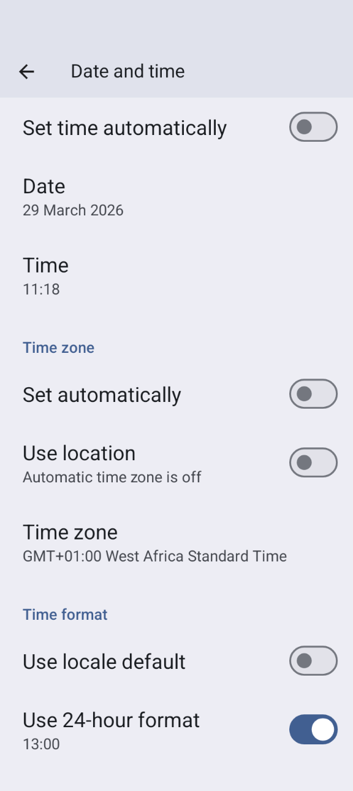

# Zeitzonenänderung und Zeitumstellung (Sommer-/ Winterzeit)

## Mit der Pumpe über Zeitzonen hinweg reisen

## Zeitzonenwechsel mit Omnipod-Dash

* Aktualisiere den Dash-Tab
* Wähle temporär ein anderes **Profil** aus und wechsel danach wieder zurück auf Dein Ausgangs- oder Dein gewünschtes **Profil**

## Zeitzonenwechsel mit DanaR, koreanische DanaR

Es gibt keine Probleme beim Zeitzonenwechsel im Smartphone, da die Pumpe keine Historie verwendet

## Zeitzonenwechsel mit DanaRv2, DanaRS

Da **AAPS** die Pumpenhistorie nutzt, die Einträge in der Pumpe aber keine Zeitangaben enthalten, benötigen diese Pumpen besondere Aufmerksamkeit. **Wenn Du die Zeitzone auf Deinem Smartphone änderst, bedeutet das, dass die Datensätze mit einer anderen Zeitzone ausgelesen und gedoppelt werden.**

Um dies zu vermeiden, gibt es zwei Möglichkeiten:

### Option 1: Heimatzeit beibehalten und Time Shift des Profils

* Schalte die automatische Einstellung von Datum und Uhrzeit in Deinem Smartphone aus (manueller Zeitzonen-Wechsel).

* Dein Smartphone muss für die gesamte Reise auf Datum und Zeit Deines Heimatortes eingestellt bleiben.

* Führe einen **Profil**wechsel mit Zeitverschiebung entsprechend dem Zeitunterschied Deines Heimatortes zum Zielort durch.
   
   * Drücke lang auf den **Profil**namen (oben in der Mitte auf dem Startbildschirm).
   * Wähle „**Profilwechsel**“
   * Stelle die 'Zeitverschiebung' entsprechend Deines Zielortes ein.
   
   
   
   * z.B. Wien -> New York: **Profilwechsel** +6 Stunden
   * z.B. Wien -> Sydney: **Profilwechsel** -8 Stunden

### Option 2: Pumpenhistorie löschen

* Schalte die automatische Einstellung von Datum und Uhrzeit in Deinem Smartphone aus (manueller Zeitzonen-Wechsel)

Wenn Du aus dem Flugzeug steigst:

* schalte die Pumpe aus
* ändere die Zeitzone auf dem Smartphone
* schalte das Smartphone aus, schalte die Pumpe an
* lösche die Historie der Pumpe
* ändere die Zeit in der Pumpe
* schalte das Smartphone an
* lasse das Smartphone mit der Pumpe verbinden und verfeinere die Zeiteinstellung

## Zeitzonenwechsel mit Insight

Der Treiber passt die Uhrzeit in der Pumpe automatisch an die Zeit im Smartphone an.

Die Insight dokumentiert auch die historischen Einträge, in denen die Zeit geändert wurde und von welcher (alten) Zeit zu welcher (neuen) Zeit. So kann die richtige Zeit in **AAPS** trotz der Zeitänderung bestimmt werden.

Es kann zu Ungenauigkeiten in der **TDDs** kommen. Das sollte allerdings unproblematisch sein.

Der Insight-Nutzer muss sich also nicht um Zeitumstellung oder den Wechsel von Zeitzonen kümmern. Es gibt eine Ausnahme zu dieser Regel: Die Insight Pumpe hat eine kleine interne Batterie, um die Zeit immer aktuell zu halten etc. während Du die "normale" Batterie wechselst. Wenn der Batteriewechsel zu lange dauert, kann diese interne Batterie leer werden, die Uhr wird zurückgesetzt und Du wirst gebeten, Zeit und Datum nach dem Einlegen der neuen Batterie neu einzugeben. In diesem Fall werden alle Einträge vor dem Batteriewechsel in der Berechnung in AAPS übersprungen, da die richtige Zeit nicht korrekt erkannt werden kann.

## Zeitzonenwechsel mit Accu-Chek Combo

Die neue [Combo-Unterstützung](../CompatiblePumps/Accu-Chek-Combo-Pump-v2.md) (eng. driver) passt die Pumpenzeit automatisch an die Zeit des Smartphones an. Die Combo selbst speichert keine Zeitzonen, sondern lediglich die lokale Zeit. Der neue Treiber setzt genau diese lokale Zeit. Zusätzlich wird die Zeitzone in den lokalen AAPS-Einstellungen hinterlegt, um die lokale Pumpenzeit in einen vollständigen Zeitstempel, der die entsprechende Zeitverschiebung enthält, umzurechnen. Du musst hier also nichts tun. Sollten die Abweichungen zwischen Combo und Smartphone zu groß werden, wird die Pumpenzeit automatisch korrigiert.

Es kann etwas dauern bis die Synchronisierung abgeschlossen ist, da die Anpassung nur mit einem langsamen Kommunikations-Protokoll (remote-terminal mode) gemacht werden kann. Das ist eine Combo-Beschränkung, die nicht umgangen werden kann.

Der alte, auf Ruffy basierende, Treiber passt die Zeit nicht automatisch ein. In diesem Setup muss die Anpassung von Hand erfolgen. Unten findest Du die nötigen Schritte, um die Anpassungen wegen eines Zeitzonenenwechsels oder wegen der Zeitumstellung sicher durchzuführen.

## Zeitzonenänderung für Medtrum

Der Treiber passt die Uhrzeit in der Pumpe automatisch an die Zeit im Smartphone an.

Änderungen der Zeitzone haben ggf. einen Einfluss auf den gespeicherten Gesamtinsulinbedarf (TDD). Die übrige Historie bleibt unberührt. Manuelle Anpassungen der Uhrzeit kann zu Problemen mit der Pumpenhistorie und dem **IOB** führen. Falls Du die Uhrzeit manuell anpasst, überprüfe das **IOB** (aktives Insulin).

Wenn sich die Zeitzone oder die Uhrzeit ändert, wird eine laufende **TBR** gestoppt.

## Zeitumstellung (Sommer-/Winterzeit)

Zeitumstellung (Sommer-/Winterzeit)

Abhängig von Deiner Pumpe und dem CGM Setup können Zeitsprünge zu **AAPS**-Problemen führen. Beispielsweise wird bei der Combo-Pumpe die Pumpenhistorie doppelt ausgelesen, sodass dadurch doppelte Einträge entstehen. Für einige Pumpen ist es besser, Zeitzonenanpassungen während der Wachphase und nicht in der Nacht durchzuführen.

### Automatische Sommer-/Winterzeitumstellung für die meisten Pumpen

* Diese Umstellungsfunktion ist seit **AAPS**-Version 2.2 verfügbar.
* Der Closed Loop wird für 3 Stunden NACH der Zeitumstellung (normalerweise 1 Uhr) deaktiviert und **AAPS** wird es für diese Zeit standardmäßig das Basal, wie es in Deinem **Profil** hinterlegt ist, abgeben. Dies geschieht aus Sicherheitsgründen - **IOB** kann wegen doppelter Boli vor der Zeitumstellung zu hoch sein.
* Nach der Zeitumstellung, führe einen **Profilwechsel** auf Dein gewünschtes **Profil** aus, um den Closed Loop zu aktivieren.
* Vor der Zeitumstellung wirst Du auf der **AAPS**-Übersicht eine Benachrichtigung erhalten, dass der Closed Loop vorübergehend deaktiviert wurde. Diese Nachricht erscheint ohne Ton, Vibration oder anderes.**

Wenn Du den **AAPS**-Bolus-Rechner zum Bolen verwendest, schließe **COB** und **IOB**-Daten aus, es sei denn, Du bist Dir absolut sicher, dass die Daten korrekt sind. Sei vorsichtig und nutze den Bolus-Rechner in den ersten Stunden nach der Zeitumstellung nicht zum Bolen.

### Zeitumstellung für Accu-Chek Insight

* Zeitumstellung erfolgt automatisch. Keine Maßnahme erforderlich.

### Zeitumstellung für Medtrum

* Zeitumstellung erfolgt automatisch. Keine Maßnahme erforderlich.

### Zeitumstellung für Omnipod Dash

* Entweder lässt Du nach der Zeitumstellung, wie sie oben beschrieben ist, temporär zu, dass **AAPS** das im Profil hinterlegte Basal abgibt.
* Oder, für den Fall, dass Du nicht möchtest, dass **AAPS** vorübergehend das hinterlegte Basal die Nacht hinweg nutzt, kannst Du die Zeitzone am Vortag der Zeitumstellung ändern, um so in der Nacht nicht gestört zu werden. HINWEIS: DIESE OPTION KANN DAZU FÜHREN, DASS DEIN POD VORZEITIG UNBRAUCHBAR WIRD. STELLE BEI DIESEM WEG BITTE SICHER, DASS DU GENUG ERSATZ ZUR HAND HAST.

#### Vor der Zeitumstellung notwendige Maßnahmen

1. Schalte alle Einstellungen Deines Smartphones AUS, die die Zeitzone des Smartphones automatisch anpassen, damit auf eine Zeitzone, die keine Sommerzeit-Umstellung hat, gewechselt werden kann. Wie Du das machst, hängt von Deinem Smartphone und der Android-Version ab.
   
   * Manche Smartphones haben zwei Einstellungen, eine für die automatische Zeiteinstellung (die idealerweise AN bleiben sollte) und eine für den automatischen Zeitzonenwechsel (die Du AUSSCHALTEN musst).
   * Unglücklicherweise haben manche Android-Versionen nur eine Einstellmöglichkeit für beides zusammen. In diesem Fall musst Du eben beide ausschalten.

2. Suche Dir eine Zeitzone, die dieselbe Uhrzeit wie Du hat, aber nicht zwischen Winter- und Sommerzeit wechselt.
   
   * Eine Liste dieser Länder findest Du z.B. auf [https://greenwichmeantime.com/countries](https://greenwichmeantime.com/countries/).
   * Für die Mitteleuropäische Zeit (MEZ) könnte dies z.B. "Brazzaville" (Kongo) sein. Stelle die Zeitzone deines Smartphones manuell auf Kongo.

3. **AAPS** verbinde Dich mit Deiner Pumpe (refresh) und wechsel auf das gewünschte **Profil**.

4. Prüfe die **IOB**- und **COB**-Werte in **AAPS**. Deaktiviere den Closed Loop für mindestens die Insulinwirkdauer (DIA) oder „Max-Carb-Time“ (je nachdem welcher Zeitraum länger ist), sofern die Werte falsch sein sollten.

5. Nach der Zeitumstellung notwendige Maßnahmen. Der Zeitpunkt zum Zurückkehren in die lokale Zeitzone ist ideal, wenn der **IOB** niedrig ist. Z. B. eine Stunde vor einer Mahlzeit wie dem Frühstück. Sowohl Dein **COB**, als auch Dein **IOB** sollten idealerweise dabei nahe Null sein.

### Zeitumstellung für Accu-Chek Combo

Dieser Abschnitt ist nur für den alten, auf Ruffy basierenden, Treiber gültig. Der neue Treiber passt Datum und Uhrzeit und Sommer-/Winterzeit automatisch an.

**AAPS** wird Dich alarmieren, wenn die Uhrzeit der Pumpe zu sehr von der des Smartphones abweicht. Bei der Zeitumstellung wäre dies unerfreulicherweise mitten in der Nacht. Um dies zu verhindern und stattdessen den Schlaf zu genießen, folge diesen Schritten, so dass Du die Zeitumstellung zu einer Zeit erzwingen kannst, die Dir passt.

#### Vor der Zeitumstellung notwendige Maßnahmen

1. Schalten alle Einstellungen AUS, die die Zeitzone automatisch festlegen, so dass Du die Zeitumstellung durchführen kannst, wann Du es möchtest. Die Vorgehensweise hängt von Deinem Smartphone und der Android-Version ab.
   
   * Manche haben zwei Einstellungen, eine für die automatische Zeiteinstellung (die idealerweise AN bleiben sollte) und eine für den automatischen Zeitzonenwechsel (die Du AUSSCHALTEN musst).
   * Unglücklicherweise haben manche Android-Versionen nur eine Einstellmöglichkeit für beides zusammen. In diesem Fall musst Du eben beide ausschalten.
   
   Screenshot_20260329-110315 (1)

2. Suche Dir eine Zeitzone, die dieselbe Uhrzeit wie Du hat, aber nicht zwischen Winter- und Sommerzeit wechselt.
   
   * Eine Liste dieser Länder findest Du z.B. auf [https://greenwichmeantime.com/countries](https://greenwichmeantime.com/countries/).
   * Für die Mitteleuropäische Zeit (MEZ) könnte dies z.B. "Brazzaville" (Kongo) sein. Stelle die Zeitzone deines Smartphones manuell auf Kongo.

3. Verbinde Dich in **AAPS** mit Deiner Pumpe (refresh).

4. Prüfe den Tab "Behandlungen". Falls Du doppelte Einträge entdeckst:
   
   * Klicke NICHT auf "lösche alle Behandlungen in der Zukunft". 
   * Drücke "Löschen" bei allen künftigen und doppelten Behandlungen. Dadurch werden die Behandlungen außer Kraft gesetzt statt nur gelöscht und somit nicht mehr beim IOB berücksichtigt.

5. Wenn die Situation von COB und/oder IOB unklar ist, pausiere den Loop zu Deiner eigenen Sicherheit bitte mindestens für den Zeitraum des DIA oder die Max-Carb-Time - und wähle den größeren der beiden.

#### Nach der Zeitumstellung notwendige Maßnahmen

Ein guter Zeitpunkt für diese Umstellung ist bei niedrigem **IOB** Z.B. eine Stunde vor einer Mahlzeit wie dem Frühstück, denn dann werden alle kürzlich abgegebenen Boli in Deiner Pumpenhistorie kleine SMB Korrekturen sein. Sowohl Dein **COB**, als auch Dein **IOB** sollten dabei nahe Null sein.

1. Wechsle die Zeitzone in Deinem Smartphone zurück auf Deine eigene Zeitzone und aktiviere die oben deaktivierte Automatik zur Zeitzoneneinstellung wieder.
2. **AAPS** wird Dich kurz danach alarmieren, dass die Uhrzeit in der Combo nicht passt. Passe die Uhrzeit manuell auf der Pumpe an.
3. Klicke im COMBO-Tab von **AAPS** auf „Aktualisieren“.
4. Prüfe dann auf dem Behandlungs-Tab, ob es Ereignisse in der Zukunft gibt. Es sollte eigentlich keine geben. Falls doch:
   
   * Klicke NICHT auf "lösche alle Behandlungen in der Zukunft". 
   * Drücke "Löschen" bei allen künftigen und doppelten Behandlungen. Dadurch werden die Behandlungen außer Kraft gesetzt statt nur gelöscht und somit nicht mehr beim IOB berücksichtigt.

5. Wenn die Situation von COB und/oder IOB unklar ist, pausiere den Loop zu Deiner eigenen Sicherheit bitte mindestens für den Zeitraum des DIA oder die Max-Carb-Time - und wähle den größeren der beiden.

6. Mache weiter wie gewohnt.