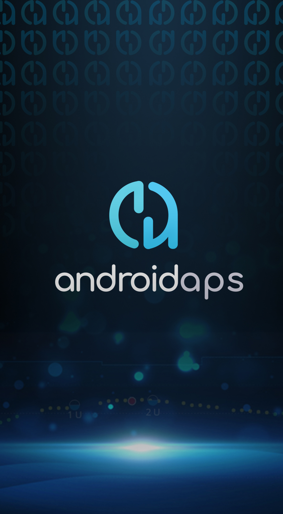

(Phones-list-of-tested-phones)=

# Liste der getesteten Smartphones

Currently, we have a very hard-working behind-the-scenes Maintainer, who is in charge of ensuring the integrity of the Hardware List of all Android Phones/Smartwatches Capable of Looping with the Omnipod Dash; the newest pump driver addition to our ever-expanding network of Bluetooth enabled insulin pumps for use within the AAPS/OpenAPS ecosystem!

Unser Betreuer hat viel Zeit und Mühe damit verbracht, dass es für Jeden leicht ist, Daten in die Tabelle einzugeben; über ein Google-Formular mit vorgefüllten Überschriften zur einfachen Anwendung! Dadurch wird sichergestellt, dass die vorhandenen Daten der Tabellen nicht versehentlich überschrieben oder gelöscht werden können. Diese Version basiert auf dem Erfolg des ersten Sheets, das nicht mehr gepflegt wurde und nutzt hierzu wiederum Google Sheets.

Der neue Treiber für den DASH Pod konnte sehr effizient und schnell erstellt werden, Dank der Einfachheit von Google Spreadsheets, welches den Anwendern einen leichten Zugang ermöglicht, der engen Kommunikation zwischen den frühen Anwendern und der Fähigkeit, ihr gemeinsames Wissen und die Erkenntnisse zu bündeln, die während der frühen Test- und Feedback-Phasen der Dash-Pump-Pod-Treiber gewonnen wurden. Die Ergebnisse, Informationen und Energie, die von den zahlreichen Early Adoptern bereitgestellt wurden, um Schritt für Schritt Feedback zu jeder neuen Version der Dash Bluetooth-Treiber zu geben, wird deutlich, wenn Du die umfassende Vergleichs- und Kontrastliste der Hardware öffnest, die für das Loopen mit dem Omnipod-Dash, geeignet ist, mit vielen Android Phones und Smartwatches getestet und die als kompatibel eingestuft wird. Darüber hinaus sind inkompatibleren Setups auch in dieser Spreadshee enthalten, so dass neue Benutzer wissen, welche Hardware sie aufgrund von Verbindungsgeschwindigkeit oder -stärke vermeiden können.

Wenn in Zukunft wieder eine andere Hardwareliste benötigt wird und Jemand sich um diese Liste kümmern möchte, kontaktiere uns bitte!

Die Liste des getesteten Telefons kann über den folgenden Link [Liste der getesteten Telefone mit Omnipod-Insulinpumpe](https://docs.google.com/spreadsheets/d/1zO-Vf3wv0jji5Gflk6pe48oi348ApF5RvMcI6NG5TnY) aufgerufen werden

Mit STRG-F kannst Du im Text der Google Tabelle suchen. Die Tabelle ist schreibgeschützt. Um den Test eines Telefons aufzunehmen, fülle bitte das [-Formular](https://forms.gle/g7GbSkMCTfFrWKjSA) aus.

Nachdem Du die Formulardaten ausgefüllt hast, wird der Betreuer die Daten überprüfen und sie zur Veröffentlichung freigeben!

Im Falle von Fragen oder Problemen mit der Tabelle kontaktiere uns bitte direkt oder über einen GitHub Issue für das openaps/AndroidAPSDocs Projekt.

(Phones-phone-background)=

# Handy Hintergrundbild

   Design: Thiago :)   If you want to decorate your phone with more AAPS, you can download your background image here: 