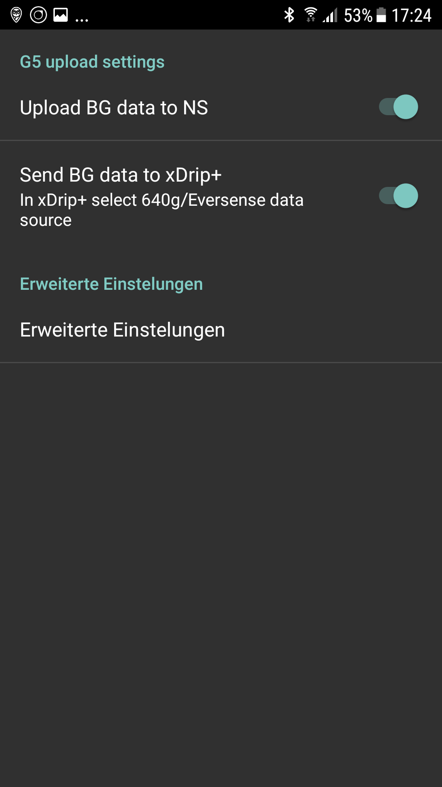

# Konfigurationsbeispiel: Samsung S7, Dana RS, Dexcom G6 und Sony Smartwatch

## Beschreibung

In dieser Variante ist das Smartphone Samsung Galaxy S7 die Schaltzentrale des Loop. Es liest mit der originalen, aber von der Community leicht modifizierten Dexcom-App das kontinuierliche Glukosemesssystem Dexcom G6 aus. AndroidAPS steuert auf Basis dieser Daten die Insulinpumpe Dana RS des koreanischen Herstellers SOOIL via Bluetooth. Weitere Geräte werden nicht benötigt.

Da die Dexcom App nur begrenzte Alarmoptionen zur Verfügung stellt, wird xDrip+ verwendet, um nicht nur Hoch- und Niedrigalarme sondern auch weitere Alarme nach individuellen Bedürfnissen auszugeben.

Falls gewünscht, können alle aktuellen Glukose- und Behandlungsdaten auf einer Android Wear Smartwatch (in diesem Beispiel die "Sony Smartwatch 3" (SWR50)) am Handgelenk angezeigt werden. Über die Smartwatch kann AndroidAPS auch bedient werden (z.B. Bolusgabe).

Das System funktioniert offline, also ohne dass zum Betrieb eine Datenverbindung des Smartphones zum Internet erforderlich ist.

Die Daten werden jedoch automatisch zu Nightscout (Open Source Cloud Service) hochgeladen, wenn eine Datenverbindung hergestellt wird. So können umfangreiche Auswertungen für den Arztbesuch erstellt oder jederzeit die aktuellen Werte mit Familienmitgliedern geteilt werden. Es ist auch möglich, die Daten nur über eine (ggf. zuvor definiertes) WLAN-Verbindung zu übertragen, um die Nightscout-Berichte nutzen zu können.

## Benötigte Komponenten

1. Samsung Galaxy S7
    
    * Alternativen: siehe [Liste der getesteten Smartphones und Smartwatches](https://docs.google.com/spreadsheets/d/1gZAsN6f0gv6tkgy9EBsYl0BQNhna0RDqA9QGycAqCQc/edit#gid=698881435) für AndroidAPS

2. [Dana RS](http://www.sooil.com/eng/product/)
    
    * Alternativen: 
    * [Accu-Chek Combo](../Configuration/Accu-Chek-Combo-Pump.md)
    * [Accu-Chek Insight](../Configuration/Accu-Chek-Insight-Pump.md)
    * [Dana R](../Configuration/DanaR-Insulin-Pump.md)
    * [Einige alte Medtronic Pumpen (zusätzlich erforderlich: RileyLink/Gnarl Hardware, Android Phone mit Bluetooth Low Energy/BLE-Chipsatz)](../Configuration/MedtronicPump.md)
    * Künftig werden evtl. weitere Pumpen für den Loop nutzbar sein. Eine Liste der zukünftig ggf. loopbare Pumpen finden sich [hier](Future-possible-Pump-Drivers.md).

3. [Dexcom G6](https://dexcom.com)
    
    * Alternativen: siehe Liste der möglichen [BZ-Quellen](../Configuration/BG-Source.rst)

4. Optional: Sony Smartwatch 3 (SWR50)
    
    * Alternativen: Alle [Uhren mit Google Wear OS](https://wearos.google.com/intl/de_de/#find-your-watch) sollten funktionieren. Details findest Du in der [Liste der getesteten Smartphones und Smartwatches](https://docs.google.com/spreadsheets/d/1gZAsN6f0gv6tkgy9EBsYl0BQNhna0RDqA9QGycAqCQc/edit#gid=698881435) für AndroidAPS (OS muss Android Wear sein).

## Nightscout Einrichtung

Detaillierte Anleitung siehe [Nightscout Setup](../Installing-AndroidAPS/Nightscout.md).

## Computer Einrichtung

Um aus dem frei verfügbaren OpenSource-Quellcode von AAPS eine Android-App selbst erstellen zu können, wird Android Studio auf dem Computer oder Notebook (Windows, Mac, Linux) benötigt. Eine detaillierte, bebilderte Installationsanleitung findet sich unter [App aus Quellcode erstellen](../Installing-AndroidAPS/Building-APK.md).

Bei der Erstinstallation von Android Studio ist einige Geduld erforderlich, da die Software nach der Installation auf dem Rechner einige weitere Komponenten nachlädt.

## Smartphone Einrichtung

### Firmware des Smartphones prüfen

* Menü > Einstellungen > Telefoninfo > Softwareinfo: Hier sollte mindestens die Firmware-Version stehen: "Android-Version 7.0" (erfolgreich getestet bis Android-Version 8.0.0 Oreo - Samsung Experience Version 9.0) 
* Falls nicht: Menü > Einstellungen > Software-Update durchführen

### Installation von Apps aus unbekannten Quellen zulassen

Menü > Einstellungen > Gerätesicherheit > Unbekannte Quellen > Schieber nach rechts (= aktiv)

Diese Einstellung sollte aus Sicherheitsgründen wieder auf inaktiv gestellt werden, wenn die Installation aller hier beschriebenen Apps abgeschlossen ist.

### Bluetooth aktivieren

1. Menü > Einstellungen > Verbindungen > Bluetooth > Schieber nach rechts (= aktiv)
2. Menü > Einstellungen > Verbindungen > Standort > Schieber nach rechts (= aktiv)

Standortdienste ("GPS") müssen aktiviert sein, damit Bluetooth ordnungsgemäß funktioniert.

### Dexcom App (modifizierte Version) installieren

Die Original-App von Dexcom aus dem Google Play Store wird nicht funktionieren, weil sie die Werte nicht an andere Apps weitergibt. Darum ist eine von der Community leicht modifizierte Version erforderlich. Nur sie kann später mit AAPS kommunizieren. Außerdem kann die modifizierte Dexcom App mit allen Android Smartphones verwendet werden, nicht nur mit den in der [Dexcom Kompatibilitätsliste](https://www.dexcom.com/dexcom-international-compatibility) aufgeführten.

Eine mmol/l Version und eine mg/dl Version der modifizierten Dexcom G6 App sind unter <https://github.com/dexcomapp/dexcomapp/tree/master/2.4> verfügbar. Wähle die passende [modifizierte G6 App für Deine Region](../Hardware/DexcomG6#g6-mit-der-gepatchten-dexcom-app).

Zur Einrichtung im Smartphone folgende Schritte ausführen:

1. Falls die Original-Dexcom-App bereits installiert sein sollte: 
    * Sensor stoppen
    * App deinstallieren über Menü > Einstellungen > Apps > Dexcom G6 Mobile > Deinstallieren
2. Lade die modifizierte Dexcom App (achte auf die Einheit mg/dl oder mmol/l und [Region](../Hardware/DexcomG6#if-using-g6-with-patched-dexcom-app) according to your needs): <https://github.com/dexcomapp/dexcomapp/tree/master/2.4>.
3. Modifizierte Dexcom G6-App auf dem Smartphone installieren (= die heruntergeladene APK-Datei auswählen)
4. Modifizierte Dexcom G6-App starten, den Sensor nach Anweisung aktivieren / kalibrieren und die Aufwärmphase abwarten.
5. Wenn die modifizierte Dexcom-App den aktuellen Wert anzeigt, dann im Hamburger-Menü (= drei waagerechte Striche links oben in der App) auf “Warnungen” und folgende Konfiguration einstellen: 
    * Akut niedrig: `55mg/dl` / `3.1mmol/l` (kann nicht deaktiviert werden)
    * Niedrig `OFF`
    * Hoch `OFF`
    * Anstiegsrate `OFF`
    * Abfallrate `OFF`
    * Signalverlust `OFF`

## AndroidAPS installieren

1. AndroidAPS APK-Datei wie [hier](../Installing-AndroidAPS/Building-APK#signierte-apk-erstellen-generate-signed-apk) ausführlich und mit Screenshots beschrieben erstellen.
2. Die erstelle APK-Datei auf das Smartphone [übertragen](../Installing-AndroidAPS/Building-APK#ubertrage-die-apk-datei-auf-das-smartphone).
3. AndroidAPS entsprechend den eigenen Anforderungen mit Hilfe des Einrichtungsassistenten oder manuell [konfigurieren](../Configuration/Config-Builder.md).
4. In diesem Beispiel haben wir (unter anderem) folgende Einstellungen verwendet:

* BZ-Quelle: `Dexcom G6 App (patched)` -- Klicke auf das Zahnrad und aktiviere `Speichere BZ-Werte in Nightscout` und `Sende BZ-Werte zu xDrip+` (siehe [BZ-Quellen](../Configuration/BG-Source.rst))

* Nightscout Client aktivieren (siehe [Nightscout-Client](../Configuration/Config-Builder#nightscout-profil) und [Nightscout Setup](../Installing-AndroidAPS/Nightscout.md))

## xDrip+ installieren

xDrip + ist eine weitere ausgereifte Open-Source-App, die unzählige Möglichkeiten bietet. Anders als von den Entwicklern eigentlich gedacht, wird xDrip+ aber bei dieser Methode nicht auch zum Sammeln der Glukosedaten vom Dexcom G6 verwendet, sondern nur, um Alarme auszugeben und auf dem Android-Homescreen im Widget den aktuellen Glukosewert samt Kurve anzuzeigen. Mit xDrip+ können die Alarme nämlich viel individueller eingestellt werden als mit der Dexcom-Software, AAPS oder Nightscout (keine Einschränkung bei der Auswahl der Sounds, verschiedene Alarme je nach Tages-/Nachtzeit etc.).

1. Letzte stabile APK-Version von xDrip+ mit dem Smartphone herunterladen unter <https://xdrip-plus-updates.appspot.com/stable/xdrip-plus-latest.apk> - nicht die Version aus dem GooglePlay-Store!
2. xDrip+ installieren, indem die heruntergeladene APK-Datei ausgewählt wird.
3. xDrip+ starten und im Hamburger-Menü (drei waagerechte Striche links oben) folgende Einstellungen vornehmen: 
    * Einstellungen > Warnungen > Glukose-Alarm-Liste > Warnungen (niedrig) und (hoch) je nach Bedarf erstellen. 
    * Die bestehenden Alarme können mit einem langen Fingerdruck geändert werden.
    * Einstellungen > Kalibrierungs-Erinnerungen: deaktiviert (wird über die Dexcom-App erinnert)
    * Einstellungen > Datenquelle > 640G/EverSense
    * Einstellungen > Inter-App-Einstellungen > Accept Calibrations > `AN`
    * Menü > Sensor starten (Ist nur "pro forma" und hat nichts mit dem laufenden G6-Sensor zu tun. Dies ist nötig, da sonst regelmäßig eine Fehlermeldung kommt.) 

Weitere Informationen über xDrip+ findest Du auf der Seite [BZ-Quellen](../Configuration/BG-Source.rst).

### Beispiel für ein Alarm-Setup:

Der "Akut niedrig Alarm" (unter 55 mg/dl bzw. 3,1 mmol/l) ist ein Standardalarm der modifizierten Dexcom App, der nicht abgeschaltet werden kann.

Tipp für Tagungen, Kirchenbesuche, Kino etc...:

Wenn im Samsung Galaxy S7 der "Nicht stören-Modus" aktiviert ist (Menü > Einstellungen > Töne und Vibration > Nicht stören: nach rechts schieben), dann vibriert das Smartphone bei dem nicht abschaltbaren Dexcom-Niedrigalarm nur und gibt keine akustische Warnung aus. Bei den übrigen, über xDrip+ eingerichteten Alarmen kann jeweils ausgewählt werden, ob der Lautlosmodus ignoriert werden soll oder nicht.

## Energiesparoptionen deaktivieren

Im Samsung Galaxy S7 auf Menü > Einstellungen > Gerätewartung > Akku > Nicht überwachte Apps > +Apps hinzufügen: Hier nacheinander die Apps AndroidAPS, Dexcom G6 Mobile, xDrip+ und ggf. AndroidWear auswählen (falls die Smartwatch verwendet wird).

## Optional: Sony Smartwatch 3 (SWR50) einrichten

Mit einer Android Wear Smartwatch lässt sich das Leben mit Diabetes noch viel unauffälliger gestalten. Über sie kann am Handgelenk jederzeit der aktuelle Glukosezucker, der Status der Loop etc. angezeigt Über die Smartwatch kann AndroidAPS auch bedient werden (z.B. Bolusgabe). Dazu den CGM-Wert im AAPSv2 Watchface doppelklicken. Die SWR50 läuft in der Regel einen ganzen Tag, bis der Akku wieder aufgeladen werden muss (selbes Ladegerät wie das Samsung Galaxy S7: microUSB).

Details zu dem auf dem Watchface angezeigten Informationen finden sich [hier](../Configuration/Watchfaces.md).

* Auf dem Smartphone über den Google-Play-Store die App "Android Wear" installieren und die SWR50 nach dortigen Anweisungen koppeln.
* In AAPS Hamburger Menü (oben links) > Konfiguration > Allgemein (ganz unten in der Liste) > Wear > links aktivieren, Zahnrad klicken > Wear-Einstellungen > `Steuerung durch die Uhr`
* Auf der Smartwatch: Lange auf das Display drücken, um das Watchface zu ändern, und dann `AAPSv2` auswählen.
* Ggf. beide Geräte einmal neu starten.

## Pumpe einrichten

siehe [Dana RS](../Configuration/DanaRS-Insulin-Pump.md)