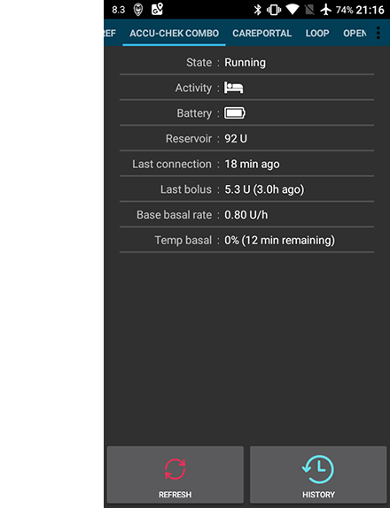

# AndroidAPS Bildschirme

## Die Startseite

Wenn du AndroidAPS öffnest, ist dies der erste Bildschirm. Er enthält die meisten der Informationen, die du tagtäglich benötigst.

### Abschnitt A

* Navigation zwischen den verschiedenen AndroidAPS Modulen, indem du nach links oder rechts blätterst (wischst)

### Abschnitt B

* Ändern des Loop Status (open loop, closed loop, Loop unterbrechen etc.)
* Anzeige des aktuellen Profils und Möglichkeit zum [Profil-Wechsel](../Usage/Profiles.md)
* Anzeige des aktuellen Zielwertes/-bereichs und Möglichkeit zum Setzen eines [Temporary Target](../Usage/temptarget.md).

Um eines davon zu verändern, drücke länger auf das entsprechende Feld. Drücke z.B. lange auf das dunkelblaue Feld im oberen rechten Bereich ("100" im Screenshot oben), um ein temporäres Ziel zu setzen.

### Abschnitt C

* letzter Glukosewert von Deinem CGM
* Zeitraum seit letztem CGM-Wert
* durchschnittliche Änderung der letzten 15 und 40 Minuten
* aktuelle Basalrate - inkl. eventuell aktiver, vom System gestarteten temporären Basalraten
* Aktives Insulin (IOB)
* Aktive Kohlenhydrate (COB)

Die optionale [Status Lights](../Configuration/Preferences#overview) (CAN | INS | RES | SEN | BAT) geben eine optische Warnung bei niedrigem Reservoirstand und Akkustand sowie einem überfälligen Kanülenwechsel.

Das Insulin on Board wäre Null, wenn nur deine Standardbasalrate liefe und kein Insulin aus einem früheren Bolus mehr wirken würde. Die Zahlen in Klammern zeigen, wie viel Insulin aus früheren Boli noch wirkt bzw. wie viel Insulin noch aus von AndroidAPS programmierten TBR vorhanden ist oder fehlt. Die zweite Komponente kann negativ werden, wenn kürzlich Basalraten reduziert wurden.

### Abschnitt D

Klicke auf den Pfeil auf der rechten Seite des Bildschirms im Abschnitt D, um auszuwählen, welche Informationen auf den folgenden Diagrammen angezeigt werden sollen.

### Abschnitt E

Dies ist die Grafik, die den Glukosewert (BG) anzeigt, wie er von deinem Messsystem (CGM) ausgelesen wird. Sie zeigt auch Nightscout-Benachrichtigungen wie Kalibrierungen mit einem Blutzuckermessgerät (Finger) und Kohlenhydrateingaben an.

Wenn du den angezeigten Zeitraum verändern möchtest, drücke lange auf die Grafik. Du kannst zwischen 6, 8, 12, 18 oder 24 Stunden wählen.

Die verlängerten Linien zeigen die vorhergesagten BZ Berechnungen und Trends - wenn du das entsprechend ausgewählt hast.

* **Orange** Linie: [COB](../Usage/COB-calculation.rst) (Farbe wird im Allgemeinen verwendet, um COB und Kohlenhydrate darzustellen)
   
   Die Prognoselinie zeigt, wohin sich der BZ (nicht die COB selbst!) auf der Grundlage der aktuellen Pumpeneinstellungen und unter der Annahme, dass die Abweichungen aufgrund der Kohlenhydrataufnahme konstant bleiben, entwickeln wird. Diese Linie erscheint nur, wenn es bekannte COB gibt.

* **Dunkelblau**: IOB (insulin on board - aktives Insulin) [Die Farbe Dunkelblau wird generell genutzt, um IOB und Insulin darzustellen.]
   
   Die Prognoselinie zeigt, was passieren würde, wenn nur der Einfluss des Insulins berücksichtigt wird. Zum Beispiel wenn Du Insulin gespritzt und dann keine Kohlenhydrate zu Dir genommen hast.

* **Hellblaue** Linie: zero-temp (BZ-Vorhersage bei Annahme, dass eine temporäre Basalrate mit 0% gesetzt wäre)
   
   Die Prognoselinie zeigt, wie sich die IOB-Kurve ändern würde, wenn die Pumpe die Insulinabgabe komplett stoppen würde (0% TBR).

* **Dunkelgelbe** Zeile: [UAM](../Configuration/Sensitivity-detection-and-COB#sensitivity-oref1) (nicht ankündigte Mahlzeiten)
   
   Unannounced meals (nicht angekündigte Mahlzeiten) bedeutet, dass ein signifikanter Anstieg des Glukosespiegels durch Mahlzeiten, Adrenalin oder andere Einflüsse festgestellt wird. Die Prognoselinie ähnelt der ORANGE COB-Linie, geht aber davon aus, dass die Abweichungen mit konstanter Rate abnehmen werden (durch Verlängerung der aktuellen Reduktionsrate).

Deine tatsächliche BZ-Kurve wird normalerweise in der Mitte dieser Prognoselinien oder in der Nähe der Linie, die Annahmen macht, die Deiner Situation am nächsten kommen, liegen.

Die **durchgezogene** Linie zeigt das von der Pumpe abgegebene Basalinsulin an. Die **gepunktete blaue** Linie ist die Basalrate ohne temporäre Basalanpassungen (ohne TBR) und die durchgezogene blaue Linie ist die tatsächliche Basalabgabe über den angezeigten Zeitraum (mit TBR).

Die **dünne gelbe** Linie zeigt die Insulinaktivität. Sie basiert auf dem erwarteten Rückgang des BZ gemäß aktivem Insulin. Weitere Faktoren (wie z.B. Kohlenhydrate) werden NICHT berücksichtigt.

### Abschnitt F

Dieser Abschnitt kann mit den Optionen in Abschnitt D konfiguriert werden.

* **Insulin On Board** (blaue Balken): Zeigt das aktive Insulin in Deinem Körper an. Wenn das aus temporären Basalraten, SMB und vorherigen Bolusgaben stammende Insulin komplett abgebaut ist, ist dieser Wert Null. Der errechnete Insulinabbau hängt davon ab, welchen DIA Du eingestellt hast und welches Insulinprofil Du verwendest. 
* **Carbs On Board** (Orange Balken): Zeigt die noch im Körper vorhandenen Kohlenhydrate. Der Abbau hängt davon ab, was der Algorithmus anhand der BZ-Abweichungen erkennt. Falls der Kohlenhydratabbau höher ausfällt als erwartet, wird Insulin abgegeben und dies erhöht Dein IOB (je nach Deinen Sicherheitseinstellungen mehr oder weniger). 
* **Abweichungen**: 
   * **GRAUE** Balken zeigen eine Abweichung aufgrund von Kohlenhydraten. 
   * **GRÜNE** Balken zeigen, dass der BZ höher ist als der Algorithmus es erwartet. 
   * **ROTE** Balken zeigen, dass der BZ niedriger ist als der Algorithmus erwartet.
* **Sensitivität** (weiße Linie): Von [Autosens](../Usage/Open-APS-features#autosens) ermittelte Sensitivität. Die Sensitivität ist die Berechnung der Insulinempfindlichkeit, die auf Grund von Bewegung, Hormonen etc. schwankt. Die Sensitivität ist die Berechnung der Insulinempfindlichkeit, die auf Grund von Bewegung, Hormonen etc. schwankt.
* **Aktivität** (gelbe Linie): Sie zeigt die Insulinaktivität. Berechnet wird sie auf Basis Deiner Einstellungen zum Insulinprofil, sie ist keine Ableitung des IOB. Der Wert ist umso höher, je näher Du Dich am Zeitpunkt des Insulin-Wirkmaximums befindest. Das bedeutet, er wird negativ, wenn das IOB abnimmt. 

### Abschnitt G

Ermöglicht es dir, einen Bolus zu verabreichen (normalerweise würdest du dazu die Schaltfläche “Calculator” verwenden) und eine CGM-Kalibrierung mit einer Blutzuckermessung (Finger) hinzuzufügen. Zudem wird hier der Quick Wizzard Button angezeigt, wenn Du ihn im [Konfigurationsgenerator](../Configuration/Config-Builder#quickwizard-einstellungen) eingestellt hast.

## Der Bolus-Rechner

Ein Mahlzeiten-Bolus wird normalerweise über den Bolus-Rechner abgegeben.

### Section H

Hier gibst Du die Informationen ein, die für die Berechnung des Bolus notwendig sind. Das Feld BG (Blutzucker) ist in der Regel mit dem letzten CGM-Wert vorbefüllt. Falls Du keine aktuellen CGM-Werte hast, ist das Feld leer. Unter CARBS (Kohlenhydrate) trägst Du Deine Schätzung der Kohlenhydrate - oder deren Äquivalent - ein. Im CORR Feld können Änderungen eingetragen werden, wenn Du die Enddosis aus welchen Gründen auch immer anpassen willst. Über das Feld CARB TIME kannst du einen SEA ("Spritz-Ess-Abstand") einstellen, d. h. das Insulin wird sofort abgegeben, die Kohlenhydrate werden aber erst später erwartet. Gib einen negativen Wert ein, wenn Du nach dem Essen spritzt, die Kohlenhydrate also schon zu Dir genommen hast.

Beim SUPER BOLUS wird das Basalinsulin der kommenden zwei Stunden zum berechneten Bolus addiert und die Basalrate für die kommenden zwei Stunden auf Null gesetzt, um das extra Insulin wieder heraus zu nehmen. Damit soll kurzfristig mehr Insulin zur Verfügung stehen und dadurch hoffentlich Spitzen vermieden werden.

### Section I

zeigt den errechneten Bolus. Falls IOB (Insulin on board) den berechneten Bolus bereits übersteigt, wird nur die Menge der fehlenden Kohlenhydrate angezeigt.

### Section J

zeigt die verschiedenen Einflussfaktoren der Bolusberechnung. Du kannst einzelne davon abwählen, wenn du sie nicht berücksichtigen willst, dies wird aber die Ausnahme sein.

### Kombinationen von COB und IOB und deren Bedeutung

<ul>
    <li>COB und IOB ausgewählt: Berücksichtigung aller Kohlenhydrate, die noch nicht vom Körper aufgenommen wurden und für die kein Insulin gespritzt wurde SOWIE aller Insulingaben (egal ob als temporäre Basalrate oder SMB).</li>
    <li>Falls Du COB ohne IOB auswählst besteht die Gefahr, dass zu viel Insulin abgegeben wird da in diesem Fall das bereits verabreichte, noch aktive Insulin nicht berücksichtigt wird. </li>
    <li>Falls Du IOB ohne COB auswählst besteht das Risiko, dass zu wenig Insulin abgegeben wird, da der Anteil des IOB, der eigentlich für noch nicht komplett vom Körper aufgenommene Kohlenhydrate vorgesehen ist, von der neuen Insulinmenge abgezogen wird. Das kann auch zur "Fehlend x g" (fehlende Kohlenhydrate führen).
</ul>

Wenn Du einen zusätzlichen Bolus kurz nach einem Mahlzeitenbolus abgeben willst (z.B. zusätzlicher Nachtisch), so kann es hilfreich sein, alle Häkchen rauszunehmen. Dadurch wird die Insulinmenge nur auf Basis der neuen Kohlenhydrate berechnet.

### Fehlerhafte Erkennung der aktiven Kohlenhydrate (COB)

Wenn Du nach Verwendung des Bolus-Assistenten die obige Warnung siehst, hat AAPS erkannt, dass aktiven Kohlenhydrate (COB) eventuell nicht korrekt berechnet werden konnten. Wenn Du kurz nach einer vorangegangenen Mahlzeit erneut einen Bolus abgeben willst, solltest Du Dir der Gefahr einer Überdosierung bewusst sein! Weitere Hinweise findest Du auf der Seite zur [Berechnung der aktiven Kohlenhydrate (COB)](../Usage/COB-calculation#detection-of-wrong-cob-values).

## Insulin Profil

Hier wird das Aktivitätsprofil des von Dir gewählten Insulins angezeigt. Die LILA Linie zeigt an, wie viel Insulin nach der Injektion verbleibt und wie es im Zeitverlauf abnimmt. Die BLAUE Linie veranschaulicht die Aktivität des Insulins.

Normalerweise wirst du eines der Oref Profile verwenden. Wichtig dabei ist, dass der Abbau über einen deutlich längeren Zeitraum erfolgt. Von der klassischen Pumpentherapie bist du es wahrscheinlich gewohnt anzunehmen, dass das Insulin nach ca. 3 1/2 Stunden vollständig abgebaut ist. Allerdings spielt der langsamere Abbau beim Loopen eine wichtige Rolle da die Berechnungen deutlich präziser sind und sich diese geringen Mengen unter den rekursiven Berechnungen des AndroidAPS Algorithmus summieren.

Weitere Informationen zu den verschiedenen Insulintypen, ihren Aktivitätsprofilen und warum dies alles eine Rolle spielt findest du in diesem Artikel: [Understanding the New IOB Curves Based on Exponential Activity Curves](https://openaps.readthedocs.io/en/latest/docs/While%20You%20Wait%20For%20Gear/understanding-insulin-on-board-calculations.html#understanding-the-new-iob-curves-based-on-exponential-activity-curves)

Du solltest auch einen Blick in diesen exzellenten Blog-Artikel werfen: [Why we are regularly wrong in the duration of insulin action (DIA) times we use, and why it matters…](http://www.diabettech.com/insulin/why-we-are-regularly-wrong-in-the-duration-of-insulin-action-dia-times-we-use-and-why-it-matters/)

Noch mehr hier: [Exponential Insulin Curves + Fiasp](http://seemycgm.com/2017/10/21/exponential-insulin-curves-fiasp/)

## Status der Pumpe

Hier sehen wir den Status des Insulin-Pumpe - in diesem Fall eine Accu-Chek Combo. Die angezeigten Informationen sind selbsterklärend. Ein langer Druck auf die Schaltfläche HISTORY ("Verlauf") liest die Daten aus deiner Pumpe einschließlich des basalen Profils. Berücksichtige bitte, dass die Combo nur ein Basalprofil unterstützt.

## Care Portal (Behandlungen)

Im Carportal konnten in der Vergangenheit die Funktionen, die Du bei Nightscout unter dem "+" Symbol findest, verwendet werden. Diese erlauben Dir, zusätzliche Notizen in Deine Aufzeichnungen zu übernehmen.

### Kohlenhydrat Korrektur

Der Behandlungs-Tab kann verwendet werden, um fehlerhafte Kohlenhydrat-Einträge zu korrigieren (z.B. wenn Du die KH-Menge über- oder unterschätzt hast).

1. Prüfe und merke Dir die aktuelle COB- und IOB-Menge, die auf dem Startbildschirm angezeigt wird.
2. Je nach Pumpenmodell werden die Kohlenhydrate entweder zusammen mit dem Insulin in einer Zeile oder als separater Eintrag (z.B. bei der Dana RS) angezeigt.
   
   

3. Lösche den Eintrag mit der fehlerhaften KH-Menge.

4. Stelle sicher, dass die KH erfolgreich gelöscht wurden, indem Du COB auf dem Startbildschirm überprüfst.
5. Mache das gleiche für IOB falls bei Dir im Tab 'Behandlungen' KH und Insulin zusammen in einer Zeile angezeigt werden.
   
   -> Falls die KH nicht wie vorgesehen gelöscht werden und Du dennoch zusätzliche Kohlenhydrate eingibst, wird mit einem zu hohen COB gerechnet und dies kann zu überhöhter Insulinabgabe führen.

6. Gib die korrekte Kohlenhydratmenge über den Kohlenhydrate-Button auf der Startseite ein und achte dabei auf die Auswahl des richtigen Zeitpunkts.

7. Falls bei Dir im Tab 'Behandlungen' KH und Insulin zusammen in einer Zeile angezeigt werden musst Du zusätzlich die Insulinmenge neu eingeben. Achte auch hier auf die Auswahl des richtigen Zeitpunkts und prüfe im Anschluss IOB auf dem Startbildschirm.

## Loop, MA, AMA, SMB

Normalerweise musst Du Dich um diese Punkte nicht kümmern. Sie zeigen die Ergebnisse des OpenAPS Algorithmus, der jedes Mal berechnet wird, wenn das System einen neuen Wert vom CGM erhält. Einstellungen und Vorgaben werden an anderer Stelle des Wikis erläutert.

## Profile

AndroidAPS kann mit verschiedenen Profileinstellungen betrieben werden. In der Regel wird - wie abgebildet - das Nightscout-Profil über den eingebaute Nightscout Client heruntergeladen und hier in Nur-Lesen-Form dargestellt. Wenn Du Änderungen vornehmen willst, mache das auf Deiner Nightscout-Seite und führe dann einen [ Profil-Wechsel](../Usage/Profiles.md) in AndroidAPS durch, um die Änderungen zu aktivieren. Daten wie z. B. das Basalprofil werden dann automatisch zur Pumpe übertragen.

**DIA** (Duration of Insulin Action) steht für die Wirkdauer des Insulins und wurde oben bei den Insulinprofilen erläutert.

**IC:** Insulin zu Kohlenhydrat-Verhältnis ("BE-Faktor"). In diesem Beispielprofil sind unterschiedliche Werte für verschiedene Tageszeiten hinterlegt.

**ISF** Insulin Sensitivitäts-Faktor: Der Korrekturfaktor beschreibt, wie stark eine Einheit Insulin deinen Blutzucker senkt - vorausgesetzt die anderen Einflussfaktoren bleiben unverändert.

**Basal:** Das in der Pumpe programmierte Basalprofil.

**Target:** ist der Zielbereich, den AndroidAPS immer anstreben soll. Du kannst verschiedene Zielbereiche für unterschiedliche Tageszeiten setzen, wenn Du willst. Dies muss kein Zielpunkt sein, Du kannst einen oberen und unteren Zielwert definieren so dass AndroidAPS nur Änderungen vornimmt, wenn der Blutzucker den Zielbereich verlässt. Wenn Du das tust wird das System aber langsamerer reagieren.

## Behandlungen, xDrip, NSClient

Diese sind einfach Aufzeichnungen der Behandlungen (Bolus und Kohlenhydrate), xDrip Nachrichten und Notizen, die über den integrierten Client an Nightscout gesandt wurden. Du musst Dich normalerweise nicht darum kümmern, es sei denn, es liegt ein Problem vor.

## Konfiguration

An dieser Stelle wird dein AndroidAPS System eingerichtet. Das Bild zeigt ein typisches System, das mit einer Accu-Chek Combo Insulinpumpe und einem Dexcom G5 CGM betrieben wird. Der Dexcom Sensor wird über xDrip+ gesteuert. Als Insulin wird NovoRapid mit einem Oref Profil verwendet und die Daten auf einen Nightscout Cloudserver hochgeladen.

Wenn die Box rechts angehakt ist, wird das entsprechende Modul in der oberen Menüliste angezeigt. Über das kleine Zahnradsymbol können weitere Einstellungen für dieses Modul vorgenommen werden - sofern verfügbar.

## Einstellungen und Vorgaben

Oben rechts in der Navigationsleiste findest du drei übereinander angeordnete kleine Punkte. Ein Klick darauf führt Dich zu den Einstellungen, der Historie, dem Einrichtungsassistenten, den Informationen über die App und den Schließen-Button, mit dem Du AAPS verlassen kannst.