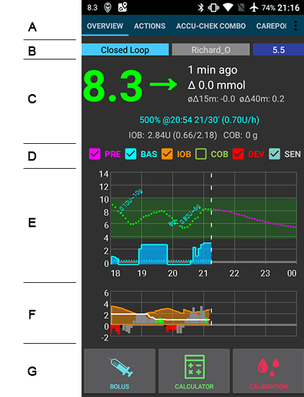

# Screenshots

## Die Startseite

Wenn du AndroidAPS öffnest, ist dies der erste Bildschirm. Er enthält die meisten der Informationen, die du tagtäglich benötigst.

**Abschnitt A:** Ermöglicht dir die Navigation zwischen den verschiedenen AndroidAPS Modulen, indem du nach links oder rechts blätterst (wischst).

**Abschnitt B:** Hier siehst du den Status des Loops (Open Loop, Closed Loop, Unterbrechung des Loops usw.), dein aktuelles Profil und deinen Zielbereich. Um eines davon zu verändern, drücke länger auf das entsprechende Feld. Drücke z.B. lange auf das dunkelblaue Feld im oberen rechten Bereich ("5.5" im Screenshot), um ein temporäres Ziel zu setzen.

**Abschnitt C:** Hier wird die letzte Glukosemessung deines CGMs angezeigt und wie lange diese her ist, außerdem die Veränderung der Werte in den vergangenen 15 und 40 Minuten, deine aktuelle Basalrate - einschließlich der vom System gesetzten temporären Basalrate (TBR), das noch wirkende Insulin (IOB, Insulin on board) und noch wirkende Kohlenhydrate (COB, carbs on board).

Das Insulin on Board wäre Null, wenn nur deine Standardbasalrate liefe und kein Insulin aus einem früheren Bolus mehr wirken würde. Die Zahlen in Klammern zeigen, wie viel Insulin aus früheren Boli noch wirkt bzw. wie viel Insulin noch aus von AndroidAPS programmierten TBR vorhanden ist oder fehlt. Die zweite Komponente kann negativ werden, wenn kürzlich Basalraten reduziert wurden.

**Abschnitt D:** Hier kannst du auswählen, welche Informationen in den folgenden Diagrammen angezeigt werden. Bei manchen Smartphones fehlt diese Zeile, man kann die auszuwählenden Diagrammpunkte aber mit einem kleinen Pfeil an der rechten Seite aufrufen.

**Abschnitt E:** Dies ist die Grafik, die den Glukosewert (BG) anzeigt, wie er von deinem Messsystem (CGM) ausgelesen wird. Sie zeigt auch Nightscout-Benachrichtigungen wie Kalibrierungen mit einem Blutzuckermessgerät (Finger) und Kohlenhydrateingaben an. Wenn du den angezeigten Zeitraum verändern möchtest, drücke lange auf die Grafik. Du kannst zwischen 6, 8, 12, 18 oder 24 Stunden wählen.

Die verlängerten Linien zeigen die vorhergesagten BZ Berechnungen und Trends - wenn du das entsprechend ausgewählt hast.

    * Orange Linie: COB (Farbe wird generell verwendet um COB und Kohlenhydrate anzuzeigen) 
    * Dunkelblaue Linie: IOB (Farbe wird generell verwendet um IOB und Insulin anzuzeigen) 
    * Hellblaue Linie: zero-temp 
    * Dunkelgelbe Linie: UAM
    

Diese Linien zeigen dir die verschiedenen Vorhersagen basierend auf der Kohlenhydrat Absorption (COB) und dem vorhandenen Insulin (IOB). Sie zeigen an, wie lange es dauern wird, den Glukoselevel in den Zielbereich zu bringen, wenn die Abweichungen unmittelbar aufhören und die temporäre Basalrate auf 0 gesetzt wird und die Erkennung unangekündigter Mahlzeiten oder Effekte wenn Kohlenhydrate erkannt werden aber nicht vom Benutzer erfasst wurden (UAM).

Die blaue Linie zeigt die Basalrate an, die von der Pumpe abgegeben wird. Die gepunktete blaue Linie zeigt an, wie die Basalrate aussehen würde, wenn keine temporären Anpassungen (TBRs) vorgenommen würden und die durchgehende blaue Linie ist die tatsächliche Insulinabgabe.

**Abschnitt F:** Die Anzeige ist ebenfalls über die Optionen in Abschnitt D konfigurierbar. In diesem Beispiel zeigen wir das IOB (Insulin on board) - wenn es keine TBR und keinen noch wirkenden Bolus gäbe, wäre dies Null. Ausserdem zeigen wir hier die Insulinempfindlichkeit und die Abweichung der Werte. GRAUE Balken zeigen die Abweichung aufgrund von Kohlenhydraten an. GRÜN zeigt an, dass der Glukosewert höher ist, als der Algorithmus erwartet und ROT, dass er niedriger ist, als vom Algorithmus erwartet.

**Abschnitt G:** Ermöglicht es dir, einen Bolus zu verabreichen (normalerweise würdest du dazu die Schaltfläche “Rechner” verwenden) und eine CGM-Kalibrierung mit einer Blutzuckermessung (Finger) hinzuzufügen.

## Der Bolus-Rechner

Dies ist die Stelle, an der du normalerweise einen Mahlzeitenbolus abgibst.

**Abschnitt A:** Hier gibst du die Informationen ein, die für die Berechnung des Bolus notwendig sind. Das Feld Zuckerwert ist normalerweise bereits mit dem letzten ausgelesenen Wert von deinem CGM befüllt. Wenn Du kein funktionierendes CGM hast, ist das Feld leer. In das Feld CARBS trägst du ein, wieviele Gramm Kohlehydrate - oder deren Äquivalent - du vermutlich zu dir nehmen wirst, die in die Berechnung des Bolus einfliessen sollen. Im CORR Feld können Änderungen eingetragen werden, wenn du die Enddosis aus irgendeinem Grund anpassen willst. Über das Feld CARB Time kannst du einen SEA ("Spritz-Ess-Abstand") einstellen, d. h. das Insulin wird sofort abgegeben, die Kohlenhydrate werden aber erst später erwartet. Du kannst einen negativen Wert in dieses Feld eingeben, wenn du den Bolus nach dem Essen abgibst.

Beim SUPER BOLUS wird das Basalinsulin der kommenden zwei Stunden zum sofort abgegebenen Bolus addiert und die Basalrate für die kommenden zwei Stunden auf Null gesetzt, um das extra Insulin zu kompensieren. Damit soll kurzfristig mehr Insulin abgegeben werden und dadurch im günstigsten Fall hohe Werte vermieden werden.

**Abschnitt B** zeigt den berechneten Bolus. Falls IOB (Insulin on bord) den berechneten Bolus bereits übersteigt, wird nur die Menge der fehlenden Kohlenhydrate angezeigt.

**Abschnitt C** zeigt die verschiedenen Variablen und deren Einfluss auf das Ergebnis der Bolusberechnung. Du kannst diejenigen abwählen, von denen du nicht möchtest, dass sie in die Berechnung einfliessen. Das wird aber die Ausnahme sein.

<b>Combinations of COB and IOB and what they mean</b>

<ul>
    <li>If you tick COB and IOB unabsorbed carbs that are not already covered with insulin + all insulin that has been delivered as TBR or SMB will be taken into account</li>
    <li>If you tick COB without IOB you run the risk of too much insulin as AAPS is not accounting for what’s already given. </li>
    <li>If you tick IOB without COB, AAPS takes account of already delivered insulin but won’t cover that off against any carbs still to be absorbed. This leads to a 'missing carbs' notice.
</ul>

If you bolus for additional food shortly after a meal bolus (i.e. additional desert) it can be helpful to untick all boxes. This way just the new carbs are being added as the main meal won't necessarily be absorbed so IOB won't match COB accurately shortly after a meal bolus.

## Insulin Profil

This shows the activity profile of the insulin you have chosen. The PURPLE line shows how much insulin remains after it has been injected as it decays with time and the BLUE line shows how active it is.

You will normally be using one of the Oref profiles - and the important thing to note is that the decay has a long tail. If you have been used to manual pumping you have probably been used to assuming that insulin decays over about 3.5 hours. However, when you are looping the long tail matters as the calculations are far more precise and these small amounts add up when they are subjected to the recursive calculations in the AndroidAPS algorithm.

For a more detailed discussion of the different types of insulin, their activity profiles and why all this matters you can read an article here on [Understanding the New IOB Curves Based on Exponential Activity Curves](https://openaps.readthedocs.io/en/latest/docs/While%20You%20Wait%20For%20Gear/understanding-insulin-on-board-calculations.html#understanding-the-new-iob-curves-based-on-exponential-activity-curves)

And you can read an excellent blog article about it here: [Why we are regularly wrong in the duration of insulin action (DIA) times we use, and why it matters…](http://www.diabettech.com/insulin/why-we-are-regularly-wrong-in-the-duration-of-insulin-action-dia-times-we-use-and-why-it-matters/)

And more at: [Exponential Insulin Curves + Fiasp](http://seemycgm.com/2017/10/21/exponential-insulin-curves-fiasp/)

## Status der Pumpe

Here we see the status of the insulin pump - in this case an Accu-Chek Combo. The information displayed is self explanatory. A long press on the HISTORY button will read the data from your pump history, including your basal profile. But remember only one basal profile is supported on the Combo pump.

## Care Portal (Behandlungen)

This replicates the functions you will find on your Nightscout screen under the "+" symbol which allows you to add notes to your records. Functions such as recording when you change a pump site, or insulin cartridge should be self explanatory. BUT this section does not issue any commands to your pump. So if you add a bolus using this screen it simply makes a note of this on your Nightscout record, the pump won't be instructed to deliver a bolus.

## Loop, MA, AMA, SMB

You don't normally need to worry about these, they show the results of the OpenAPS algorithm which runs each time the system gets a fresh reading from the CGM. These are discussed elsewhere.

## Profile

AndroidAPS can run using a number of different profile configuratons. Typically - as shown here - the Nightscout profile has been downloaded via the built in Nighscout client and is displayed here in read-only form. If you wanted to make any changes you would do this from your Nightscout user interface and then do a "Switch Profile" on your AndroidAPS rig to refresh the download. Data such as the basal profile would then be automatically copied over to your pump.

**DIA:** stands for Duration of Insulin Action and it is discussed above in the section on insulin profiles.

**IC:** is Insulin to Carb ratio. This profile has a number of different values set for different times of day.

**ISF:** is Insulin Sensitivity Factor - the amount by which one unit of insulin will reduce your blood glucose assuming that nothing else changes.

**Basal:** is the basal profile programmed into your pump.

**Target:** is the blood glucose level that you want the rig to be aiming for all the time. You can set different levels for differenttimes of day if you wish, and you can even set an upper and lower range so that the rig will only start to make changes when the predicted blood glucose value falls outside, but if you do that then the rig will respond more slowly and you are unlikely to achieve such stable blood sugars.

## Behandlungen, xDrip, NSClient

These are simply logs of treatments (boluses and carbs), xDrip messages and messages sent to Nightscout via the built-in Nightscout client. You don't normally need to worry about any of these unless there is a problem.

## Konfiguration

This is where you will set up the configuraton of your AndroidAPS rig. This screenshot shows a pretty typical rig using a Combo pump, a Dexcom G5 CGM sensor being managed via xDrip+ and running with NovoRapid insulin on an Oref profile and connected to a Nightscout cloud based server.

The tick box on the right determines if that particular module will be displayed in the top menu bar (see section A at Homescreen) and the small gear wheel symbol allows access to the setting for that module, if there are any.

## Einstellungen und Vorgaben

At the top right of the navigation bar you will find three small vertical dots. Pressing on these takes you to the app's preferences and settings, and enables you to export your settings if ever you need to transfer to a different rig. These are discussed elsewhere in the wiki.