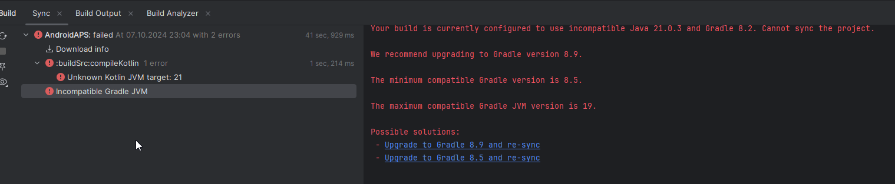

(troubleshooting_androidstudio-troubleshooting-android-studio)=
# Fehlerbehebung für Android Studio

(troubleshooting_androidstudio-lost-keystore)=
## Verlorener Keystore
If you use the same keystore when updating **AAPS** you do not have to uninstall the previous version on your smartphone. That's why it is recommended to store the keystore in a safe place.

If you try to install the apk, signed with a different keystore than before, you will get an error message explaining that the installation failed!

In the event that you cannot trace your old keystore or password, proceed as follows:

1. [Exportiere die Einstellungen](../Maintenance/ExportImportSettings.md) von Deinem Smartphone.
2. Kopiere die Datei mit den Einstellungen von deinem Smartphone auf ein externes Gerät (d.h. dein Computer, externe Festplatte) oder lade sie in deinen Cloudspeicher hoch.
4. Generate a new version of the signed apk as described on the [Update guide](../Maintenance/UpdateToNewVersion) and transfer it to your phone.
5. Uninstall previous **AAPS** version on your phone.
6. Install new **AAPS** version on your phone.
7. [Importiere die Einstellungen](#ExportImportSettings-restoring-from-your-backups-on-a-new-phone-or-fresh-installation-of-aaps), um sowohl Deinen Fortschritt bei den Zielen (Objectives), als auch Deine Konfiguration wieder herzustellen.

   If you can't find these on your phone, copy them from the external storage to your phone.

8. Prüfe deine Einstellungen und deaktiviere den Energiesparmodus.
9. Loope weiter!

## Gradle Sync schlägt fehl
Gradle Sync can fail for various reasons. When you receive a message saying that 'gradle sync failed', open the "Build" tab (1) at the bottom of Android Studio and check what error message (2) is displayed.

  

The common reasons for gradle sync failures are:
* [Uncommitted changes](#uncommitted-changes)
* [No cached version of ... available](#could-not-resolveno-cached-version)
* [Incompatible Gradle JVM](#incompatible-gradle-jvm)
* [Incompatible version of the Android Gradle plugin](#incompatible-version-of-android-gradle-plugin)

*Wichtig*: Nachdem Du die Anleitung zum Beheben Deines Problems befolgt hast, ist es notwendig den [Gradle Sync](#gradle-resync) erneut anzustoßen.


### Uncommitted changes

If you receive a failure message this this one:


#### Schritt 1 - Überprüfe Deine Git Installation
  * Öffne den Terminal Reiter (1) im unteren Bereich von Android Studio und kopiere den folgenden Text, oder tippe ihn ins Terminal ein.
    ```
    git --version
    ```

    

    Note: There is a space and two hyphens between Git and version!

  * You must receive a message saying what Git version is installed, as you can see in the screenshot above. In diesem Fall, mache mit [Schritt 2](#troubleshooting-android-studio-check-for-uncommitted-changes) weiter.

  * Falls du einen Hinweis wie diesen bekommst
    ```
    Git: command not found
    ```
    ist deine git Installation fehlerhaft.

  * [Prüfe die Git-Installation](#BuildingAaps-steps-for-installing-git)

  * if on Windows and the Git was just installed, you should restart your computer to make Git globally available after the installation

  * If Git is installed, you have restarted (if on windows), and Git still couldn't found:

  * Suche auf deinem Computer nach einer Datei "git.exe".

    Notiere dir den Pfad, wo diese Datei auf dem Computer liegt.

  * Gehe zu den Umgebungsvariablen auf Windows, wähle die Variable "PATH" und klicke bearbeiten. Add the directory where you have found your Git installation.

  * Speichern und schließen.

  * Starte Android Studio neu.


#### Schritt 2: Prüfe, ob es uncommitted changes gibt.

  * In Android Studio, open the 'Commit' tab (1) on the left-hand side. 
  * Dort siehst du entweder "Default changeset" (2) oder "Unversioned files" (3):

    * For "Default changeset", you probably updated 'Gradle' or changed some of the file contents by mistake.

    * Mache einen Rechtsklick auf "Default Changeset" und wähle "Rollback"

      

    * Diese Dateien werden erneut vom Git Server gezogen. Wenn es keine weiteren Änderungen im Commit-Tab gibt, mache mit [Schritt 3](#gradle-resync) weiter.

  * Falls du "Unversioned Files" sehen kannst, hast du wahrscheinlich Dateien im Sourcecode Projekt abgelegt, die dort nicht hingehören (z.B: deine keystore Datei).

    * Use your regular file explorer on your computer to move or cut and paste that file to a safe place.

    * Go back to Android Studio and click the Refresh button (4) within the Commit tab to make sure the file is not stored in the **AAPS** directory anymore.

      If there are no other changes in the Commit tab, go to [Step 3](#gradle-resync).


#### Schritt 3: Resync Gradle (erneut)

Folge der Anleitung unter [Gradle Resync](#gradle-resync).

(troubleshooting_androidstudio-android-gradle-plugin-requires-java-11-to-run)=

(incompatible-gradle-jvm)=
### Incompatible Gradle JVM

 If you experience the above error message, you need to download a correct JVM version before you can try rebuild again:
1.  Check in the [requirement table](#Building-APK-recommended-specification-of-computer-for-building-apk-file) which JVM version you need for the **AAPS** version you are building, and make a note of it.

2. Open the Gradle view by clicking on the elephant (1) on the right side of Android Studio and open the settings (2) and select **Gradle Settings** (3):


3.  Öffnen die Optionen des **Gradle JDK** und wähle dann **Download JDK...**


4. At tab (1), select the JDK version required for your **AAPS** version (the one you made a note of at the first step). Then select the **JetBrains Runtime** from the **Vendor** at tab (2). Do not change the **Location** at tab (3).


5.  Schließe die **Settings** (dt. Einstellungen) mit **OK**.
6. Jetzt musst Du den Gradle Sync neu starten. Folge der Anleitung unter [Gradle Resync](#gradle-resync).

(incompatible-version-of-android-gradle-plugin)=
### Incompatible version of Android Gradle plugin

  Wenn Du die folgende Fehlermeldung erhältst,

  

  nutzt Du eine veraltete Version des Android Studios. Gehe im Menü zu Help > Check for updates und installiere die neueste Version des Android Studios und deren Plugins.

(troubleshooting_androidstudio-could-not-resolve-no-cached-version)=
### Could not resolve/No cached version

  Wahrscheinlich siehst Du diese Fehlermeldung:


  * Öffne den Gradle Tab auf der rechten Seite (1).

    Stelle sicher, dass der Button der bei (2) zu sehen ist, *NICHT* selektiert ist.

    

  * Starte jetzt einen [Gradle Resync](#gradle-resync)

(troubleshooting_androidstudio-unable-to-start-daemon-process)=
### Unable to start daemon process

  Wenn Du eine Fehlermeldung wie die unten siehst, verwendest Du wahrscheinlich ein Windows 10 32-Bit-Betriebssystem. This is not supported by Android Studio 3.5.1 and above and unfortunately there is nothing that the **AAPS** developers can do about this!

  There  is information on the internet about how to determine wether you have a 32-bit or 64-bit OS - i.e. [this one](https://support.microsoft.com/en-us/windows/32-bit-and-64-bit-windows-frequently-asked-questions-c6ca9541-8dce-4d48-0415-94a3faa2e13d).

  

(gradle-resync)=
### Gradle Resync

  Falls Du immer noch den Hinweis sehen kannst, dass der Gradle sync fehlgeschlagen ist, wähle den Link "Try again".  


  If you don't see the message anymore, you can still trigger this manually:

  * Öffne den Gradle Tab (1) am rechten Rand von Android Studio.

    

  * Rechtsklick auf AAPS (2)

  * Klicke auf "Reload Gradle Project" (3)

## Generate Signed APK generated successfully with 0 build variants

When you generate the signed apk, you might get the notification that generation was successfully but are told that this is with '0 build variants' were generated:


Diese Warnung ist falsch. Check the directory for your selected "Destination folder" for generation (step [Generate Signed APK](#Building-APK-generate-signed-apk)) and you will find the generated apk there!


## App was created with compiler/kotlin warnings

Falls Dein Build erfolgreich durchgelaufen ist, Du aber Warnungen vom Compiler oder Kotlin bekommst (diese zeigen sich durch ein gelbes oder blaues Ausrufezeichen), kannst Du diese Warnungen einfach ignorieren.

 

Your apk was built successfully and can be transferred to your phone!


## Key was created with errors

When creating a new keystore for building the signed apk, on Windows the following error message might appear


Dies scheint ein Fehler in Android Studio 3.5.1 und seiner Java-Umgebung in Windows zu sein. Der Schlüssel wird korrekt erstellt, aber eine Empfehlung wird fälschlicherweise als Fehler angezeigt. Dies kann momentan ignoriert werden.


## AAPS empfängt keine CGM-Daten

* If you are using patched Dexcom G6 app: this app is outdated. Nutze an deren Stelle die [BYODA](#DexcomG6-if-using-g6-with-build-your-own-dexcom-app)-App instead.

* If you are using xDrip+: identify receiver as described on [xDrip+ settings page](#xdrip-identify-receiver).


## Apk not installed


* Stelle sicher, dass Du die “app-full-release.apk” auf Dein Smartphone übertragen hast.
* Falls "App not installed" auf dem Smartphone angezeigt wird, gehe wie folgt vor:

1. [Exportiere die Einstellungen](../Maintenance/ExportImportSettings.md), der AAPS-Version, die bereits auf Deinem Smartphone installiert ist.
2. Uninstall **AAPS** on your phone.
3. Aktiviere den Flugmodus & schalte Bluetooth aus.
4. Installiere die neue Version ("app-full-release.apk").
5. [Importiere die Einstellungen](../Maintenance/ExportImportSettings.md)
6. Aktiviere Bluetooth wieder und schalte den Flugmodus aus.

## Apk installed but old version

Wenn Du die App erfolgreich erstellt, sie auf Dein Smartphone übertragen und dort erfolgreich installiert hast, jedoch weiter die alte Versionsnummer angezeigt wird, hast Du wahrscheinlich versäumt, Deine [lokale Kopie zu aktualisieren](#Update-to-new-version-update-your-local-copy).

## Keiner der oben genannten Löungsvorschläge funktioniert

If non of the above tips helped you might consider building the apk from scratch:

1. [Exportiere die Einstellungen](../Maintenance/ExportImportSettings.md), der AAPS-Version, die bereits auf Deinem Smartphone installiert ist.

2. Halte Dein key Passwort und Dein key store Passwort bereit. Falls du Passwörter vergessen hast, kannst du versuchen sie in Projekt Dateien wiederzufinden [wie hier beschrieben](https://youtu.be/nS3wxnLgZOo).

    Oder verwende einfach einen neuen keystore.

3. Build the apk from scratch as described [here](#Building-APK-download-AAPS-code).

4. When you have built the apk successfully delete the exiting apk on your phone, transfer the new apk to your phone and install.
5. [Importiere die Einstellungen](../Maintenance/ExportImportSettings.md) noch einmal, damit die Ziele und Einstellungen wieder hergestellt werden.
6. Überprüfe deine Einstellungen und deaktiviere den Energiesparmodus erneut.

## Worst case scenario

If the above does not solve your build issue you may wish to try to uninstall Android Studio completely and rebuild from scractch.  Some users find that this can resolve their build problem.  When deleting Android Studio, do not delete Android user settings and **Make sure to uninstall all files associated with Android Studio.** If you do not completely remove Android Studio with all hidden files, uninstalling may cause new problems instead of solving your existing one(s). Anleitungen zur kompletten Deinstallation findest Du online z.B.

[https://stackoverflow.com/questions/39953495/how-to-completely-uninstall-android-studio-from-windowsv10](https://stackoverflow.com/questions/39953495/how-to-completely-uninstall-android-studio-from-windowsv10).

Installiere Android Studio von Grund auf neu (Neuinstallation), wie es [hier](#Building-APK-install-android-studio) beschrieben ist.
