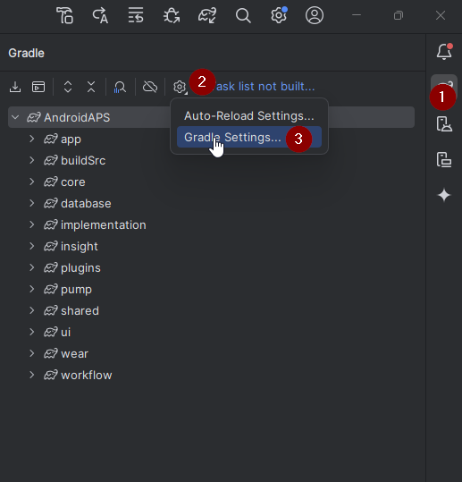

(troubleshooting_androidstudio-troubleshooting-android-studio)=
# Fehlerbehebung für Android Studio

(troubleshooting_androidstudio-lost-keystore)=
## Verlorener Keystore
Wenn Du beim Update von AAPS denselben "Keystore" verwendest, musst Du die Vorgängerversion von AAPS auf Deinem Smartphone nicht deinstallieren. Daher wird empfohlen, den Keystore an einem sicheren Platz zu speichern.

Wenn Du versuchst das apk zu installieren und es mit einem anderen keystore signiert wurde als zuvor, bekommst Du einen Fehler, dass die Installation fehlgeschlagen ist!

Falls Du deinen alten keystore oder das dazugehörige Passwort nicht mehr wiederfindest, kannst Du wie folgt vorgehen:

1. [Exportiere die Einstellungen](../Maintenance/ExportImportSettings.md) von Deinem Smartphone.
2. Kopiere die Datei mit den Einstellungen von deinem Smartphone auf ein externes Gerät (d.h. dein Computer, externe Festplatte) oder lade sie in deinen Cloudspeicher hoch.
4. Erstelle, so wie es in der [Update-Anleitung](../Maintenance/UpdateToNewVersion) beschrieben ist, aus der neuen Version eine signierte APK und übertrage sie auf Dein Smartphone.
5. Deinstallieren die Vorgängerversion von AAPS auf Deinem Smartphone.
6. Installiere die neue AAPS-Version auf Deinem Smartphone.
7. [Importiere die Einstellungen](#ExportImportSettings-restoring-from-your-backups-on-a-new-phone-or-fresh-installation-of-aaps), um sowohl Deinen Fortschritt bei den Zielen (Objectives), als auch Deine Konfiguration wieder herzustellen.

   Falls du die Einstellungen nicht findest, kopiere sie von deinem externen Speicher auf dein Smartphone.

8. Prüfe deine Einstellungen und deaktiviere den Energiesparmodus.
9. Loope weiter!

## Gradle Sync schlägt fehl
Der Gradle Sync kann aus verschiedenen Gründen fehlschlagen. Falls Du einen Hinweis bekommst, dass der Gradle Sync fehlgeschlagen ist ("Gradle Sync failed"), öffne den "Build" Reiter (1) im unteren Bereich von Android Studio und überprüfe welche Fehlermeldung (2) du angezeigt bekommst.

  

Das sind die üblichen Gradle Sync Fehler:
* [Uncommitted changes](#uncommitted-changes)
* [No cached version of ... available](#could-not-resolveno-cached-version)
* [Incompatible Gradle JVM](#incompatible-gradle-jvm)
* [Incompatible version of the Android Gradle plugin](#incompatible-version-of-android-gradle-plugin)

*Important*: After you have followed the instructions for your specific problem, you need to trigger the [gradle sync](#gradle-resync) again.

(troubleshooting_androidstudio-uncommitted-changes)=
### Uncommitted changes

Falls Du eine Fehlermeldung bekommst, die so aussieht


#### Schritt 1 - Überprüfe deine Git Installation
  * Öffne den Terminal Reiter (1) im unteren Bereich von Android Studio und kopiere den folgenden Text, oder tippe ihn ins Terminal ein.
    ```
    git --version
    ```

    

    Hinweis: Es ist ein Leerzeichen und zwei Bindestriche zwischen git und version!

  * Im Terminal sollte ein Hinweis erscheinen, der übermittelt welche git Version installiert ist (siehe Screenshot oberhalb). In diesem Fall, mache mit [Schritt 2](#troubleshooting-android-studio-check-for-uncommitted-changes) weiter.

  * Falls du einen Hinweis wie diesen bekommst
    ```
    Git: command not found
    ```
    ist deine git Installation fehlerhaft.

  * [Prüfe die git Installation](#BuildingAaps-steps-for-installing-git)

  * Falls du mit Windows arbeitest und Git erst kurz zuvor installiert wurde, solltest du deinen Computer neu starten, um Git nach der Installation global verfügbar zu machen

  * Falls Git installiert ist, du deinen Computer neu gestartet hast (wenn du Windows benutzt), und Git immer noch nicht gefunden werden kann:

  * Suche auf deinem Computer nach einer Datei "git.exe".

    Notiere dir den Pfad, wo diese Datei auf dem Computer liegt.

  * Gehe zu den Umgebungsvariablen auf Windows, wähle die Variable "PATH" und klicke bearbeiten. Füge den zuvor notierten Pfad deiner Git Installation hinzu.

  * Speichern und schließen.

  * Starte Android Studio neu.

(troubleshooting-android-studio-check-for-uncommitted-changes)=
#### Schritt 2: Prüfe, ob es uncommitted changes gibt.

  * In Android Studio: öffne den "Commit" Tab (1) auf der linken Seite. 
  * Dort siehst du entweder "Default changeset" (2) oder "Unversioned files" (3):

    * Bei "Default changeset", hast du wahrscheinlich Gradle upgedatet oder aus Versehen etwas an einer Datei geändert.

    * Mache einen Rechtsklick auf "Default Changeset" und wähle "Rollback"

      

    * Diese Dateien werden erneut vom Git Server gezogen. Wenn es keine weiteren Änderungen im Commit-Tab gibt, mache mit [Schritt 3](#gradle-resync) weiter.

  * Falls du "Unversioned Files" sehen kannst, hast du wahrscheinlich Dateien im Sourcecode Projekt abgelegt, die dort nicht hingehören (z.B: deine keystore Datei).

    * Benutze deinen Datei Explorer und verschiebe die Datei an einen Ort, außerhalb des Source Code Projekts.

    * Gehe zurück zu Android Studio und klicke den Refresh Button (4) im Commit Tab, um sicherzustellen, dass die Datei nicht mehr im AAPS-Ordner liegt.

      Wenn es keine weiteren Änderungen im Commit-Tab gibt, mache mit [Schritt 3](#gradle-resync) weiter.


(troubleshooting_androidstudio-step-3-gradle-resync)=

#### Schritt 3: Resync Gradle (erneut)

Folge der Anleitung unter [Gradle Resync](#gradle-resync).

(troubleshooting_androidstudio-android-gradle-plugin-requires-java-11-to-run)=

(incompatible-gradle-jvm)=
### Incompatible Gradle JVM

 Wenn Du die folgende Fehlermeldung erhältst, musst Du, bevor Du es noch einmal probieren kannst, eine korrekte JVM-Version herunterladen:
* Check in the [requirement table](#Building-APK-recommended-specification-of-computer-for-building-apk-file) which JVM version you need for the **AAPS** version you are building, and make a note of it.

* Öffne die Gradle-Ansicht, in dem Du auf der rechten Seite im Android Studio auf den Elefanten (1) klickst, und öffne dann die Einstellungen (2) und wähle dort die **Gradle Settings** (3) aus:



* Öffnen die Optionen des **Gradle JDK** und wähle dann **Download JDK...**


* At **Version** (1), select the one required for your **AAPS** version (the one you made a note of at the first step). Wähle jetzt **JetBrains Runtime** in den **Vendor**-Optionen(2) aus. Ändere nichts unter **Location** (3).


* Schließe die **Settings** (dt. Einstellungen) mit **OK**.
* Jetzt musst Du den Gradle Sync neu starten. Folge der Anleitung unter [Gradle Resync](#gradle-resync).

(incompatible-version-of-android-gradle-plugin)=
### Inkompatibilität der Android Gradle Plugin Version

  Wenn Du die folgende Fehlermeldung erhältst,

  

  nutzt Du eine veraltete Version des Android Studios. Gehe im Menü zu Help > Check for updates und installiere die neueste Version des Android Studios und deren Plugins.

(troubleshooting_androidstudio-could-not-resolve-no-cached-version)=
### Could not resolve/No cached version

  Wahrscheinlich siehst Du diese Fehlermeldung:


  * Öffne den Gradle Tab auf der rechten Seite (1).

    Stelle sicher, dass der Button der bei (2) zu sehen ist, *NICHT* selektiert ist.

    

  * Starte jetzt einen [Gradle Resync](#gradle-resync)

(troubleshooting_androidstudio-unable-to-start-daemon-process)=
### Unable to start daemon process

  Wenn Du eine Fehlermeldung wie die unten siehst, verwendest Du wahrscheinlich ein Windows 10 32-Bit-Betriebssystem. Dies wird von Android Studio Version 3.5.1 und höher nicht unterstützt und daran können die AAPS Entwickler leider nichts ändern!

  Es gibt im Internet eine Reihe von Anleitungen (wie z.B. [diese](https://support.microsoft.com/en-us/windows/32-bit-and-64-bit-windows-frequently-asked-questions-c6ca9541-8dce-4d48-0415-94a3faa2e13d)), die beschreiben, wie Du herausfindest, ob Du ein 32-Bit oder 64-Bit Betriebssystem hast.

  

(gradle-resync)=
### Gradle Resync

  Falls Du immer noch den Hinweis sehen kannst, dass der Gradle sync fehlgeschlagen ist, wähle den Link "Try again".  


  Falls Du den Hinweis nicht mehr siehst, kannst Du das auch manuell auswählen:

  * Öffne den Gradle Tab (1) am rechten Rand von Android Studio.

    

  * Rechtsklick auf AAPS (2)

  * Klicke auf "Reload Gradle Project" (3)

## Generate Signed APK generated successfully with 0 build variants

Wenn Du die Apk generierst, bekommst Du möglicherweise den Hinweis, dass das Generieren zwar erfolgreich war, aber, dass keine build variants generiert wurden:


Diese Warnung ist falsch. Prüfe das Verzeichnis, dass Du als „Destination Folder“ für die Erstellung angegeben hast (Schritt [Signierte AAPS APK erstellen](#Building-APK-generate-signed-apk)). Dort wirst Du die signierte APK finden!


## App was created with compiler/kotlin warnings

Falls Dein Build erfolgreich durchgelaufen ist, Du aber Warnungen vom Compiler oder Kotlin bekommst (diese zeigen sich durch ein gelbes oder blaues Ausrufezeichen), kannst Du diese Warnungen einfach ignorieren.

 

Deine App wurde erfolgreich gebaut und kann aufs Smartphone übertragen werden!


## Key was created with errors

Beim Erstellen eines neuen Keystores zum Erstellen der signierten APK wird unter Windows möglicherweise die folgende Fehlermeldung angezeigt:


Dies scheint ein Fehler in Android Studio 3.5.1 und seiner Java-Umgebung in Windows zu sein. Der Schlüssel wird korrekt erstellt, aber eine Empfehlung wird fälschlicherweise als Fehler angezeigt. Dies kann momentan ignoriert werden.


## AAPS empfängt keine CGM-Daten

* Falls Du gepatchte Dexcom G6-App verwendest: Diese App ist veraltet. Nutze an deren Stelle die [BYODA](#DexcomG6-if-using-g6-with-build-your-own-dexcom-app)-App instead.

* Falls Du xDrip+ verwendest: Identifiziere den Empfänger (engl. identify receiver) wie in den [xDrip+ Einstellungen](#xdrip-identify-receiver) beschrieben.


## App not installed


* Stelle sicher, dass Du die “app-full-release.apk” auf Dein Smartphone übertragen hast.
* Falls "App not installed" auf dem Smartphone angezeigt wird, gehe wie folgt vor:

1. [Exportiere die Einstellungen](../Maintenance/ExportImportSettings.md), der AAPS-Version, die bereits auf Deinem Smartphone installiert ist.
2. Deinstalliere AAPS auf Deinem Smartphone.
3. Aktiviere den Flugmodus & schalte Bluetooth aus.
4. Installiere die neue Version ("app-full-release.apk").
5. [Importiere die Einstellungen](../Maintenance/ExportImportSettings.md)
6. Aktiviere Bluetooth wieder und schalte den Flugmodus aus.

## App installiert, aber weiter die alte Version auf dem Smartphone

Wenn Du die App erfolgreich erstellt, sie auf Dein Smartphone übertragen und dort erfolgreich installiert hast, jedoch weiter die alte Versionsnummer angezeigt wird, hast Du wahrscheinlich versäumt, Deine [lokale Kopie zu aktualisieren](#Update-to-new-version-update-your-local-copy).

## Keiner der oben genannten Löungsvorschläge funktioniert

Falls die oben genannten Tipps Dich nicht weiter bringen, kannst Du überlegen, die App von Grund auf neu zu erstellen.

1. [Exportiere die Einstellungen](../Maintenance/ExportImportSettings.md), der AAPS-Version, die bereits auf Deinem Smartphone installiert ist.

2. Halte Dein key Passwort und Dein key store Passwort bereit. Falls du Passwörter vergessen hast, kannst du versuchen sie in Projekt Dateien wiederzufinden [wie hier beschrieben](https://youtu.be/nS3wxnLgZOo).

    Oder verwende einfach einen neuen keystore.

3. Erstelle die App komplett von vorne, so wie es [hier](#Building-APK-download-AAPS-code) beschrieben ist.

4. Nachdem Du die APK erfolgreich erstellt hast, kannst Du die App auf Deinem Smartphone deinstallieren. Übertrage dann die neue APK auf Dein Smartphone und installiere diese.
5. [Importiere die Einstellungen](../Maintenance/ExportImportSettings.md) noch einmal, damit die Ziele und Einstellungen wieder hergestellt werden.
6. Überprüfe deine Einstellungen und deaktiviere den Energiesparmodus erneut.

## Worst case scenario

Falls auch die Neuerstellung der App von Grund auf Dein Problem nicht löst, könntest Du versuchen, Android Studio komplett neu zu installieren. Einige Benutzer berichteten, dass dies ihr Problem gelöst hat.

**Stelle sicher, dass du alle Dateien, die in Verbindung mit Android Studio stehen, deinstallierst.** Falls du Android Studio nicht mit allen versteckten Dateien löscht, können beim Deinstallieren neue Probleme auftreten, anstatt dass Deine bestehenden Probleme gelöst werden. Anleitungen zur kompletten Deinstallation findest Du online z.B.

[https://stackoverflow.com/questions/39953495/how-to-completely-uninstall-android-studio-from-windowsv10](https://stackoverflow.com/questions/39953495/how-to-completely-uninstall-android-studio-from-windowsv10).

Installiere Android Studio von Grund auf neu (Neuinstallation), wie es [hier](#Building-APK-install-android-studio) beschrieben ist.
