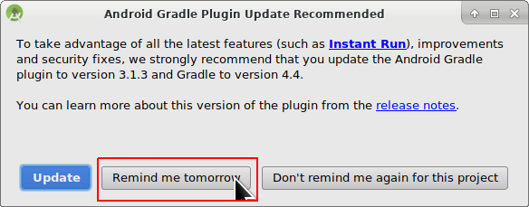
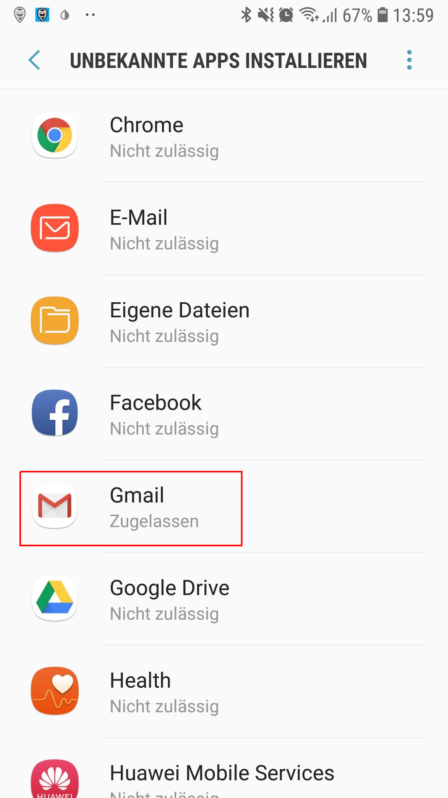

# AndroidAPS installieren - App erstellen

* * *

***Bitte beachte** beim Erstellen einer AndroidAPS 2.0 apk: **Configuration on demand** wird in der aktuellen Version des Android Gradle Plugins nicht unterstützt! Wenn der Build-Prozess mit einem Fehler zu "on demand configuration" fehlschlägt, dann kannst du folgendes tun:*

     *  *Das Einstellungen-Fenster öffnen, indem du auf Datei > Einstellungen (auf dem Mac: Android Studio > Präferenzen) klickst.*
    *  *Im linken Fensterbereich, klicke auf Build, Execution, Deployment > Compiler.*
    *  *Deaktiviere die "Configure on demand" checkbox.*
    

## * *Klicke Apply oder OK.*

### Dieser Artikel ist in zwei Teile geteilt.

* Im Überblick werden die wichtigsten Schritte kurz zusammengefasst die allgemein nötig sind, um die APK Datei zu erstellen.
* In der “Schritt für Schritt Anleitung” wird detailliert auf die einzelnen Punkte mithilfe von Screenshots eingegangen. Da die Versionen von Android Studio - der Software, die wir zum Bau der APK verwenden werden - sich schnell weiterentwickeln werden diese nicht mit deiner Installation übereinstimmen, aber sie geben einen guten ersten Eindruck. Android Studio läuft sowohl auf Windows, als auch auf Mac OS X und Linux. Es kann sein, dass es bei jedem Betriebssystem einige kleinere Unterschiede gibt. Bei grösseren Veränderungen oder fehlenden bzw. falschen Informationen wäre es hilfreich, dies den Entwicklern in der Facebookgruppe "Android APS" oder in den Gitter Chats [Android APS](https://gitter.im/MilosKozak/AndroidAPS) oder [AndroidAPSwiki](https://gitter.im/AndroidAPSwiki/Lobby) mitzuteilen, so dass wir einen Blick darauf werfen können.

## Übersicht

Kurzfassung der wichtigsten Schritte zum Erstellen der APK Datei:

* Git installieren
* Installiere und konfiguriere Android Studio.
* Nutze git clone, um den Quellcode von AndroidAPS auf Github zu downloaden.
* Öffne das heruntergeladene Projekt in Android Studio.
* Erstelle die signierte APK.
* Übertrage die erstellte APK auf dein Smartphone.

## Schritt für Schritt Anleitung

Detaillierte Beschreibung der notwendigen Schritte.

### Install Android Studio

* Installiere git 
  * [Windows](https://gitforwindows.org/)
  * [Mac OS X](http://sourceforge.net/projects/git-osx-installer/)
  * Linux - installiere einfach ein ‘Package Git’ über einen ‘Package Manager’ deiner Linux-Distribution
* Installiere [Android Studio](https://developer.android.com/studio/install.html).
* Konfiguriere Android Studio gleich beim ersten Öffnen des Programms.

Wähle “Do not import settings”, da bisher keine Einstellungen vorgenommen wurden.

Klicke auf “Next”.

Wähle “Standard” Installation und klicke auf “Next”.

Wähle “Intellij” als “UI theme” (Benutzeroberfläche) und klicke auf “Next”.

Klicke auf “Next” in dem Fenster “Verify Settings”.

Der Android Emulator (um ein Smartphone auf Deinem PC oder Mac zu simulieren) wird zum Bau der APK nicht benutzt. Du kannst auf ‘Finish’ klicken, um die Installation zu beenden und die vorgeschlagene Dokumentation bei Bedarf später lesen.

Android Studio lädt viele benötigte Software-Komponenten herunter. Du kannst auf ‘Show Details’ klicken um zu sehen was passiert, aber das ist nicht relevant für den weiteren Verlauf.

Wenn der Download beendet ist, klicke auf “Finish”.

* Applause, applause you have now finished the Android Studio installation and can start cloning the source code. Maybe it's time for a short break?

### Generate signed APK

* Use git clone in Android Studio as shown in screenshots below. Select "Check out project from Version Control" with "Git" as concrete version control system.

 

Gib die URL der Hauptseite des AndroidAPS Repositorys (“https://github.com/MilosKozak/AndroidAPS”) an und klicke auf “Clone”.

Android Studio fängt an das Projekt zu ”clonen” (kopieren). Klicke nicht auf “Background”, es geht schnell und macht es derzeit nur komplizierter.

Beende “checkout from version control”, indem du auf “Yes” klickst und das Projekt öffnest.

Nutze den Standard “default gradle wrapper” und klicke auf “OK”.

Lies und schließe den “Tip of the Day” von Android Studio, indem du auf “close” klickst.

* Excellent, you have your own copy of the source code and are ready to start the build.
* Now we are approaching our first error message. Fortunately, Android Studio will directly give us the solution for this.

Klicke auf “Install missing platform(s) and sync project”, da Android Studios noch einige Komponenten installieren muss.

Akzeptiere die Lizenzvereinbarung, indem du auf “Accept” und “Next” klickst.

Wie beschrieben, einfach warten, bis die Installation abgeschlossen ist.

Ist diese abgeschlossen, dann klicke wieder auf “Finish”. 

Und dann wird wohl wieder der nächste Fehler auf dich zukommen... Aber auch hier schlägt Android Studio einen ähnlichen Lösungsweg vor. Klicke auf “Install Build Tools and sync project” um die fehlenden “Tools” zu installieren.

Wie beschrieben, einfach warten, bis die Installation abgeschlossen ist.

Ist diese abgeschlossen, dann klicke wieder auf “Finish”. 

Und der nächste Fehler tritt auf. Klicke einfach wieder auf “Install missing platform(s) and sync project”.

Wie beschrieben, einfach warten, bis die Installation abgeschlossen ist.

Ist diese abgeschlossen, dann klicke wieder auf “Finish”. 

Klicke auf “Install Build Tools and sync project” um die fehlenden “Tools” zu installieren.

Wie beschrieben, einfach warten, bis die Installation abgeschlossen ist.

Ist diese abgeschlossen, dann klicke wieder auf “Finish”. 

Sieht so aus, als ob wir die Fehlermeldungen hinter uns haben :). Zeit für eine Trinkpause?

Nun wird von Android Studio empfohlen, ”Gradle Plugin” auf Version 4.4 zu aktualisieren. Wenn du nicht mindestens einen Release Candidate für AndroidAPS 2.0 kompilieren willst, dann befolge diese Empfehlung nicht. Anderenfalls wird der Build fehlschlagen. “Gradle” ist nur dafür da, den “Build Process” zu kontrollieren. Für AndroidAPS ist es kein Nachteil, die alte Gradle Version zu verwenden. Die APK-Datei unterscheidet sich nicht. Wenn du eine Version von AndroidAPS 2.0 oder größer bauen willst, könntest du dennoch auf Version 4.4 aktualisieren.

Der Prozess läuft weiter...

Perfekt, der erste “Build Prozess” ist erfolgreich abgeschlossen, aber wir sind noch nicht fertig.

Als nächstes, gehe zum “Build” Menü und “Generate Signed APK”. Signieren bedeutet, dass du deine generierte Anwendung unterschreibst, aber digital als eine Art digitaler Fingerabdruck in der Anwendung selbst. Es ist notwendig, die App digital zu signieren, da Android aus Sicherheitsgründen nur signierten Code akzeptiert. Falls dich das Thema interessiert, findest du [hier](https://developer.android.com/studio/publish/app-signing.html#generate-key) mehr. Sicherheit ist ein großes und komplexes Thema, um das du dich zur Zeit noch nicht kümmern musst.

Wähle “App” aus und klicke auf “Next”.

Klicke auf “Create new...” um einen Key zu erstellen. Dieser ist nichts anderes als eine Datei, in der die Informationen deiner Signatur der App gespeichert sind. Sie ist verschlüsselt und passwortgeschützt. Wir empfehlen, diese Datei in deinem Heimatverzeichnis zu speichern und dir die Passwörter zu merken. Falls du aber diese Informationen verlierst, ist es auch kein Beinbruch, weil du sie jederzeit wieder neu erzeugen kannst. Am besten ist es, diese Informationen sorgfältig aufzubewahren.

* Fill in the information for the next dialog. 
  * Key store path: is the path to the keystore file
  * The password fields below are for the keystore to double check for typing errors.
  * Alias is a name for the key you need. You can leave the default or give it a fancy name you want.
  * The password fields below the key are for the key itself. As always to double check for typing errors.
  * You can let the validity at the default of 25 years.
  * You only have to fill out firstname and lastname but feel free to complete the rest of information. Then click "OK".

Fülle die Informationen von dem Keystore, den du gerade erstellt hast, aus und klicke auf “Next”.

Wähle “full” in dem “Flavors” Menü aus, um die vollständige AndroidAPS App zu erstellen und klicke auf V1 “Jar Signature” (V2 ist optional) und klicke auf “Finish”. Folgende Informationen könnten später für dich nützlich sein:

* 'Release' should be your default choice for "Build Type", 'Debug' is just for people coding.
* Select the build type you want to build. 
  * full (i.e. recommendations automatically enacted in closed looping)
  * openloop (i.e. recommendations given to user to manually enact)
  * pumpcontrol (i.e. remote control for pump, no looping)
  * nsclient (i.e. looping data of another user is displayed and careportal entries can be added)

Im event log sollte jetzt angezeigt werden, dass die signierte APK erfolgreich generiert wurde.

Klicke auf “locate” im “event log”.

### Transfer APK to smartphone

Es sollte sich ein Datei Manager öffnen. Das könnte bei dir anders aussehen (dieser Screenshot wurde auf einem Linux PC erstellt). In Windows wird sich der “Explorer” öffnen, in Mac OS X der “Finder”. Dort solltest du jetzt das Verzeichnis mit der APK-Datei sehen. Es ist aber unglücklicherweise nicht die, die wir suchen, sondern nur die “wear-release.apk”.

Um zu der gesuchten APK zu gelangen, musst du zu dem Ordner AndroidAPS/app/full/release gehen und nach der “app-full-release.apk” Datei Ausschau halten. Übertrage die Datei auf dein Smartphone. Du kannst es machen wie du willst, z.B. Bluetooth, Cloud Upload oder E-Mail. In diesem Beispiel verwende ich Gmail, da dies für mich ziemlich einfach ist. Ich erwähne das deshalb, weil wir Android erlauben müssen, auf unserem Smartphone diese Installation auszuführen, auch wenn diese Datei via Google Mail empfangen wurde, was normalerweise verboten ist. Wenn Du einen anderen Übertragungsweg nutzt, setze die entsprechenden Rechte analog zum Vorgehen bei Gmail.

In den Einstellungen deines Smartphones gibt es den Bereich "Unbekannte Quellen". Dort musst du Gmail das Recht geben, APK Dateien zu installieren, die du per Gmail erhalten hast.

Klicke dort auf “aus dieser Quelle zulassen”. Nach der Installation ist es empfehlenswert dies aus Sicherheitsgründen wieder rückgängig zu machen.

Der letzte Schritt ist es, auf die APK Datei zu klicken und die App zu installieren. Sollte es nicht funktionieren, kann es sein, dass sich eine ältere Version mit einem anderen “Key”/einer anderen Signatur auf dem Handy befindet. Exportiere deine Einstellungen aus der älteren Version und deinstalliere diese erst danach.

Herzlichen Glückwunsch, du hast es geschafft! Nun kannst du AndroidAPS starten und einrichten.