# AndroidAPS installieren - App erstellen

## Kein Download möglich - APK muss selbst erstellt werden

**Aufgrund der gesetzlichen Regelungen für Medizinprodukte ist AndroidAPS nicht als Download verfügbar. Du kannst die App legal für Dich selbst erstellen, darfst aber keine Kopie an andere weitergeben! Weitere Informationen findest Du auf der [FAQ Seite](../Getting-Started/FAQ.md).**

## Wichtige Hinweise

***Hinweis***: Verwende [ Android Studio Version 3.5.1 ](https://developer.android.com/studio/) oder neuer, um die APK-Datei zu erstellen.

** Konfiguration auf Abruf ** (Configuration on demand) wird von der aktuellen Version des Android-Gradle-Plugins nicht unterstützt!

Wenn der Build-Prozess mit einem Fehler zu "on demand configuration" fehlschlägt, dann kannst du folgendes tun:

* Das Einstellungen-Fenster öffnen, indem du auf Datei > Einstellungen (auf dem Mac: Android Studio > Preferences) klickst.
* Klicke im linken Fensterbereich auf Build, Execution, Deployment > Compiler.
* Deaktiviere die "Configure on demand" Checkbox.
* Klicke Apply oder OK.

* * *

### Dieser Artikel ist in zwei Teile geteilt.

* Im Überblick werden die wichtigsten Schritte kurz zusammengefasst die allgemein nötig sind, um die APK Datei zu erstellen.
* In der “Schritt für Schritt Anleitung” wird detailliert auf die einzelnen Punkte mithilfe von Screenshots eingegangen. Da die Versionen von Android Studio - der Software, die wir zum Bau der APK verwenden werden - sich schnell weiterentwickeln werden diese nicht mit deiner Installation übereinstimmen, aber sie geben einen guten ersten Eindruck. Android Studio läuft sowohl auf Windows als auch auf Mac OS X und Linux. Es kann sein, dass es bei jedem Betriebssystem einige kleinere Unterschiede gibt. Bei größeren Veränderungen oder fehlenden bzw. falschen Informationen wäre es hilfreich, dies den Entwicklern in der Facebookgruppe "Android APS" oder in den Gitter Chats [Android APS](https://gitter.im/MilosKozak/AndroidAPS) oder [AndroidAPS wiki](https://gitter.im/AndroidAPSwiki/Lobby) mitzuteilen, so dass wir einen Blick darauf werfen können.

## Übersicht

Kurzfassung der wichtigsten Schritte zum Erstellen der APK Datei:

* [Installiere git](../Installing-AndroidAPS/git-install.rst)
* Installiere und konfiguriere Android Studio.
* Nutze git clone, um den Quellcode von AndroidAPS auf Github zu downloaden.
* Öffne das heruntergeladene Projekt in Android Studio.
* Erstelle die signierte APK.
* Übertrage die erstellte APK auf dein Smartphone.

## Schritt für Schritt Anleitung

Detaillierte Beschreibung der notwendigen Schritte.

## Installiere git (falls du es noch nicht hast)

Die Schritt-für-Schritt-Anleitung findest Du auf der Seite zur [git Installation](../Installing-AndroidAPS/git-install.rst).

## Android Studio installieren

Die folgenden Screenshots stammen aus Android Studio Version 3.1.3. Je nach verwendeter Android Studio-Version kann Dein Bildschirm etwas anders aussehen. Aber Du solltest Dich dennoch zurechtfinden. Hilfe aus der Community findest Du z. B. in der [ -AndroidAPS-Facebook-Gruppe ](https://www.facebook.com/groups/1900195340201874/) und [auf diesen Seiten](../Where-To-Go-For-Help/Connect-with-other-users.md).

Installiere [Android Studio](https://developer.android.com/studio/install.html) und richte es während des ersten Starts ein.

Wähle “Do not import settings”, da bisher keine Einstellungen vorgenommen wurden.

Klicke auf “Next”.

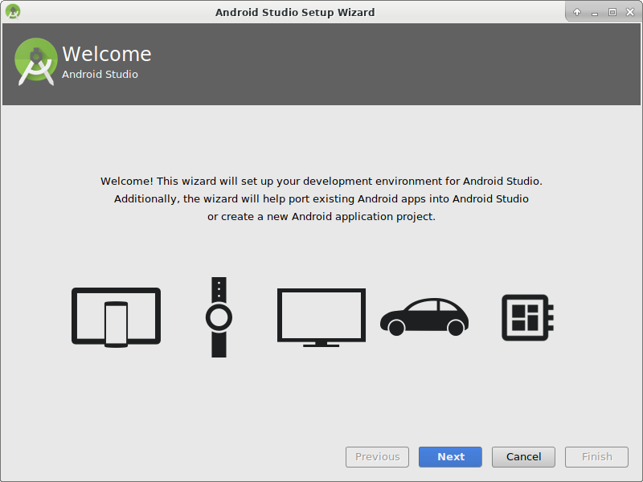

Wähle “Standard” Installation und klicke auf “Next”.

Wähle das Design für die Benutzeroberfläche, das Dir am besten gefällt. (In diesem Handbuch verwenden wir "Intellij".) Klicke danach auf “Next”. Das ist nur das Farbschema. Du kannst auswählen, was Du möchtest (z.B. "Darcula" für den dunklen Modus). Diese Auswahl hat keinen Einfluss auf die Erstellung der APK.

Klicke auf “Next” in dem Fenster “Verify Settings”.

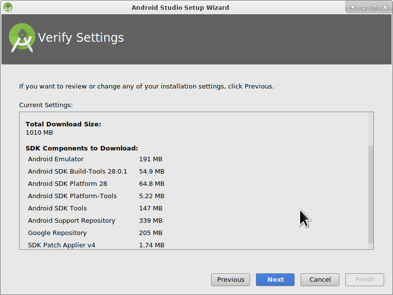

Der Android Emulator (um ein Smartphone auf Deinem PC oder Mac zu simulieren) wird zum Bau der APK nicht benutzt. Du kannst auf ‘Finish’ klicken, um die Installation zu beenden und die vorgeschlagene Dokumentation bei Bedarf später lesen.

Android Studio lädt viele benötigte Software-Komponenten herunter. Du kannst auf ‘Show Details’ klicken, um zu sehen was passiert, aber das ist nicht relevant für den weiteren Verlauf.

Wenn der Download beendet ist, klicke auf “Finish”.

* Herzlichen Glückwunsch, jetzt hast du Android Studio soweit fertig installiert und kannst mit dem Clonen des Quellcodes beginnen. Hier ist allerdings auch ein guter Zeitpunkt, um eine Pause einzulegen.

## Git-Pfad in Android Studio eintragen

### Windows

* In Android Studio musst Du den Pfad zu git.exe hinterlegen: File - Settings
  
  

* Im nächsten Fenster: Version Control - Git

* Wähle den richtigen Pfad: .../Git<b>/bin</b>

* Stelle sicher, dass die update method "Merge" ausgewählt ist.
  
  

### Mac

* Wenn Du git über homebrew installierst, musst Du keine Einstellungen ändern. Im Fall der Fälle findest Du diese unter Android Studio - Preferences.

## Code und weitere Komponenten herunterladen

* Nutze “git clone” in Android Studio wie in folgendem Screenshot angegeben. Wähle “Check out project from Version Control” und “Git” als konkretes System zur Versionskontrolle aus.

Gib die URL der Hauptseite des AndroidAPS Repositorys (“https://github.com/MilosKozak/AndroidAPS”) an und klicke auf “Clone”.

Android Studio fängt an das Projekt zu ”clonen” (kopieren). Klicke nicht auf “Background”, es geht schnell und macht es derzeit nur komplizierter.

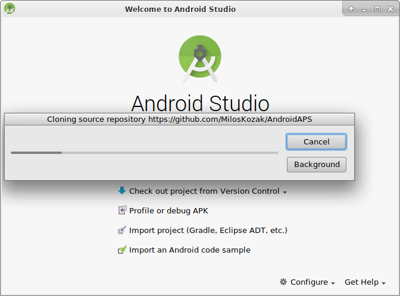

Beende “checkout from version control”, indem du auf “Yes” klickst und das Projekt öffnest.

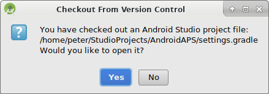

Nutze den Standard “default gradle wrapper” und klicke auf “OK”.

Lies und schließe den “Tip of the Day” von Android Studio, indem du auf “close” klickst.

* Perfekt, du hast jetzt deine eigene Kopie des Quellcodes erstellt und kannst mit dem Kompilieren beginnen.
* Als nächstes erwartet uns die erste Fehlermeldung. Glücklicherweise schlägt Android Studio gleich die Lösung vor.

Klicke auf “Install missing platform(s) and sync project”, da Android Studios noch einige Komponenten installieren muss.

Akzeptiere die Lizenzvereinbarung, indem du auf “Accept” und “Next” klickst.

Wie beschrieben, einfach warten, bis die Installation abgeschlossen ist.

Ist diese abgeschlossen, dann klicke wieder auf “Finish”. 

Und dann wird wohl wieder der nächste Fehler auf dich zukommen... Aber auch hier schlägt Android Studio einen ähnlichen Lösungsweg vor. Klicke auf “Install Build Tools and sync project” um die fehlenden “Tools” zu installieren.

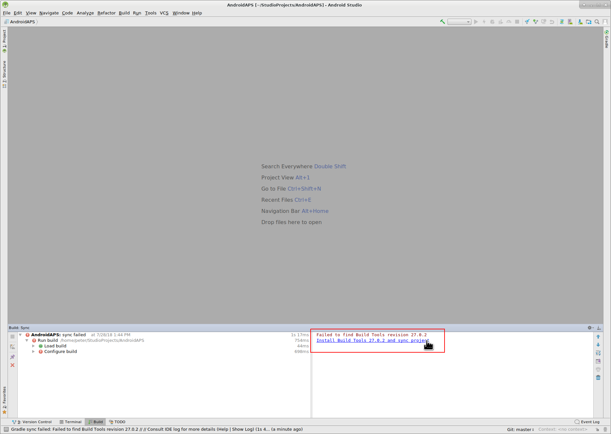

Wie beschrieben, einfach warten, bis die Installation abgeschlossen ist.

Ist diese abgeschlossen, dann klicke wieder auf “Finish”. 

Und der nächste Fehler tritt auf. Klicke einfach wieder auf “Install missing platform(s) and sync project”.

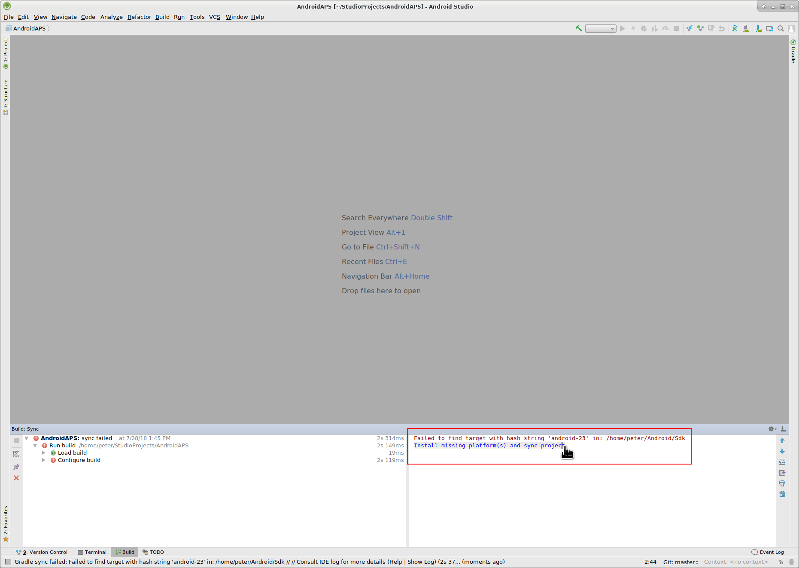

Wie beschrieben, einfach warten, bis die Installation abgeschlossen ist.

Ist diese abgeschlossen, dann klicke wieder auf “Finish”. 

Klicke auf “Install Build Tools and sync project” um die fehlenden “Tools” zu installieren.

Wie beschrieben, einfach warten, bis die Installation abgeschlossen ist.

Ist diese abgeschlossen, dann klicke wieder auf “Finish”. 

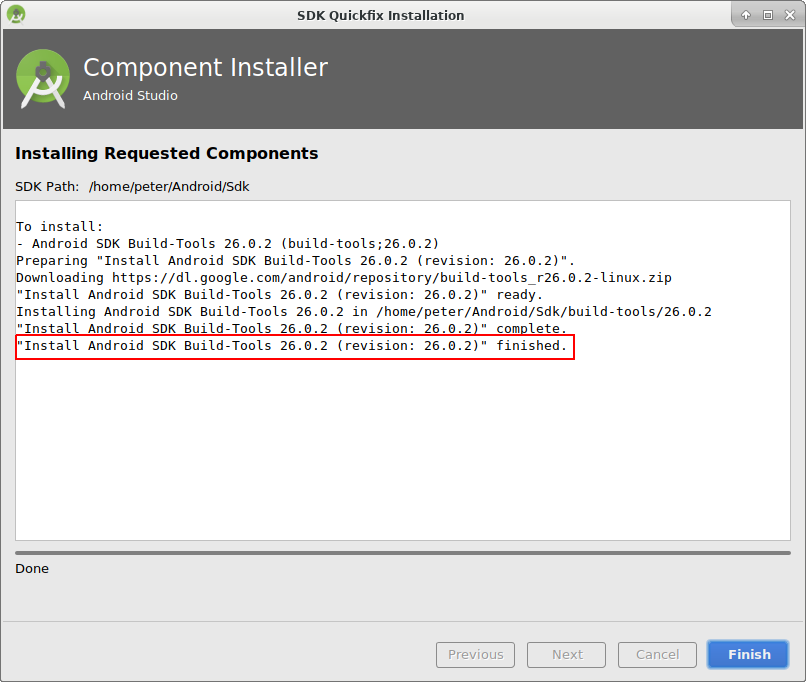

Sieht so aus, als ob wir die Fehlermeldungen hinter uns haben :). Zeit für eine Trinkpause?

Android Studio empfiehlt, das Gradle-System zu aktualisieren. **Führe niemals ein Gradle-Update durch!** Dies kann zu Problemen führen!

Klicke auf "Don't remind me again for this project".

Der Prozess läuft weiter...

Perfekt, der erste “Build Prozess” ist erfolgreich abgeschlossen, aber wir sind noch nicht fertig.

## Signierte APK erstellen (Generate signed APK)

Wähle im Menü "Build" und dann "Generate Signed Bundle / APK...". (Das Menü in Android Studio wurde im September 2018 geändert. In älteren Versionen wähle im Menü „Build“ und dann „Signed APK generieren...“

Signieren bedeutet, dass du deine generierte Anwendung unterschreibst, aber digital als eine Art digitaler Fingerabdruck in der Anwendung selbst. Es ist notwendig, die App digital zu signieren, da Android aus Sicherheitsgründen nur signierten Code akzeptiert. Falls dich das Thema interessiert, findest du [hier](https://developer.android.com/studio/publish/app-signing.html#generate-key) mehr. Sicherheit ist ein großes und komplexes Thema, um das du dich zur Zeit noch nicht kümmern musst.

Wähle in der folgenden Dialogbox "APK" statt "Android App Bundle" und klicke auf den Button "Next".

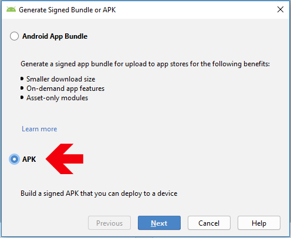

Wähle “App” aus und klicke auf “Next”.

Klicke auf “Create new...” um einen Keystore zu erstellen. Dieser ist nichts anderes als eine Datei, in der die Informationen deiner Signatur der App gespeichert sind. Sie ist verschlüsselt und passwortgeschützt. Wir empfehlen, diese Datei in deinem Heimatverzeichnis zu speichern und dir die Passwörter zu merken. Falls du aber diese Informationen verlierst, ist es auch kein Beinbruch, weil du sie jederzeit wieder neu erzeugen kannst. Am besten ist es, diese Informationen sorgfältig aufzubewahren.

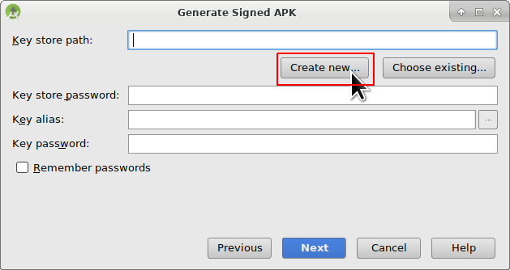

* Fülle die Informationen in den nächsten Textfeldern aus. 
  * “Key store path”: Der Ort, an dem der Keystore gespeichert wird. **Speichere ihn nicht im gleichen Ordner wie Dein Projekt. Du musst ein anderes Verzeichnis verwenden!**
  * Die Passwortfelder sind dazu da, um den Key auf Tippfehler zu überprüfen.
  * “Alias”: ist der Name des Schlüssels. Du kannst ihn unverändert lassen wie vorgegeben oder jeden beliebigen anderen Namen eingeben.
  * Die Passwort-Felder unter dem Key sind für den Key selbst. Wie immer, um die Eingabe auf Tippfehler zu prüfen.
  * Die Gültigkeit kannst du bei den vorgeschlagenen 25 Jahren belassen.
  * Du musst nur Vor- und Nachname ausfüllen, kannst aber auch den Rest ergänzen. Klicke danach auf “OK”.

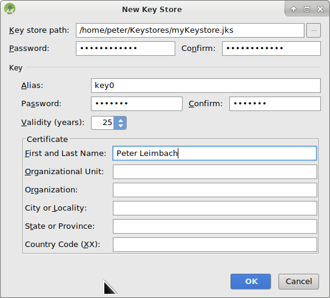

Fülle die Informationen von dem Keystore, den du gerade erstellt hast, aus und klicke auf “Next”.

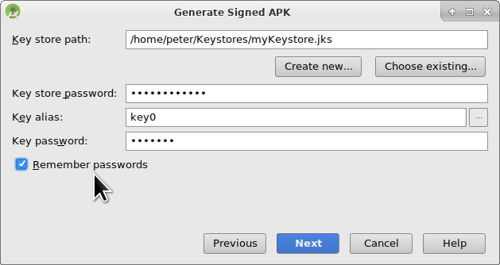

Wähle “full” (oder "fullRelease") in dem “Flavors” Menü aus, um die vollständige AndroidAPS App zu erstellen und klicke auf V1 “Jar Signature” (V2 ist optional) und klicke auf “Finish”. Folgende Informationen könnten später für dich nützlich sein:

* “Release” solltest du immer lassen, “Debug” ist nur für Programmierer, um Fehler zu finden.
* Wähle den “build type”, den du kompilieren möchtest: 
  * full / fullRelease (d.h. automatische Pumpensteuerung im Closed Loop)
  * openloop (d.h. gibt temporäre Basalraten-Vorschläge, die manuell auszuführen sind)
  * pumpcontrol (d.h. nur Fernbedienung für die Pumpe, kein Loopen)
  * nsclient (d.h. es werden z.B. die Daten eines anderen Nutzers dargestellt und Careportal-Einträge können hinzugefügt werden)

Im event log sollte jetzt angezeigt werden, dass die signierte APK erfolgreich generiert wurde.

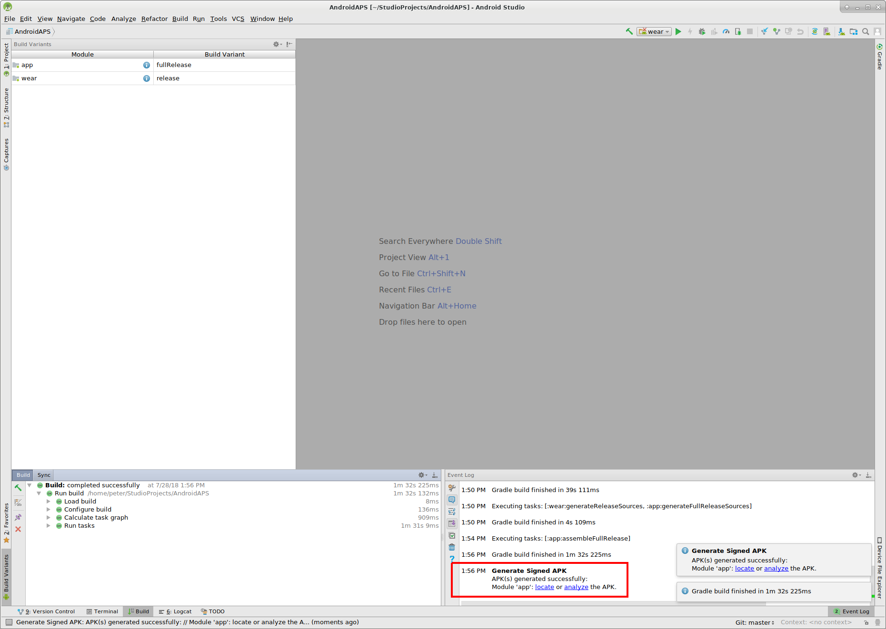

Klicke auf “locate” im “event log”.

## Übertrage die APK-Datei auf das Smartphone

Es sollte sich ein Datei Manager öffnen. Das könnte bei dir anders aussehen (dieser Screenshot wurde auf einem Linux PC erstellt). In Windows wird sich der “Explorer” öffnen, in Mac OS X der “Finder”. Dort solltest du jetzt das Verzeichnis mit der APK-Datei sehen. Es ist aber unglücklicherweise nicht die, die wir suchen, sondern nur die “wear-release.apk”.

Um zu der gesuchten APK zu gelangen, musst du zu dem Ordner AndroidAPS/app/full/release gehen und nach der “app-full-release.apk” Datei Ausschau halten. Übertrage die Datei auf dein Smartphone. Wähle Deinen bevorzugten Weg:

* Bluetooth
* Upload in die Cloud (Google Drive oder vergleichbare Dienste)
* Computer und Smartphone per Kabel verbinden 
* per E-Mail (Beachte, dass einige Mail-Apps keine APK-Anhänge zulassen, verwende in diesem Fall eine andere Übertragungsmethode.)

In diesem Beispiel wird Gmail verwendet, da es ziemlich einfach ist. Du musst Android erlauben, auf Deinem Smartphone diese Installation auszuführen, auch wenn diese Datei via Google Mail empfangen wurde, was normalerweise verboten ist. Wenn Du einen anderen Übertragungsweg nutzt, setze die entsprechenden Rechte analog zum Vorgehen bei Gmail.

In den Einstellungen deines Smartphones gibt es den Bereich "Unbekannte Quellen". Dort musst du Gmail das Recht geben, APK Dateien zu installieren, die du per Gmail erhalten hast.

Klicke dort auf “aus dieser Quelle zulassen”. Nach der Installation ist es empfehlenswert dies aus Sicherheitsgründen wieder rückgängig zu machen.

Der letzte Schritt ist es, auf die APK Datei zu klicken und die App zu installieren. Sollte es nicht funktionieren, kann es sein, dass sich eine ältere Version mit einem anderen “Key”/einer anderen Signatur auf dem Handy befindet. Exportiere deine Einstellungen aus der älteren Version und deinstalliere diese erst danach.

Herzlichen Glückwunsch, du hast es geschafft! Nun kannst du AndroidAPS starten und einrichten.

## Identifiziere den Empfänger falls Du xDrip verwendest

[Siehe xDrip Seite](../Configuration/xdrip#identify-receiver)

## Problembehandlung

Siehe die separate Seite zur [Problembehandlung bei Android Studio](../Installing-AndroidAPS/troubleshooting_androidstudio.rst).