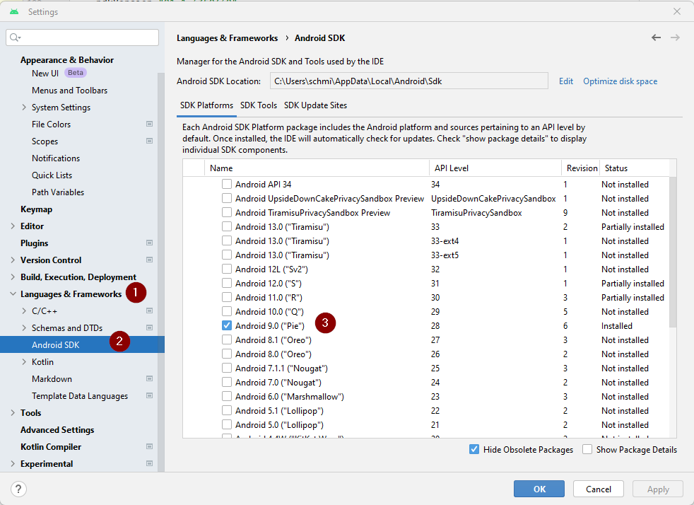

# AndroidAPS installieren - App erstellen

## Kein Download möglich - APK muss selbst erstellt werden

**Aufgrund der gesetzlichen Regelungen für Medizinprodukte ist AndroidAPS nicht als Download verfügbar. Es ist zulässig, die App für den eigenen Gebrauch zu erstellen, aber du darfst keine Kopie an andere weitergeben! Weitere Informationen findest Du auf der [FAQ Seite](../Getting-Started/FAQ.md).**

## Wichtige Hinweise

* Nutze bitte **[Android Studio Version 2020.3.1](https://developer.android.com/studio/)** oder neuer, um die APK-Datei zu erstellen.
* [Windows 10 32-bit Systeme](troubleshooting_androidstudio-unable-to-start-daemon-process) werden von Android Studio 2020.3.1 nicht unterstützt

(Building-APK-recommended-specification-of-computer-for-building-apk-file)=

## Empfohlene Spezifikation des Computers zum Erstellen der Apk-Datei

<table class="tg">
  
<thead>
  <tr>
    <th class="tg-baqh">Betriebssystem (nur 64 Bit)</th>
    <th class="tg-baqh">Windows 8 oder höher</th>
    <th class="tg-baqh">Mac OS 10.14 oder höher</th>
    <th class="tg-baqh">Jedes Linux unterstützt Gnome, KDE oder Unity DE;&nbsp;&nbsp;GNU C Library 2.31 oder höher</th>
  </tr>
</thead>
<tbody>
  <tr>
    <td class="tg-baqh"><p align="center">CPU (nur 64 Bit)</td>
    <td class="tg-baqh">x86_64 CPU-Architektur; Intel Core oder neuere Generation oder AMD CPU mit Unterstützung für einen <br><a href="https://developer.android.com/studio/run/emulator-acceleration#vm-windows" target="_blank" rel="noopener noreferrer"><span style="text-decoration:var(--devsite-link-text-decoration,none)">Windows Hypervisor</span></a></td>
    <td class="tg-baqh">ARM-based Chips oder Intel Core der zweiten Generation oder neuer mit Unterstützung für <br><a href="https://developer.android.com/studio/run/emulator-acceleration#vm-mac" target="_blank" rel="noopener noreferrer"><span style="text-decoration:var(--devsite-link-text-decoration,none)">Hypervisor.Framework</span></a></td>
    <td class="tg-baqh">x86_64 CPU Architektur; Intel Core der zweiten Generation oder neuer, alternativ AMD Prozessor mit Unterstützung für AMD Virtualization (AMD-V) und SSSE3</td>
  </tr>
  <tr>
    <td class="tg-baqh"><p align="center">RAM</td>
    <td class="tg-baqh" colspan="3"><p align="center">8GB oder mehr</td>
  </tr>
  <tr>
    <td class="tg-baqh"><p align="center">Festplatte</td>
    <td class="tg-baqh" colspan="3"><p align="center">Mind. 30 GB freier Speicherplatz. SSD wird empfohlen.</td>
  </tr>
  <tr>
    <td class="tg-baqh"><p align="center">Bildschirmauflösung</td>
    <td class="tg-baqh" colspan="3"><p align="center">min. 1280 x 800<br></td>
  </tr>
  <tr>
    <td class="tg-baqh"><p align="center">Internet</td>
    <td class="tg-baqh" colspan="3"><p align="center">Breitband</td>
  </tr>
</tbody>
</table>

Bitte beachte, dass sowohl eine **64-Bit-CPU als auch ein 64-Bit-Betriebssystem zwingend erforderlich sind**. Wenn Dein System diese Bedingung nicht erfüllt, musst Du die betroffene Hardware, Software oder das ganze System ersetzen. **Es wird dringend empfohlen, SSD (Solid State Disk) anstelle von HDD (Hard Disk Drive) zu verwenden, da dies dies die Zeit zur Erstellung der APS-Installationsdatei reduziert.** Dies wird nur eine Empfohlung und ist nicht zwingend erforderlich. Du kannst auch eine normale Festplatte verwenden. Beachte aber, dass der Prozess zur Erstellung der APK-Datei dann länger dauert. Du kannst den Prozess aber unbeaufsichtigt laufen lassen, nachdem Du ihn gestartet hast.

* * *

### Dieser Artikel ist in zwei Teile geteilt.

* Im Überblick werden die wichtigsten Schritte kurz zusammengefasst die allgemein nötig sind, um die APK Datei zu erstellen.
* In der “Schritt für Schritt Anleitung” wird detailliert auf die einzelnen Punkte mithilfe von Screenshots eingegangen. Da die Versionen von Android Studio - der Software, die wir zum Bau der APK verwenden werden - sich schnell weiterentwickeln werden diese nicht mit deiner Installation übereinstimmen, aber sie geben einen guten ersten Eindruck. Android Studio läuft sowohl auf Windows als auch auf Mac OS X und Linux. Es kann sein, dass es bei jedem Betriebssystem einige kleinere Unterschiede gibt. Falls Du feststellst, dass etwas wichtiges falsch ist oder fehlt, informiere bitte die Facebook Gruppe "AndroidAPS users" oder im Discord chat [Android APS](https://discord.gg/4fQUWHZ4Mw), damit wir uns das anschauen können.

## Übersicht

Kurzfassung der wichtigsten Schritte zum Erstellen der APK Datei:

1. [Git installieren](../Installing-AndroidAPS/git-install.md)
2. [Android Studio installieren](Building-APK-install-android-studio)
3. [Pfad zu git.exe in den Einstellungen von Android Studio festlegen](Building-APK-set-git-path-in-preferences)
4. [AndroidAPS-Code herunterladen](Building-APK-download-androidaps-code)
5. [Download Android SDK](Building-APK-download-android-sdk)
6. [App erstellen](Building-APK-generate-signed-apk) (generate signed apk)
7. [APK-Datei auf das Smartphone übertragen](Building-APK-transfer-apk-to-smartphone)
8. [Identifiziere den Empfänger falls Du xDrip verwendest+](xdrip-identify-receiver)

## Schritt für Schritt Anleitung

Detaillierte Beschreibung der notwendigen Schritte.

## Installiere git (falls du es noch nicht hast)

Die Schritt-für-Schritt-Anleitung findest Du auf der Seite zur [git Installation](../Installing-AndroidAPS/git-install.md).

(Building-APK-install-android-studio)=

## Android Studio installieren

Die folgenden Screenshots stammen von Android Studio Version Arctic Fox | 2020.3.1. Die Bildschirme können bei zukünftigen Versionen von Android Studio leicht anders aussehen. Aber Du solltest Dich dennoch zurechtfinden. Bei Fragen gibt es [Hilfe in der Community](../Where-To-Go-For-Help/Connect-with-other-users.md).

Einer der wichtigsten Punkte bei der Installation von Android Studio ist: **Sei geduldig!** Während der Installation und Einrichtung lädt Android Studio sehr viele Daten nach und das braucht seine Zeit.

Lade [Android Studio von dieser Seite](https://developer.android.com/studio/install.html) herunter und installiere es auf Deinem Computer.

Beim ersten Start öffnet sich der Setup Wizard:

Wähle “Do not import settings”, da bisher keine Einstellungen vorgenommen wurden.


Entscheide, ob Du Daten mit Google teilen möchtest oder nicht.


Klicke auf dem nächsten Bildschirm den Button "Next".


Wähle “Standard” Installation und klicke auf “Next”.


Wähle das Design für die Benutzeroberfläche, welches Dir am besten gefällt. (In dieser Anleitung verwenden wir "Light".) Dann klicke auf "Next".

> ***Hinweis:*** Das ist nur das Farbschema. Du kannst auswählen, was Du möchtest (z.B. "Darcula" für den dunklen Modus). Diese Auswahl hat keinen Einfluss auf das Erstellen der APK, aber die folgenden Screenshots könnten anders aussehen.


Klicke auf “Finish” im Fenster “Verify Settings”.


Warte während Android Studio zusätzliche Komponenten herunterlädt und bleibe geduldig. Sobald alles heruntergeladen ist, wird der Button "Finish" blau dargestellt. Klicke diesen dann an.


(Building-APK-set-git-path-in-preferences)=

## Git-Pfad in Android Studio eintragen

Stelle sicher, dass [git auf Deinem PC installiert](../Installing-AndroidAPS/git-install.md) ist und dass Du den PC nach der git-Installation neu gestartet hast.

Klicke auf dem Android Studio Willkommensbildschirm auf "Customize" \[Anpassen\] (1) auf der linken Seite und wähle dann den Link "All settings..." \[Alle Einstellungen...\] (2):


### Windows

* Stelle als Windows Nutzer sicher, dass Du den PC neu gestartet hast, nachdem Du [Git installiert](../Installing-AndroidAPS/git-install.md) hast.

* Doppelklicke auf "Version Control" (1), um das Untermenü zu öffnen.

* Git (2) anklicken.
* Stelle sicher, dass die update method "Merge" (3) ausgewählt ist.
* Prüfe durch klicken des Buttons "Test" (4), ob Android Studio den Pfad zu git.exe automatisch ermitteln kann.
    
    

* Wenn die automatische Einstellung möglich ist, wird die Git-Version hinter dem Pfad angezeigt.
    
    

* Eventuell kann git.exe nicht automatisch gefunden werden oder der Test führt zu einem Fehler (1):
    
    
    
    Klicke in diesem Fall auf das Ordner-Symbol (2).

* Verwende die [Suchfunktion](https://www.tenforums.com/tutorials/94452-search-file-explorer-windows-10-a.html) im Windows Explorer um "git.exe" zu finden, falls Du Dir nicht sicher bist, in welchem Ordner "git.exe" installiert wurde. Du suchst eine Datei namens "git.exe", diese befindet sich im **\bin** Ordner.

* Wähle den Pfad zu git.exe aus, stelle sicher, dass Du den Ordner ** \bin\ ** ausgewählt hast (3), und klicke auf "OK" (4).
    
    

* Überprüfe den gewählten Git-Pfad erneut mit der Schaltfläche "Test" wie oben beschrieben.

* Wenn die git Version hinter dem Pfad angezeigt wird (siehe Screenshot oben), kannst Du das Einstellungsfenster mit Klick auf "OK" (5) schließen.

### Mac

* Jede git Version sollte funktionieren. Zum Beispiel <https://git-scm.com/download/mac>.
* Benutze Homebrew um git zu installieren: ```$ brew install git```.
* Details zur Installation von git findest Du in der [offiziellen git Dokumentation](https://git-scm.com/book/en/v2/Getting-Started-Installing-Git).
* Wenn Du git über homebrew installierst, musst Du keine Einstellungen ändern. Im Fall der Fälle findest Du diese unter Android Studio - Preferences.

(Building-APK-download-androidaps-code)=

## AndroidAPS-Code herunterladen

* Wähle auf dem Android Studio Willkommensbildschirm "Projects" auf der linken Seite (1) und dann "Get from VCS" (2).
    
    
    
    * Wenn Du Android Studio bereits geöffnet hast und den Willkommensbildschirm nicht mehr siehst, klicke auf File (1) > New (2) > Project from Version Control... (3)
        
        
    
    * Wir werden Android Studio nun sagen, wo es den Code herunterladen soll:
    
    * Stelle sicher, dass Du "Repository-URL" auf der linken Seite ausgewählt hast (1).
    
    * Überprüfe, ob "Git" als Versionskontrolle (2) ausgewählt ist.
    * Kopiere nachfolgende URL ```https://github.com/nightscout/AndroidAPS``` und füge sie in Android Studio in die URL Textbox (3) ein.
    * Wähle das Verzeichnis, in dem die Kopie des Codes gespeichert werden soll (4.).
        
        

* Klicke auf "Clone" (5).
    
    

* Klicke nicht auf "Background", während das Repository geklont wird!

* Nachdem das Projektarchiv erfolgreich geklont wurde, wird Android Studio das geklonte Projekt öffnen.

* Du wirst gefragt, ob Du dem Projekt vertrauen willst. Klicke auf "Trust project"!
    
    

* In der Statusleiste im unteren Teil des Fensters siehst Du die Information, dass Android Studio Hintergrundaufgaben ausführt.
    
    

* Gewähre Zugriff, falls Dich Deine Firewall dazu auffordert.
    
    

* Sobald die Hintergrund-Aufgaben beendet sind, wirst Du wahrscheinlich eine Fehlermeldung sehen, die besagt, dass Fehler aufgetreten sind (1) oder (2) oder (3).
    
    
    
    Keine Sorge, das wird bald gelöst!

(Building-APK-download-android-sdk)=

## Download Android SDK

* Gehe im Menü zu File (1) > Settings (2).
    
    

* Doppelklicke auf Appearance & Behaviour, um das Untermenü zu öffnen (1).

* Doppelklicke auf System Settings (2) und wähle Android SDK (3).
* Markiere die Box links neben "Android 9.0 (Pie)" (4) (API Level 28).
    
    

* Bestätige die Änderungen durch Klick auf OK.
    
    

* Akzeptiere die Lizenzvereinbarung (1) und klicke auf "Next" (2).
    
    

* Warte, bis der SDK-Download und die Installation abgeschlossen sind.
    
    

* Wenn die SDK-Installation abgeschlossen ist, wird der Button "Finish" blau angezeigt. Klicke dann darauf.
    
    

* Android Studio empfiehlt eventuell, das Gradle-System zu aktualisieren. **Führe niemals ein Gradle-Update durch!** Dies wird zu Problemen führen!

* Wenn Du auf der unteren rechten Seite des Android Studio Fensters die Information siehst, dass das Android Gradle Plugin zur Aktualisierung bereit ist, klicke auf den Text "Update" (1).
    
    

* Wähle in der folgenden Dialogbox "Don't remind me again for this project" (2).
    
    

* Starte Android Studio neu, bevor Du fortfährst.

(Building-APK-generate-signed-apk)=

## Signierte APK erstellen (Generate signed APK)

Signieren bedeutet, dass Du die App mit einem digitalen Fingerabdruck versiehst und als von Dir erstellt kennzeichnest. Es ist notwendig, die App digital zu signieren, da Android aus Sicherheitsgründen nur signierte Apps akzeptiert. Weitere Informationen dazu findest Du unter [diesem Link](https://developer.android.com/studio/publish/app-signing.html#generate-key).

* Nachdem Android Studio gestartet wurde, musst Du warten, bis alle Hintergrundaufgaben abgeschlossen sind.
    
    
    
    * ***Warnung:*** Fahre mit den folgenden Schritten nicht fort, wenn Fehler auftreten. \ Schaue auf der [Seite zur Problembehebung in Android Studio](../Installing-AndroidAPS/troubleshooting_androidstudio) nach bekannten Problemen!
    
    

* Klicke in der Menüzeile auf "Build" (1) und wähle "Generate Signed Bundle / APK..." (2).
    
    

* Wähle "APK" (1) statt "Android App Bundle" aus und klicke auf "Next" (2).
    
    

* Stelle sicher, dass als Modul "AndroidAPS.app" (1) ausgewählt ist.

* Klicke auf “Create new...” (2), um Deinen key store zu erstellen.
    
    ***Hinweis:*** Ein key store ist in diesem Fall nichts anderes als eine Datei, in der die Signierdaten gespeichert werden. Sie ist verschlüsselt und passwortgeschützt.
    
    

* Klicke das Ordner-Symbol, um den Pfad zu wählen, unter dem Dein key store auf Deinem PC gespeichert werden soll.
    
    

* Wähle den Pfad, in dem Dein key store gespeichert werden soll (1).
    
    
    
    ***Speichere ihn nicht im gleichen Ordner wie Dein Projekt. Du musst ein anderes Verzeichnis verwenden!*** Dein Benutzerordner wäre ein guter Speicherort.

* Gib einen Dateinamen für Deinen key store ein (2) und bestätige mit "OK" (3).

* Gib das Passwort für Deinen key store ein (2) und bestätige es (3).
    
    ***Hinweis:*** Passwörter für key store und key müssen nicht sehr anspruchsvoll sein. Merke sie Dir gut oder notiere sie an einem sicheren Ort. Falls Du künftig einmal keinen Zugriff auf die Passwörter haben solltest, findest Du einen Lösungsvorschlag unter [Fehlerbehebung verlorener key store](troubleshooting_androidstudio-lost-keystore).

* Gib einen Alias für Deinen key ein (4). Wähle eine beliebige Bezeichnung.

* Gib das Passwort für Deinen key ein (5) und bestätige es (6).

* Als Validity (Gültigkeit) (7) ist standardmäßig 25 Jahre voreingestellt. Das musst Du nicht verändern.

* Ein Vor- und Nachname müssen eingegeben werden (8). Alle anderen Informationen sind optional.

* Klicke auf "OK" (9), wenn Du fertig bist.

* Achte darauf, dass die Checkbox "remember passwords" ausgewählt ist (1). Dann musst Du sie bei der nächsten App-Erstellung (z.B. beim Update auf eine neue AndroidAPS Version) nicht erneut eingeben.

* Klicke auf "Next" (2).
    
    

* Wähle die Build-Variante "fullRelease" (1) und drücke "Finish".
    
    

* Android Studio zeigt im unteren Teil des Fensters "Gradle Build running" an. Dies dauert eine Weile je nach Computer und Internetverbindung. **Sei geduldig!**
    
    

* Android Studio zeigt "Generate Signed APK" an, so bald die Erstellung der APK-Datei abgeschlossen ist.
    
    

* Falls beim Erstellen Fehler auftreten, findest Du Lösungsansätze auf den Seiten zur [Fehlerbehebung](../Installing-AndroidAPS/troubleshooting_androidstudio).

* Klicke auf die Benachrichtigung, um sie zu vergrößern.

* Klicke auf den link "locate".
    
    
    
    * Falls die Benrachrichtigung automatisch geschlossen wurde, kannst Du immer den "Event log" öffen und dort den Link auswählen.

* Dein Dateimanager (z.B. Windows Explorer) wird geöffnet. Navigiere zum Verzeichnis "full" (1) > "release" (2).
    
    

* "app-full-release.apk" (3) ist die von Dir gesuchte Datei!

(Building-APK-transfer-apk-to-smartphone)=

## Übertrage die APK-Datei auf das Smartphone

Der einfachste Weg, die Datei app-full-release.apk auf Dein Smartphone zu übertragen, ist mittels [USB-Kabel oder Google Drive](https://support.google.com/android/answer/9064445?hl=en). Bitte beachte, dass die Übertragung per Mail zu Schwierigkeiten führen kann und daher nicht empfohlen wird.

Auf dem Smartphone musst Du die Installation aus unbekannten Quellen zulassen. Anleitungen dazu findest Du im Internet (z.B. hier</0a> oder [hier](https://www.androidcentral.com/unknown-sources)).</p> 

## Problembehandlung

Siehe die separate Seite zur [Problembehandlung bei Android Studio](../Installing-AndroidAPS/troubleshooting_androidstudio).