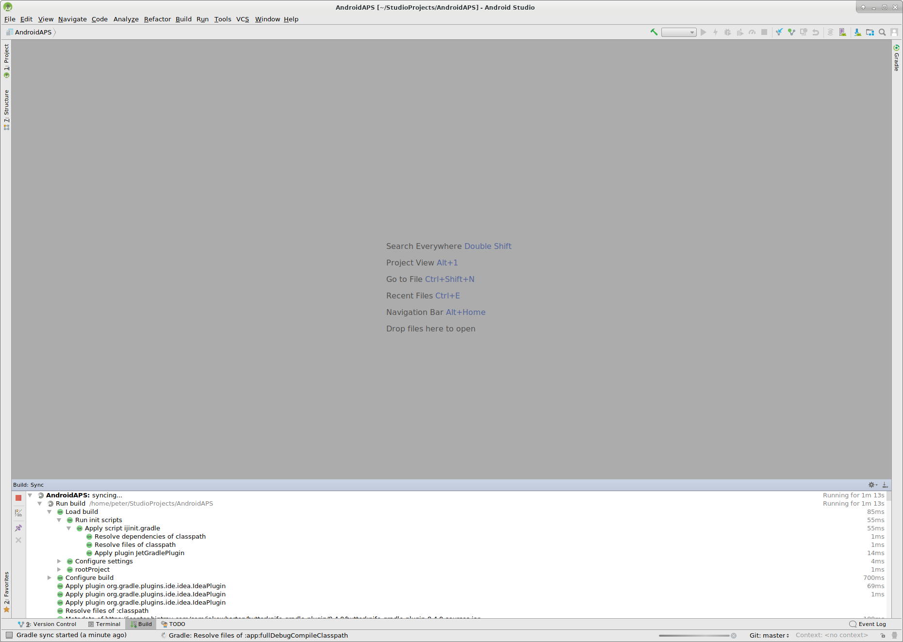
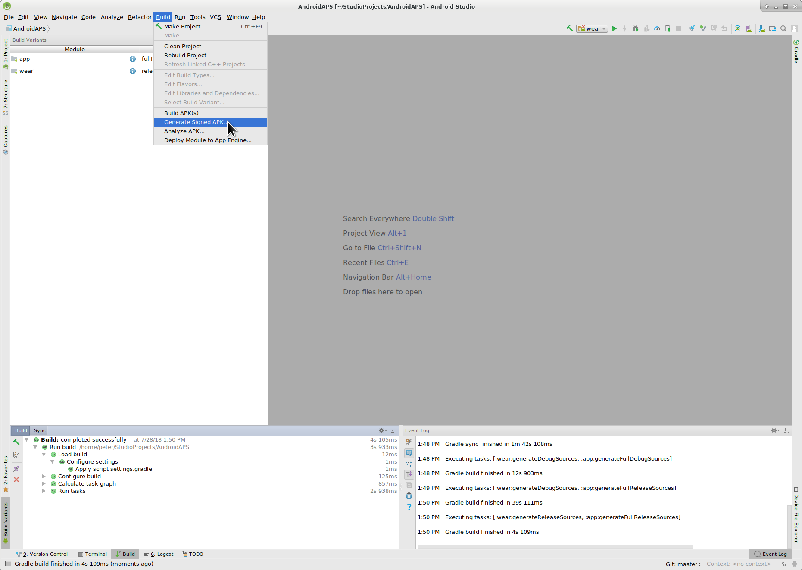

# AndroidAPS installieren - App erstellen

Dieser Artikel ist in zwei Teile geteilt.

* Im Überblick werden die wichtigsten Schritte kurz zusammengefasst die allgemein nötig sind, um die APK Datei zu erstellen.
* In der “Schritt für Schritt Anleitung” wird detailliert auf die einzelnen Punkte mithilfe von Screenshots eingegangen. Da die Versionen von Android Studio - der Software, die wir zum Bau der APK verwenden werden - sich schnell weiterentwickeln werden diese nicht mit deiner Installation übereinstimmen, aber sie geben einen guten ersten Eindruck. Android Studio läuft sowohl auf Windows, als auch auf Mac OS X und Linux. Es kann sein, dass es bei jedem Betriebssystem einige kleinere Unterschiede gibt. Bei grösseren Veränderungen oder fehlenden bzw. falschen Informationen wäre es hilfreich, dies den Entwicklern in der Facebookgruppe "Android APS" oder in den Gitter Chats [Android APS](https://gitter.im/MilosKozak/AndroidAPS) oder [AndroidAPSwiki](https://gitter.im/AndroidAPSwiki/Lobby) mitzuteilen, so dass wir einen Blick darauf werfen können.

## Überblick

Kurzfassung der wichtigsten Schritte zum Erstellen der APK Datei:

* Git installieren
* Installiere und konfiguriere Android Studio.
* Nutze git clone, um den Quellcode von AndroidAPS auf Github zu downloaden.
* Öffne das heruntergeladene Projekt in Android Studio.
* Erstelle die signierte APK.
* Übertrage die erstellte APK auf dein Smartphone.

## Schritt für Schritt Anleitung

Detaillierte Beschreibung der notwendigen Schritte.

* Installiere git 
  * [Windows](https://gitforwindows.org/)
  * [Mac OS X](http://sourceforge.net/projects/git-osx-installer/)
  * Linux - installiere einfach ein ‘Package Git’ über einen ‘Package Manager’ deiner Linux-Distribution
* Installiere [Android Studio](https://developer.android.com/studio/install.html).
* Konfiguriere Android Studio gleich beim ersten Öffnen des Programms.

Wähle “Do not import settings”, da bisher keine Einstellungen vorgenommen wurden.

Klicke auf “Next”.

Wähle “Standard” Installation und klicke auf “Next”.

Wähle “Intellij” als “UI theme” (Benutzeroberfläche) und klicke auf “Next”.

Klicke auf “Next” in dem Fenster “Verify Settings”.

Der Android Emulator (um ein Smartphone auf Deinem PC oder Mac zu simulieren) wird zum Bau der APK nicht benutzt. Du kannst auf ‘Finish’ klicken, um die Installation zu beenden und die vorgeschlagene Dokumentation bei Bedarf später lesen.

Android Studio lädt viele benötigte Software-Komponenten herunter. Du kannst auf ‘Show Details’ klicken um zu sehen was passiert, aber das ist nicht relevant für den weiteren Verlauf.

Wenn der Download beendet ist, klicke auf “Finish”.

* Herzlichen Glückwunsch, jetzt hast du die Android Studio soweit fertig installiert und kannst mit dem “Cloning” des Quellcodes beginnen. Hier ist allerdings auch ein guter Zeitpunkt, um eine Pause einzulegen.

* Nutze “git clone” in Android Studio wie in dem folgendem Screenshot angegeben. Wähle “Check out project from Version Control” und “Git” aus.

 

Gib die URL der Hauptseite des AndroidAPS Repositorys (“https://github.com/MilosKozak/AndroidAPS”) an und klicke auf “Clone”.

Android Studio fängt an das Projekt zu ”clonen” (kopieren). Klicke nicht auf “Background”, es geht schnell und macht es derzeit nur komplizierter.

Beende “checkout from version control”, indem du auf “Yes” klickst und das Projekt öffnest.

Nutze den Standard “default gradle wrapper” und klicke auf “OK”.

Lies und schließe den “Tip of the Day” von Android Studio, indem du auf “close” klickst.

* Perfekt, du hast jetzt deine eigene Kopie des Quellcodes erstellt und kannst mit dem Kompilieren beginnen.
* Als nächstes erwartet uns die erste Fehlermeldung. Glücklicherweise schlägt Android Studio gleich die Lösung vor.

Klicke auf “Install missing platform(s) and sync project”, da Android Studios noch einige Komponenten installieren muss.

Akzeptiere die Lizenzvereinbarung, indem du auf “Accept” und “Next” klickst.

Wie beschrieben, einfach warten, bis die Installation abgeschlossen ist.

Ist diese abgeschlossen, dann klicke wieder auf “Finish”. 

Und dann wird wohl wieder der nächste Fehler auf dich zukommen... Aber auch hier schlägt Android Studio einen ähnlichen Lösungsweg vor. Klicke auf “Install Build Tools and sync project” um die fehlenden “Tools” zu installieren.

Wie beschrieben, einfach warten, bis die Installation abgeschlossen ist.

Ist diese abgeschlossen, dann klicke wieder auf “Finish”. 

Und der nächste Fehler tritt auf. Klicke einfach wieder auf “Install missing platform(s) and sync project”.

Wie beschrieben, einfach warten, bis die Installation abgeschlossen ist.

Ist diese abgeschlossen, dann klicke wieder auf “Finish”. 

Klicke auf “Install Build Tools and sync project” um die fehlenden “Tools” zu installieren.

Wie beschrieben, einfach warten, bis die Installation abgeschlossen ist.

Ist diese abgeschlossen, dann klicke wieder auf “Finish”. 

Sieht so aus, als ob wir die Fehlermeldungen hinter uns haben :). Maybe it's time to drink some water?

Android Studio recommends we now update the gradle system to version 4.4. If you made this build for an AndroidAPS version before the release of at least a release candidate(RC) of version 2.0 do not follow this recommendation. Otherwise, the build will fail. “Gradle” ist nur dafür da, den “Build Process” zu kontrollieren. For AndroidAPS there is no disadvantage to using the old gradle version. Die APK-Datei unterscheidet sich nicht. Wenn du eine Version von AndroidAPS 2.0 oder größer bauen willst, könntest du dennoch auf Version 4.4 aktualisieren.

Der Prozess läuft weiter...

Perfekt, der erste “Build Prozess” ist erfolgreich abgeschlossen, aber wir sind noch nicht fertig.

Als nächstes, gehe zum “Build” Menü und “Generate Signed APK”. Signing means that you sign your generated app but in a digital way as a kind of digital fingerprint in the app itself. That is necessary because Android has a rule that it only accepts signed code to run for security reasons. For more information on this topic, follow the link [here](https://developer.android.com/studio/publish/app-signing.html#generate-key) Security is a deep and complex topic and you don't need this now.

Wähle “App” aus und klicke auf “Next”.

Click "Create new..." to start creating your keystore. A keystore in this case is nothing more than a file in which the information for signing is stored. It is encrypted and the information is secured with passwords. We suggest storing it in your home folder and remember the passwords but if you lose this information it's not a big issue because then you just have to create a new one. Best practice is to store this information carefully.

* Fülle die Informationen in den nächsten Textfeldern aus. 
  * “Key store path”: Der Ort, an dem der Keystore gespeichert wird.
  * The password fields below are for the keystore to double check for typing errors.
  * “Alias”: ist der Name für die Verschlüsselung. You can leave the default or give it a fancy name you want.
  * The password fields below the key are for the key itself. As always to double check for typing errors.
  * “Validity”: Übersetzt bedeutet das “Gültigkeit”. Du kannst die “25 years” so stehen lassen.
  * You only have to fill out firstname and lastname but feel free to complete the rest of information. Klicke danach auf “OK”.

Fülle die Informationen von dem Keystore, den du gerade erstellt hast, aus und klicke auf “Next”.

Wähle “full” in dem “Flavors” Menü aus, um die vollständige AndroidAPS App zu erstellen und klicke auf V1 “Jar Signature” (V2 ist optional) und klicke auf “Finish”. Folgende Informationen könnten später für dich nützlich sein:

* “Release” solltest du immer lassen, “Debug” ist nur für Programmierer, um Fehler zu finden.
* Wähle den “Flavour”, den du kompilieren möchtest: 
  * full: Gesamte App (inkl. open loop, closed loop, Smartwatch-Steuerung)
  * openloop (dieser gibt nur temporäre Basalraten-Vorschläge, die nur manuell auszuführen sind)
  * pumpcontrol (kein Loop, mit dieser kann man die Pumpe über die App bedienen)
  * nsclient (hier werden z.B. die Daten eines anderen Nutzers dargestellt und Careportal-Einträge können hinzugefügt werden)

Im event log sollte jetzt angezeigt werden, dass die signierte APK erfolgreich generiert wurde.

Klicke auf “locate” im “event log”.

Es sollte sich ein Datei Manager öffnen. It might look a bit different on your system as I am using Linux. In Windows wird sich der “Explorer” öffnen, in Mac OS X der “Finder”. There you should see the directory with the generated APK file. Unfortunately this is the wrong place as "wear-release.apk" is not the signed "app" APK we are searching for.

Please change to the directory AndroidAPS/app/full/release to find the "app-full-release.apk" file. Übertrage die Datei auf dein Smartphone. You can do it on your preferred way, i.e. Bluetooth, cloud upload or email. In diesem Beispiel verwende ich Gmail, da dies für mich ziemlich einfach ist. I mention this because to install the self-signed app we need to allow Android on our smartphone to do this installation even if this file is received via Gmail which is normally forbidden. Wenn Du einen anderen Übertragungsweg nutzt, setze die entsprechenden Rechte analog zum Vorgehen bei Gmail.

In the settings of your smartphone there is an area "unknown apps install" where I have to give Gmail the right to install APK files which I get via Gmail.

Klicke dort auf “aus dieser Quelle zulassen”. Nach der Installation ist es empfehlenswert dies aus Sicherheitsgründen wieder rückgängig zu machen.

Der letzte Schritt ist es, auf die APK Datei zu klicken und die App zu installieren. Sollte es nicht funktionieren, kann es sein, dass sich eine ältere Version mit einem anderen “Key”/einer anderen Signatur auf dem Handy befindet. Exportiere deine Einstellungen aus der älteren Version und deinstalliere diese erst danach.

Herzlichen Glückwunsch, du hast es geschafft! Nun kannst du AndroidAPS starten und einrichten.