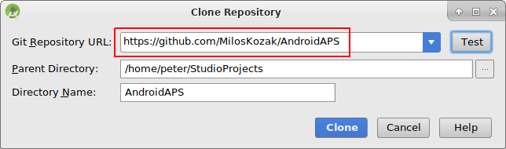

# AndroidAPS installieren - App erstellen

* * *

***Please note** With AndroidAPS version 2.3 it is not possible to build the APK with the latest Android Studio version. Please use Android Studio 3.4 from [here](https://developer.android.com/studio/archive?).

***Please note** when building AndroidAPS 2.0 apk: **Configuration on demand** is not supported by the current version of the Android Gradle plugin! Wenn der Build-Prozess mit einem Fehler zu "on demand configuration" fehlschlägt, dann kannst du folgendes tun:*

     *  *Das Einstellungen-Fenster öffnen, indem du auf Datei > Einstellungen (auf dem Mac: Android Studio > Präferenzen) klickst.*
    *  *Im linken Fensterbereich, klicke auf Build, Execution, Deployment > Compiler.*
    *  *Deaktiviere die "Configure on demand" checkbox.*
    

## * *Klicke Apply oder OK.*

### Dieser Artikel ist in zwei Teile geteilt.

* Im Überblick werden die wichtigsten Schritte kurz zusammengefasst die allgemein nötig sind, um die APK Datei zu erstellen.
* In der “Schritt für Schritt Anleitung” wird detailliert auf die einzelnen Punkte mithilfe von Screenshots eingegangen. Da die Versionen von Android Studio - der Software, die wir zum Bau der APK verwenden werden - sich schnell weiterentwickeln werden diese nicht mit deiner Installation übereinstimmen, aber sie geben einen guten ersten Eindruck. Android Studio läuft sowohl auf Windows, als auch auf Mac OS X und Linux. Es kann sein, dass es bei jedem Betriebssystem einige kleinere Unterschiede gibt. Bei grösseren Veränderungen oder fehlenden bzw. falschen Informationen wäre es hilfreich, dies den Entwicklern in der Facebookgruppe "Android APS" oder in den Gitter Chats [Android APS](https://gitter.im/MilosKozak/AndroidAPS) oder [AndroidAPSwiki](https://gitter.im/AndroidAPSwiki/Lobby) mitzuteilen, so dass wir einen Blick darauf werfen können.

## Übersicht

In general, the steps necessary to build the APK file:

* Git installieren
* Installiere und konfiguriere Android Studio.
* Nutze git clone, um den Quellcode von AndroidAPS auf Github zu downloaden.
* Öffne das heruntergeladene Projekt in Android Studio.
* Erstelle die signierte APK.
* Übertrage die erstellte APK auf dein Smartphone.

## Schritt für Schritt Anleitung

Detailed description of the steps necessary to build the APK file.

## Android Studio installieren

* Installiere git 
  * [Windows](https://gitforwindows.org/)
  * [Mac OS X](http://sourceforge.net/projects/git-osx-installer/)
  * Linux - installiere einfach ein ‘Package Git’ über einen ‘Package Manager’ deiner Linux-Distribution
* Installiere [Android Studio](https://developer.android.com/studio/install.html).
* Konfiguriere Android Studio gleich beim ersten Öffnen des Programms.

Select "Do not import settings" as you have not used it before.

Click "Next".

Select "Standard" installation and click "Next".

Select the theme for the user interface you like. (In this manual we used "Intellij". Then click "Next". This is just the color scheme. You can select any you like (i.e. "Darcula" for dark mode). This selection has no influence on building the APK.

Click "Next" on the "Verify Settings" dialog.

The Android emulator (to emulate the smartphone on your PC or Mac) is not used to build the APK. You can click "Finish" to finish the installation and read the documentation later on demand.

Android Studio is downloading a lot of software components it uses. You can click on the "Show Details" button to the what happens but that's not important at all.

After the downloads are completed click the "Finish" button.

* Herzlichen Glückwunsch, jetzt hast du Android Studio soweit fertig installiert und kannst mit dem Clonen des Quellcodes beginnen. Hier ist allerdings auch ein guter Zeitpunkt, um eine Pause einzulegen.

## Code und weitere Komponenten herunterladen

* Nutze “git clone” in Android Studio wie in dem folgendem Screenshot angegeben. Wähle “Check out project from Version Control” und “Git” als konkretes System zur Versionskontrolle aus.

Fill in the URL to the main AndroidAPS repository ("https://github.com/MilosKozak/AndroidAPS") and click "clone".

Android Studio will start cloning. Don't click "Background" as it goes fast and makes things more complicated at the moment.

Finish the checkout from version control with opening the project by clicking "Yes".

Use the standard "default gradle wrapper" and click "OK".

Read and close the "Tip of Day" screen of Android Studio by pressing "Close".

* Perfekt, du hast jetzt deine eigene Kopie des Quellcodes erstellt und kannst mit dem Kompilieren beginnen.
* Als nächstes erwartet uns die erste Fehlermeldung. Glücklicherweise schlägt Android Studio gleich die Lösung vor.

Click "Install missing platform(s) and sync project" as Android Studio needs to install a missing platform.

Accept the license agreement by selecting "Accept" and clicking "Next".

As it is said in the dialog please wait until the download is finished.

Now it's finished. Please click "Finish".

Aaaahhh, next error. But Android Studio suggests a similar solution. Click "Install Build Tools and sync project" as Android Studio needs to download missing Tools.

As it is said in the dialog please wait until the download is finished.

Now it's finished. Please click "Finish".

And another error to handle as Android Studio needs to download again a missing platform. Click "Install missing platform(s) and sync project".

As it is said in the dialog please wait until the download is finished.

Now it's finished. Please click "Finish".

Click "Install Build Tools and sync project" as Android Studio needs to download missing Tools.

As it is said in the dialog please wait until the download is finished.

Now it's finished. Please click "Finish".

Yeah, the error messages are gone and the first gradle build is runing. Maybe it's time to drink some water?

Android Studio recommends to update the gradle system. **Never update gradle!** This might lead to difficulties!

Please click "Don't remind me again for this project".

The build is running again.

Yeah, the first build is successful but we are not finished.

## Siginierte APK erstellen (Generate signed APK)

Wähle im Menü "Build" und dann "Generate Signed Bundle / APK...". (Das Menü in Android Studio wurde im September 2018 geändert. Falls Du eine ältere Version benutzt, wähle im Menü “Build” und dann “Generate Signed APK...”.)  
Signieren bedeutet, dass du deine generierte Anwendung unterschreibst, aber digital als eine Art digitaler Fingerabdruck in der Anwendung selbst. Es ist notwendig, die App digital zu signieren, da Android aus Sicherheitsgründen nur signierten Code akzeptiert. Falls dich das Thema interessiert, findest du [hier](https://developer.android.com/studio/publish/app-signing.html#generate-key) mehr. Sicherheit ist ein großes und komplexes Thema, um das du dich zur Zeit noch nicht kümmern musst.

Wähle in der folgenden Dialogbox "APK" statt "Android App Bundle" und klicke auf den Button "Next".

Wähle “App” aus und klicke auf “Next”.

Click "Create new..." to start creating your keystore. A keystore in this case is nothing more than a file in which the information for signing is stored. It is encrypted and the information is secured with passwords. We suggest storing it in your home folder and remember the passwords but if you lose this information it's not a big issue because then you just have to create a new one. Best practice is to store this information carefully.

* Fülle die Informationen in den nächsten Textfeldern aus. 
  * “Key store path”: Der Ort, an dem der Keystore gespeichert wird.
  * Die Passwortfelder sind dazu da, um den Key auf Tippfehler zu überprüfen.
  * “Alias”: ist der Name des Schlüssels. Du kannst ihn unverändert lassen wie vorgegeben oder jeden beliebigen anderen Namen eingeben.
  * Die Passwort-Felder unter dem Key sind für den Key selbst. Wie immer, um die Eingabe auf Tippfehler zu prüfen.
  * Die Gültigkeit kannst du bei den vorgeschlagenen 25 Jahren belassen.
  * Du musst nur Vor- und Nachname ausfüllen, kannst aber auch den Rest ergänzen. Klicke danach auf “OK”.

Fill in the information of the last dialog in this dialog and click "Next".

Wähle “full” in dem “Flavors” Menü aus, um die vollständige AndroidAPS App zu erstellen und klicke auf V1 “Jar Signature” (V2 ist optional) und klicke auf “Finish”. Folgende Informationen könnten später für dich nützlich sein:

* “Release” solltest du immer lassen, “Debug” ist nur für Programmierer, um Fehler zu finden.
* Wähle den “build type”, den du kompilieren möchtest: 
  * full (d.h. automatische Pumpensteuerung im Closed Loop)
  * openloop (d.h. gibt temporäre Basalraten-Vorschläge, die manuell auszuführen sind)
  * pumpcontrol (d.h. nur Fernbedienung für die Pumpe, kein Loopen)
  * nsclient (d.h. es werden z.B. die Daten eines anderen Nutzers dargestellt und Careportal-Einträge können hinzugefügt werden)

Im event log sollte jetzt angezeigt werden, dass die signierte APK erfolgreich generiert wurde.

Klicke auf “locate” im “event log”.

## Übertrage die APK-Datei auf das Smartphone

Es sollte sich ein Datei Manager öffnen. Das könnte bei dir anders aussehen (dieser Screenshot wurde auf einem Linux PC erstellt). In Windows wird sich der “Explorer” öffnen, in Mac OS X der “Finder”. Dort solltest du jetzt das Verzeichnis mit der APK-Datei sehen. Es ist aber unglücklicherweise nicht die, die wir suchen, sondern nur die “wear-release.apk”.

Um zu der gesuchten APK zu gelangen, musst du zu dem Ordner AndroidAPS/app/full/release gehen und nach der “app-full-release.apk” Datei Ausschau halten. Übertrage die Datei auf dein Smartphone. Sie können es auf Ihre bevorzugte Weise tun, z.B. Bluetooth, Cloud Upload, Computer und Telefon per Kabel verbinden oder E-Mail verwenden. In diesem Beispiel verwende ich Gmail, da dies für mich ziemlich einfach ist. Ich erwähne das deshalb, weil wir Android erlauben müssen, auf unserem Smartphone diese Installation auszuführen, auch wenn diese Datei via Google Mail empfangen wurde, was normalerweise verboten ist. Wenn Du einen anderen Übertragungsweg nutzt, setze die entsprechenden Rechte analog zum Vorgehen bei Gmail.

In den Einstellungen deines Smartphones gibt es den Bereich "Unbekannte Quellen". Dort musst du Gmail das Recht geben, APK Dateien zu installieren, die du per Gmail erhalten hast.

Klicke dort auf “aus dieser Quelle zulassen”. Nach der Installation ist es empfehlenswert dies aus Sicherheitsgründen wieder rückgängig zu machen.

Der letzte Schritt ist es, auf die APK Datei zu klicken und die App zu installieren. Sollte es nicht funktionieren, kann es sein, dass sich eine ältere Version mit einem anderen “Key”/einer anderen Signatur auf dem Handy befindet. Exportiere deine Einstellungen aus der älteren Version und deinstalliere diese erst danach.

Herzlichen Glückwunsch, du hast es geschafft! Nun kannst du AndroidAPS starten und einrichten.