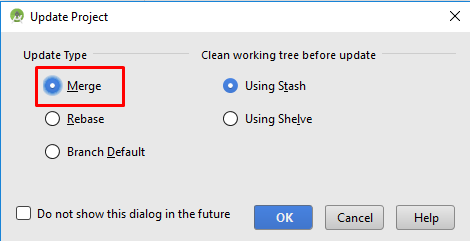

# Update auf eine neue Version oder branch

<font color="#FF0000"><b>Wichtiger Hinweis: Ab Version 2.3 muss für das Update git genutzt werden. Ein Update mittels ZIP-File ist nicht mehr möglich.</font></b>

## Installiere git (falls du es noch nicht hast)

### Windows

* Jede git Version sollte funktionieren. Beispiel: <https://git-scm.com/download/win>
* Notiere Dir den Installationspfad. Du brauchst diesen im nächsten Schritt.
  
  

* In Android Studio musst Du den Pfad zu git.exe hinterlegen: File - Settings
  
  

* Im nächsten Fenster: Version Control - Git

* Wähle den richtigen Pfad: .../Git<font color="#FF0000"><b>/bin</b></font>

* Stelle sicher, dass die update method "Merge" ausgewählt ist.
  
  

### Mac

* Jede git Version sollte funktionieren. Zum Beispiel <https://git-scm.com/download/mac>
* Benutze Homebrew um git zu installieren: ```$ brew install git```.
* Details zur Installation von git findest Du in der [offiziellen git Dokumentation](https://git-scm.com/book/en/v2/Getting-Started-Installing-Git).
* Wenn Du git über homebrew installierst, musst Du keine Einstellungen ändern. Im Fall der Fälle findest Du diese unter Android Studio - Preferences.

## Führe ein Update deiner lokalen Version durch

* Klicke: VCS->Git->Fetch
  
  

## Branch auswählen

* Falls du “branch” wechseln willst, wähle eine andere “branch” vom Reiter: master (aktuellste, getestete Version), oder andere (siehe weiter unten).
  
  

und anschließend "checkout". Verwende 'Checkout as New Branch' falls 'Checkout' nicht angezeigt wird.

     
    

## Branch-Update von Github

* Drücke Strg+T, wähle Merge method und drücke OK
  
  

Auf dem Reiter siehst du eine grüne Nachricht “updated project”.

## Siginierte APK erstellen (Generate signed APK)

<!--- Text is maintained in page building-apk.md ---> Wähle im Menü "Build" und dann "Generate Signed Bundle / APK...". (Das Menü in Android Studio wurde im September 2018 geändert. Falls Du eine ältere Version benutzt, wähle im Menü “Build” und dann “Generate Signed APK...”.)

  
Signieren bedeutet, dass du deine generierte Anwendung unterschreibst, aber digital als eine Art digitaler Fingerabdruck in der Anwendung selbst. Es ist notwendig, die App digital zu signieren, da Android aus Sicherheitsgründen nur signierten Code akzeptiert. Falls dich das Thema interessiert, findest du [hier](https://developer.android.com/studio/publish/app-signing.html#generate-key) mehr. Sicherheit ist ein großes und komplexes Thema, um das du dich zur Zeit noch nicht kümmern musst.


Wähle in der folgenden Dialogbox "APK" statt "Android App Bundle" und klicke auf den Button "Next".


Wähle “App” aus und klicke auf “Next”.


Gib den Pfad zu Deinem key store und Dein key store Passwort ein. Wähle anschließend key alias und gib Dein key Passwort ein.

Klicke 'Remember passwords' an.

Klicke danach auf “Next”.


Wähle “full” in dem “Flavors” Menü aus, um die vollständige AndroidAPS App zu erstellen und klicke auf V1 “Jar Signature” (V2 ist optional) und klicke auf “Finish”. Folgende Informationen könnten später für dich nützlich sein:

* “Release” solltest du immer lassen, “Debug” ist nur für Programmierer, um Fehler zu finden.
* Wähle den “build type”, den du kompilieren möchtest: 
  * full (d.h. automatische Pumpensteuerung im Closed Loop)
  * openloop (d.h. gibt temporäre Basalraten-Vorschläge, die manuell auszuführen sind)
  * pumpcontrol (d.h. nur Fernbedienung für die Pumpe, kein Loopen)
  * nsclient (d.h. es werden z.B. die Daten eines anderen Nutzers dargestellt und Careportal-Einträge können hinzugefügt werden)


Im event log sollte jetzt angezeigt werden, dass die signierte APK erfolgreich generiert wurde.


Klicke auf “locate” im “event log”.


## Übertrage die APK-Datei auf das Smartphone

<!--- Text is maintained in page building-apk.md ---> Es sollte sich ein Datei Manager öffnen. Das könnte bei dir anders aussehen (dieser Screenshot wurde auf einem Linux PC erstellt). In Windows wird sich der “Explorer” öffnen, in Mac OS X der “Finder”. Dort solltest du jetzt das Verzeichnis mit der APK-Datei sehen. Es ist aber unglücklicherweise nicht die, die wir suchen, sondern nur die “wear-release.apk”.


Um zu der gesuchten APK zu gelangen, musst du zu dem Ordner AndroidAPS/app/full/release gehen und nach der “app-full-release.apk” Datei Ausschau halten. Übertrage die Datei auf dein Smartphone. Sie können es auf Ihre bevorzugte Weise tun, z.B. Bluetooth, Cloud Upload, Computer und Telefon per Kabel verbinden oder E-Mail verwenden. In diesem Beispiel verwende ich Gmail, da dies für mich ziemlich einfach ist. Ich erwähne das deshalb, weil wir Android erlauben müssen, auf unserem Smartphone diese Installation auszuführen, auch wenn diese Datei via Google Mail empfangen wurde, was normalerweise verboten ist. Wenn Du einen anderen Übertragungsweg nutzt, setze die entsprechenden Rechte analog zum Vorgehen bei Gmail.


In den Einstellungen deines Smartphones gibt es den Bereich "Unbekannte Quellen". Dort musst du Gmail das Recht geben, APK Dateien zu installieren, die du per Gmail erhalten hast.

Klicke dort auf “aus dieser Quelle zulassen”. Nach der Installation ist es empfehlenswert dies aus Sicherheitsgründen wieder rückgängig zu machen.


Der letzte Schritt ist es, auf die APK Datei zu klicken und die App zu installieren. Sollte es nicht funktionieren, kann es sein, dass sich eine ältere Version mit einem anderen “Key”/einer anderen Signatur auf dem Handy befindet. Exportiere deine Einstellungen aus der älteren Version und deinstalliere diese erst danach.

Herzlichen Glückwunsch, du hast es geschafft! Nun kannst du AndroidAPS starten und einrichten.

## AAPS-Version auf dem Smartphone überprüfen

Klicke oben rechts auf das Drei-Punkte-Menü und dann den Menüpunkt Über, um auf Deinem Smartphone die installierte AAPS-Version anzuzeigen.


# Problembehandlung

## Kotlin Compiler Warnung

Wenn der Build erfolgreich abgeschlossen wurde, Du aber eine Warnung des 'Kotlin Compilers' erhälst, so kannst Du diese ignorieren.

Die App wurde erfolgreich erstellt und kann auf das Smartphone übertragen werden.


## Could not download… / Offline Work

Falls Du eine Fehlermeldung bekommst, die wie folgt oder ähnlich aussieht


stelle sicher, dass 'offline work' deaktiviert ist.

File -> Settings


## Uncommitted changes

Falls Du eine Fehlermeldung bekommst, die wie folgt oder ähnlich aussieht


### Option 1

* Wähle in Android Studio den Menüeintrag VCS -> GIT -> Reset HEAD 

### Option 2

* Kopiere 'git checkout --' in die Zwischenablage (ohne die Anführungszeichen)
* Wechsle zum Terminal in Android Studio (linke untere Seite des Android Studio-Fensters)

* Fügen den Text aus der Zwischenablage ein und drücke Return.

## App not installed / Installation fehlgeschlagen


* Stelle sicher, dass Du die “app-full-release.apk” auf Dein Smartphone übertragen hast.
* Falls "App not installed" auf dem Smartphone angezeigt wird, gehe wie folgt vor: 
  1. [Exportiere die Einstellungen](../Usage/Objectives#export-import-settings) (in der AAPS Version, die bereits auf Deinem Smartphone installiert ist)
  2. Deinstalliere AAPS auf Deinem Smartphone.
  3. Aktiviere den Flugmodus & schalte Bluetooth aus.
  4. Installiere die neue Version ("app-full-release.apk").
  5. [Importiere die Einstellungen](../Usage/Objectives#export-import-settings)
  6. Aktiviere Bluetooth wieder und schalte den Flugmodus aus.

## App installiert, aber weiter die alte Version auf dem Smartphone

Wenn Du die App erfolgreich erstellt, sie auf Dein Smartphone übertragen und dort erfolgreich installiert hast jedoch weiter die alte Versionsnummer angezeigt wird, so hast Du wahrscheinlich den Schritt 'Merge' in der [Update Anleitung](…/Installing-AndroidAPS/Update-to-new-version.html#updating-branch-from-github) übersprungen.

## Keiner der oben genannten Löungsvorschläge funktioniert

Falls die oben genannten Tipps Dich nicht weiter bringen, kannst Du überlegen, die App von Grund auf neu zu erstellen.

1. [Exportiere die Einstellungen](../Usage/Objectives#export-import-settings) (in der AAPS Version, die bereits auf Deinem Smartphone installiert ist)
2. Halte Dein key password und key store password bereit. Falls Du diese vergessen haben solltest, kannst Du sie evtl. wie [hier](https://youtu.be/nS3wxnLgZOo) beschrieben herausfinden.
3.     Notiere Dir den Pfad zu Deinem key store.
      In Android Studio Build ->  Generate Signed APK
      
      
  
  4. Erstelle die App von Grund auf neu wie [hier](…/Installing-AndroidAPS/Building-APK.html#download-code-and-additional-components) beschrieben. Verwende dabei den bestehenden key und key store.
4. Nachdem Du die APK erfolgreich erstellt hast, kannst Du die App auf Deinem Smartphone deinstallieren. Übertrage dann die neue APK auf Dein Smartphone und installiere diese.
5. [Importiere die Einstellungen](../Usage/Objectives#export-import-settings)

## Worst case scenario

Falls auch die Neuerstellung der App von Grund auf Dein Problem nicht löst, könntest Du versuchen, Android Studio komplett neu zu installieren. Einige Benutzer berichteten, dass dies ihr Problem gelöst hat.

Stelle sicher, dass Du beim Deinstallieren von Android Studio alle damit in Verbindung stehenden Dateien entfernst. Anleitungen dazu findest Du online z.B. <https://stackoverflow.com/questions/39953495/how-to-completely-uninstall-android-studio-from-windowsv10>.

Installiere Android Studio von Grund auf, wie [hier](/Installing-AndroidAPS/Building-APK#install-android-studio) beschrieben.