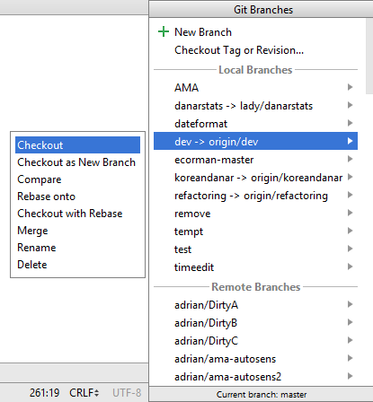

# Update auf eine neue Version oder branch

## Master branch

**Installiere git (falls du es noch nicht hast)**

* Jede git Version sollte funktionieren. Beispiel: <https://git-scm.com/download/win>
* Wähle den Ordner, in dem sich git.exe befinde: File - Settings - Version Control - Git 

**Führe ein Update deiner lokalen Version durch**

* Klicke: VCS->Git->Fetch

**Wähle branch**

* Falls du “branch” wechseln willst, wähle eine andere “branch” vom Reiter: master (aktuellste, getestete Version), oder andere (siehe weiter unten).

and then checkout (You can use 'Checkout as New Branch' if 'Checkout' is not available.)

**Branch-Update von Github**

* Drücke Strg+T, wähle Merge method und drücke OK

Auf dem Reiter siehst du eine grüne Nachricht “updated project”.

**Upload auf das Smartphone**

Erstelle die APK wie unter [Building APK](Building-APK.md) beschrieben

## Entwickler-Version (dev branch)

**Achtung:** Die Entwicklungsversion (Dev Branch) von AndroidAPS ist für Entwickler sowie Tester bestimmt, die mit Stacktraces, Log-Dateien und dem Debugger umgehen können, um Fehlerberichte erstellen zu können, die Entwicklern beim Beheben der Fehler helfen (kurzum: Personen, die wissen, was sie tun und selbstständig arbeiten können). Aus diesem Grunde sind unfertige Features deaktiviert. Diese Features sind nur im **Engineering Mode** aktiviert. Dieser kann eingeschaltet werden, wenn eine Datei mit dem Namen `engineering_mode` im gleichen Verzeichnis, in dem sich die Log-Dateien befinden, angelegt wird. Das Aktivieren dieser Features kann dazu führen, dass der Loop überhaupt nicht mehr funktioniert.

Die stabilste AndroidAPS Version ist im [Master branch](https://github.com/MilosKozak/AndroidAPS/tree/master). Es wird empfohlen diese, vor allem anfangs, zu verwenden.

Im [Dev branch](https://github.com/MilosKozak/AndroidAPS/tree/dev) sieht man, welche Funktionen gerade getestet werden. Damit können Fehler ausgebügelt und Feedback darüber gegeben werden, wie die neuen Funktionen in der Praxis funktionieren. Meist wird die Entwickler-Version auf einem alten Telefon mit einer separaten Pumpe getestet bis es stabil läuft. Jede Benutzung des dev branch erfolgt auf eigene Gefahr!

Eine kurze Zusammenfassung einiger der Änderungen an alten Features oder der Entwicklung neuer Features, die sich derzeit im dev branch befinden, ist unten aufgeführt. Falls verfügbar werden zusätzlich Links zu den Schlüsselthemen angegeben.

**Super Micro Bolus (SMB)**

Details finden sich hier: [Super Micro Boluses (SMB) on OpenAPS docs](https://openaps.readthedocs.io/en/latest/docs/Customize-Iterate/oref1.html#understanding-smb).  
  
Bedenke, dass du dich für das Testen einer Funktion entscheidest, die sich noch in Entwicklung befindet. Tue dies auf eigene Gefahr und mit der gebotenen Sorgfalt, um dich selbst zu schützen.  
  
> Du solltest mehr als vier Wochen lang (nach Abschluss von Ziel 7) gelooped haben (closed loop nicht open loop) und dir der Situationen bewusst sein, in denen dein APS versagen könnte.  
>  
Ggf. musst du deine Einstellungen anpassen, damit SMB effektiv arbeiten kann. Ein guter Ausgangspunkt ist, dein max IOB in Höhe des normalen Mahlzeitenbolus + die dreifache maximale tägliche Baslarate einzustellen. Aber bleibe wachsam und passe Einstellungen mit Sorgfalt an.

   
  
Wie bei allen Updates wurde der vorherigen Code bereinigt, verbessert und die Fehler behoben.    
Wenn du einen Fehler gefunden hast oder glaubst, dass etwas falsch berechnet wurde, dann sehe im [issues tab](https://github.com/MilosKozak/AndroidAPS/issues) nach, um zu sehen, ob schon jemand diesen Fehler bemerkt hat, falls nicht, kannst du einen neuen Issue öffnen. Je mehr Informationen du dabei bereitstellst, desto besser/schneller kann der Fehler reproduziert und behoben werden. Vergiss nicht, die [Log Dateien](../Usage/Accessing-logfiles.md) anzufügen. Neue Funktion können auch im [gitter room](https://gitter.im/MilosKozak/AndroidAPS) besprochen werden.    
Wenn du mit dem dev branch up to date bleiben willst, kannst du Updates wie oben beschrieben durchführen. Du musst nur in Android Studio auf den entsprechenden dev branch wechseln.