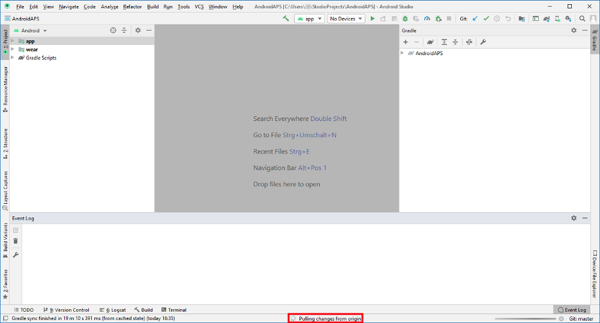

# Update auf eine neue Version oder branch

## Kein Download möglich - APK muss selbst erstellt werden

**Aufgrund der gesetzlichen Regelungen für Medizinprodukte ist AndroidAPS nicht als Download verfügbar. Du kannst die App legal für Dich selbst erstellen, darfst aber keine Kopie an andere weitergeben! Weitere Informationen findest Du auf der [FAQ Seite](../Getting-Started/FAQ.md).**

## Wichtige Hinweise

* Wenn eine neue Version erscheint, führe bitte so bald als möglich ein Update durch. You will receive an [information on the AndroidAPS home screen](../Installing-AndroidAPS/Releasenotes#release-notes) about the new version.
* Ab Version 2.3 muss für das Update git genutzt werden. Ein Update mittels ZIP-File ist nicht mehr möglich.
* Nutze bitte [Android Studio Version 3.6.1](https://developer.android.com/studio/) oder neuer, um die APK-Datei zu erstellen.
* [Windows 10 32-bit Systeme](../Installing-AndroidAPS/troubleshooting_androidstudio#unable-to-start-daemon-process) werden bei Android Studio 3.6.1 nicht unterstützt.
* Wenn Du xDrip verdwendet, stelle sicher, dass [identifiziere Empfänger](../Configuration/xdrip#identifiziere-empfanger) gesetzt ist.
* Wenn Du den Dexcom G6 mit der [gepatchted Dexcom app](../Hardware/DexcomG6#if-using-g6-with-patched-dexcom-app) verwendest, dann musst Du die Version aus dem [2.4 Verzeichnis](https://github.com/dexcomapp/dexcomapp/tree/master/2.4) installiert haben.

## Kurzanleitung für erfahrene Anwender

Bitte überspringe diesen Absatz, wenn Du zum ersten Mal aktualisierst. Die Kurzanleitung ist für erfahrene Anwender. Dein nächster Schritt ist, [git zu installieren](../Installing-AndroidAPS/git-install.rst) wenn das Programm bisher nicht auf Deinem Computer installiert ist.

Wenn Du AAPS bereits in früheren Versionen aktualisiert hast und einen Windows-PC verwendest, kannst Du in vier einfachen Schritten aktualisieren:

1. [Exportiere Deine Einstellungen](../Usage/ExportImportSettings#exportieren-der-einstellungen) von der "alten" AAPS Version auf Deinem Smartphone, um auf der sicheren Seite zu sein.
2. [Aktualisiere Deine lokale Kopie](../Installing-AndroidAPS/Update-to-new-version#update-your-local-copy) (VCS->Git->Pull)
3. [Erstelle die signierte APK-Datei](../Installing-AndroidAPS/Update-to-new-version#generate-signed-apk) (Generate signed APK - Wähle dabei 'app' statt 'wear' im Dialogfeld!)
4. Je nach [BZ-Quelle](../Configuration/BG-Source.rst) stelle sicher, dass [identifiziere Empfänger](../Configuration/xdrip#identifiziere-empfanger) in xDrip gesetzt ist or verwende die gepatchte Dexcom App aus dem [2.4 Ordner](https://github.com/dexcomapp/dexcomapp/tree/master/2.4).

## Installiere git (falls du es noch nicht hast)

Die Schritt-für-Schritt-Anleitung findest Du auf der Seite zur [git Installation](../Installing-AndroidAPS/git-install.rst).

## Führe ein Update deiner lokalen Version durch

* Klicke: VCS -> Git -> Pull
    
    

* Klicke auf Pull (keine Änderungen im Dialogfeld erforderlich)
    
    

* Warte während der Download läuft.
    
    

* Nach erfolgreichem Update der lokalen Dateien zeigt Android Studio "all files are up-to-date" an.
    
    

## Signierte APK erstellen (Generate signed APK)

<!--- Text is maintained in page building-apk.md --->

* Klicke in der Menüzeile auf "Build" und wähle "Generate Signed Bundle / APK...".

* Wähle "APK" (1.) statt "Android App Bundle" aus und klicke auf "Next" (2.).

* Bei Modul muss "app" ausgewählt werden.
* Klicke auf "Choose existing..." um Deine Keystore-Datei auszuwählen.
* Gib Deine Passwörter für Keystore und Key ein.
* Wenn das Kästchen "remember passwords" aktiviert ist, musst Du diese nicht eingeben. Falls die Box beim letzten Erstellen der apk-Datei nicht aktiviert war und Du Dich nicht mehr an Deine Passwörter erinnern kannst, findest Du eine Lösung im Bereich [Fehlerbehebung](../Installing-AndroidAPS/troubleshooting_androidstudio#verlorener-keystore).
* Klicke auf “Next”.

* Wählen Sie die Build-Variante "fullRelease" (1.) aus. 
* Klicke die Checkboxen V1 und V2 für signature versions an (2.).
* Klicke auf "Finish". (3.)

* Android Studio wird die Information "APK(s) generated successfully..." anzeigen, sobald die APK-Datei vollständig erstellt wurde.
* Falls beim Erstellen Fehler auftreten, findest Du Lösungsansätze auf den Seiten zur [Fehlerbehebung](../Installing-AndroidAPS/troubleshooting_androidstudio.rst).
* Der einfachste Weg, die fertige APK-Datei zu finden, ist ein Klick auf "Event log".

* Klicke im Event Log auf "locate".

* app-full-release.apk ist die von Dir gesuchte Datei.

## Übertrage die APK-Datei auf das Smartphone

Der einfachste Weg, die Datei app-full-release.apk auf Dein Smartphone zu übertragen ist mittels [USB-Kabel oder Google Drive](https://support.google.com/android/answer/9064445?hl=de). Bitte beachte, dass die Übertragung per Mail zu Schwierigkeiten führen kann und daher nicht empfohlen wird.

Auf dem Smartphone musst Du die Installation aus unbekannten Quellen zulassen. Anleitungen dazu findest Du im Internet (z.B. [hier](https://mobilsicher.de/ratgeber/apps-aus-apk-datei-installieren-mit-android-8) oder [hier](https://www.tutonaut.de/anleitung-android-apps-unbekannten-quellen-installieren/)).

## AAPS-Version auf dem Smartphone überprüfen

Klicke oben rechts auf das Drei-Punkte-Menü und dann den Menüpunkt Über, um auf Deinem Smartphone die installierte AAPS-Version anzuzeigen.

## Problembehandlung

Siehe die separate Seite zur [Problembehandlung bei Android Studio](../Installing-AndroidAPS/troubleshooting_androidstudio.rst).