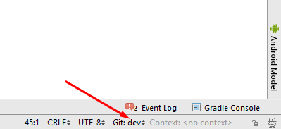

# Update auf eine neue Version oder branch

## Master branch

**Installiere git (falls du es noch nicht hast)**

* Jede git Version sollte funktionieren. Beispiel: <https://git-scm.com/download/win>
* Wähle den Ordner, in dem sich git.exe befinde: File - Settings - Version Control - Git 

**Führe ein Update deiner lokalen Version durch**

* Klicke: VCS->Git->Fetch

**Wähle branch**

* Falls du “branch” wechseln willst, wähle eine andere “branch” vom Reiter: master (aktuellste, getestete Version), oder andere (siehe weiter unten).

und anschließend "checkout". Verwende 'Checkout as New Branch' falls 'Checkout' nicht angezeigt wird.

**Branch-Update von Github**

* Drücke Strg+T, wähle Merge method und drücke OK

Auf dem Reiter siehst du eine grüne Nachricht “updated project”.

**Upload auf das Smartphone**

Erstelle die signierte APK wie unter [AndroidAPS installieren - App erstellen (Generate signed APK)](Building-APK.html#generate-signed-apk) beschrieben.

## Entwickler-Version (dev branch)

**Achtung:** Die Entwicklungsversion (Dev Branch) von AndroidAPS ist für Entwickler sowie Tester bestimmt, die mit Stacktraces, Log-Dateien und dem Debugger umgehen können, um Fehlerberichte erstellen zu können, die Entwicklern beim Beheben der Fehler helfen (kurzum: Personen, die wissen, was sie tun und selbstständig arbeiten können). Aus diesem Grunde sind unfertige Features deaktiviert. Diese Features sind nur im **Engineering Mode** aktiviert. Dieser kann eingeschaltet werden, wenn eine Datei mit dem Namen `engineering_mode` im gleichen Verzeichnis, in dem sich die Log-Dateien befinden, angelegt wird. Das Aktivieren dieser Features kann dazu führen, dass der Loop überhaupt nicht mehr funktioniert.

Die stabilste AndroidAPS Version ist im [Master branch](https://github.com/MilosKozak/AndroidAPS/tree/master). Es wird empfohlen diese, vor allem anfangs, zu verwenden.

Im [Dev branch](https://github.com/MilosKozak/AndroidAPS/tree/dev) sieht man, welche Funktionen gerade getestet werden. Damit können Fehler ausgebügelt und Feedback darüber gegeben werden, wie die neuen Funktionen in der Praxis funktionieren. Meist wird die Entwickler-Version auf einem alten Telefon mit einer separaten Pumpe getestet bis es stabil läuft. Jede Benutzung des dev branch erfolgt auf eigene Gefahr! When testing any new features, remember that you are choosing to test a still-in-development feature. Do so at your own risk & with due diligence to keep yourself safe.

If you find a bug or think something wrong has happened when using the Dev branch, then view the [issues tab](https://github.com/MilosKozak/AndroidAPS/issues) to check whether anyone else has found it, or add it yourself if not. The more information you can share here the better (don't forget you may need to share your [log files](../Usage/Accessing-logfiles.md). The new features can also be discussed in the [gitter room](https://gitter.im/MilosKozak/AndroidAPS).    
If you would like to be up-to-date on the Dev Branch you can use the same steps as already outlined above. You just need to change to the corresponding "dev"-Branch in Android Studio.