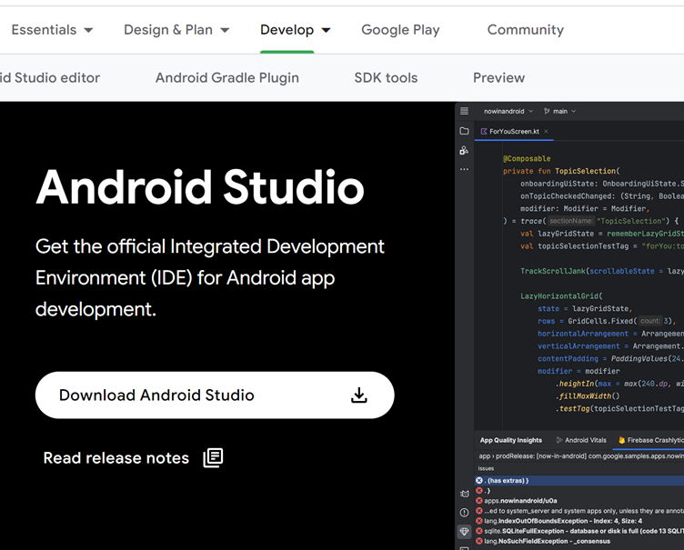
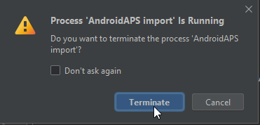

# AAPS erstellen

## Kein Download möglich - APK muss selbst erstellt werden

**Die AAPS-App (eine apk-Datei) ist aufgrund der Vorschriften rund um medizinische Geräte nicht zum Download verfügbar. Es ist zulässig, die App für den eigenen Gebrauch zu erstellen, aber du darfst keine Kopie an andere weitergeben!**

Siehe [FAQ Seite](../Getting-Started/FAQ.md) für Details.

(Building-APK-recommended-specification-of-computer-for-building-apk-file)=

## Computer- und Software-Spezifikationen für das "Bauen" von AAPS

- Please use the **[Android Studio version called at least Hedgehog or one more recent like Iguana, Jellyfish, and Koala](https://developer.android.com/studio/)** to build the apk. <u>**Do not use the Ladybug version.**</u> Older versions of Android Studio need to be updated first!
- [Windows 32-Bit-Systeme](troubleshooting_androidstudio-unable-to-start-daemon-process) werden von Android Studio nicht unterstützt. Bitte beachte, dass sowohl eine 64-Bit-CPU als auch ein 64-Bit-Betriebssystem zwingend erforderlich sind. Wenn dein System diese Bedingungen nicht erfüllt, musst du die entsprechende Hardware, Software oder das ganze System ersetzen.

<table class="tg">
<thead>
  <tr>
    <th class="tg-baqh">Betriebssystem (nur 64 Bit)</th>
    <th class="tg-baqh">Windows 8 oder höher</th>
    <th class="tg-baqh">Mac OS 10.14 oder höher</th>
    <th class="tg-baqh">Jedes Linux unterstützt Gnome, KDE oder Unity DE;&nbsp;&nbsp;GNU C Library 2.31 oder höher</th>
  </tr>
</thead>
<tbody>
  <tr>
    <td class="tg-baqh"><p align="center">CPU (nur 64 Bit)</td>
    <td class="tg-baqh">x86_64 CPU-Architektur; Intel Core oder neuere Generation oder AMD CPU mit Unterstützung für einen <br><a href="https://developer.android.com/studio/run/emulator-acceleration#vm-windows" target="_blank" rel="noopener noreferrer"><span style="text-decoration:var(--devsite-link-text-decoration,none)">Windows Hypervisor</span></a></td>
    <td class="tg-baqh">ARM-based Chips oder Intel Core der zweiten Generation oder neuer mit Unterstützung für <br><a href="https://developer.android.com/studio/run/emulator-acceleration#vm-mac" target="_blank" rel="noopener noreferrer"><span style="text-decoration:var(--devsite-link-text-decoration,none)">Hypervisor.Framework</span></a></td>
    <td class="tg-baqh">x86_64 CPU Architektur; Intel Core der zweiten Generation oder neuer, alternativ AMD Prozessor mit Unterstützung für AMD Virtualization (AMD-V) und SSSE3</td>
  </tr>
  <tr>
    <td class="tg-baqh"><p align="center">RAM</td>
    <td class="tg-baqh" colspan="3"><p align="center">8GB oder mehr</td>
  </tr>
  <tr>
    <td class="tg-baqh"><p align="center">Festplatte</td>
    <td class="tg-baqh" colspan="3"><p align="center">Mind. 30 GB freier Speicherplatz. SSD wird empfohlen.</td>
  </tr>
  <tr>
    <td class="tg-baqh"><p align="center">Bildschirmauflösung</td>
    <td class="tg-baqh" colspan="3"><p align="center">1280 x 800 Minimum <br></td>
  </tr>
  <tr>
    <td class="tg-baqh"><p align="center">Internet</td>
    <td class="tg-baqh" colspan="3"><p align="center">Breitband</td>
  </tr>
</tbody>
</table>

\*\*Es wird dringend empfohlen eine SSD (Solid State Disk) anstelle einer HDD (Hard Disk Drive) zu verwenden, da damit weniger Zeit benötigt wird, um die AAPS apk Datei zu erstellen. \* Es ist aber immer noch möglich eine Festplatte (HDD) zu verwenden, um die **AAPS** apk Datei zu erstellen. Wenn du dies tust, kann es lange dauern, bis der Bau der App abgeschlossen ist, aber sobald er begonnen hat, kann man ihn unbeaufsichtigt lassen.

## Hilfe und Unterstützung während des Erstellungsprozesses

Wenn du Schwierigkeiten beim Bau der **AAPS** App hast, gibt es einen speziellen [**Fehlerbehebung Android Studio**](../Installing-AndroidAPS/troubleshooting_androidstudio) Bereich, den du zuerst besuchen solltest.

Wenn du denkst, dass etwas in der Anleitung zum Erstellen der App falsch ist, fehlt oder verwirrend erscheint, oder du hast anschließend immer noch Probleme, bitte kontaktiere andere **AAPS** Benutzer auf [Facebook](https://www. acebook.com/groups/AndroidAPSUsers) oder [Discord](https://discord.gg/4fQUWHZ4Mw). Wenn Du selber etwas ändern möchtest (Screenshots aktualisieren _etc_), sende bitte einen [Pull Request (PR)](../make-a-PR.md).

## Schritt-für-Schritt Anleitung zum Erstellen der AndroidAPS.wear apk

```{admonition} WARNING
:class: warning
If you have built AAPS before, you don't need to take all the following steps again.
Please jump directly to the [update guide](../Installing-AndroidAPS/Update-to-new-version)!
```

Die allgemeinen Schritte zum Erstellen der **AAPS** apk Datei sind wie folgt:

4.1 [Git installieren](Install-Git)

4.2 [Android Studio installieren](Building-APK-install-android-studio)

4.3 [AAPS-Code herunterladen](Building-APK-download-AAPS-code)

4.4 [Git-Pfad in den Android Studio Einstellungen setzen](Building-APK-set-git-path-in-preferences)

4.5 [AAPS "signed" apk erstellen](Building-APK-generate-signed-apk)

In dieser Anleitung findest du _Beispiel_ Screenshots zum Erstellen einer **AAPS** apk-Datei. Weil **Android Studio** - die Software, die wir zum Erstellen der **AAPS** apk verwenden - regelmäßig aktualisiert wird, sind diese Screenshots vielleicht nicht identisch mit Deiner Installation, aber sie sollten trotzdem zur Anleitung ausreichen.

Da **Android Studio** auf Windows, Mac OS X und Linux Plattformen läuft, kann es auch kleinere Unterschiede in den Schritten zwischen den verschiedenen Plattformen geben.

(Git installieren)=

### Git installieren (wenn Du es nicht hast)

```{admonition} Why Git? 
:class: dropdown

Git is known as a “_Versioning Control System_” (VCS).\
Git is a program that allows you to track changes in code and to collaborate with others. You will use Git to make a copy of the **AAPS** source code from the GitHub website to your local computer. Then, you will use Git on your computer to build the **AAPS** application (apk). 
```

#### Schritte zur Installation von Git

1. Überprüfe, ob du **Git** nicht bereits installiert hast. Du kannst dies tun, indem du “git” in die Windows-Suchleiste eingibst – wenn Du **“Git Bash”** oder eine andere Form von Git siehst, ist es bereits installiert und du kannst direkt zu [Android Studio installieren] gehen (Building-APK-install-android-studio):


2. Wenn du Git nicht installiert hast, lade die neueste Version für dein System von [**hier**](https://git-scm.com/downloads) herunter und installiere sie. Jede aktuelle Git-Version sollte funktionieren, wähle die richtige Version nach deinem System, entweder Mac, Windows oder Linux.

**Hinweis für Mac-Benutzer:** Die Git-Webseite schlägt vor, ein zusätzliches Programm namens "Homebrew" zu installieren, um die Installation zu unterstützen. Wenn Du git über homebrew installierst, musst Du keine Einstellungen ändern.

(Make_a_note_of_Git_path)=

- Bei der Installation wirst Du nach einer "destination location" (einem Zielordner) gefragt werden. Notiere Dir bitte den Ort an dem Git installiert wird (den Installationspfad). Du wirst dort im nächsten Schritt etwas überprüfen müssen. Der Installationspfad wird in in etwa so aussehen: "C:\Program Files\Git\cmd\git.exe"

- Akzeptptiere in den verschiedenen Schritten der Git-Installation die voreingestellten Optionen.

- Falls Du nach der Installtion vergessen hast (oder Du Dir keinen Notiz gemacht hast), in welchem Verzeichnis Git installiert wurde, kannst Du es auch auf folgendem Weg herausfinden: Gib in der Windows-Suchleiste unten "git"ein, klicke mit der rechten Maustaste auf "Git Bash", "Dateispeicherort öffnen". Damit öffnet sich der Installationspfad.

- Starte vor dem nächsten Schritt Deinen Computer bitte neu.

(Building-APK-install-android-studio)=

### Android Studio installieren

- **Du musst durchgängig online sein, da Android Studio verschiedene Updates herunterladen wird**

```{admonition} What is Android Studio?
:class: dropdown
Android Studio is a program which runs on your computer. It allows you to download source code from the internet (using Git) and build smartphone (and smartwatch) apps. You cannot "break" a current, looping version of **AAPS** which you might have running on a smartphone by building a new or updated app on your PC with Android Studio, these are totally separate processes. 
```

The following screenshots have been taken from Android Studio Version **Hedgehog**, they should be identical with more recent versions.

Einer der wichtigsten Punkte bei der Installation von Android Studio ist: **Geduldig sein!** Während der Installation und Einrichtung lädt Android Studio sehr viele Daten nach und das braucht seine Zeit.

**Download a supported version of Android Studio (Hedgehog, Iguana, Jellyfish or Koala - not Ladybug)** from [**here**](https://developer.android.com/studio/archive), locate it in your browser downloads folder, and install it on your computer:



Beim ersten Start des Android Studios wirst Du wie folgt begrüßt:


Wähle "Next":


Ändere keine der Markierungen und wähle "Next":


Erlaube die Installation im Standardverzeichnis und wähle "Next":


Wenn der Smart Menu Ordner vorgeschlagen wird, wähle einfach "Installieren". Du musst nun ein paar Minuten warten, während Android Studio installiert wird. Du solltest dann sehen, dass die Installation abgeschlossen ist, wähle anschließend "Weiter":


Wähle nun "Beenden":


Android Studio wird jetzt gestartet.

Wenn Du gefragt wirst, ob Du Einstellungen importieren möchtest, wähle "Do not import settings" aus. Wir möchten keine Einstellungen aus früheren Installationen importieren:


Entscheide, ob du Daten mit Google teilen möchtest oder nicht (falls unsicher, wähle einfach "Nicht senden").


Du erhältst jetzt eine Nachricht über ein fehlendes Software-Entwicklungskit (SDK) (keine Sorge, das wird bald gelöst), wähle "Weiter":


The software should autoselect the required (SDK) and choose a location.

```{admonition} What is an Android SDK?
:class: dropdown

In order to run **AAPS** on the phone the application needs to integrate with Android itself. Android provides “_software development kits_” (SDK) which allow apps like **AAPS** to interface with an Android operating system.
```

Das SDK-Plattform-Paket bezieht sich **nicht** auf die Android-Version, die auf deinem Telefon läuft, sondern auf die Version von **AAPS**. **AAPS** Version 3.2 (und neuer) basiert auf API Level 34, der automatisch in der **Hedgehog** Version von **Android Studio** ausgewählt wird. Daher einfach auf "Weiter" klicken:


Wenn die Einstellungen überprüft werden sollen, wähle einfach "Weiter":


Wenn nach der Lizenzvereinbarung gefragt wird, wähle "Akzeptieren" und klicke dann auf "Beenden":


> **_Hinweis:_** Abhängig von deinem Setup können die zu akzeptierenden Lizenzen von dem abweichen, was im Screenshot angezeigt wird.

Warte, während Android Studio zusätzliche Komponenten herunterlädt, dies kann einige Minuten dauern:


Sobald alles heruntergeladen ist, wird der "Fertig" Button blau, und du kannst es anklicken:


Du wirst jetzt mit dem Bildschirm "Willkommen im Android Studio" begrüßt.


(Building-APK-download-AAPS-code)=

### Download the AAPS code

```{admonition} Why can it take a long time to download the AAPS code?
:class: dropdown

The first time **AAPS** is downloaded, Android Studio will connect over the internet to the Github website to download the source code for **AAPS**. This should take about 1 minute. 

Android Studio will then use **Gradle** (a development tool in  Android studio) to identify other components needed to install these items on your computer. 

```

On the Android Studio Welcome screen, check that "**Projects**" (1) is highlighted on the left. Then click "**Get from VCS**" (2) on the right:


- We will now tell Android Studio where to get the code from:

- "Repository URL" should be selected (by default) on the left (1).

- "Git" should be selected (by default) as version control (2).

Now copy this URL:

```
https://github.com/nightscout/AndroidAPS.git
```

and paste it into the URL textbox (3).

- Check the (default) directory for saving the cloned code is sensible (4).

```{admonition} INFORMATION
:class: information
Make a note of the directory. It is where your sourcecode is stored!
```

- Now click the button "Clone" (5).


You will now see a screen telling you that the repository is being cloned:


At some point, you may be asked whether you want to trust the project. Klicke auf "Trust project":


Only for Windows users: If your firewall asks for permission, grant access:


Nachdem das Projektarchiv erfolgreich geklont wurde, wird Android Studio das geklonte Projekt öffnen.

Click on the cog top right and select "**Switch to Classic UI...**" to return to the view used in this documentation.

If you do not see that cog, don't worry. You already use the classic UI!


Restart Android Studio to make the changes effective.


You might get one or both of the following warnings about running processes. It's save to abort them!

 

When Android Studio opened again, wait patiently (this may take a few minutes), and particularly, **do not** update the project as suggested in the pop-up.


```{admonition} NEVER UPDATE GRADLE!
:class: warning

Android Studio might recommend updating the gradle system. **Never update gradle!** This will lead to difficulties.
```

_Optional_ - If you want to clear the pop-up for **"project update recommended"**, click on the blue text "More" (1). In the dialog box the select "Don't ask for this project" (2).


For Windows users only:
If you have not restarted your computer since installing or updating Git, close Android Studio now. Then restart your computer, and re-open Android Studio.

(Building-APK-set-git-path-in-preferences)=

### Pfad zu git.exe in den Einstellungen von Android Studio festlegen

Now we will tell Android studio where to find Git, which you installed [earlier](Install-Git).

- Windows users only: Make sure you have restarted your computer after [installing Git](Install-Git).
- Open **Android Studio** (you can find it by searching in the Start menu).
- In the top left corner of **Android Studio**, navigate to _File-Settings_ (Windows) or _Android Studio > Preferences_ (Mac). This opens the following window, click to expand the dropdown called "version control" (1):


- Now select "**Git**" (2).
- In the lower middle of the page, make sure update method "Merge" (3) is selected.
- Check if **Android Studio** can automatically locate the correct path to **git.exe** automatically by clicking the button "Test" (4):


- If the automatic setting is successful, your current version of **Git** will be displayed next to the path.

  

- If you find that **git.exe** is not found automatically, or that clicking "Test" results in an error (1), you can either manually enter the path which you saved [earlier](Make_a_note_of_Git_path), or click on the folder icon (2) and manually navigating to the directory where **git.exe** is stored:

  

- Use the [search function](https://www.tenforums.com/tutorials/94452-search-file-explorer-windows-10-a.html) in windows explorer to find "git.exe" if you are unsure where git has been installed. How to do this is explained [above](Make_a_note_of_Git_path) in more detail.

- If you have manually selected it, check your selected Git path with the "Test" button as described above.

When the Git version is displayed next to the path (see screenshot above) you have completed this stage successfully and you can close the Android Studio "Settings" window by clicking the "**OK**" button (5):


(Building-APK-generate-signed-apk)=

### Build the AAPS "signed" APK

```{admonition} Why does the AAPS app need to be "signed"?
:class: dropdown

Android requires each app to be _signed_, to ensure that it can only be updated later from the same trusted source that released the original app. For more information on this topic, follow [this link](https://developer.android.com/studio/publish/app-signing.html#generate-key). For our purposes, this just means that we generate a signing or "keystore" file and use it when we build the **AAPS** app.
```

- In the menu bar, click "Build" (1), select "Generate Signed Bundle/APK (2)


- Select "APK" instead of "Android App Bundle" and click "Next":


- In the next screen, make sure that "Module" is set to "AAPS.app" (1).

(Building-APK-wearapk)=

```{admonition} INFORMATION!
:class: information
If you want to create the apk for your watch, you need to select AAPS.wear!
```

- Click "Create new..." (2) to start creating your key store.

```{admonition} INFORMATION!
:class: information
You will only need to create the keystore once.
If you have build AAPS before, do NOT create a new keystore but select your existing one!
```

**_Note:_** The key store is a file in which the information for signing the app is stored. It is encrypted, and the information is secured with passwords.


- Click the "folder" symbol (1) to select a path on your computer for your key store:


- Click on the drop-down menu (1), to select where you want to save your keystore file. In this example, it is being saved in "My Documents" (2). Do not save the keystore in same folder as your Android Studio files (StudioProject). Type in a simple name for your key store (3) and confirm it with "OK" (4):


This will take you back to the previous screen. Your chosen location for saving the key store file is shown.

```{admonition} WARNING!
:class: warning
Make sure to note down for yourself where your keystore is stored. You will need it when you build the next AndroidAPS update!
```

Now choose a simple password (make a note of it), enter it in the password box (1), and confirm it (2).  The passwords for key store and key do not have to be sophisticated. If you lose your password in the future, see [troubleshooting for lost key store](troubleshooting_androidstudio-lost-keystore).

The default alias (3) for your key is "key0", leave this unchanged.

You now need a password for your key. To keep it simple, if you want, you can use the same password you used for your keystore, above. Enter a password (4) and confirm (5) it.

```{admonition} WARNING!
:class: warning
Note down these passwords! You will need them when you build the next AAPS update!
```

The validity (6) is 25 years by default, leave it as it is.

Enter your first and last name (7). No other information needs to be added.

Click "OK" (8) to continue:


On the "Generate signed bundle or APK" page, the path to your keystore will now be displayed. Now re-enter the Key Store password (1) and Key password (2), and tick the box to remember passwords is checked (3), so you don't have to enter them again next time you build the apk (i.e. when updating to a new AAPS version). Klicke auf "Next" (4):


On the next screen, select build variant "fullRelease" (1) and click "Create" (2).


Android Studio will now build the **AAPS** apk. It will show "Gradle Build running" at the bottom right. The process takes some time, depending on your computer and internet connection, **be patient!** If you want to watch the progress of the build, click on the small hammer "build" at the bottom of Android Studio:


Now you can watch the building progress:


Android Studio will display the information "BUILD SUCCESSFUL" after build is finished. You may see a popup notification which you can click to select "locate". If you miss this, click on the notification "locate or analyse the APK" (yellow highlight) at the very bottom of the screen to bring up the Notifications:


_If the build was not successful, refer to the [troubleshooting section](../Installing-AndroidAPS/troubleshooting_androidstudio)._

In the Notifications box, click on the blue link "locate":


Your file manager/explorer will open. Navigiere zum Verzeichnis "full" (1) > "release" (2).


Open the folder "release". The file "app-full-release.apk" (1) is the **AAPS** apk that you have just built, you will be transferring this file to your smartphone in the next section of the docs:


Glückwunsch! Now you have built the **AAPS** apk file, you can move to the next stage of [Transferring and Installing **AAPS**](Transferring-and-installing-AAPS.md).
