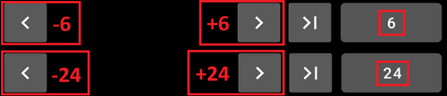
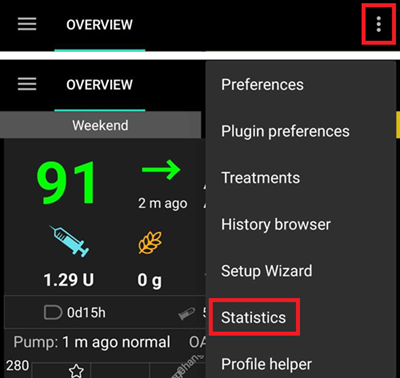

# **Deine Daten reviewen**

## **AAPS-Historie**

**AAPS** speichert die gesamte Historie (__**Glukosewerte****, Behandlungen, Basal, Ziele, **Profilwechsel**,…) in seiner eigenen Datenbank, die nicht exportiert oder kopiert werden kann und nach einer Weile bereinigt werden muss. Zur Bereinigung ist eine Überprüfung der „ältesten Daten“ in **AAPS** erforderlich. Dies kann durch das Hochladen zu Nightscout erledigt werden.

Die **AAPS**-Historie kann über die Funktion „Historie“ (Drei-Punkte-Menü oben rechts) aus der Übersicht heraus aufgerufen werden.

Wähle das zu prüfende Datum.

Die Anzeigeoptionen sind identisch mit denen des Graphen in der Übersicht.

Die „Historie“ kann in Zeitspannen von 6, 12, 18 oder 24 Stunden angezeigt werden.

Durch Drücken auf die Pfeiltasten neben dem Datum kann der dargestellte Zeitraum (wie unten dargestellt) nach links oder rechts verschoben werden.

Um zu den aktuellen Daten zurückzukehren, tippe auf diese Schaltfläche:

(reviewing-statistics)=
## **AAPS-Statistiken**

**AAPS** stellt einige rudimentäre Statistiken zur Verfügung.

Die meisten Werte und Kennzahlen basieren auf den [Empfehlungen](https://diabetesjournals.org/care/article/46/Supplement_1/S97/148053/6-Glycemic-Targets-Standards-of-Care-in-Diabetes) der ADA (American Diabetes Association) aus 2023.

### Total Daily Dose (TDD, dt. tägliche Gesamtinsulinmenge)

**TDD** fasst die Informationen einer Woche, gruppiert nach Tagen, zusammen:

- Σ: Die tägliche Gesamtinsulinmenge (**TDD**), die Summe aller Insulinmengen des Tages (Bolus und Basal).
- Bolus: Die Summe aller Bolusgaben und SMBs.
- Basal: Nur das Basal.
- Basal%: Der Anteil des Basalinsulins an der Gesamtinsulinmenge (**TDD**).
- KHs: eingegebene und verzögerte (sog. eCarbs) Kohlenhydrate.

Die TDD-Statistik wird erst mit dem Aufruf der Seite berechnet und braucht daher etwas Zeit.

### Time in Range (TIR, dt. Zeit im Zielbereich)

Time In Range (**TIR**): 70-180 mg/dl oder 3,9-10 mmol/l.

**TIR**-Informationen stehen, in Abhängigkeit von der Datenmenge in der **AAPS**-Datenbank, für 7 und 30 Tage zur Verfügung.

Time In Tight Range (TITR) 70-140 mg/dl oder 3,9-7,8 mmol/l sind unten verfügbar.

**Besprich den Zielbereich mit Deinem Diabetes-Team.**

Dein Diabetes kann anders aussehen. Du solltest alle vorgeschlagenen Zielbereiche mit Deinem Endokrinologen oder Deinem Diabetes-Team besprechen. Bei richtiger Verwendung können AAPS-Statistiken ein effektives Mittel sein, um __Glukokosewert__-Trends und deren Entwicklung im Auge zu behalten.

Detaillierte 14 Tage **TIR**-Statistiken.

**SD**: Standard Deviation (dt. Standardabweichung), ein [Indikator](https://www.ncbi.nlm.nih.gov/pmc/articles/PMC3125941/) für Glukosewert-Schwankungenof (je höher umso schlechter).

HbA1c: die Schätzung des sich ergebenden glykierten Hämoglobins („Langzeit-Blutzucker“), basierend auf dem Durchschnitt der CGM-Messungen. Dies ist ein indikativer Wert, der möglicherweise nicht mit dem im Blut gemessenen HbA1c übereinstimmt.

### Aktivitätsmonitor

Der Aktivitätsmonitor erfasst die Zeit für jede **AAPS**-Aktivität.

------

## **Wie unterscheiden sich Nightscout und Tidepool?**

Nightscout ermöglicht die Speicherung von **AAPS**-Daten und bietet eine breite Palette an [Auswertungsmöglichkeiten](https://nightscout.github.io/nightscout/reports/).

Tidepool dahingegen erlaubt den Review der [Daten](https://www.tidepool.org/viewing-your-data) und macht das [Teilen der Informationen mit dem Diabetes-Team sehr einfach](https://www.tidepool.org/providers/how-it-works#tidepool-data-platform).