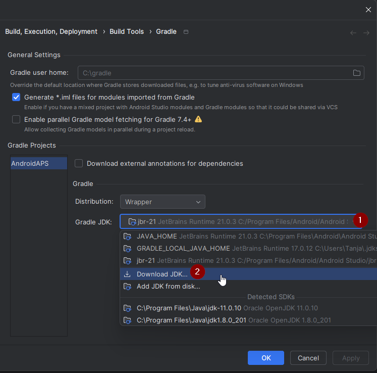

# Updating to AAPS 3.2.0.4

(update-aaps-3204)=

## Kein Download möglich - APK muss selbst erstellt werden

**Die AAPS-App (eine apk-Datei) ist aufgrund der Vorschriften rund um medizinische Geräte nicht zum Download verfügbar. Es ist zulässig, die App für den eigenen Gebrauch zu erstellen, aber du darfst keine Kopie an andere weitergeben!**

Zu den Details schaue bitte auf die [FAQ-Seite](../UsefulLinks/FAQ.md).

## Computer and software specifications for building AAPS 3.2.0.4

* Um die APK zu erstellen ist möglicherweise eine bestimmte **[Android Studio](https://developer.android.com/studio/)**-Version erforderlich.

| AAPS-Version            | Empfohlene <br/>Android Studio<br/> Version | Alternative <br/>Android Studio<br/> Version | Gradle | JVM |
| ----------------------- | ------------------------------------------------------- | -------------------------------------------------------- | ------ |:--- |
| [3.2.0.4](#version3200) | Hedgehog (2023.1.1)                                     | up to Meerkat                                            | 8.2    | 17  |

Die „empfohlene Version“ enthält im Paket bereits die entsprechende JVM-Version. Die empfohlene Version ist gleichzeitig auch die Mindestversion, die Du zum Erstellen von **AAPS** nutzen kannst. Mit einer älteren Version als der, die unter „empfohlen“ aufgeführt ist, wirst Du **NICHT** in der Lage sein, AAPS zu erstellen. Solltest Du eine andere Version verwenden, kann es aufgrund der JVM-Version zu Problemen kommen. Schaue auf den Seiten zur [Fehlerbehebung für Android Studio](#troubleshooting_androidstudio-uncommitted-changes) nach, um diese Probleme zu lösen. Wenn Deine aktuelle Android Studio Version nicht in der Tabelle aufgeführt ist, musst Du sie zuerst aktualisieren.

Die Gradle-Version ist mit dem Quellcode verknüpft. Wenn Du den Quellcode herunterlädst oder aktualisierst, bekommst Du automatisch die richtige Gradle-Version. Das wird hier rein zu Deiner Information erwähnt. Du brauchst nichts machen.

* Android Studio unterstützt keine [Windows 32-Bit-Systeme](#troubleshooting_androidstudio-unable-to-start-daemon-process). Bitte beachte, dass sowohl eine **64-Bit-CPU als auch ein 64-Bit-Betriebssystem zwingend erforderlich sind**. Wenn Dein System diese Bedingung nicht erfüllt, musst Du die entsprechende Hardware, Software oder das ganze System ersetzen.

<table class="tg">
<tbody>
  <tr>
    <th class="tg-baqh">Betriebssystem (nur 64 Bit)</th>
    <td class="tg-baqh">Windows 8 oder höher</td>
    <td class="tg-baqh">Mac OS 10.14 oder höher</td>
    <td class="tg-baqh">Jedes Linux unterstützt Gnome, KDE oder Unity DE;&nbsp;&nbsp;GNU C Library 2.31 oder höher</td>
  </tr>
  <tr>
    <th class="tg-baqh"><p align="center">CPU (nur 64 Bit)</th>
    <td class="tg-baqh">x86_64-CPU-Architektur Intel Core der 2. Generation oder neuer oder AMD-CPU mit Unterstützung für <br><a href="https://developer.android.com/studio/run/emulator-acceleration#vm-windows" target="_blank" rel="noopener noreferrer"><span style="text-decoration:var(--devsite-link-text-decoration,none)">Windows Hypervisor-Framework</span></a></td>
    <td class="tg-baqh">ARM-basierte Chips oder Intel Core der 2. Generation oder neuer mit Unterstützung für <br><a href="https://developer.android.com/studio/run/emulator-acceleration#vm-mac" target="_blank" rel="noopener noreferrer"><span style="text-decoration:var(--devsite-link-text-decoration,none)">Hypervisor-Framework</span></a></td>
    <td class="tg-baqh">x86_64 CPU Architektur; Intel Core der zweiten Generation oder neuer, alternativ AMD Prozessor mit Unterstützung für AMD Virtualization (AMD-V) und SSSE3</td>
  </tr>
  <tr>
    <th class="tg-baqh"><p align="center">RAM</th>
    <td class="tg-baqh" colspan="3"><p align="center">8GB oder mehr</td>
  </tr>
  <tr>
    <th class="tg-baqh"><p align="center">Festplatte</th>
    <td class="tg-baqh" colspan="3"><p align="center">Mind. 30 GB freier Speicherplatz. SSD wird empfohlen.</td>
  </tr>
  <tr>
    <th class="tg-baqh"><p align="center">Bildschirmauflösung</th>
    <td class="tg-baqh" colspan="3"><p align="center">min. 1280 x 800<br></td>
  </tr>
  <tr>
    <th class="tg-baqh"><p align="center">Internet</th>
    <td class="tg-baqh" colspan="3"><p align="center">Breitband</td>
  </tr>
</tbody>
</table>

**Es wird dringend empfohlen eine SSD (Solid State Disk) anstelle einer HDD (Hard Disk Drive) zu verwenden, da damit weniger Zeit benötigt wird, um die AAPS-apk-Datei zu erstellen**. Es ist aber auch möglich eine Festplatte (HDD) zum Erstellen der **AAPS**-apk-Datei zu nutzen. Wenn du dies tust, kann es lange dauern, bis der Bau der App abgeschlossen ist, aber sobald er begonnen hat, kann man ihn unbeaufsichtigt lassen.

## Help and support during 3.2.0.4 building process

If you run into difficulties in the process of building the **AAPS** app, there is a dedicated [**troubleshooting Android Studio**](https://androidaps.readthedocs.io/en/3.2/GettingHelp/TroubleshootingAndroidStudio.html) section, please consult that first.

Wenn Du den Eindruck hast, dass in der Anleitung Schritte falsch, fehlend oder missverständlich sind, oder Du trotzdem noch Probleme hast, wende Dich über [Facebook](https://www.facebook.com/groups/AndroidAPSUsers) oder [Discord](https://discord.gg/4fQUWHZ4Mw) an andere **AAPS**-Nutzende. Wenn Du selbst etwas ändern möchtest (z.B. Screenshots aktualisieren _etc_), erstelle einen entsprechenden [Pull-Request (PR)](../SupportingAaps/HowToEditTheDocs.md).

```{note}
This page provides both example pictures for the **New** and old (**Classic**) Android Studio user interfaces.
```

## Overview for updating 3.2.0.x to 3.2.0.4

```{contents} Steps for updating to 3.2.0.4
:depth: 1
:local: true
```

### Export your current settings

Export your settings from the existing **AAPS** version on your phone. Vielleicht brauchst Du sie nicht, aber sicher ist sicher.

See the [Export & import settings](ExportImportSettings.md) page if you don't remember how to do this.

### Update your local AAPS copy

* Öffne Dein bestehendes AAPS-Projekt mit Android Studio. Möglicherweise musst Du Dein Projekt wählen. Klicke (doppelt) auf das AAPS-Projekt.


<br>


* In the menu bar of Android Studio, select Git -> Fetch


<br>


* Unten rechts wird Dir eine Meldung angezeigt, sobald der Fetch erfolgreich durchgeführt wurde.


<br>


* In the menu bar, now select Git -> Pull


<br>


* Lasse alle Optionen wie sie sind (Original/Master) und wähle Pull.


<br>


* Warte ab, während der Download läuft. Du siehst dazu einen Hinweis in der Fußzeile. Eine Erfolgsmeldung wird angezeigt, so bald erfolgreich heruntergeladen wurde.

  ```{note}
  Die Anzahl der aktualisierten Dateien kann unterschiedlich sein! Dies ist kein Hinweis auf einen Download-Fehler.
  ```


<br>


* Gradle Sync wird ausgeführt, um einige Abhängigkeiten herunterzuladen. Warte, bis es fertig ist.


<br>


### Select JVM version 17

- Öffne die Gradle-Ansicht, in dem Du auf der rechten Seite im Android Studio auf den Elefanten (1) klickst, und öffne dann die Einstellungen (2) und wähle dort die **Gradle Settings** (3) aus:


<br>


- In **Gradle JDK** field, check if the appropriate version: **jbr-17** is selected (1) If not, click on the field, and see if it is already available in the list.




- In Version (1), select **17**. In Vendor (2) select JetBrains Runtime or any Vendor. Location (3): Ändere nichts.


- Schließe die **Settings** (dt. Einstellungen) mit **OK**.

### Select the AAPS 3.2.0.4 branch

- At the bottom left, select the Git symbol, right-click on 3.2.0.4 and Checkout.


<br>


### Sync project with Gradle

```{admonition} WARNING!
:class: warning
**Never update Gradle.** Always sync it with the project.
```

Use the elephant icon and Sync Project with Gradle Files (or follow [this](#gradle-resync)) for the new UI.


Or ([this](https://androidaps.readthedocs.io/en/3.2/GettingHelp/TroubleshootingAndroidStudio.html#gradle-resync)) for the classic UI.


### Build the Signed 3.2.0.4 APK

Dein Quellcode entspricht jetzt der zuletzt freigegebenen Version und alle Voraussetzungen sind geprüft. Es ist an der Zeit, die signierte APK wie im Abschnitt[Signierte AAPS APK erstellen](#Building-APK-generate-signed-apk) beschrieben zu erstellen (bauen).

### Transfer and install the 3.2.0.4 APK

Du musst die APK-Datei auf Dein Smartphone übertragen, um sie dort installieren zu können.

```{note}
Wenn Du beim Erstellen Deinen bestehenden „Keystore“ im Android Studio genutzt hast, musst Du die bestehende App nicht deinstallieren. Um die APK zu installieren, folge den Anweisungen während des Updatevorgangs.
In allen anderen Fällen (z.B. wenn ein neuer 'key store' für das Signieren der APK genutzt wurde), muss die alte App gelöscht werden, bevor die neue Version installiert werden kann. **Achte darauf, Deine Einstellungen zu exportieren!**
```

Nutze die Anleitung [AAPS auf Dein Smartphone übertragen und installieren](../SettingUpAaps/TransferringAndInstallingAaps.md)

### Check AAPS version 3.2.0.4 on phone

Nachdem Du die neue APK-Datei installiert hast, kannst Du auf dem Smartphone die Version prüfen. Gehe dazu oben rechts auf die drei Punkte und wähle dann "Über". Du solltest die aktuelle Version angezeigt bekommen.

