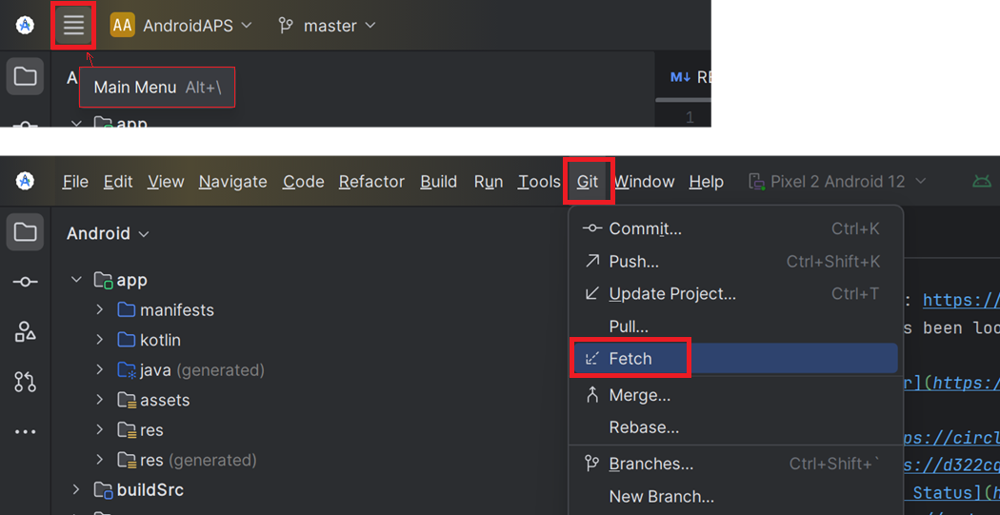
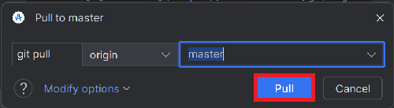

# Update auf eine neue Version oder einen Branch

## Kein Download möglich - APK muss selbst erstellt werden

Aufgrund der gesetzlichen Regelungen für Medizinprodukte ist **AAPS** nicht als Download verfügbar. Es ist zulässig, die App für den eigenen Gebrauch zu erstellen, aber du darfst keine Kopie an andere weitergeben! Zu den Details schaue bitte auf die [FAQ-Seite](../UsefulLinks/FAQ.md).

## Wichtige Hinweise

* Aktualisiere so bald wie möglich auf die neueste **AAPS**-Version, nachdem sie verfügbar ist.
* Sobald eine neue Version verfügbar ist, wird Dir in der **AAPS**-App ein Hinweis darüber angezeigt.
* Wenn eine neue Version verfügbar ist, wird darüber auch auf Facebook informiert.
* Nach der Veröffentlichung lies bitte die [Versionshinweise](ReleaseNotes.md) (Release Notes) genau durch, und kläre mögliche Fragen in der Community auf Facebook oder Discord, bevor Du mit dem Update weiter machst.
    
    ```{note}
    Falls Du **AAPS** auf einem neuen Computer erstellen möchtest: Kopiere das Backup Deiner Keystore-Datei auf den neuen Computer. Folge dann dem [Prozess für die erstmalige **AAPS**-Erstellung](../SettingUpAaps/BuildingAaps.md) und nicht dieser Anleitung. Der einzige Unterschied besteht darin, dass Du anstelle einen neuen Keystore zu erstellen, den Keystore auswählst, den Du auf den neuen Computer kopiert hast.
    ```

## Übersicht zum Aktualisieren auf eine neue AAPS Version

```{contents} Schritte, um auf eine neue AAPS-Version zu aktualisieren :depth: 1 :local: true

    <br />Falls Probleme auftreten, schaue auf der eigenen Seite für [Fehlerbehebung des Android Studio](../GettingHelp/TroubleshootingAndroidStudio) nach einer Lösung.
    
    ### Exportiere Deine Einstellungen
    
    Exportiere Deine Einstellungen aus der auf Deinem Smartphone existierenden **AAPS**-Version. Vielleicht brauchst Du sie nicht, aber sicher ist sicher.
    
    Wenn Du nicht mehr genau weißt, wie das geht, lies es auf der Seite [Ex- & Importieren der Einstellungen](ExportImportSettings.md) nach.
    
    ### Überprüfe Deine Android Studio Version
    
    Die benötigte Minimalversion ist im Abschnitt [AAPS erstellen](#Building-APK-recommended-specification-of-computer-for-building-apk-file) beschrieben. Sollte Deine Version älter sein, [aktualisiere zuerst das Android Studio](#Building-APK-install-android-studio)!
    
    (Update-to-new-version-update-your-local-copy)=
    ### Aktualisiere Deine lokale Kopie
    
    ```{admonition} WARNING
    :class: warning
    Wenn Du von einer Version vor 2.8.x aktualisierst, erstelle - wie in der Anleitung beschrieben - einen [neuen Clone](../SettingUpAaps/BuildingAaps.md). Der hier beschriebene Weg wird für Dich nicht funktionieren!
    

* Öffne Dein bestehendes AAPS-Projekt mit Android Studio. Möglicherweise musst Du Dein Projekt wählen. Klicke (doppelt) auf das AAPS-Projekt.
    
    

* Wähle in der Menüleiste von Android Studio Git -> Fetch.
    
    

* Unten rechts wird Dir eine Meldung angezeigt, sobald der Fetch erfolgreich durchgeführt wurde.
    
    

* Wähle nun in der Menüleiste Git -> Pull.
    
    

* Lasse alle Optionen wie sie sind (Original/Master) und wähle Pull.
    
    

* Warte ab, während der Download läuft. Du siehst dazu einen Hinweis in der Fußzeile. Eine Erfolgsmeldung wird angezeigt, so bald erfolgreich heruntergeladen wurde.
    
    ```{note}
    Die Anzahl der aktualisierten Dateien kann unterschiedlich sein! Dies ist kein Hinweis auf einen Download-Fehler.
    ```
    
    

* Gradle Sync wird ausgeführt, um einige Abhängigkeiten herunterzuladen. Warte, bis es fertig ist.
    
    

### JVM-Version prüfen

Diese Prüfung ist besonders dann notwendig, wenn Du bereits eine frühere **AAPS**-Version auf demselben Computer erstellt hast.

Schaue im Abschnitt [AAPS erstellen](#Building-APK-recommended-specification-of-computer-for-building-apk-file) nach, welche JVM-Version zur **AAPS**-Version, die Du erstellen möchtest, passt. Um sicherzustellen, dass Du die korrekte JVM-Version verwendest, befolge die Schritte, die im Abschnitt [Incompatible Gradle JVM](#incompatible-gradle-jvm) beschriebenen sind.

(Update-to-new-version-build-the-signed-apk)=

### Erstelle die signierte APK

Dein Quellcode entspricht jetzt der zuletzt freigegebenen Version und alle Voraussetzungen sind geprüft. Es ist an der Zeit, die signierte APK wie im Abschnitt[Signierte AAPS APK erstellen](#Building-APK-generate-signed-apk) beschrieben zu erstellen (bauen).

(Update-to-new-version-transfer-and-install)=

### Übertrage und installiere die APK

Du musst die APK-Datei auf Dein Smartphone übertragen, um sie dort installieren zu können.

```{note}
Wenn Du beim Erstellen Deinen bestehenden „Keystore“ im Android Studio genutzt hast, musst Du die bestehende App nicht deinstallieren. Um die APK zu installieren, folge den Anweisungen während des Updatevorgangs.
In allen anderen Fällen (z.B. wenn ein neuer 'key store' für das Signieren der APK genutzt wurde), muss die alte App gelöscht werden, bevor die neue Version installiert werden kann. **Achte darauf, Deine Einstellungen zu exportieren!**
```

Nutze die Anleitung [AAPS auf Dein Smartphone übertragen und installieren](../SettingUpAaps/TransferringAndInstallingAaps.md)

(Update-to-new-version-check-aaps-version-on-phone)=

### AAPS-Version auf dem Smartphone überprüfen

Nachdem Du die neue APK-Datei installiert hast, kannst Du auf dem Smartphone die Version prüfen. Gehe dazu oben rechts auf die drei Punkte und wähle dann "Über". Du solltest die aktuelle Version angezeigt bekommen.


Schaue in den [Release Notes](../Maintenance/ReleaseNotes.md) nach, ob es nach dem Update besondere Dinge zu beachten gibt.

## Problembehandlung

Keine Panik, wenn irgendetwas schiefläuft.

Tief durchatmen!

Danach schaue auf der Seite [Fehlerbehebung für Android Studio](../GettingHelp/TroubleshootingAndroidStudio) nach einer Lösung, sofern Dein Problem bereits bekannt sein sollte!

Wenn Du weitere Hilfe brauchst, kontaktiere bitte andere **AAPS**-Nutzende auf [Facebook](https://www.facebook.com/groups/AndroidAPSUsers) oder [Discord](https://discord.gg/4fQUWHZ4Mw).