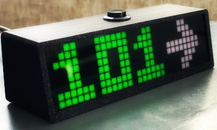

# AAPS folgen (keine Interaktion mit dem AAPS-System)

In addition to the range of possibilities available for remotely controlling _and_ following **AAPS** which are described at [remote control](../RemoteFeatures/RemoteControl.md), there are several additional apps and devices which the community has developed, to simply follow numbers (glucose levels and other information), without interacting with **AAPS**.

A good overview of the extensive options available for following **AAPS** is at [Nightscout follower](https://nightscout.github.io/nightscout/downloaders/#) webpage.

```{contents} Table of contents
:depth: 1
:local: true
```

Die häufigsten Strategien im Zusammenhang mit **AAPS** werden weiter unten erläutert.

## Smartphone apps

```{contents} These are some of the main “follower” apps used by **AAPS** users. All of these apps are “free”: 
:depth: 1
:local: true
```

### Dexcom Follow ([Android](https://play.google.com/store/apps/details?id=com.dexcom.follow.region2.mgdl) and [iOS](https://apps.apple.com/fr/app/dexcom-follow-mg-dl-dxcm2/id1032203080))


* Dexcom Follow is compatible with a wide range of handsets (both Android and iPhone). Dexcom Follow kann, auch wenn Du nicht die offiziellen Dexcom App nutzt, dazu genutzt werden, Sensordaten zu empfangen.

* Many caregivers are familiar with Dexcom Follow, preferring its clear interface over something more complicated.

* Dexcom Follow is very good for teachers/grandparents and people who know very little about diabetes and sugar levels. It has customisable alerts (BG level, what sound to play etc.). Alarme können bei Bedarf komplett abgeschaltet werden. Das kann z.B. in Situationen, in denen der Sensor noch nicht zuverlässig läuft und falsche tiefe Werte anzeigt, hilfreich sein.

#### Dexcom Follow konfigurieren: Schritt-für-Schritt-Anleitung

Wenn Du die inoffizielle Dexcom App BYODA für das Auslesen der Sensorwerte nutzt, kannst Du weitere Follower aus der BYODA App heraus einladen. Es können Einladungen an Dexcom Follow auch aus xDrip+ heraus gesendet werden (Einstellungen - Cloud-Upload - Dexcom Share Server Upload). Siehe Anleitung:

https://xdrip.readthedocs.io/en/latest/use/cloud/?h=#dexcom-share-server-upload

Mittlerweile können aus Drittanbieter-Apps keine Einladungs-Emails mehr an Dexcom-Follower verschickt werden. In xDrip+ wird die Einladungsanfrage nur zu einer „Einladung nicht gesendet“-Nachricht führen.

Du musst die offizielle Dexcom-App installieren, die Einladung senden und dann die offizielle App wieder deinstallieren.

Die Schritte dazu sind folgende:

1)  Installiere die offizielle “Dexcom-App" auf einem _beliebigen_ Smartphone (Android/iPhone). Das kann auch ein Follower-Smartphone sein, wenn es für Dich besser passt. 2)  Logge Dich mit Deinen Dexcom Nutzernamen und  Passwort ein. Nutze dazu die normalen Login-Daten, die Du auch für Dexcom Clarity nutzt (wenn Du ein Dexcom/Clarity Kunde sein solltest). Hast Du noch keinen Dexcom Login, gibt es an dieser Stelle die Möglichkeit einen neuen Login zu erstellen.   
3)  Wische durch die einleitenden Menüs. 4)  Wähle “Kein Code” als Sensorcode aus. 5)  Unter Transmitter-SN wähle "Manuell eingeben" und gib einen gültigen Transmitter-Code ein (z. B. den eines bereits abgelaufenen Transmitters, damit dieser sich nicht mit einen laufenden Transmitter in die Quere kommt). Das Format ist ein Abfolge von Zahlen und Buchstaben: “ZBZZZB” einer bestimmten Kombination. Daher ist es am einfachsten einen Code eines alten Transmitters zu verwenden. 6) Sobald die App versucht, den Transmitter und den Sensor zu finden, kannst Du Follower einladen: Wähle die kleinen drei Punkte oben links in der App aus und füge einen neuen Follower hinzu. Wenn einer Deiner Follower ein neues Samrtphone hat, kannst Du diesen Weg auch nutzen,  um ihm/ihr - sofern nötig - eine neue Einladung zu schicken. An der Stelle löscht Du die Person zunächst aus der Follower-Liste und verschickst dann eine neue Einladungs-E-Mail, die dann auf dem neunen Smartphone ankommt. 7)  Lade die Dexcom Follow App auf das Follower-Smartphone herunter (iPhone: App Store oder Android: Play) und installiere sie. Richte die Dexcom Follow App ein. Während der Einrichtung wirst Du dazu aufgefordert, die E-Mail mit der Follower-Einladung zu öffnen.    
8)  Jetzt kannst Du die offizielle Dexcom G6 App deinstallieren.

For Dexcom Follow, the sensor data is then exported from the **AAPS** phone either directly from BYODA, or from xDrip+, depending on which app you are using.


### [Nightguard](https://apps.apple.com/fr/app/nightguard/id1116430352) (iOS)


Vorteile (von Nutzenden gemeldet):

* Available in the [app store](https://apps.apple.com/us/app/nightguard/id1116430352), simple, user-friendly interface.

* Swipe button or shake phone to snooze alarms at different intervals ranging from 5 min to 24 hours

* Customize alarms (high, low alerts, missed readings when no data for 15-45 minutes).

* Fast rise/drop over 2-5 consecutive readings (you choose). Du bestimmst auch das Delta zwischen zwei Sensorwerten

* Smart snooze so doesn't alert if levels are moving in right direction

* There is a Care tab which appears to enable you to set a new temp target for a certain duration, delete the temp target or enter carbs.

Nachteile (von Nutzenden gemeldet)

* Only available for iOS

* The TT shows as 5 mmol regardless of which TT level is set

* Never shows Temp Basal rate even though it shows TB

### [Nightwatch](https://play.google.com/store/apps/details?id=se.cornixit.nightwatch) (Android)


* Nightwatch markets itself as a Nightscout client and monitors the user’s Nightscout glucose levels on either Android phone or tablet.

* The app can be downloaded from [Google play](https://play.google.com/store/apps/details?id=se.cornixit.nightwatch) and displays BG data in real time.

* The user can be alerted with customised noisy low and high alarms set.

* BG data can be viewed in either mmol/L or mg/dL.

* It requires Android 5.0 and up.

* It has a dark Ul, large readings and buttons, designed for usage at night.

### [xDrip+](https://xdrip.readthedocs.io/en/latest/) (Android)

Du kannst xDrip+ als Follower-App nutzen.

#### Wenn Du Nightscout nutzt ...

Konfiguriere in xDrip+ Nightscout Follower als Datenquelle. Du kannst damit Glukosewerte und Behandlungsdaten empfangen, nicht jedoch das Basal.


#### Wenn Du Nightscout nicht nutzt (Datenquelle: xDrip+ Sync Follower) ...

If your **AAPS** data source is xDrip+ (or if xDrip+ can also receive BG from another app like BYODA, Juggluco, ...) you can use it from the master phone to share data with xDrip+ followers, displaying BG, treatments and basal rates.


#### Wenn Du Nightscout nicht nutzt (Datenquelle: Companion App) ...

If your **AAPS** data source is not xDrip+ but you can display BG data from the Companion App data source, you can use it from the master phone to share data with xDrip+ followers, displaying BG, treatments and basal rates.


### xDrip4iOS/Shuggah (iOS)


xDripSwift stammt von der ursprünglichen xDrip-App ab, wurde auf iOS portiert und entwickelte sich dann weiter zu "xDrip for iOS" (**xDrip4iOS** ).

Eine Version von **xDrip4iOS** ist im Apple Store unter dem Namen **Shuggah** verfügbar.

```{admonition} Further detail about how to attempt to obtain the original **xDrip4iOS** app
:class: dropdown
Die [xDrip4iOS Facebook-Gruppe](https://www.facebook.com/groups/853994615056838/announcements) ist die wichtigste Community-Unterstützung für xDrip4iOS und Shuggah. **xDrip4iOS** kann sich mit vielen verschiedenen CGM-Systemen und -Transmittern verbinden und Glukosewerte, Diagramme und Statistiken anzeigen und Alarme auslösen. Es kann auch zu Nightscout hochladen oder als [Follower-App für Nightscout](https://xdrip4ios.readthedocs.io/de/latest/connect/follower/) fungieren. Die Schwierigkeit besteht allerdings darin, die **xDrip4iOS**-App für Dein Smartphone zu bekommen. 

"Wie bekomme ich **xDrip4iOS** für mein iPhone?"
Es gibt zwei Möglichkeiten:

1. Wenn Du einen Mac und einen Apple Developer Account (99 EUR/USD pro Jahr) hast, kannst Du Dein eigenes xDrip4iOS erstellen, indem Du den folgenden Anweisungen folgst:

https://xdrip4ios. eadthedocs. o/de/latest/install/build/

Wenn Du möchtest, kannst Du dann zu einem Herausgeber ("releaser") werden, einen persönlichen Testflight xDrip4iOS mit bis zu 100 anderen Personen teilen, um ihnen damit zu helfen:
https://xdrip4ios. eadthedocs.io/.../personal_testflight/

2. Du bist der [xDrip4iOS Facebook-Gruppe](https://www.facebook. om/groups/853994615056838/announcements) beigetreten und verfolgst die Beiträge… warte darauf, dass jemand eine Einladung zu seinem eigenen Testflight-Release in der Gruppe anbietet. **Du solltest nicht um eine Einladung zur App** bitten (lies die Gruppenregeln). 

Einfacher ist es deswegen, die **Shuggah**-App herunterzuladen. 
```

#### [Shuggah](https://apps.apple.com/sa/app/shuggah/id1586789452)

App:


"Was ist Shuggah?" Eine Gruppe ukrainischer Entwickler nahm den xDrip4iOS Projektcode (der öffentlich auf Github verfügbar ist) und veröffentlichte ihn unter einem Firmenkonto im App Store (die App ist kostenlos, und die Absichten sind gut). Die App musste leicht angepasst werden, um eine Datenschutzerklärung und einen Haftungsausschluss hinzuzufügen, und so durch die Überprüfung zu kommen. Der Rest der App sollte identisch zu xDrip4iOS sein. Das Shuggah-Release wird nicht von den xDrip4iOS Entwicklern verwaltet, daher kann nicht garantiert werden, dass es wie xDrip4iOS funktionieren wird, dass es zum gleichen Zeitpunkt aktualisiert wird oder dass Apple es nicht irgendwann aus dem App Store entfernen wird.

Die [xDrip4iOS Facebook-Gruppe](https://www.facebook.com/groups/853994615056838/announcements) unterstützt xDrip4iOS, Shuggah und die zugehörige Apple Watch App.

### [Sugarmate](https://apps.apple.com/fr/app/sugarmate/id1111093108) (iOS)


[Sugarmate](https://sugarmate.io/) kann auf iPhones aus dem App Store heruntergeladen werden. Sugarmate is compatible with:
* Apple iPhone (Requires software version 13.0 or later)
* Apple iPad (Requires software version 13.0 or later)
* Google Android (Save web app to your homescreen)

Es wurde von Sugarmate-Nutzenden berichtet, dass es in den USA mit Apple CarPlay genutzt werden kann, um Glukosewerte während des Fahrens anzuzeigen. Ob das in Ländern außerhalb der USA auch möglich ist, ist noch nicht geklärt. Wenn Du mehr dazu wissen solltest, ergänze Deine Informationen hier in der Dokumentation, indem Du einen Pull-Request (link), der schnell gemacht ist, machst.


### [Spike](https://spike-app.com/) (iOS)


Spike can be used as a primary receiver or as a follower app, providing BG, alarms and IOB and more.

The website and app are no longer developed. Support bekommst Du auf [Facebook](https://www.facebook.com/groups/1973791946274873) oder [Gitter](https://gitter.im/SpikeiOS/Lobby).

## Smartwatches for **Monitoring of AAPS** (full profile data, or glucose-only) where **AAPS** is running on a phone.

See [here](../Getting-Started/Watches.md).


## Devices for following AAPS

```{contents} Devices include:
:depth: 1
:local: true
```

### M5 stack


Der [M5Stack](https://github.com/mlukasek/M5_NightscoutMon/wiki) ist eine kleine Box, die für verschiedene Anwendungen programmiert werden kann. Eine dieser Anwendungen ist die Anzeige von Glukosewerten, den entsprechenden Verläufen, den wirkenden Kohlenhydraten und des aktiven Insulins. Es ist in einem Plastikgehäuse untergebracht und hat neben einem Farb-Display auch einen Micro-SD-Karten-Steckplatz, 3 Tasten, einen Lautsprecher und einen internen Akku. It is a great blood sugar monitor and is relatively easy to set up if you have a Nightscout account. Users typically run it on their home Wi-Fi, but some users report using it as a display when motorbiking, by running it off a phone Wi-Fi hotspot.

### Sugarpixel

SugarPixel ist ein Gerät, dass als Zweitanzeige für Glukosewerte und Alarme genutzt wird. Es wird mit der Dexcom App oder der Nightscout App auf dem Smartphone verbunden und man kann dann damit die Glukosewerte permanent verfolgen. Das Gerät zeigt die Glukosewerte in Echtzeit an. Dieser CGM-Hardware-Monitor kann unglaublich laute Zufallstöne für Alarme, und auch Vibrationsalarme für Hörgeschädigte erzeugen, hat verschiedene Einstellmöglichkeiten für die Anzeige und ein natives "Multi-User-Following".




* SugarPixel has multiple display options in mg/dL and mmol/L to suit the user’s needs with colour-coded glucose values.
* The standard face displays BG, Trend Arrow, and Delta. Delta ist die Veränderung + oder - seit dem letzten Messwert.
* SugarPixel can be customised for use in low brightness with the BG and Time face to see the user’s BG reading and current time on the user’s nightstand.
* SugarPixel’s xolour face utilises the entire display to show a single colour representing the BG value. Damit kann man die Glukosewerte auch auf große Entfernungen durch das Fenster erkennen, während im Hof, qauf der Terrasse oder im Planschbecken oder Pool gespielt wird.
* The Big BG face is useful for nightstand users who wear glasses or contact lenses.

### Nightscout Clock on Ulanzi TC001

**Nightscout Clock** is an open source software running on the **Ulanzi TC001** device. It connects with Dexcom servers or Nightscout and displays real time blood sugar readings.


* The clock supports both mmol/L and mg/dL units, and includes audible alarms.
* Several display available, see [Github nightscout-clock](https://github.com/ktomy/nightscout-clock?tab=readme-ov-file#more-information-for-people-who-needs-it) for an overview.
* Setting up and configuring the device involves just a few simple steps. Once set up, it only requires power and Wi-Fi to function.
* The Ulanzi TC001 device is significantly cheaper than the SugarPixel to buy.
* The software along with installation instructions can be found on [Github nightscout-clock](https://github.com/ktomy/nightscout-clock?tab=readme-ov-file).
* It is developed and maintained by Artiom Kenibasov, offering support on the [Facebook AAPS Users group](https://www.facebook.com/groups/cgminthecloud/posts/8776932509094594/).

### PC (TeamViewer)
Zur Remote-Fehlerbehebung hat sich für einige Konstellationen ein Fernüberwachungs-Tool wie z. B. [TeamViewer](https://www.teamviewer.com/) bewährt.