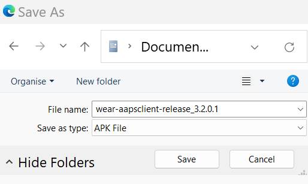

# AAPS remote steuern
Es gibt vier sehr wirkungsvolle Wege, **AAPS** remote zu steuern:

1) [SMS commands](RemoteControl_SMS-Commands) (follower phone can be either Android or iOS), 2) [AAPSClient](RemoteControl_aapsclient) (follower phone is Android) 3) [Nightscout](RemoteControl_nightscout) (Android, iOS or other computer/device).  
4) [Smartwatches](RemoteControl_smartwatches) (Android)

The first three are mostly appropriate for caregivers/parents, but smartwatches are very useful for caregivers/parents **and** for adults with diabetes themselves.

(RemoteControl_SMS-Commands)=

## 1) SMS-Befehle

See the dedicated [SMS Commands](../RemoteFeatures/SMSCommands.md) page.

(RemoteControl_aapsclient)=
## 2) AAPSClient

_Ab AAPS Version 3.2 (oder höher) ersetzt der **AAPSClient** den **NSClient**. Details findest Du in den Release Notes._

Wenn Du ein Eltern-/Betreuenden-Smartphone haben solltest und eine ältere **AAPS**-Version (vor 3.2) benötigst, kannst Du die [**AAPSClient**](https://github.com/nightscout/AndroidAPS/releases/)-App direkt herunterladen und installieren. Der **AAPSClient** sieht **AAPS** sehr ähnlich, und stellt den Eltern/Betreuenden einen Reiter zur Verfügung, auf dem Aktionen remote in **AAPS** ausgeführt werden können:

Es gibt zwei Versionen der apk, die [heruntergeladen werden können](https://github.com/nightscout/AndroidAPS/releases/):  **AAPSClient** & **AAPSClient2**, die einen kleinen aber feinen Unterschied, der unten erklärt wird, haben.

**AAPSClient** kann auf einem einzigen Smartphone oder mehreren Follower-Smartphones installiert werden (z.B. auf das Follower-Smartphone des ersten Elternteils und des zweiten Elternteils), um so beiden die Möglichkeit zu geben das zugehörige **AAPS**-Master-Smartphone remote zu steuern.

Sollte die Notwendigkeit bestehen, ein weiteres AAPS-Smartphone (eines anderen Patienten mit einem Nightscout-Konto) zu steuern, ist eine weitere Kopie des **AAPSClient** notwendig. Hierzu muss dann der **AAPSClient2** zusätzlich zum **AAPSClient** installiert werden. Durch den **AAPSClient 2** ist es möglich, dass eine betreuende Person die **AAPSClient** apk zweimal auf dem Follower-Smartphone installieren kann und so den Daten von zwei Patienten gleichzeitig folgen kann.

Um den **AAPSClient** herunterzuladen, navigiere [hierhin](https://github.com/nightscout/AndroidAPS/releases/) und klicke auf das Element **“app-AAPSClient-release_x.x.x.x”** (die im Screenshot unten gezeigte Version kann eventuell älter sein):

Gehe dann in Deinen _Downloads_-Ordner auf Deinem Computer. Unter Windows zeigt -downloads- das rechte Menüband an:

Nach dem Herunterladen klicke auf _im Ordner anzeigen_, um die Datei dort zu finden.

Die **AAPSClient** apk kann nun entweder:

Mit einem USB-Kabel auf das Follower-Smartphone übertragen werden, oder in einen Google-Drive Ordner gezogen werden und dann auf das Follower-Smartphone durch klicken auf app-"AAPSClient-release-"-Datei gebracht werden.

### Synchronisierung - AAPSClient und AAPS einrichten (für Version 3.2.0.0 und höher)

Once __AAPSClient__ apk is installed on the follower phone, the user must ensure their ‘Preferences’ in Config Builder are correctly set up and aligned with __AAPS__ for Nightscout 15 (see Release Notes [here](../Maintenance/UpdateToNewVersion)). Das folgende Beispiel bietet Hilfestellung bei den Synchronisierungs-Einstellungen für NSClient und NSClientV3 im Zusammenspiel mit Nightscout 15. Es gibt daneben auch noch andere __AAPS__-Optionen (z.B. xDrip+).

Innerhalb des Abschnitts 'Synchronisierung' in der 'KONFIGURATION' kannst Du Dich für verschiedene Synchronisierungsoptionen sowohl für __AAPS__ als auch das Follower-Smartphone entscheiden:

- Option 1: NSClient (also known as ‘v1’) - which synchronizes the user’s data with Nightscout; or

- Option 2: NSClientV3 (also referred to as ‘v3’).- which synchronizes the user’s data with Nightscout using v3 API.

Du musst sicherstellen, dass __beide__ Smartphones (AAPS und AAPS-Client) die gleiche Synchronisierungs-Option nutzen (v1 oder v3):

Option 1: v1 (Nightscout-Client) für beide Smartphones:

- Gib Deine Nightscout-URL ein

- Gib Dein Nightscout API-Key (API secret) ein

Option 2: v3 für beide Smartphones:

- Gib Deine Nightscout-URL in den NSClientV3-Einstellungen ein

- Gib Dein NS-Zugangstoken in der KONFIGURATION ein. Bitte folge den Hinweisen [hier](https://nightscout.github.io/nightscout/security/#create-a-token)

Wenn Du die optionale Funktion 'Mit Websockets verbinden' auswählst, achte darauf, dass dies sowohl für das __AAPS__-Smartphone als auch für das __AAPSClient__-Smartphone aktiviert bzw. deaktiviert ist. Das Aktivieren der Websockets in __AAPS__ und nicht im __AAPSClient__ (und auch umgekehrt) wird nur dazu führen, dass __AAPS__ nicht richtig funktioniert. Durch das Aktivieren der Websockets wird eine schnellere Synchronisierung mit Nightscout ermöglicht. Das kann zu einem höheren Akkuverbrauch des Smartphones führen.

Achte darauf, dass sowohl der __AAPSClient__ als auch __AAPS__ auf dem Reiter „NSClient“ für jedes der Smartphones „verbunden“ anzeigt und dass bei Auswahl eines „Profilwechsel“ oder „Temporäres Ziel“ im  __AAPSClient__ dieses auch in __AAPS__ korrekt aktiviert wird.

Achte auch darauf, dass Kohlenhydrat-Eingaben, sowohl im __AAPSClient__ als auch in __AAPS__ unter 'Behandlungen" erscheinen. Passiert das nicht, ist das ein Hinweis darauf, dass die Einstellungen nicht richtig sind.

### Das 'NS access token'-Konfigurationsproblem beheben

Die genaue Konfiguration des 'NS Access Token' kann davon abhängig sein, ob Du einen Nightscout-Anbieter als Bezahldienst (paid service) nutzt oder nicht.

Wenn Du Probleme mit **AAPS** v3 hast ('NS Access Token' wird nicht akzeptiert) und Du für Deine Nightscout-Seite bezahlst, solltest Du zuerst diesen Anbieter um Hilfestellung beim Lösen des NS Access Token Problems bitten. In allen anderen Fällen wende Dich an die **AAPS**-Gruppe. Bitte prüfe im Vorfeld, ob Du die [hier](https://nightscout.github.io/nightscout/security/#create-a-token) beschriebene Anleitung genau durchgegangen bist.

### AAPSClient-Funktionen sind unter anderem:

| Tab / Hamburger     | Features                                                                                                                                                                                              |
| ------------------- | ----------------------------------------------------------------------------------------------------------------------------------------------------------------------------------------------------- |
| **Action** Tab      | - Profile Switch  - Temp Target - BG Check - CGM Sensor Insert - Note - Exercise - Announcement - Question? - History Browser |
| **Food** Tab        |                                                                                                                                                                                                       |
| **Treatments** Tab  | - Check Treatments delivered including bolus and carbs entered                                                                                                                                        |
| **Maintenance** Tab | - Export and Import Settings                                                                                                                                                                          |
| **Profile** Tab     | - Creating new profile - Profile switch                                                                                                                                                      |

Mit dem **AAPSClient** kann das Elternteil/Betreuende einen Großteil der Anpassungen direkt in **AAPS** (Ausnahme: Bolusabgabe) über das Mobilfunknetz oder Internet remote vornehmen. Die wichtigsten Vorteile des **AAPSClient** sind die Geschwindigkeit und Einfachheit mit der Eltern/Betreuende **AAPS** remote steuern können. Der __AAPSClient__ _kann_ deutlich schneller als die Eingabe von zu authentifizierenden SMS-Befehlen sein. Befehle, die im **AAPSClient** eingegeben werden, werden nach Nightscout hochgeladen.

Remote control through **AAPSClient** is only recommended if your synchronization is working well (_i.e._ you don’t see unwanted data changes like self-modification of TT, TBR etc) see [release notes for Version 2.8.1.1](#important-hints-2-8-1-1) for further details.

### AAPSClient mit Smartwatch-Optionen

Eine Smartwatch kann sehr nützlich sein, um bei Kindern **AAPS** zu managen. Es sind einige verschiedene Konfigurationen möglich. Auf einer kompatiblen Smartwatch kann die [AAPSClient WearOS App](https://github.com/nightscout/AndroidAPS/releases/) installiert werden, die mit der AAPSClient-App auf dem Eltern-Smartphone verbunden wird. Damit können der aktuelle Glukosewert und der Loop-Status angezeigt werden. Zusätzlich können dann KH-Einträge vorgenommen werden und auch temporäre Ziele und Profiländerungen aktiviert werden. Die Abgabe eines Bolus ist NICHT über die WearOS App möglich. You can read more about Smartwatches [here](#4-smartwatches).

(RemoteControl_nightscout)=
## 3) Nightscout

Genauso wie es Nightscout als einen Server "in der Cloud" gibt, gibt es auch eine dedizierte **Nightscout**-App, die über den App Store direkt auf Dein iPhone heruntergeladen werden kann. If you have an Android follower phone, there is not a dedicated Nightscout app and it is better to use [**AAPSClient**](#2-aapsclient), or, if you only want to follow, and not send treatments you can download and install the [Nightwatch](https://play.google.com/store/apps/details?id=se.cornixit.nightwatch) app from the Playstore.

Sobald Du die **Nightscout**-App auf Deinem iPhone installiert hast, öffne die App, folge den Anweisungen für die Einrichtung und gib Deine Nightscout-Adresse (siehe links unten) ein. Je nach Anbieter bei dem Deine Nightscout-Seite läuft, kann es etwas anders aussehen. (_z. B._ http://deineadresse.herokuapp.com). Gib dann Dein Nightscout API secret (Passwort) ein (siehe rechts unten). Wenn Du nicht nach Deinem API-Passwort gefragt wirst, klickst Du oben in der App auf das Schloss-Symbol und gibst es dann ein:

Weitere Informationen zur Einrichtung findest Du direkt bei [Nightscout](https://nightscout.github.io/nightscout/discover/)

When you first log in, you will have a very simple display. Customize the display options, by selecting the “hamburger” in the top right and scrolling down:

Scrolle bis zu den „Einstellungen“ herunter. Die Darstellung der Glukosewerte erfolgt standardmäßig "logaritmisch". Das kannst Du unter "Skalierung" auf "Linear" ändern. Um das Basal der Pumpe einzublenden, ändere unter dem Abschnitt "Basalraten-Darstellung" den Wert auf "Standard“.

Select your desired options. Uncheck alarms if you use an alternative app for alarms.

Scrolle weiter herunter bis zum Abschnitt "Zeige Plugins".

Wichtig ist, dass dort “Behandlungs-Portal” ausgewählt ist. In diesem Abschnitt kannst Du einige andere Metriken zusätzlich auswählen, von denen Aktives Insulin, Behandlungs-Portal, Pumpe, Kanülenalter, Insulin-Alter, Basalraten-Profil, und OpenAPS am nützlichsten sind.

Wichtig ist, dass Du nach Deinen Änderungen unten auf "Speichern“ klickst, damit diese Änderungen wirksam werden.

Nach dem Drücken von „Speichern“ wird die App zum Hauptbildschirm der Nightscout-App zurückkehren. Es sollte ungefähr so aussehen:

1. Current glucose value
2. Information on AAPS system status - touch the individual tabs on the screen to display more detail. Add or remove these display options using hamburger menu.
3. Recent glucose trace with treatments (carbs, boluses) displayed
4. Longer-term glucose trace
5. "Hamburger" menu for setting display options, generating reports, editing profiles and Nightscout admin tools
6. "**+**" menu for entering treatments to send to AAPS.
7. Select different time period to display
8. Basal insulin profile
9. Green line = historical glucose Blue lines = predicted glucose

Schauen wir uns das obere linke Menü der Nightscout-App etwas genauer an:

1. Careportal retrospective edit
2. Turn on/off alarms
3. Hamburger - for setting preferences
4. Careportal - Log treatment - to send changes to AAPS

Es gibt auf diesem Bildschirm eine Vielzahl an Statusinformationen des **AAPS**-Systems in den grauen Tabs (und noch mehr Informationen werden angezeigt, wenn Du auf die Tabs tippst):

1. 5min glucose trend
2. Bolus wizard preview
3. Press on Basal to see your current profile and basal information
4. Time since latest CGM reading in AAPS
5. **Pump**: insulin, battery % and when AAPS last connected to it
6. Last time AAPS refreshed - if this is longer than 5 mins it can indicate a connection issue between AAPS phone and pump/CGM
7. Press on IOB to see split of basal and bolus insulin
8. Insulin age in reservoir
9. Kanülenalter
10. Battery status of AAPS phone
11. Size of your database. If it gets too full (DIY Nightscout only - hosted services just ignore) you may start having connectivity issues. You can delete data to reduce the size of the number in the Admin tools menu (via hamburger).

Press "refresh" at the bottom of the page to close the popup.

### Behandlungen über die Nightscout-App an AAPS senden

Um das Senden von Behandlungsdaten aus der **Nightscout**-App an das **AAPS** des Haupt-Smartphones (Master) zu ermöglichen, gehe auf dem **AAPS**-Hauptbildschirm in den Reiter **AAPSClient**. Öffne oben rechts das 3-Punkte-Menü und öffnen dort AAPSClient-Einstellungen – Synchronisierung und wähle die entsprechende Option aus. Aktiviere die Option, damit die verschiedenen Befehle (Temporäre Ziele etc.) empfangen werden können und auch um Profile zwischen Geräten synchronisieren zu können. Wenn es den Anschein haben sollte, dass die Synchronisierung nicht erfolgt, gehe auf den AAPSClient-Reiter und wähle im 3-Punkte-Menü "Vollständige Synchronisation" und warte einige Minuten ab.

Nightscout auf Deinem iPhone hat den vollen Funktionsumfang, wie es auch Nightscout auf Deinem PC hat. Es erlaubt Dir, viele Befehle an **AAPS**zu schicken, aber es erlaubt Dir nicht, einen Bolus abzugeben.

### Negatives Insulin löschen, um wiederholte Hypos zu vermeiden

Auch wenn Du keinen eigentlichen Bolus abgeben kannst, kannst Du eine Insulingabe durch Nightscout als Korrekturbolus "ankündigen". Weil AAPS ab diesem Zeitpunkt diesen Fake-Bolus berücksichtigt, führt die faktisch dazu, dass AAPS _weniger aggressiv_ reagiert. Das kann, wenn Dein Profil (z. B. wg. sportlicher Aktivität) zu stark war, helfen, um negatives Insulin auszugleichen und so niedrige Werte zu verhindern. Falls Dein **Nighscout**-Setup davon abweichen sollte, solltest Du das mit dem **AAPS**-Smartphone in Deiner Nähe genau prüfen.

Einige der hilfreichsten **Nightscout**-Befehle sind in der unten stehenden Tabelle beschrieben.

#### Nightscout Befehls-Tabelle

| Most commonly used treatments                             | Function, example of when command is useful                                                                                                                                                                                                               |
| --------------------------------------------------------- | --------------------------------------------------------------------------------------------------------------------------------------------------------------------------------------------------------------------------------------------------------- |
| **Correction bolus**                                      | Allows you to announce **but <u>not</u> bolus** insulin. Very useful for cancelling negative insulin to prevent a hypo, for example in the middle of the night, if the profile has been too strong.                                     |
| **Kohlenhydrat-Korrektur**                                | Announce carbs now                                                                                                                                                                                                                                        |
| **Temporary Target** **Temporary Target cancel** | Allows temp targets to be set and cancelled. Note that cancelling does not always work, in this instance you can set a new target for a short time period (2 min) which will then revert back to the normal target afterwards. |
| **Profilwechsel**                                         | Allows you to check the current profile which is running, and switch to another profile, either permanently, or for a defined length of time (mins).                                                                                    |

| Less widely used commands                                                                                                           | Function, example of when command is useful                                                                                                                              |
| ----------------------------------------------------------------------------------------------------------------------------------- | ------------------------------------------------------------------------------------------------------------------------------------------------------------------------ |
| **BG check**                                                                                                                        | Send a BG check to AAPS.                                                                                                                                                 |
| **Snack bolus** **Meal bolus** **Combo bolus**                                                                    | Can announce carbs (plus proteins and fat)  from 60 min in the past to 60 min in the future. Combo bolus allows insulin announcement at the same time. |
| **Announcement** **Note** **Question** **Exercise** **Open APS offline** **DAD alert** | Add these info notes (DAD = diabetic dog alert).                                                                                                                         |
| **Pump site change** **Battery change** **Insulin cartridge change**                                              | Announces these pump changes.                                                                                                                                            |
| **CGM sensor start** **CGM sensor insert** **CGM sensor stop**                                                    | Announces these CGM changes.                                                                                                                                             |
| **Temp basal start** **Temp basal end**                                                                                    | Most useful in open looping.                                                                                                                                             |

Mehr zu den **Nightscout**-Optionen kannst Du [hier](https://nightscout.github.io/) nachlesen

### Tipps, um das Beste aus der Nightscout-App herauszuholen

1). Wenn Du auf einer Seite "hängenbleibst" und zum Hauptbildschirm zurückkehren möchtest, klicke einfach auf „Aktualisieren“ (unten in der Mitte). Das bringt Dich zurück auf den **Nightscout**-Startbildschirm mit der Anzeige der Glukosewerte.

Wenn Du das aktuell auf dem Smartphone laufende Profil sehen möchtest, drücke auf die verschiedenen Symbole oberhalb des Diagramms. Zusatzinformationen (Mahlzeitenfaktoren, Insulin-Empfindlichkeit und Zeitzone etc.) erhältst Du, indem Du auf "Basal“ drückst und hinter "OpenAPS“ sind Informationen zum Profil und das aktuelle Ziel etc. anzeigbar. Der Ladezustand sowohl des Smartphone-Akkus, als auch der Pumpen-Batterie können ebenfalls angezeigt werden. BWP zeigt die Vorhersage des Algorithmus zur voraussichtlichen Entwicklung des aktiven Insulins (IOB) und der aktiven Kohlenhydrate (COB).

#### Andere Menü-Symbole: Was bedeutet der Stift (bearbeiten)?

Du kannst Bleistift (technisch) verwenden, um Bolus- oder Korrekturbehandlungen der letzten 48 Stunden zu verschieben oder zu löschen.

Mehr Details dazu findest Du [hier](https://nightscout.github.io/nightscout/discover/#edit-mode-edit)

Obwohl dies potenziell nützlich sein könnte, um angekündigte (aber nicht gebolte) Kohlenhydrate zu löschen, funktioniert es in der Praxis derzeit nicht gut mit **AAPS** und wir empfehlen diese Änderungen direkt über die **AAPS**-App vorzunehmen.

(RemoteControl_smartwatches)=
## 4) Smartwatches

### Option 1) Controlling AAPS from a Wear OS Watch

Once you have [setup **AAPS** on your watch](../WearOS/BuildingAapsWearOS.md), extensive details about the smartwatch faces and their functions can be found in [Operation of Wear AAPS on a Smartwatch](../WearOS/WearOsSmartwatch.md).

Als kurze Übersicht: Die folgenden Funktionen können von der Smartwatch aus gestartet werden:

* set a temporary target

* use the bolus calculator (calculation variables can be defined in settings on the phone)

* administer eCarbs

* administer a bolus (insulin + carbs)

* watch settings

* status

* check pump status

* check loop status

* check and change profile, CPP (Circadian Percentage Profile = time shift + percentage)

* show TDD (Total daily dose = bolus + basal per day)

* Remote bolus where the caregiver and T1D child are in different locations (this is possible for the **AAPS** watch and **AAPS** phone providing both devices are connected to the network)

#### Communication from caregivers to the watch using other apps (like WhatsApp)

It is possible to add additional apps to the watch, like WhatsApp, for messaging (for example) between caregivers and kids. Es ist wichtig, dass dem Smartphone nur EIN Google-Konto zugeordnet ist, da die Smartwatch sonst die Daten nicht rüberbringen kann. Du musst 13 oder älter sein, um ein Samsung-Konto zu haben. Das Geburtsdatum muss in der eMail-Adresse hinterlegt sein, die auf dem Android-Smartphone verwendet wird.

A video explaining getting WhatsApp setup for messaging on the Galaxy 4 watch (you can’t get full functionality of WhatsApp) is shown [here](https://gorilla-fitnesswatches.com/how-to-get-whatsapp-on-galaxy-watch-4/)

Making adjustments in both the **Galaxy wearable** app on the **AAPS** phone and the watch makes it possible for WhatsApp messages to announce with a slight vibration, and also for the WhatsApp message to display over the existing watchface.

### Option 2) **AAPS** auf der Smartwatch steuert **AAPS** auf dem Smartphone

Ähnlich wie mit einem Follower-Smartphone auf dem der AAPSClient, Nightscout oder SMS-Befehle laufen (Link zu Abschnitten) kann eine Smartwatch genutzt werden, um **AAPS** remote zu steuern und vollständige Profildaten bereitzustellen. Ein entscheidender Unterschied liegt darin, dass die Smartwatch sich mit dem **AAPS**-Smartphone über Bluetooth verbindet und keinen Authentifizierungscode benötigt. As a side-note, if both smartwatch and **AAPS** phone linked by bluetooth are also on a Wi-Fi/Cellular data network, the watch will also interact with the **AAPS** phone, giving a longer range of communication. Hier reden wir von einer Remote-Bolusabgabe in einer Situation in der die betreuende Person mit der **AAPS**-Smartwatch und das Kind (mit dem **AAPS**-Smartphone) an verschiedenen Orten sind. Das hilft z.B., wenn das Kind in der Schule ist.

Eine Smartwatch zur Remote-Steuerung ist verschiedensten Situationen komfortabel:

a)  **AAPSClient**/Nightscout/**SMS**-Befehle funktionieren nicht oder

b) der Nutzende möchte die Eingabe eines Authentifizierungscode vermeiden (wie es bei der Dateneingabe, dem Setzen eines temporären Ziels oder der Kohlenhydrateingabe über das Follower-Smartphone notwendig ist).

Um **AAPS** steuern zu können, muss auf der Smartwatch **Android Wear** Software (idealerweise 10 oder höher) laufen. Please check the technical specifications of the watch, and check the [Phones page](../Getting-Started/Phones.md). Wenn Du Dir nicht sicher sein solltest, frage einfach in den **AAPS**  Facobook/Discord Gruppen nach.

Eine detaillierte Schritt-für-Schritt Anleitung für die **AAPS**-Einrichtung auf der Samsung Galaxy Watch 4 (40mm) findest Du weiter unten. Die [Garmin](https://apps.garmin.com/en-US/apps/a2eebcac-d18a-4227-a143-cd333cf89b55?fbclid=IwAR0k3w3oes-OHgFdPO-cGCuTSIpqFJejHG-klBTm_rmyEJo6gdArw8Nl4Zc#0)-Smartwatch ist ebenfalls gerne gewählt. If you have experience of setting up a different smartwatch which you think would be useful to others, please add it into these pages [edit the documentation](../SupportingAaps/HowToEditTheDocs.md) to share your findings with the wider **AAPS** community.

### Option 3) **AAPS** auf dem Smartphone wird über AAPS auf der Smartwatch gesteuert

Die notwendige Smartwatch-Software (**AAPSClient** Wear APK) kann direkt von [Github](https://github.com/nightscout/AndroidAPS/releases/) heruntergeladen werden.

Um die Software herunterzuladen, klicke auf die benötigte App (in diesem Screenshot, würden sowohl **wear-aapsclient-release_3.2.0.1** und auch **wear-aapsclient2-release_3.2.0.1** funktionieren; es gibt zwei Versionen, falls eine zweite Kopie für eine zweite Betreuenden-Smartwatch benötigt wird):

Dann "Speichern unter" und speichere die Datei an einem Ort Deiner Wahl auf Deinem Computer:

The **AAPSClient** wear apk can be transferred to your phone and side-loaded onto the watch in the same way as the **AAPS** Wear app, as detailed in [Transferring the Wear app onto your AAPS phone](#remote-control-transferring-the-aaps-wear-app-onto-your-aaps-phone)  

