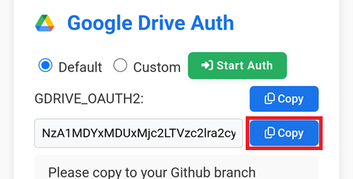
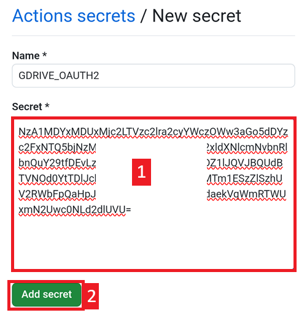
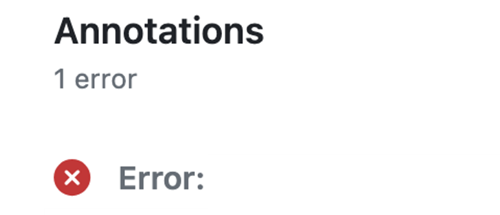

(browser-build)=

# Im Browser erstellen (Browser Build)

AAPS mit GitHub-Aktionen erstellen.

**Ab AAPS-Version 3.3.2.1. möglich.**

## Kein Download möglich - APK muss selbst erstellt werden

**Die AAPS-App (eine apk-Datei) ist aufgrund der Vorschriften rund um medizinische Geräte nicht zum Download verfügbar. Es ist zulässig, die App für den eigenen Gebrauch zu erstellen, aber du darfst keine Kopie an andere weitergeben!**

Zu den Details schaue bitte auf die [FAQ-Seite](../UsefulLinks/FAQ.md).

(Building-APK-without-a-computer)=

## Computer- und Software-Anforderungen für die AAPS-Erstellung

Wir empfehlen die Verwendung eines Android-Geräts. Du kannst allerdings auch einen Computer oder ein iOS-Gerät nutzen.

Du wirst in Deinem Browser mehrere Tabs verwenden und dabei zwischen diesen Tabs hin und her wechseln. Beispiel Chrome:


Zusätzlich benötigst Du ein Google-Konto, damit die App in Deinem Google-Drive gespeichert werden kann.

```{note}
Dieses Wiki geht davon aus, dass Du alle Operationen mit Deinem Smartphone und dem Chrome-Browser durchführst.  
Du wirst zwischen den Tabs springen: Starte mit geschlossenen Tabs. Das verhindert, dass Du Dich beim Umschalten von einem zum anderen „vertust“.
```

(github-fork)=

## 1. AAPS eigener „Fork“

Du musst Deinen persönlichen Android Java Key und Dein Google Drive-Informationen geheim in GitHub speichern (später im Prozess erklären wir, wie das geht).

Da das im öffentlichen AAPS-Repository nicht möglich ist, musst Du Deine persönliche Kopie des Quellcodes erstellen (sog. „Fork“).

### GitHub-Konto

Wenn Du noch kein GitHub-Konto hast, musst Du zuerst ein [GitHub-Konto erstellen](https://github.com/signup).  
Du kannst Dich mit einer eMail-Adresse oder mit Google registrieren. Durchlaufe den Registrierungs- und Verifikationsprozess.

Hast Du bereits ein Konto, [logge Dich in GitHub ein](https://github.com/login).

### Fork AndroidAPS (neuen AAPS-Entwicklungsast bilden)

Öffne das offizielle AndroidAPS-Repository hinter [diesem Link](https://github.com/nightscout/AndroidAPS).

Tippe auf das Fork-Symbol. Das erstellt in Deinem eigenen Konto eine Kopie.


Scrolle auf dem nächsten Bildschirm nach unten und tippe auf **Create Fork**.


*Notiz: Du kannst die Option „Copy the main branch only“ **deaktivieren**, wenn Du eine Entwicklerversion oder Anpassungen erstellen möchtest.*


```{note}
Forking a repository allows you to freely experiment with changes without affecting the original project. You cannot fork and you see this?</br></br>
**`Create a new fork`**</br>
`A fork is a copy of a repository. View existing forks.`</br>
*`Required fields are marked with an asterisk (*).`*</br>
**`No available destinations to fork this repository.`**</br></br>
Dies bedeutet, dass Du bereits einen existierenden Fork von AndroidAPS hast.</br>
Stelle Sie sicher, dass der Fork aktuell ist und mache mit den Vorbereitungsschritten weiter.
```

```{warning}
**Lösche niemals Deinen Fork, ohne ein Backup Deiner „Secrets“ (Passwörter) gemacht zu haben!**
```

GitHub zeigt jetzt Deine persönliche Kopie von AndroidAPS an. Lasse diesen Tab des Web-Browsers geöffnet.


(aaps-ci-preparation)=

## 2. Vorbereitende Schritte

- Solltest Du die Erstellung auf einem Android-Gerät durchführen, installiere den [File Manager Plus](https://play.google.com/store/apps/details?id=com.alphainventor.filemanager) aus dem Google Play Store.

```{admonition} File Manager Plus
:class: dropdown

:::{include} BrowserBuildFileManagerPlus.md
```

- Lade die Vorbereitungsdatei von [aaps-ci-preparation.html](https://github.com/nightscout/aaps-ci-preparation/releases/download/release-v1.1.2/aaps-ci-preparation.html) herunter

````{admonition} Note
:class: note

1. Solltest Du diese Seite aus einer App heraus aufgerufen haben (über einen Webview), kann es sein, dass die HTML-Datei nicht heruntergeladen wird. Bitte kopiere die URL und öffne diese in einem Browser:
```text
https://github.com/nightscout/aaps-ci-preparation/releases/download/release-v1.1.2/aaps-ci-preparation.html
```
oder gehe zur Seite mit den neuesten Releases:
```text
https://github.com/nightscout/aaps-ci-preparation/releases/latest
```

2.Backup-Kopie auf dieser Seite verfügbar:

 - Sollte auch der externe Link nicht verfügbar sein, kannst Du alternativ auch eine Backup-Datei herunterladen.
<!--crowdin:disable-->

```{eval-rst}
.. raw:: html

    &nbsp;&nbsp;&nbsp;&nbsp;&nbsp;&nbsp;<a href="../_static/CI/aaps-ci-preparation.html" download>  aaps-ci-preparation.html</a>
```
<!--crowdin:enable-->
````
AndroidAPS build requires private keys, that are stored in a Java KeyStore (JKS): -
- Solltest Du AAPS das allererste Mal erstellen (oder Du kein Android Studio JKS haben), nutze den in [AAPS-CI Option 1 – JKS erzeugen](aaps-ci-option1) beschriebenen Weg, um das Setup abzuschließen.
</br>

```{warning}
Wenn Du AAPS mit der **Option 1** baust, kannst Du Deine bestehenden AAPS-Version nicht aktualisieren.
Du musst:
1. [Einstellungen auf Deinem Smartphone exportieren](#ExportImportSettings-Automating-Settings-Export).
2. Kopiere die Datei mit den Einstellungen von Deinem Smartphone auf ein externes Gerät (d. h. Deinen Computer, externe Festplatte) oder lade sie in Deinen Cloudspeicher hoch.
3. Erstelle, so wie es in der Anleitung zu Option 1 beschrieben ist, eine neue Version der signierten APK und transferiere diese auf Dein Smartphone.
4. Deinstallieren die Vorgängerversion von AAPS auf Deinem Smartphone.
5. Installiere die neue AAPS-Version auf Deinem Smartphone.
6. [Einstellungen importieren](#ExportImportSettings-restoring-from-your-backups-on-a-new-phone-or-fresh-installation-of-aaps), um Deine Ziele (Objectives) und Einstellungen wiederherzustellen.
7. Stelle die Daten aus Nightscout wieder her.
```

- Falls Du Deinen eigenen JKS, den Du bei einem früheren AAPS-Build mit einem in Android Studio genutzt hast, nutzen möchtest und Du das Passwort und den Alias (key0) kennst, wähle bitte [AAPS-CI Option 2 – Hochladen eines vorhandenen JKS](aaps-ci-option2).

</br>

Sobald die AAPS-App erstellt wurde, wird sie in Deinem Google Cloud-Laufwerk gespeichert.

(aaps-ci-option2)=
### AAPS-CI Option 1 – JKS erzeugen
 - Diese Option ist für Nutzende ohne JKS, oder die das Passwort oder den Alias vergessen haben.
- Unten sind einige Beispiele von verschiedenen Plattformen verlinkt.
- Wähle in der Liste unten die Plattform aus, die Du nutzt. Du kannst zwischen Android (bevorzugte Wahl), iOS oder PC/Computer wählen.

```{tab-set}

:::{tab-item} Android
(aaps-ci-option1-android)=
:::{include} BrowserBuildO1A.md
:::  

:::{tab-item} iOS
(aaps-ci-ios-ipad)=
:::{include} BrowserBuildO1I.md
:::  

:::{tab-item} Computer
(aaps-ci-option1-computer)=
:::{include} BrowserBuildO1C.md
:::  

```

Überspringe den nächsten Abschnitt und fahre [hier](#aaps-ci-google-drive-auth) fort.

---

(aaps-ci-option2)=

### AAPS-CI Option 2 – Hochladen eines bestehenden JKS
 - Diese Option ist für Nutzende, die bereits einen JKS haben und dass zugehörige Passwort und den Alias kennen. Als `KEYSTORE_PASSWORD`, `KEY_ALIAS`, und `KEY_PASSWORD`, gib Dein aktuelles Password und Alias aus GitHub ein. Diejenigenen, die Android Studio nutzen, schauen unten nach, wo diese genutzt wurden.

```{admonition} KEY + PASSWORDS
:class: dropdown


```

 - Unten sind einige Beispiele von verschiedenen Plattformen verlinkt.
 - Wähle in der Liste unten die Plattform aus, die Du nutzt. Du kannst zwischen Android (bevorzugte Wahl) oder PC/Computer wählen.


```{tab-set}

:::{tab-item} Android
(aaps-ci-option2-android)=
:::{include} BrowserBuildO2A.md
:::  

:::{tab-item} Computer
(aaps-ci-option2-computer)=
:::{include} BrowserBuildO2C.md
:::  

```

(aaps-ci-google-drive-auth)=

### AAPS-CI Google Drive Auth

Hinweis: Solltest Du die Schritte aus dem Video bereits durchgeführt haben, kannst Du direkt [hierhin](#github-build-apk) springen.

Gehe zurück zum „File Explorer Plus“-Tab.

Scrolle bis zum „Google Drive Auth“-Abschnitt herunter und tippe auf "Start Auth".


Wähle Dein Google-Konto aus.


Scrolle herunter und erlaube den Zugriff. Die Webseite benötigt ihn, um den Google Drive Authentifizierungsschlüssel zu bekommen.

Tippe auf „Continue“.


Das Feld `GDRIVE_OAUTH2` wird ausgefüllt. Tippe auf die oberste „Copy“-Schaltfläche.


Switch back to the GitHub tab.

Scrolle zu den „Repository Secrets“ herunter und tippe auf „New Repository Secret“.

Nutzt Du die Option 1, solltest Du Folgendes sehen:


Nutzt Du die Option 2, sind weitere Schlüssel notwendig:


In the Name field, paste the text you just copied. Use a long touch on the text box to show the paste menu.


Switch to the File Explorer Plus tab.

Tap the second Copy button.



Switch back to the GitHub tab.

1. In the Secret field, paste the text you just copied. Use a long touch on the text box to show the paste menu.

2. Tap Add secret.



GitHub wird ab jetzt in der Lage sein, die AAPS-APK-Datei in Deinem Google Drive zu speichern, sobald sie erstellt wurde.

(github-build-apk)=
## AAPS-CI GitHub Aktionen, um die AAPS APK zu erstellen
 - Passend für allgemeine Benutzer.

```{tab-set}

:::{tab-item} Wiki
:::{include} BrowserBuildCIS.md
:::  

:::{tab-item} Video
<div align="center" style="max-width: 360px; margin: auto; margin-bottom: 2em;">
  <div style="position: relative; width: 100%; aspect-ratio: 9/16;">
    <iframe
      src="https://www.dailymotion.com/embed/video/x9rdwms?autoplay=0&queue-enable=false&loop=1"
      style="position: absolute; top: 0; left: 0; width: 100%; height: 100%;"
      frameborder="0"
      allowfullscreen>
    </iframe>
  </div>
</div>
:::  

```

### Auswahl der zu erstellenden Version („Build Version“)

**Das Erstellen der Version in einem Browser („Browser Build“) ist erst ab AAPS-Version 3.3.2.1 (oder höher) möglich.**


(variant)=

### Auswahl der zu erstellenden Variante („Build Variants“)

*Hinweis: Sowohl die Android- als auch Android Wear-App werden automatisch erstellt.*

  - Wähle die gewünschte Variante aus:
    - fullRelease: Volle Funktionalität mit normaler Pumpennutzung.
    - [aapsclientRelease, aapsclient2Release](#RemoteControl_aapsclient): Für Pflegende/Eltern (erfordert [Nightscout](../SettingUpAaps/Nightscout.md)).
    - pumpcontrolRelease: Ersetzt die Pumpenbedienung über App oder das separate Bediengerät („controller“)


Varianten mit der Endung „Debug“ signalisieren, dass die APK im Debug-Modus gebaut wird. Diese Versionen helfen Entwickelnden bei der Fehleranalyse und -behebung.

<!-- If you want to test the items in a pull request has been moved to dev page /AdvancedOptions/DevBranch.md -->

(aaps-ci-troubleshooting)=
## AAPS-CI Fehlerbehebung

(aaps-ci-preparation-web)=
### aaps-ci-preparation Webseite
  - Wenn Du die Seite „aaps-ci-preparation.html“ mit einem Dateimanager öffnest, wird ein temporärer lokaler Server auf Deinem Smartphone gestartet, um so die Webseite anzuzeigen und das Google Refresh Token zu erhalten.
  - Solltest Du den unten gezeigten Bildschirm sehen, bedeutet das, dass Du eine ganze Weile inaktiv warst und der Dateimanager den lokalen Server bereits abgeschaltet hat.
  - Bitte öffne „aaps-ci-preparation.html“ erneut mit der Dateimanager-App und schließe die verbleibenden Schritte ab.

  

(aaps-ci-disable-software)=
### Software, die bei der OAUTH-Verifizierung stören könnte, deaktivieren
  - Deaktiviere sämtliche VPN- oder Sicherheits-Apps (Firewall, Antimalware, ...) auf dem Smartphone, bevor Du versuchst den OAUTH-Key abzurufen.

(aaps-ci-actions-permission)=
### Prüfe die GitHub-Berechtigungen (Actions Permission Settings)
  - Stelle sicher, dass die GitHub-Actions-Richtlinien auf „Allow all actions and resusable workflows“ gesetzt sind (Settings → Actions → General).

  

`actions/checkout@v4` und `actions/setup-java@v4` dürfen nicht in `xxxxx/AndroidAPS` genutzt werden. Actions in diesem Workflow müssen aus einem Repository, das `xxxxx` gehört, stammen

--------

```{warning}
Anpassungen sind in der Regel nicht notwendig. Das dient lediglich der Information.
```

(github-cherry-pick)=

## Wenn Du einen bestimmten Commit zu Deinem Branch hinzufügen möchtest, benutze bitte „Cherry-pick“ als Methode

  

  - Use workflow from Branch: Bitte gib den Branch-Namen ein, aus dem Du die Funktionalität auswählen/hinzufügen möchtest.
  - Upstream Repository: Bitte gib den Repository-Namen ein, aus dem Du die Funktionalität auswählen/hinzufügen möchtest.
  - Commit SHA: Bitte gib den Commit SHA (Secure Hash Algorithmus) ein, den Du auswählen möchtest. (wie ein Git-Commit Hash)
  - Wähle die Build-Variante aus: [variant](variant)

(ci-keystore-export)=
## CI KeyStore Export

Wenn Du den Keystore exportieren willst, nutze diese Methode.

Dieses Skript exportiert Deine zuvor konfigurierten Keystore-Informationen (von Option 1 oder Option 2) als passwortgeschützte ZIP-Datei in das Verzeichnis `/AAPS/KeyStore` in Dein Google Drive.

```{warning}
Bevor Du diese Exportmethode nutzt, stelle sicher, dass Du Deine Keystore- und Google Drive-Einstellungen abgeschlossen hast.
```

### Schritte:

1. **ZIP-Passwort-Secret hinzufügen:**
   - Gehe in die Einstellungen Deines Repositorys: **Settings** → **Secrets and variables** → **Actions**
   - Klick auf **New repository secret**
   - Ins Feld **Name** gib bitte `ZIP_PASSWORD` ein
   - In das Feld **Secret**, gib Dein selbstgewähltes Passwort zur ZIP-Verschlüsselung ein
   - Verwende ausschließlich englische Buchstaben und Zahlen für das Passwort (keine speziellen Symbole)
   - Klicke auf **Add secret**

   

2. **Starte „Export Workflow“:**
   - Gehe zum **Actions**-Tab in Deinem Repository
   - Wähle **CI KeyStore Export** aus
   - Klicke auf **Run workflow**
   - Die exportierte Keystore-ZIP-Datei wird in Deinem Google Drive gespeichert

   

   