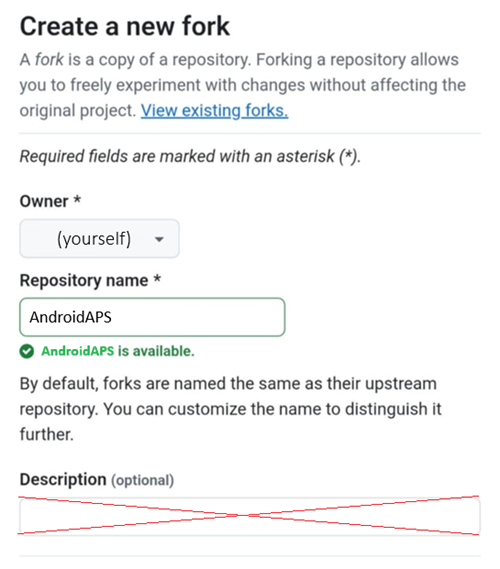
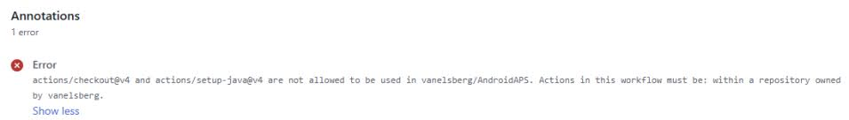

(browser-build)=

# Browser build

Building AAPS with GitHub Actions.

**Minimum AAPS version supported is 3.3.2.1.**

## Kein Download möglich - APK muss selbst erstellt werden

**Die AAPS-App (eine apk-Datei) ist aufgrund der Vorschriften rund um medizinische Geräte nicht zum Download verfügbar. Es ist zulässig, die App für den eigenen Gebrauch zu erstellen, aber du darfst keine Kopie an andere weitergeben!**

Zu den Details schaue bitte auf die [FAQ-Seite](../UsefulLinks/FAQ.md).

(Building-APK-without-a-computer)=

## Device and software specifications for building AAPS

You need a browser that works on either Android or iOS.

You will need to use multiple tabs in your browser, and switch from one to the other. Example Chrome:


You also need a Google account so that the app can be saved in your Google Drive.

```{note}
This wiki assumes you're performing all operations with your cellular phone and the Chrome web browser.  
You will need to jump from tab to tab: start with all tabs closed to avoid losing yourself when switching from one to another.
```

(github-fork)=

## 1. AAPS personal fork

You will need to secretly store your personal Android Java Key and Google Drive information in GitHub (later in the process, we will explain how).

Since this cannot be done inside the public repository of AndroidAPS, you need to make your personal copy of the source code (called a fork).

### GitHub account

You need to [create a GitHub account](https://github.com/signup) if you don't have one yet.  
You can sign up with your email, or you can sign up with Google. Follow the registration and verification process.

When you have an account, [sign in to GitHub](https://github.com/login).

### Fork AndroidAPS

Open the official AndroidAPS repository following [this link](https://github.com/nightscout/AndroidAPS).

Tap on the fork icon. This will create a copy inside your own account.


Scroll down the next screen and tap **Create Fork**.



*Note: you can **unselect** "Copy the main branch only" if you will want to build developers versions or customizations.*


GitHub now displays your personal copy of AndroidAPS. Leave this web browser tab open.


(aaps-ci-preparation)=

## 2. Preparation Steps

- If you are building from an Android device, install [File Manager Plus](https://play.google.com/store/apps/details?id=com.alphainventor.filemanager) from the Google Play store.

```{admonition} File Manager Plus
:class: dropdown

:::{include} BrowserBuildFileManagerPlus.md
```

- Download the preparation file from here:

  <!--crowdin:disable-->

```{eval-rst}
.. raw:: html

    &nbsp;&nbsp;&nbsp;&nbsp;&nbsp;&nbsp;<a href="../_static/CI/aaps-ci-preparation.html" download style="font-weight: bold; font-size: 20px;">  aaps-ci-preparation.html</a>
```
<br>
<br>
<br>
<!--crowdin:enable-->

AndroidAPS build requires private keys, that are stored in a Java KeyStore (JKS):

- If this is your first time building AAPS (or you don't have a an Android Studio JKS), follow [AAPS-CI Option 1 – Generate JKS](aaps-ci-option1) to complete the setup.

</br>

```{warning}
Building AAPS with **Option 1** will not allow you to upgrade your existing AAPS: you will need to uninstall it, restore the settings from your phone and data from Nightscout.
```

- If you want to use your own JKS (the one you used on a previous build of AAPS from a computer in Android Studio), you know its password and alias (key0), please choose [AAPS-CI Option 2 – Upload Existing JKS](aaps-ci-option2).

</br>

The AAPS app will be saved in your Google Cloud drive once built.

(aaps-ci-option1)=
### AAPS-CI Option 1 – Generate JKS
 - Suitable for first-time users, or those without a JKS, or who have forgotten the password or alias.
- Here are examples using multiple platforms below.
- Select your platform in the list below, between Android (preferred choice), iOS or Computer.

```{tab-set}

:::{tab-item} Android
(aaps-ci-option1-android)=
:::{include} BrowserBuildO1A.md
:::  

:::{tab-item} iOS
(aaps-ci-ios-ipad)=
:::{include} BrowserBuildO1I.md
:::  

:::{tab-item} Computer
(aaps-ci-option1-computer)=
:::{include} BrowserBuildO1C.md
:::  

```

Skip the next section and continue [here](#aaps-ci-google-drive-auth).

---

(aaps-ci-option2)=

### AAPS-CI Option 2 – Upload Existing JKS
 - Suitable for users who already have a JKS and know the JKS password and alias  (For `KEYSTORE_PASSWORD`, `KEY_ALIAS`, and `KEY_PASSWORD`, enter your actual password and alias in GitHub - those from Android Studio, see below where you used them.)

```{admonition} KEY + PASSWORDS
:class: dropdown


```

 - Here are examples using multiple platforms below.
 - Select your platform in the list below, between Android (preferred choice) or Computer.


```{tab-set}

:::{tab-item} Android
(aaps-ci-option2-android)=
:::{include} BrowserBuildO2A.md
:::  

:::{tab-item} Computer
(aaps-ci-option2-computer)=
:::{include} BrowserBuildO2C.md
:::  

```

(aaps-ci-google-drive-auth)=

### AAPS-CI Google Drive Auth
- Click Start Auth to begin the authorization process, and set the obtained token in GitHub after authorization.


(github-build-apk)=
## AAPS-CI GitHub Actions to Build the AAPS APK
 - Suitable for general users.
```{eval-rst}
.. raw:: html

    <!--crowdin: exclude-->
    <div align="center" style="max-width: 360px; margin: auto; margin-bottom: 2em;">
      <div style="position: relative; width: 100%; aspect-ratio: 9/16;">
        <iframe
          src="https://www.youtube.com/embed/amfEBwpTtQI"
          style="position: absolute; top: 0; left: 0; width: 100%; height: 100%;"
          frameborder="0"
          allowfullscreen>
        </iframe>
      </div>
    </div>
```
  - In GitHub, go to Actions, select AAPS-CI, and click Run workflow to start building the APK.

*Note: both Android and Android Wear apps will be built automatically.*

  

  - variant:
    - Please refer to [variant](variant)

<!-- If you want to test the items in a pull request has been moved to dev page /AdvancedOptions/DevBranch.md -->

(aaps-ci-troubleshooting)=
## AAPS-CI Troubleshooting

(aaps-ci-preparation-web)=
### aaps-ci-preparation web page
  - When you open aaps-ci-preparation.html using a file manager, it will start a temporary local server on your phone to display the webpage and receive the Google refresh token.
  - If you see the screen below, it means you have been inactive for a while, and the file manager has already shut down the local server.
  - Please reopen aaps-ci-preparation.html using the file manager app and complete the remaining steps.

  

(aaps-ci-disable-software)=
### Disable Software That May Interfere With OAUTH Verification
  - Disable any VPN or security app (firewall, antimalware,...) on the phone before trying to get the OAUTH key.

(aaps-ci-actions-permission)=
### Check GitHub Actions Permission Settings
  - Make sure GitHub Actions policies are set to “Allow all actions and reusable workflows” (Settings → Actions → General).

  

--------

```{warning}
Customizations are usually not necessary. This is for your information ony.
```

(github-cherry-pick)=

## If you want to add a specific commit to your branch, please use cherry-pick.

  

  - Use workflow from Branch: Please enter the branch name you want to cherry-pick to.
  - Upstream Repository: Please enter the repository name you want to cherry-pick from.
  - Commit SHA: Please enter the commit SHA you want to cherry-pick.(like git commit hash)
  - Select Build Variant: [variant](variant)