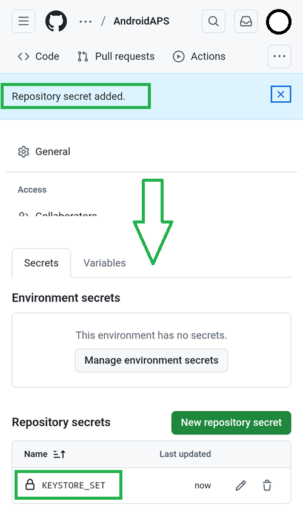

### Öffne die CI preparation Hilfedatei

Öffne mit dem Dateimanager+ die Datei `aaps-ci-preparation-html`, die Du bereits heruntergeladen hast.

Wähle den Downloads-Ordner aus.

Und suche nach der Datei, tippe auf den Namen, um sie zu öffnen, öffne sie mit Chrome, tippe nur einmal darauf.

Es wird sich ungefähr so öffnen.

Wähle „Generate JKS“. Das Feld unten wird mit Zeichen gefüllt.

Lass diesen Tab geöffnet.

### Erstelle ein neues Geheimnis (New Secret) in GitHub

Gehe zurück auf den GitHub-Browser-Tab: Deiner eigenen AndroidAPS-Kopie.

1. Oben rechts, tippe auf die `...`-Schaltfläche
2. Wähle aus der Liste die Einstellungen aus

Scrolle zum Abschnitt „Security“ nach unten und wähle „Secrets and Variables“ aus.

Wähle jetzt „Actions“ aus

Scrolle zu den „Repository Secrets“ herunter und tippe auf „New Repository Secret“

Du wirst den folgenden Dialog sehen. (Sollte er nicht zu sehen sein, scrolle nach unten).

Lass den Tab, so wie hier gezeigt, geöffnet.

Wechsle auf den Dateimanager+ Tab.

Tippen auf die oberste Kopieren-Schaltfläche.

Wechsle zurück auf den GitHub-Tab.

Füge in das Namensfeld den gerade kopierten Text ein. Drücke lange auf die Textbox, um das „Einfügen-Menü“ anzuzeigen.

Wechsle auf den Dateimanager+ Tab.

Tippe auf den zweiten Kopieren-Knopf.

Wechsle zurück auf den GitHub-Tab.

1. Füge in das Secret-Feld den gerade kopierten Text ein. Drücke lange auf die Textbox, um das „Einfügen-Menü“ anzuzeigen.

2. Tippe auf „Add Secret“.

Prüfe, ob das „Secret“ hinzugefügt wurde, und scrolle dazu nach unten.

