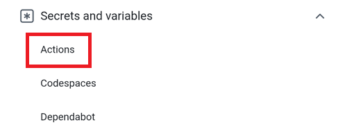
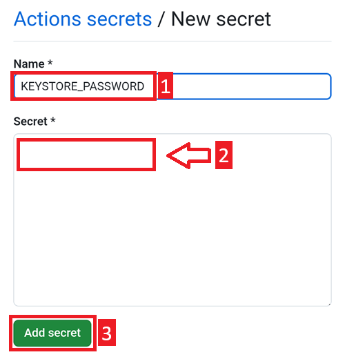

### Kopiere Deinen Android Studio Schlüssel in Dein Google Cloud Laufwerk.

Suche auf Deinem Computer nach der Keystore-Datei, die Du zum Erstellen von AAPS verwendet hast. Du kannst sie an der Dateiendung `.jks` erkennen.

Zieh es in [Dein Google Drive](https://drive.google.com/drive/my-drive), entweder im Browser oder in Deinem verknüpften Google Drive.

Öffne den Dateimanager+ und wähle die Cloud aus.

Füge einen Cloud-Pfad hinzu.

Wähle Google Drive aus.

Wähle die E-Mail Deines Google Drive-Kontos. Tippe auf OK.

Du solltest die Inhalte Deines Google Cloud-Laufwerk sehen. Gehe jetzt zur App-Startseite zurück.

### Öffne die CI preparation Hilfedatei

Öffne die von Dir heruntergeladene Datei `aaps-ci-preparation-html`.

Wähle den Downloads-Ordner aus.

Und suche nach der Datei, tippe auf den Namen, um sie zu öffnen, öffne sie mit Chrome, tippe nur einmal darauf.

Es wird sich ungefähr so öffnen.

Scroll nach unten zur Option 2: Upload existing JKS. Klappe die Oberfläche auf.

Wähle „Choose File“.

Wähle Deine Keystore-Datei aus Deinen Google Drive-Dateien aus.

Das Feld unten wird ausgefüllt.

Lass diesen Tab geöffnet.

### Erstelle ein neues Geheimnis (New Secret) in GitHub

Gehe zurück auf den GitHub-Browser-Tab: Deiner eigenen AndroidAPS-Kopie.

1. Oben rechts, tippe auf die `...`-Schaltfläche
2. Wähle aus der Liste die Einstellungen aus

Scrolle zum Abschnitt „Security“ nach unten und wähle „Secrets and Variables“ aus.

Wähle jetzt „Actions“ aus

Scrolle zu den „Repository Secrets“ herunter und tippe auf „New Repository Secret“

Du wirst den folgenden Dialog sehen. (Sollte er nicht zu sehen sein, scrolle nach unten).

Lass den Tab, so wie hier gezeigt, geöffnet.

Wechsle auf den Dateimanager+ Tab.

Tippen auf die oberste Kopieren-Schaltfläche.

Wechsle zurück auf den GitHub-Tab.

Füge in das Namensfeld den gerade kopierten Text ein. Drücke lange auf die Textbox, um das „Einfügen-Menü“ anzuzeigen.

Wechsle auf den Dateimanager+ Tab.

Tippe auf den zweiten Kopieren-Knopf.

Wechsle zurück auf den GitHub-Tab.

1. Füge in das Secret-Feld den gerade kopierten Text ein. Drücke lange auf die Textbox, um das „Einfügen-Menü“ anzuzeigen.

2. Tippe auf „Add Secret“.

Prüfe, ob das „Secret“ hinzugefügt wurde, und scrolle dazu nach unten.

Neues Secret hinzufügen: Tippe auf „New Repository Secret“.

Wechsle auf den Dateimanager+ Tab.

Tippe auf die oberste Kopieren-Schaltfläche, um das `KEYSTORE_PASSWORD` zu kopieren.

Hinweis: Wenn Du sicher bist, kannst Du die Schlüsselnamen direkt in GitHub eingeben und musst sie nicht kopieren/einfügen. Falls Du nicht sicher sein solltest, den Schlüsselnamen richtig einzugeben, mache wie folgt weiter. Beachte bitte, dass am Ende des Schlüsselnamens kein `:` stehen sollte.

Wechsle zurück auf den GitHub-Tab.

1.  Füge den neuen Schlüsselnamen ein.
2. Gib Dein Keystore-Passwort in das „Secret“-Feld ein und lasse es nicht leer.
3. Tippe auf „Add Secret“.

Prüfe, ob das „Secret“ hinzugefügt wurde, und scrolle dazu nach unten.

Tippe auf die „New Repository Secret“-Schaltfläche, die oben gezeigt wird.

Wechsle auf den Dateimanager+ Tab.

Tippe auf die Kopieren-Schaltfläche, um den `KEYSTORE_ALIAS` zu kopieren.

Wechsle zurück auf den GitHub-Tab.

1.  Füge den neuen Schlüsselnamen ein.
2. Gib Deinen Keystore-Alias (normalerweise ist er `key0`, kleingeschrieben und mit einer Null und nicht dem Buchstaben O) in das „Secret“-Feld ein. Achte darauf, dass die Android-Autokorrektur nichts verändert.
3. Tippe auf „Add Secret“.

Prüfe, ob das „Secret“ hinzugefügt wurde, und scrolle dazu nach unten.

Tippe auf die „New Repository Secret“-Schaltfläche, die oben gezeigt wird.

Wechsle auf den Dateimanager+ Tab.

Tippe auf die Kopieren-Schaltfläche, um das `KEY_PASSWORD` zu kopieren.

Wechsle zurück auf den GitHub-Tab.

1.  Füge den neuen Schlüsselnamen ein.
2. Gib Dein Key-Passwort in das „Secret“-Feld ein und lasse es nicht leer. Es ist in der Regel das gleiche wie das Keystore-Passwort.
3. Tippe auf „Add Secret“.

Prüfe, ob das „Secret“ hinzugefügt wurde, und scrolle dazu nach unten.
