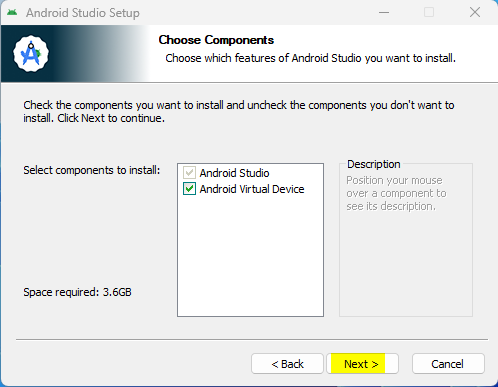
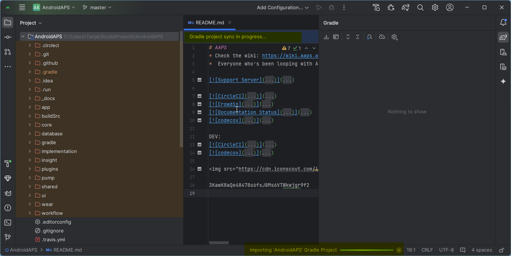
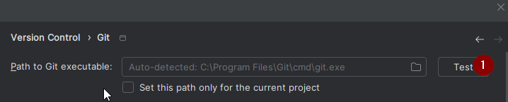
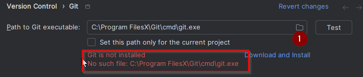
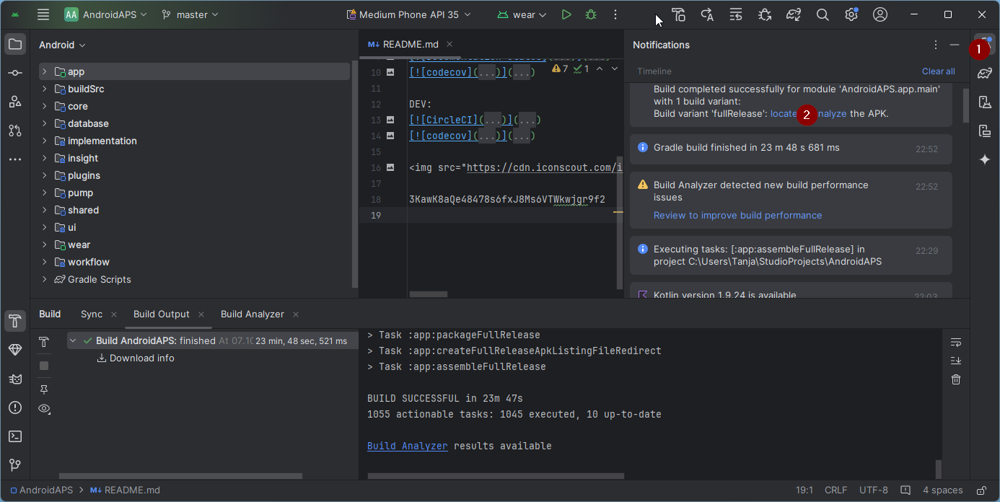

# AAPS erstellen

## Kein Download möglich - APK muss selbst erstellt werden

**Die AAPS-App (eine apk-Datei) ist aufgrund der Vorschriften rund um medizinische Geräte nicht zum Download verfügbar. Es ist zulässig, die App für den eigenen Gebrauch zu erstellen, aber du darfst keine Kopie an andere weitergeben!**

Zu den Details schaue bitte auf die [FAQ-Seite](../UsefulLinks/FAQ.md).


(Building-APK-recommended-specification-of-computer-for-building-apk-file)=
## Computer- und Software-Spezifikationen für das "Bauen" von AAPS

* Um die APK zu erstellen ist möglicherweise eine bestimmte **[Android Studio](https://developer.android.com/studio/)**-Version erforderlich. Siehe Tabelle unten:

| AAPS-Version            | Empfohlene <br/>Android Studio<br/> Version | Alternative <br/>Android Studio<br/> Version | Gradle | JVM |
| ----------------------- | ------------------------------------------------------- | -------------------------------------------------------- | ------ |:--- |
| 2.6.2                   | 3.6.1                                                   |                                                          | 5.6.4  | 11  |
| 2.8.2.1                 | 4.1.1                                                   |                                                          | 6.1.1  | 13  |
| [3.1.0.3](#version3100) | 2020.3.1                                                | up to Narwhal                                            | 7.3.3  | 17  |
| [3.2.0.4](#version3204) | Hedgehog (2023.1.1)                                     | up to Narwhal                                            | 8.2    | 17  |
| [3.3.1.3](#version3300) | Ladybug Feature Drop (2024.2.2)                         | up to Narwhal                                            | 8.10   | 21  |
| [3.3.2](#version3300)   | Meerkat (2024.3.1)                                      | Narwhal                                                  | 8.11.1 | 21  |

Die „empfohlene Version“ enthält im Paket bereits die entsprechende JVM-Version. Die empfohlene Version ist gleichzeitig auch die Mindestversion, die Du zum Erstellen von **AAPS** nutzen kannst. Mit einer älteren Version als der, die unter „empfohlen“ aufgeführt ist, wirst Du **NICHT** in der Lage sein, AAPS zu erstellen. Solltest Du eine andere Version verwenden, kann es aufgrund der JVM-Version zu Problemen kommen. Schaue auf den Seiten zur [Fehlerbehebung für Android Studio](#troubleshooting_androidstudio-uncommitted-changes) nach, um diese Probleme zu lösen. Wenn Deine aktuelle Android Studio Version nicht in der Tabelle aufgeführt ist, musst Du sie zuerst aktualisieren.

Die Gradle-Version ist mit dem Quellcode verknüpft. Wenn Du den Quellcode herunterlädst oder aktualisierst, bekommst Du automatisch die richtige Gradle-Version. Das wird hier rein zu Deiner Information erwähnt. Du brauchst nichts machen.

* Android Studio unterstützt keine [Windows 32-Bit-Systeme](#troubleshooting_androidstudio-unable-to-start-daemon-process). Bitte beachte, dass sowohl eine **64-Bit-CPU als auch ein 64-Bit-Betriebssystem zwingend erforderlich sind**. Wenn Dein System diese Bedingung nicht erfüllt, musst Du die entsprechende Hardware, Software oder das ganze System ersetzen.

<table class="tg">
<tbody>
  <tr>
    <th class="tg-baqh">Betriebssystem (nur 64 Bit)</th>
    <td class="tg-baqh">Windows 8 oder höher</td>
    <td class="tg-baqh">Mac OS 10.14 oder höher</td>
    <td class="tg-baqh">Jedes Linux unterstützt Gnome, KDE oder Unity DE;&nbsp;&nbsp;GNU C Library 2.31 oder höher</td>
  </tr>
  <tr>
    <th class="tg-baqh"><p align="center">CPU (nur 64 Bit)</th>
    <td class="tg-baqh">x86_64-CPU-Architektur Intel Core der 2. Generation oder neuer oder AMD-CPU mit Unterstützung für <br><a href="https://developer.android.com/studio/run/emulator-acceleration#vm-windows" target="_blank" rel="noopener noreferrer"><span style="text-decoration:var(--devsite-link-text-decoration,none)">Windows Hypervisor-Framework</span></a></td>
    <td class="tg-baqh">ARM-basierte Chips oder Intel Core der 2. Generation oder neuer mit Unterstützung für <br><a href="https://developer.android.com/studio/run/emulator-acceleration#vm-mac" target="_blank" rel="noopener noreferrer"><span style="text-decoration:var(--devsite-link-text-decoration,none)">Hypervisor-Framework</span></a></td>
    <td class="tg-baqh">x86_64 CPU Architektur; Intel Core der zweiten Generation oder neuer, alternativ AMD Prozessor mit Unterstützung für AMD Virtualization (AMD-V) und SSSE3</td>
  </tr>
  <tr>
    <th class="tg-baqh"><p align="center">RAM</th>
    <td class="tg-baqh" colspan="3"><p align="center">8GB oder mehr</td>
  </tr>
  <tr>
    <th class="tg-baqh"><p align="center">Festplatte</th>
    <td class="tg-baqh" colspan="3"><p align="center">Mind. 30 GB freier Speicherplatz. SSD wird empfohlen.</td>
  </tr>
  <tr>
    <th class="tg-baqh"><p align="center">Bildschirmauflösung</th>
    <td class="tg-baqh" colspan="3"><p align="center">min. 1280 x 800<br></td>
  </tr>
  <tr>
    <th class="tg-baqh"><p align="center">Internet</th>
    <td class="tg-baqh" colspan="3"><p align="center">Breitband</td>
  </tr>
</tbody>
</table>

**Es wird dringend empfohlen eine SSD (Solid State Disk) anstelle einer HDD (Hard Disk Drive) zu verwenden, da damit weniger Zeit benötigt wird, um die AAPS-apk-Datei zu erstellen**. Es ist aber auch möglich eine Festplatte (HDD) zum Erstellen der **AAPS**-apk-Datei zu nutzen. Wenn du dies tust, kann es lange dauern, bis der Bau der App abgeschlossen ist, aber sobald er begonnen hat, kann man ihn unbeaufsichtigt lassen.

## Hilfe und Unterstützung während des Erstellungsprozesses

Solltest Du Probleme beim Erstellen der **AAPS**-App haben, kannst Du im Abschnitt [**Fehlerbehebung für Android Studio**](../GettingHelp/TroubleshootingAndroidStudio) einiges an Hilfestellung finden.

Wenn Du den Eindruck hast, dass in der Anleitung Schritte falsch, fehlend oder missverständlich sind, oder Du trotzdem noch Probleme hast, wende Dich über [Facebook](https://www.facebook.com/groups/AndroidAPSUsers) oder [Discord](https://discord.gg/4fQUWHZ4Mw) an andere **AAPS**-Nutzende. Wenn Du selbst etwas ändern möchtest (z.B. Screenshots aktualisieren _etc_), erstelle einen entsprechenden [Pull-Request (PR)](../SupportingAaps/HowToEditTheDocs.md).

## Schritt-für-Schritt Anleitung zum Erstellen der AAPS-App

```{admonition} WARNING
:class: warnung
Wenn Du AAPS in der Vergangenheit bereits einmal erstellt hast, musst Du nicht alle der folgenden Schritte noch einmal durchlaufen.
Bitte springe direkt zur [Update-Anleitung](../Maintenance/UpdateToNewVersion.md)!
```

```{contents} The overall steps for building the **AAPS** apk file
:depth: 1
:local: true
```

Diese Anleitung enthält _beispielhafte_ Screenshots zum Erstellen der **AAPS**-APK-Datei. Weil **Android Studio** - die Software, die wir zum Erstellen der **AAPS**-APK verwenden - regelmäßig aktualisiert wird, sind diese Screenshots vielleicht nicht mit Deiner Installation identisch. Sie sollten trotzdem ausreichen durch den Prozess zu kommen.

Da **Android Studio** auf Windows, Mac OS X und Linux Plattformen läuft, kann es auch kleinere Unterschiede in den Schritten zwischen den verschiedenen Plattformen geben.

(install-git-if-you-dont-have-it)=
### Git installieren

```{admonition} Why Git? 
:class: dropdown

Git ist ein „_Versioning Control System_“ (VCS).
Git ist ein Programm, das es Dir erlaubt Änderungen im Code zu verfolgen und mit anderen zusammenzuarbeiten. Du wirst Git dazu nutzen, eine Kopie des **AAPS** Quellcodes von der Github Webseite auf Deinem lokalen Computer zu erstellen. Anschließend wirst Du Git auf Deinem Computer verwenden, um die **AAPS** Anwendung (apk) zu erstellen. 
```

(BuildingAaps-steps-for-installing-git)=
#### Schritte zur Installation von Git

1.  Überprüfe, ob Du **Git** nicht bereits installiert hast. Du überprüfst es, indem Du „git“ in die Windows-Suchleiste eingibst. Wenn **„Git bash“** oder eine andere Form von Git gefunden wird, ist es bereits installiert und Du kannst direkt zur [Installation von Android Studio](#install-android-studio) weitergehen:


2. Sollte Git noch nicht installiert sein, lade die neueste Version für Dein System aus dem „Download“-Bereich [**hier**](https://git-scm.com/downloads) herunter und installiere sie. Jede aktuelle Git-Version sollte funktionieren, wähle die richtige Version nach deinem System, entweder Mac, Windows oder Linux.

**Hinweis für Mac-Benutzer:** Die Git-Webseite schlägt vor, ein zusätzliches Programm namens "Homebrew" zu installieren, um die Installation zu unterstützen. Wenn Du git über homebrew installierst, musst Du keine Einstellungen ändern.

(Make_a_note_of_Git_path)=

* Bei der Installation wirst Du nach einer „destination location“ (einem Zielordner) gefragt werden. Notiere Dir bitte _den Ort_ an dem Git installiert wird (den **Installationspfad**). Du wirst dort im nächsten Schritt etwas überprüfen müssen. Der Installationspfad wird in in etwa so aussehen: "C:\Program Files\Git\cmd\git.exe"

*  Akzeptptiere in den verschiedenen Schritten der Git-Installation die voreingestellten Optionen.

*  Falls Du nach der Installtion vergessen hast (oder Du Dir keinen Notiz gemacht hast), in welchem Verzeichnis Git installiert wurde, kannst Du es auch auf folgendem Weg herausfinden: Gib in der Windows-Suchleiste unten "git"ein, klicke mit der rechten Maustaste auf "Git Bash", "Dateispeicherort öffnen". Damit öffnet sich der Installationspfad.

* Starte vor dem nächsten Schritt Deinen Computer bitte neu.

(Building-APK-install-android-studio)=
### Android Studio installieren

- **Du musst durchgängig online sein, da Android Studio verschiedene Updates herunterladen wird**

```{admonition} What is Android Studio?
:class: dropdown
Android Studio ist ein Programm, dass auf Deinem Computer läuft. Es erlaubt Dir Quellcode, mit Hilfe von Git, aus dem Internet herunterzuladen und dann daraus Smartphone- (und Smartwatch)-Apps zu erstellen. Die aktuell auf Deinem Smartphone laufende Loop-Version von **AAPS** kannst Du durch das Erstellen einer neuen oder aktualisierten Version auf Deinem PC mit Android Studio nicht beschädigen oder gar zerstören. Es sind zwei voneinander völlig unabhängige Prozesse. 
```

Einer der wichtigsten Punkte bei der Installation von Android Studio ist: **Geduldig sein!** Während der Installation und Einrichtung lädt Android Studio sehr viele Daten nach und das braucht seine Zeit.

```{admonition} Different UI
:class: warning
Wichtige Anmerkung: Android Studio hat seine Benutzeroberfläche (UI) seit den letzten Versionen geändert. Diese Anleitung zeigt Dir die Schritte in dem *neuen UI* „Ladybug“. Nutzt Du noch eine ältere Version der Benutzeroberfläche, dann solltest Du Android Studio als Erstes auf das neue Design umstellen. Wie das funktioniert ist [hier beschrieben](NewUI).
```

Die Android-Studio-Version ist sehr wichtig. Schaue Dir die [Anleitung oben](#Building-APK-recommended-specification-of-computer-for-building-apk-file) an, um die richtige Android Studio Version auszuwählen.

Lade Dir die [aktuelle Version des Android Studio](https://developer.android.com/studio) oder eine ältere Version aus dem [**Archiv**](https://developer.android.com/studio/archive) herunter und akzeptiere dabei die Download-Vereinbarungen.


Sobald der Download abgeschlossen ist, starte die heruntergeladene Anwendung, um sie auf Deinem Computer zu installieren. Eventuell musst Du einige Windows-Warnungen zu heruntergeladenen Apps akzeptieren/bestätigen!

Installiere Android Studio, indem Du, wie in den folgenden Screenshots gezeigt, auf "Weiter" (Next) klickst. Du musst **keine** Einstellungen ändern!


If you want to save hard disk space, your you can uncheck Android Virtual Device: it is not used for building **AAPS**.




Klicke nun auf "Install":


Sobald die Installation abgeschlossen ist, klicke auf "Next"


Im letzten Schritt klicke auf "Finished" (dt. Fertig), um Android Studio erstmalig zu starten.


Du wirst danach gefragt, ob Du bei der Verbesserung des Android Studios helfen möchtest. Wähle die Option, die Dir am meisten zusagt. Das hat keinen Einfluss auf die Folgeschritte.


Der Willkommensbildschirm begrüßt Dich zur Installation des Android Studios. Klicke "Next" (dt. Weiter).


Wähle "Standard" als Installationstyp aus.


Überprüfe die Einstellungen, indem Du erneut auf "Next" (dt. Weiter) klickst.


Jetzt musst Du die Lizenzvereinbarungen akzeptieren. Du hast auf der linken Seite zwei Abschnitte (1 + 3) die Du einen nach dem anderen auswählst und mit "Accept" (2 + 4) auf der rechten Seite bestätigst.

Danach kannst Du auf "Finish" (5) klicken.


Einige der Android-Pakete werden nun heruntergeladen und installiert. Habe Geduld und warte ab.

Nach dem Abschluss siehst Du den folgenden Bildschirm, auf dem Du erneut "Finish" klickst.


Du wirst jetzt Android Studios Willkommens-Bildschirm sehen.


(Building-APK-download-AAPS-code)=
### AAPS-Code herunterladen

```{admonition} Why can it take a long time to download the AAPS code?
:class: dropdown

Beim ersten **AAPS**-Download wird Android Studio sich übers Internet mit der Github-Webseite verbinden und von dort den **AAPS**-Quellcode herunterladen. Das sollte etwa eine Minute dauern. 

Android Studio wird dann mit **Gradle** (einem Entwicklungswerkzeug für Android Studio) andere erforderliche Komponenten identifizieren, die zusätzlich installiert werden müssen. 
```

Überprüfe auf dem Begrüßungsbildschirm von Android Studio, ob „**Projects**“ (1) auf der linken Seite hervorgehoben ist.

Then click "**Clone Repository**" (2) on the right:


Wir werden Android Studio nun sagen, wo es den Code herunterladen soll:


* "Repository-URL" (voreingestellt) sollte auf der linken Seite ausgewählt werden (1).
* "Git" (standardmäßig) sollte als Version Control ausgewählt werden (2).
* Kopiere nun diese URL:
    ```
    https://github.com/nightscout/AndroidAPS.git
    ```
    und füge sie in das URL-Textfeld (3) ein.

* Prüfe, ob das (Standard)-Verzeichnis zum Speichern des geklonten Codes nicht bereits auf Deinem Computer existiert (4). You can change it to some directory, but please remember where you stored it!
* Klicke nun auf "Clone" (5).

```{admonition} INFORMATION
:class: information
Notiere Dir das Verzeichnis. Das ist die Stelle, an der Dein Quellcode gespeichert ist!
```

Du wirst jetzt einen Screen sehen, der Dir sagt, dass das Repository geklont wurde:


Irgendwann wird sich Android Studio schließen und neu starten. Du wirst gefragt, ob Du dem Projekt vertrauen willst. Klicke auf "Trust project":

  


Nur für Windows-Benutzer: Wenn Deine Firewall um Erlaubnis bittet, lasse den Zugriff zu:

 

Nachdem das Projektarchiv erfolgreich geklont wurde, wird Android Studio das geklonte Projekt öffnen.

(NewUI)=
```{admonition} New UI
:class: Informationen
Android Studios Benutzeroberfläche wurde kürzlich geändert. Neue Installationen des Android Studio verwenden standardmäßig die neue Benutzeroberfläche!

Nur wenn Dein Android Studio anders aussieht, musst Du möglicherweise auf das neue UI umschalten:
Klicke oben links auf das Hamburger-Menü und wähle dann **Settings** (oder bei Apple-Rechnern auf **Preferences**).
Im Menü **Appearance & Behaviour**, gehe auf **New UI** und aktiviere dort **Enable new UI**. Starte Android Studio danach neu, damit die Änderungen aktiv werden.

Wenn Du die Option **New UI** nicht findest, mache Dir keine Sorgen: Du nutzt sie dann schon!
```


Wenn Android Studio wieder gestartet ist, warte ab (das kann einige Minuten dauern), und vor allem, anders als es das Popup vorschlägt, **aktualisiere** das Projekt <0>nicht</0>.

Android Studio startet automatisch einen "Gradle project sync", der einige Minuten dauert. Du siehst, dass es (noch) läuft:



```{admonition} NEVER UPDATE GRADLE!
:class: warning

Android Studio wird unter Umständen vorschlagen das Gradle-System zu aktualisieren. **Mache niemals ein Gradle-Update!** Dies wird sonst zu Folgeproblemen führen.
```

Nur für Windows-Rechner: Es kann sein, dass Du Benachrichtigungen darüber, dass Windows Defender läuft, erhältst: Klicke auf **Automatically** und bestätige es. Der Build-Prozess wird damit schneller laufen!


Du kannst den Gradle Sync laufen lassen während Du Dich schon um die folgenden Schritte kümmerst.

(Building-APK-set-git-path-in-preferences)=
### Pfad zu Git in den Einstellungen von Android Studio festlegen

Sage Android Studio nun, wo Git, das Du [vorher](#install-git-if-you-dont-have-it) installiert hast, zu finden ist.

* Nur für Windows-Rechner: Starte Deinen Rechner nach der [Git-Installation](#install-git-if-you-dont-have-it) auf jeden Fall neu. Falls nicht, starte jetzt neu und öffne Android Studio dann erneut

Öffne in der linken oberen Ecke des **Android Studio** das Hamburger-Menü und navigiere zu **File** > **Settings** (Windows) oder **Android Studio** > **Preferences** (Mac). Damit öffnet sich das folgende Fenster. Klicke auf das Dropdown-Menü **Version Control** (1), um es aufzuklappen und wähle **Git**


Klicke auf den Button „Test“ (1), um zu prüfen, ob **Android Studio** den **Pfad zur ausführbaren Datei git.exe** automatisch ermitteln kann:




Wenn die automatische Erkennung funktioniert, wird die **Git**-Version in der Nähe des Pfads angezeigt.

   


Wenn **git.exe** nicht automatisch gefunden wird oder wenn Du nach dem Klicken auf „Test“ eine Fehlermeldung erhältst (1), kannst Du entweder
* den Pfad, den Du [vorher](#BuildingAaps-steps-for-installing-git) gespeichert hast, manuell eingeben oder
* auf das Ordnersymbol (1) klicken und manuell zum Verzeichnis, in dem **git.exe** [vorher](#BuildingAaps-steps-for-installing-git) installiert wurde, navigieren.
* Überprüfe die Einstellungen mit dem **Test**-Button!

  

(Building-APK-generate-signed-apk)=
### Signierte AAPS APK erstellen

```{admonition} Why does the AAPS app need to be "signed"?
:class: dropdown

Android fordert, dass jede App _signiert_ wird, um sicherzustellen, dass sie später nur aus derselben vertrauenswürdigen Quelle, aus der auch die orginale App stammt, aktualisiert werden kann. Für weitere Informationen zu diesem Thema folge [diesem Link](https://developer.android.com/studio/publish/app-signing.html#generate-key). 

Für unsere Zwecke bedeutet das nur, dass wir eine Signatur- oder "Keystore"-Datei generieren und diese beim Erstellen der **AAPS**-App verwenden.
```


**Wichtig: Achte darauf, dass der Gradle Sync erfolgreich abgeschlossen ist, bevor Du weiter machst!**


Klicke oben links auf das Hamburger-Menü, um die Menüleiste zu öffnen. Wähle **Build** (1) und dann **Generate Signed App Bundle / APK** (2) aus


Wähle "APK" anstelle von "Android App Bundle" aus und klicke auf "Next":


In der nächsten Ansicht muss "Modul" auf "AAPS.app" (1) eingestellt sein/werden.

(Building-APK-wearapk)=
```{admonition} INFORMATION!
:class: information
Wenn Du die APK für Deine Smartwatch erstellen möchtest, musst Du jetzt AAPS.wear auswählen!
```


Klicke auf "Create new..." (2), um mit der Erzeugung Deines Keystore zu beginnen.

```{admonition} INFORMATION!
:class: information
Der Keystore muss nur einmal erstellt werden.
Wenn Du AAPS schon einmal erstellt (gebaut) hast, erstelle KEINEN neuen Keystore, sondern wähle den bestehenden und gib dessen Passwörter ein!
```

**_Hinweis:_** Der Keystore ist eine Datei, in der die Informationen zum Signieren der App gespeichert sind. Die Datei ist verschlüsselt und passwortgeschützt.


* Klicke auf das Ordner-Symbol, um den Pfad Deines Keystore auf Deinem Computer auszuwählen.

  Nimm **nicht** das Verzeichnis, in dem Du Deinen Quellcode gespeichert hast, sondern ein Verzeichnis, das Du auch auf einen neuen Computer übertragen würdest.

```{admonition} WARNING!
:class: warning
Schreib Dir auf, wo Dein Keystore gespeichert wird. Du wirst es für Dein nächstes AndroidAPS-Update brauchen!
```

* Wähle jetzt ein einfaches Passwort (und notiere es Dir), gib es in das Passwortfeld (2) ein und bestätige es (2).

  Die Passwörter für Keystore und Key müssen nicht sehr anspruchsvoll sein. Solltest Du Dein Passwort verlieren, lies dazu bitte den Abschnitt[Verlorener Keystore](#troubleshooting_androidstudio-lost-keystore).

* Der Standard-Alias (3) für den Key lautet "key0". Lass ihn unverändert.

* Jetzt brauchst Du ein Passwort für Deinen Key. Wenn Du es einfach halten willst, nimmst Du das selbe Passwort, das Du auch für Deinen Keystore oben verwendet hast. Gib ein Passwort (4) ein und bestätige es.

```{admonition} WARNING!
:class: warning
Notiere Dir diese Passwörter! Du wirst sie für Dein nächstes AAPS-Update brauchen!
```

* Standardmäßig sind sie 25 Jahre gültig. Lass es unverändert.

* Gib Deinen Vor- und Nachnamen ein (5). Es müssen keine weiteren Informationen hinzugefügt werden, aber Du kannst es dennoch tun, wenn Du möchtest (6-7).

* Drücke auf "OK" (8) um fortzufahren:


Auf der Seite **Generate signed App Bundle or APK** wird jetzt der Pfad zu Deinem Keystore angezeigt. Gib jetzt erneut das Keystore-Password (1) und das Key-Password (2) ein, und hake die Box "remember password" an (3), sodass Du es beim nächsten Erstellen der APK (z.B. bei der nächsten AAPS-Aktualisierung) nicht noch einmal eingeben brauchst. Klicke auf "Next" (4):


Auf der nächsten Seite wähle die Build-Variante "fullRelease" (2) aus und klicke auf "Create" (3). Merke Dir das Verzeichnis, das in (1) angezeigt wird, da dort später die Build-APK-Datei zu finden sein wird!

   

Android Studio wird jetzt die **AAPS**-APK erstellen. Es wird unten rechts "Gradle Build running" (2) angezeigt. Der Vorgang dauert je nach Computer und Internetverbindung einige Zeit, **Gedulde Dich!** Wenn Du den Fortschritt des „Builds“ mitverfolgen möchtest, klicke auf den kleinen Hammer „Build“ (1) unten im Android Studio:


Jetzt kannst Du den Build-Fortschritt verfolgen:


Sobald der Build abgeschlossen ist, wird Android Studio "BUILD SUCCESSFUL" anzeigen. Möglicherweise erscheint eine Popup-Benachrichtigung auf der Du "locate" anklicken kannst. Wenn Du diesen Moment verpasst haben solltest, klicke ganz unten auf dem Bildschirm auf das Benachrichtigungs-Symbol (1) und dann auf **locate** (2), um die Benachrichtigungen anzeigen zu lassen:



**_Wenn der „Build“ fehlgeschlagen ist, lies bitte den Abschnitt [Fehlerbehebung für Android Studio](../GettingHelp/TroubleshootingAndroidStudio)._**

Klicke im Benachrichtigungsfeld auf den blauen Link "locate":

 Der Dateimanager öffnet sich und zeigt Dir die gerade von Dir erzeugte APK-Datei an.

   

Glückwunsch! Du hast die **AAPS**-APK-Datei erstellt. Du wirst diese Datei im nächsten Abschnitt der Dokumentation auf Dein Smartphone übertragen.

```{tip}
Wenn Du darüber nachdenkst, zukünftig eine Android Wear-Smartwatch zu nutzen, ist jetzt genau der richtige Zeitpunkt die AAPS Wear-APK zu erstellen, um so sicherzustellen, dass diese mit der AAPS-APK zusammenpasst.
```

Gehe jetzt zum nächsten Schritt [**AAPS** auf Dein Smartphone übertragen und installieren](../SettingUpAaps/TransferringAndInstallingAaps.md) weiter.


