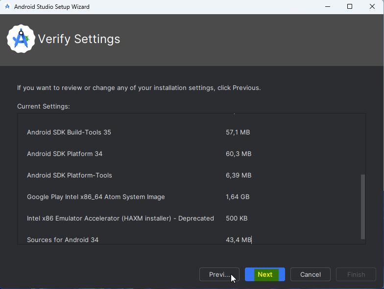
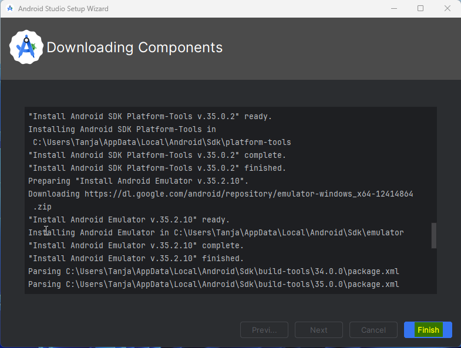
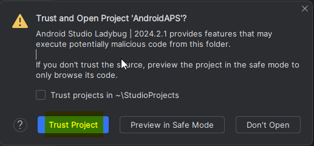
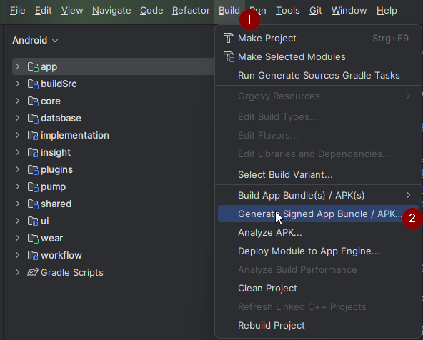
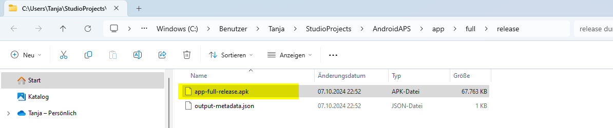

# AAPS erstellen

## Kein Download möglich - APK muss selbst erstellt werden

**Die AAPS-App (eine apk-Datei) ist aufgrund der Vorschriften rund um medizinische Geräte nicht zum Download verfügbar. Es ist zulässig, die App für den eigenen Gebrauch zu erstellen, aber du darfst keine Kopie an andere weitergeben!**

See [FAQ page](../UsefulLinks/FAQ.md) for details.

(Building-APK-recommended-specification-of-computer-for-building-apk-file)=

## Computer- und Software-Spezifikationen für das "Bauen" von AAPS

- Bitte nutze die **[Android Studio Version Hedgehog (2023.1.1) oder eine neuere Version wie Iguana, Jellyfish, Koala oder Ladybug](https://developer.android.com/studio/)**, um die APK-Datei zu erstellen ("bauen"). Ältere Versionen des Android Studios müssen zuerst aktualisiert werden!
- [Windows 32-bit systems](../GettingHelp/TroubleshootingAndroidStudio#unable-to-start-daemon-process) are not supported by Android Studio. Bitte beachte, dass sowohl eine 64-Bit-CPU als auch ein 64-Bit-Betriebssystem zwingend erforderlich sind. Wenn dein System diese Bedingungen nicht erfüllt, musst du die entsprechende Hardware, Software oder das ganze System ersetzen.

<table class="tg">
<tbody>
  <tr>
    <th class="tg-baqh">Betriebssystem (nur 64 Bit)</th>
    <td class="tg-baqh">Windows 8 oder höher</td>
    <td class="tg-baqh">Mac OS 10.14 oder höher</td>
    <td class="tg-baqh">Jedes Linux unterstützt Gnome, KDE oder Unity DE;&nbsp;&nbsp;GNU C Library 2.31 oder höher</td>
  </tr>
  <tr>
    <th class="tg-baqh"><p align="center">CPU (nur 64 Bit)</th>
    <td class="tg-baqh">x86_64-CPU-Architektur Intel Core der 2. Generation oder neuer oder AMD-CPU mit Unterstützung für <br><a href="https://developer.android.com/studio/run/emulator-acceleration#vm-windows" target="_blank" rel="noopener noreferrer"><span style="text-decoration:var(--devsite-link-text-decoration,none)">Windows Hypervisor-Framework</span></a></td>
    <td class="tg-baqh">ARM-basierte Chips oder Intel Core der 2. Generation oder neuer mit Unterstützung für <br><a href="https://developer.android.com/studio/run/emulator-acceleration#vm-mac" target="_blank" rel="noopener noreferrer"><span style="text-decoration:var(--devsite-link-text-decoration,none)">Hypervisor-Framework</span></a></td>
    <td class="tg-baqh">x86_64 CPU Architektur; Intel Core der zweiten Generation oder neuer, alternativ AMD Prozessor mit Unterstützung für AMD Virtualization (AMD-V) und SSSE3</td>
  </tr>
  <tr>
    <th class="tg-baqh"><p align="center">RAM</th>
    <td class="tg-baqh" colspan="3"><p align="center">8GB oder mehr</td>
  </tr>
  <tr>
    <th class="tg-baqh"><p align="center">Festplatte</th>
    <td class="tg-baqh" colspan="3"><p align="center">Mind. 30 GB freier Speicherplatz. SSD wird empfohlen.</td>
  </tr>
  <tr>
    <th class="tg-baqh"><p align="center">Bildschirmauflösung</th>
    <td class="tg-baqh" colspan="3"><p align="center">1280 x 800 Minimum <br></td>
  </tr>
  <tr>
    <th class="tg-baqh"><p align="center">Internet</th>
    <td class="tg-baqh" colspan="3"><p align="center">Breitband</td>
  </tr>
</tbody>
</table>

\*\*Es wird dringend empfohlen eine SSD (Solid State Disk) anstelle einer HDD (Hard Disk Drive) zu verwenden, da damit weniger Zeit benötigt wird, um die AAPS apk Datei zu erstellen. \* Es ist aber immer noch möglich eine Festplatte (HDD) zu verwenden, um die **AAPS** apk Datei zu erstellen. Wenn du dies tust, kann es lange dauern, bis der Bau der App abgeschlossen ist, aber sobald er begonnen hat, kann man ihn unbeaufsichtigt lassen.

## Hilfe und Unterstützung während des Erstellungsprozesses

If you run into difficulties in the process of building the **AAPS** app, there is a dedicated [**troubleshooting Android Studio**](../GettingHelp/TroubleshootingAndroidStudio) section, please consult that first.

Wenn Du denkst, dass etwas in der Anleitung zum Erstellen der App falsch ist, fehlt oder verwirrend erscheint, oder Du nach dem Lesen immer noch Probleme hast, kontaktiere bitte andere **AAPS**-Nutzende auf [Facebook](https://www. acebook.com/groups/AndroidAPSUsers) oder [Discord](https://discord.gg/4fQUWHZ4Mw). If you want to change something yourself (updating screenshots _etc_), please submit a [pull request (PR)](../SupportingAaps/HowToEditTheDocs.md).

## Schritt-für-Schritt Anleitung zum Erstellen der AndroidAPS.wear apk

```{admonition} WARNING
:class: warning
If you have built AAPS before, you don't need to take all the following steps again.
Please jump directly to the [update guide](../Maintenance/UpdateToNewVersion.md)!
```

Die allgemeinen Schritte zum Erstellen der **AAPS** apk Datei sind wie folgt:

4.1 [Install Git](#install-git-if-you-dont-have-it)

4.2 [Install Android Studio](#install-android-studio)

4.3 [Download AAPS code](#download-the-aaps-code)

4.4 [Set Git path in Android Studio preferences](#set-git-path-in-android-studio-preferences)

4.5 [Build AAPS "signed" apk](#build-the-aaps-signed-apk)

In dieser Anleitung findest du _Beispiel_ Screenshots zum Erstellen einer **AAPS** apk-Datei. Weil **Android Studio** - die Software, die wir zum Erstellen der **AAPS** apk verwenden - regelmäßig aktualisiert wird, sind diese Screenshots vielleicht nicht identisch mit Deiner Installation, aber sie sollten trotzdem zur Anleitung ausreichen.

Da **Android Studio** auf Windows, Mac OS X und Linux Plattformen läuft, kann es auch kleinere Unterschiede in den Schritten zwischen den verschiedenen Plattformen geben.

(Git installieren)=

### Git installieren (wenn Du es nicht hast)

```{admonition} Why Git? 
:class: dropdown

Git ist ein “_Versioning Control System_” (VCS), d.h. ein System mit dem man Quellcode versionieren kann.\
Git ist ein Programm, das Änderungen am Quellcode nachhalten kann und es Teams ermöglicht gemeinsam daran zu arbeiten. Du wirst Git dazu nutzen eine Kopie des **AAPS**-Quellcodes von der GitHub-Webseite auf Deinen lokalen Computer herunterzuladen. Danach wirst Du mit Hilfe von Git die **AAPS**-App (apk) auf Deinem Computer erstellen (bauen).
```

#### Schritte zur Installation von Git

1. Überprüfe, ob du **Git** nicht bereits installiert hast. You can do this by typing “git” in the Windows search bar – if you see **“Git bash”** or some other form of Git, it is already installed and you can go straight to [installing Android Studio](#install-android-studio):


2. Wenn Git nicht installiert ist, lade die neueste Version für Dein System aus dem "Download"-Bereich [**hier**](https://git-scm.com/downloads) herunter und installiere sie. Jede aktuelle Git-Version sollte funktionieren, wähle die richtige Version nach deinem System, entweder Mac, Windows oder Linux.

**Hinweis für Mac-Benutzer:** Die Git-Webseite schlägt vor, ein zusätzliches Programm namens "Homebrew" zu installieren, um die Installation zu unterstützen. Wenn Du git über homebrew installierst, musst Du keine Einstellungen ändern.

(Make_a_note_of_Git_path)=

- Bei der Installation wirst Du nach einer "destination location" (einem Zielordner) gefragt werden. Notiere Dir bitte den Ort an dem Git installiert wird (den Installationspfad). Du wirst dort im nächsten Schritt etwas überprüfen müssen. Der Installationspfad wird in in etwa so aussehen: "C:\Program Files\Git\cmd\git.exe"

- Akzeptptiere in den verschiedenen Schritten der Git-Installation die voreingestellten Optionen.

- Falls Du nach der Installtion vergessen hast (oder Du Dir keinen Notiz gemacht hast), in welchem Verzeichnis Git installiert wurde, kannst Du es auch auf folgendem Weg herausfinden: Gib in der Windows-Suchleiste unten "git"ein, klicke mit der rechten Maustaste auf "Git Bash", "Dateispeicherort öffnen". Damit öffnet sich der Installationspfad.

- Starte vor dem nächsten Schritt Deinen Computer bitte neu.

(Building-APK-install-android-studio)=

### Android Studio installieren

- **Du musst durchgängig online sein, da Android Studio verschiedene Updates herunterladen wird**

```{admonition} What is Android Studio?
:class: dropdown
Android Studio ist ein Programm, das auf Deinem Computer läuft. Damit kannst Du Quellcode (mit Git) herunterladen und Smartphone- oder Smartwatch-Apps erstellen. Eine auf Deinem Smartphone bereits laufende **AAPS**-Loop-Version kann nicht durch das Erstellen einer neuen oder aktualsierten App mit Anbdroid Studio auf Deinem Computer zerstört werden. Das sind zwei voneinander vollständig unabhängige Prozesse. 
```

Einer der wichtigsten Punkte bei der Installation von Android Studio ist: **Geduldig sein!** Während der Installation und Einrichtung lädt Android Studio sehr viele Daten nach und das braucht seine Zeit.

Jede Version des Android Studios wie z.B. die Version Hedgehog (oder neuer) ist geeignet. Mit der Version Ladybug musst Du eventuell einen weiteren Schritt machen, aber der ist gut zu schaffen!

```{admonition} Different UI
:class: warning
Import-Anmerkung: Android Studio hat seine Benutzeroberfläche (Ui) mit den letzten Versionen geändert. Diese Anleitung zeigt Dir die Schritte mit dem *neuen UI* in "Ladybug". Wenn Du immer noch die ältere Oberfläche verwendest, solltest Du Android Studio auf die neue Oberfläche umstellen, indem Du [diesen Anweisungen](NewUI) folgst.
```

Lade die [aktuelle Version von Android Studio](https://developer.android.com/studio) oder eine ältere Version aus dem [**Archiv**](https://developer.android.com/studio/archive) herunter und akzeptiere die Download-Vereinbarungen.


Sobald der Download abgeschlossen ist, starte die heruntergeladene Anwendung, um sie auf Deinem Computer zu installieren.
Eventuell musst Du einige Windows-Warnungen zu heruntergeladenen Apps akzeptieren/bestätigen!

Installiere Android Studio, indem Du, wie in den folgenden Screenshots gezeigt, auf "Weiter" (Next) klickst. Du musst **keine** Einstellungen ändern!


Klicke nun auf "Install":


Sobald die Installation abgeschlossen ist, klicke auf "Next"


Im letzten Schritt klicke auf "Finished" (dt. Fertig), um Android Studio erstmalig zu starten.


Du wirst danach gefragt, ob Du bei der Verbesserung des Android Studios helfen möchtest. Wähle die Option, die Dir am meisten zusagt. Das hat keinen Einfluss auf die Folgeschritte.


Der Willkommensbildschirm begrüßt Dich zur Installation des Android Studios. Klicke "Next" (dt. Weiter).


Wähle "Standard" als Installationstyp aus.


Überprüfe die Einstellungen, indem Du erneut auf "Next" (dt. Weiter) klickst.



Jetzt musst Du die Lizenzvereinbarungen akzeptieren. Du hast auf der linken Seite zwei Abschnitte (1 + 3) die Du einen nach dem anderen auswählst und mit "Accept" (2 + 4) auf der rechten Seite bestätigst.

Danach kannst Du auf "Finish" (5) klicken.


Einige der Android-Pakete werden nun heruntergeladen und installiert. Habe Geduld und warte ab.

Nach dem Abschluss siehst Du den folgenden Bildschirm, auf dem Du erneut "Finish" klickst.



Du wirst jetzt Android Studios Willkommens-Bildschirm sehen.


(Building-APK-download-AAPS-code)=

### AAPS-Code herunterladen

```{admonition} Why can it take a long time to download the AAPS code?
:class: dropdown

Wenn **AAPS** das erste Mal heruntergeladen wird, verbindet sich Android Studio über das Internet mit der Github-Website, um von dort den **AAPS**-Quellcode herunterlzuladen. Das wird in etwa eine Minute dauern.

Android Studio wird dann mit Hilfe von **Gradle** (einem Entwicklungswerkzeug für Android-Apps) weitere Komponenten identifizieren, die für das Erstellen auf Deinem Computer benötigt werden. 
```

Überprüfe auf dem Begrüßungsbildschirm von Android Studio, ob "**Projects**" (1) auf der linken Seite hervorgehoben ist.

Klicke auf "**Get from VCS**" (2) auf der rechten Seite:


Wir werden Android Studio nun sagen, wo es den Code herunterladen soll:


- "Repository-URL" (voreingestellt) sollte auf der linken Seite ausgewählt werden (1).

- "Git" (standardmäßig) sollte als Version Control ausgewählt werden (2).

- Kopiere nun diese URL:
  ```
  https://github.com/nightscout/AndroidAPS.git
  ```
  und füge sie in das URL-Textfeld (3) ein.

- Überprüfe ob das (Standard)-Verzeichnis zum Speichern des geklonten Codes auf Deinem Computer nicht bereits existiert (4). You can change it to some directory, but please remember where you stored it!

- Klicke nun auf "Clone" (5).

```{admonition} INFORMATION
:class: information
Notiere Dir das Verzeichnis. Das ist der Ort an dem Dein Quellcode abgelegt wird!
```

Du wirst jetzt einen Screen sehen, der Dir sagt, dass das Repository geklont wurde:


Irgendwann wird sich Android Studio schließen und neu starten. Du wirst gefragt, ob Du dem Projekt vertrauen willst. Klicke auf "Trust project":



Nur für Windows-Benutzer: Wenn Deine Firewall um Erlaubnis bittet, lasse den Zugriff zu:


Nachdem das Projektarchiv erfolgreich geklont wurde, wird Android Studio das geklonte Projekt öffnen.

(NewUI)=

```{admonition} New UI
:class: information
Android Studio hat die Benutzeroberfläche (UI) kürzlich verändert. Neue Installationen des Android Studios verwenden standardmäßig das neue UI!

Nur wenn Dein Android Studio anders aussieht, solltest Du auf die neue Benutzeroberfläche umschalten:
Klicke oben rechts auf das Hamburger-Menü, wähle dann **Settings** (oder **Preferences** bei Apple-Computern).
In **Appearance & Behaviour**, gehe auf **New UI** und markiere **Enable new UI**.  Starte das Android Studio dann mit neuer Oberfläche neu.

Sei nicht beunruhigt, wenn Du die Option **New UI** nicht findest: Du nutzt sie bereits!
```

Wenn Android Studio wieder gestartet ist, warte ab (das kann einige Minuten dauern), und vor allem **aktualisiere nicht** das Projekt wie es das Popup vorschlägt.

Android Studio startet automatisch einen "Gradle project sync", der einige Minuten dauert. Du siehst, dass es (noch) läuft:


```{admonition} NEVER UPDATE GRADLE!
:class: warning

Es kann sein, dass Dir Android Studio empfehlen wird, das Gradle-System zu aktualisieren. **Aktualisiere Gradle auf gar keinen Fall!** Eine Aktualisierung wird zu Schwierigkeiten führen.
```

Nur für Windows-Rechner: Es kann sein, dass Du Benachrichtigungen darüber, dass Windows Defender läuft, erhältst: Klicke auf **Automatically** und bestätige es. Der Build-Prozess wird damit schneller laufen!


Du kannst den Gradle Sync laufen lassen während Du Dich schon um die folgenden Schritte kümmerst.

(Building-APK-set-git-path-in-preferences)=

### Pfad zu Git in den Einstellungen von Android Studio festlegen

Now we will tell Android studio where to find Git, which you installed [earlier](#install-git-if-you-dont-have-it).

- Windows users only: Make sure you have restarted your computer after [installing Git](#install-git-if-you-dont-have-it). Falls nicht, starte jetzt neu und öffne Android Studio dann erneut

Öffne das Hamburger-Menü in der linken oberen Ecke des **Android Studio** und navigiere zu **File** > **Settings** (unter Windows) oder **Android Studio** > **Preferences** (auf dem Mac).
Damit öffnet sich das folgende Fenster. Klicke auf das Dropdown-Menü **Version Control** (1), um es aufzuklappen und wähle **Git**


Klicke auf den Button "Test" (1), um zu prüfen, ob **Android Studio** den **Pfad zur git.exe** automatisch ermitteln kann:


Wenn die automatische Erkennung funktioniert, wird die Git-Version in der Nähe des Pfads angezeigt.


Wenn **git.exe** nicht automatisch gefunden wird oder wenn Du nach dem Klicken auf "Test" eine Fehlermeldung erhältst (1), kannst Du entweder

- manually enter the path which you saved [earlier](#steps-for-installing-git), or
- click on the folder icon (1) and manually navigating to the directory where **git.exe** was installed [earlier](#steps-for-installing-git)
- Überprüfe die Einstellungen mit dem **Test**-Button!

  

(Building-APK-generate-signed-apk)=

### Signierte AAPS APK erstellen

```{admonition} Why does the AAPS app need to be "signed"?
:class: dropdown

Android schreibt zwingend vor, dass jede App _signiert_ wird, um sicherzustellen, dass eine spätere Aktualisierung nur aus der gleichen vertrauenswürdigen Quelle aus der auch die Erstinstallation erfolgte, durchgeführt werden kann. Weitere Informationen hierzu findest hinter [diesem Link](https://developer.android.com/studio/publish/app-signing.html#generate-key). 

Für uns bedeutet das nur, dass wir eine Signatur- oder "Keystore"-Datei generieren und diese nutzen, wenn wir die **AAPS**-App erstellen.
```

**Wichtig: Achte darauf, dass der Gradle Sync erfolgreich abgeschlossen ist, bevor Du weiter machst!**

Klicke oben links auf das Hamburger-Menü, um die Menüleiste zu öffnen.
Wähle **Build** (1), und dann **Generate Signed App Bundle / APK** (2)



Wähle "APK" anstelle von "Android App Bundle" aus und klicke auf "Next":


In der nächsten Ansicht muss "Modul" auf "AAPS.app" (1) eingestellt sein/werden.

(Building-APK-wearapk)=

```{admonition} INFORMATION!
:class: information
Wenn Du die APK für Deine Smartwatch erstellen möchtest, musst Du jetzt AAPS.wear auswählen!
```


Klicke auf "Create new..." (2), um mit der Erzeugung Deines Keystore zu beginnen.

```{admonition} INFORMATION!
:class: informationen
Der Keystore (Schlüssel-/Signaturdatei) muss nur einmal erstellt werden.
Wenn Du AAPS schon einmal erstellt hast, erstelle KEINEN neuen Keystore, sondern wähle den vorhanden Keystore und gib dessen Passwort ein!
```

**_Hinweis:_** Der Keystore ist eine Datei, in der die Informationen zum Signieren der App gespeichert sind. Die Datei ist verschlüsselt und passwortgeschützt.


- Klicke auf das Ordner-Symbol, um den Pfad Deines Keystore auf Deinem Computer auszuwählen.

  Nimm **nicht** das Verzeichnis, in dem Du Deinen Quellcode gespeichert hast, sondern ein Verzeichnis, das Du auch auf einen neuen Computer übertragen würdest.

```{admonition} WARNING!
:class: warning
Notiere Dir den Speicherort Deines Keystore. Du brauchst die Datei, wenn Du AAPS das nächst mal aktualisierst!
```

- Wähle jetzt ein einfaches Passwort (und notiere es Dir), gib es in das Passwortfeld (2) ein und bestätige es (2).

  Die Passwörter für Keystore und Key müssen nicht sehr anspruchsvoll sein. If you lose your password in the future, see [troubleshooting for lost key store](../GettingHelp/TroubleshootingAndroidStudio#lost-keystore).

- Der Standard-Alias (3) für den Key lautet "key0". Lass ihn unverändert.

- Jetzt brauchst Du ein Passwort für Deinen Key. Wenn Du es einfach halten willst, nimmst Du das selbe Passwort, das Du auch für Deinen Keystore oben verwendet hast. Gib ein Passwort (4) ein und bestätige es.

```{admonition} WARNING!
:class: warning
Notiere Dir die Passwörter! Du wirst sie brauchen, wenn Du AAPS das nächst mal aktualisierst!
```

- Standardmäßig sind sie 25 Jahre gültig. Lass es unverändert.

- Gib Deinen Vor- und Nachnamen ein (5). Es müssen keine weiteren Informationen hinzugefügt werden, aber Du kannst es dennoch tun, wenn Du möchtest (6-7).

- Drücke auf "OK" (8) um fortzufahren:

Auf der Seite **Generate signed bundle or APK** wird jetzt der Pfad zu Deinem Keystore angezeigt. Gib jetzt erneut das Keystore-Password (1) und das Key-Password (2) ein, und hake die Box "remember password" an (3), sodass Du es beim nächsten Erstellen der APK (z.B. bei der nächsten AAPS-Aktualisierung) nicht noch einmal eingeben brauchst. Klicke auf "Next" (4):


Auf der nächsten Seite wähle die Build-Variante "fullRelease" (2) aus und klicke auf "Create" (3). Merke Dir das Verzeichnis, das in (1) angezeigt wird, da dort später die Build-APK-Datei zu finden sein wird!


Android Studio wird jetzt die **AAPS** apk erstellen. Es wird unten rechts "Gradle Build running" (2) angezeigt. Der Vorgang dauert je nach Computer und Internetverbindung einige Zeit, **Gedulde Dich!** Wenn Du den Fortschritt des Builds mitverfolgen möchtest, klicke auf den kleinen Hammer "Build" (1) unten in Android Studio:


Jetzt kannst Du den Build-Fortschritt verfolgen:


Sobald der Build abgeschlossen ist, wird Android Studio "BUILD SUCCESSFUL" anzeigen. Möglicherweise erscheint eine Popup-Benachrichtigung auf der Du "locate" anklicken kannst. Wenn Du das verpasst hast, klicke ganz unten auf dem Bildschirm auf das Benachrichtigungs-Symbol (1) und dann auf **locate** (2), um die Benachrichtigungen anzuzeigen:


_If the build was not successful, refer to the [Android Studio Troubleshooting section](../GettingHelp/TroubleshootingAndroidStudio)._

Klicke im Benachrichtigungsfeld auf den blauen Link "locate":


Your file manager will open and show you the build apk file that you have just built.



Glückwunsch! Du hast die **AAPS**-APK-Datei erstellt. Du wirst diese Datei im nächsten Abschnitt der Dokumentation auf Dein Smartphone übertragen.

Move to the next stage of [Transferring and Installing **AAPS**](../SettingUpAaps/TransferringAndInstallingAaps.md).
