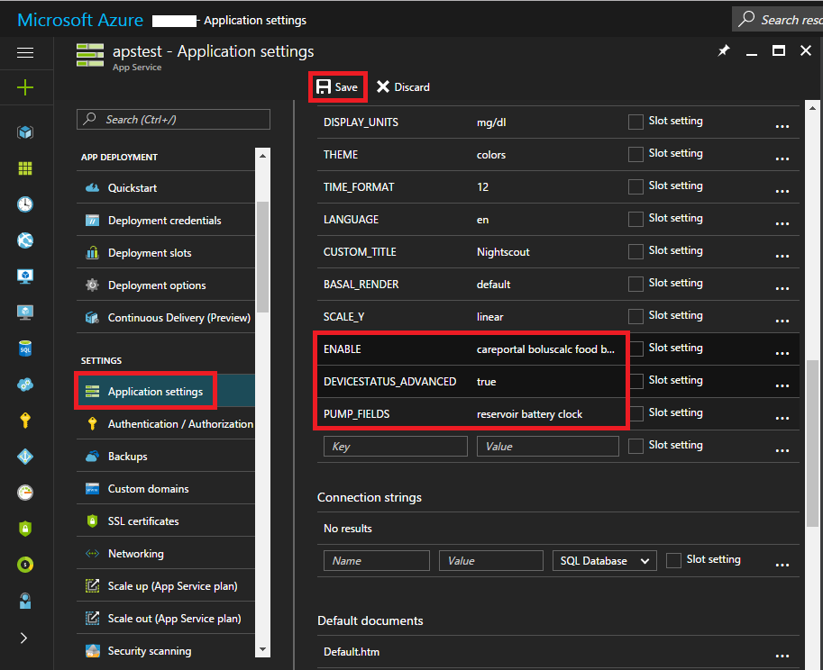

# Nightscout

(Nightscout-security-considerations)=

## Sicherheitsüberlegungen

Neben der Erstellung von Berichten, kann Nightscout auch genutzt werden, um AndroidAPS zu steuern. So kannst Du z.B. temporäre Ziele setzen oder Kohlenhydrate eingeben. Diese Informationen werden von AAPS übernommen, das dann entsprechend reagiert. Daher macht es Sinn, über die Absicherung Deiner Nightscout-Seite nachzudenken.

Handle mit größter Vorsicht, wenn Du mit Nightscout als Datenquelle für Dein AAPS verwendest.

### Nightscout settings

Du kannst den öffentlichen Zugang zu Deinen Nightscout-Daten verweigern, indem Du [authentication roles](https://nightscout.github.io/nightscout/security) (Authentifizierungsrollen) verwendest: stelle sicher, dass Du Deinen URL mit einem `readable` (nur lesen) Token zur Verfügung stellst und niemals mit einem `admin` (Administrator) Token.

Das Nightscout `API_SECRET` ist das Hauptpasswort für Deinen Nightscout-Server, mache es keinesfalls öffentlich zugänglich.

(Nightscout-aaps-settings)=

### AAPS settings

Du kannst AAPS so einstellen, dass Nightscout-Befehle akzeptiert werden (Profiländerungen, Behandlungsparameter, ...) oder dies vollständig ausschalten.

* Zugriff auf die Einstellungen (settings) des NSClient bzw. des NSClientV3-Plugins: 1) Startseite -> Config Builder -> Synchronization -> NSClient Zahnrad-Symbol 2) NSCLIENT Registerkarte -> Dreipunkte-Menü -> Plugin preferences
* Aktiviere das Hochladen aller Daten in Nightscout (3), da dies jetzt die Standardmethode ist, es sei denn, Deine BZ-Datenquelle ist Nightscout.  
  Wenn Nightscout Deine BZ-Datenquelle ist, dann stelle den Upload der BZ-Daten zu NS **nicht** ein(3).
* Stelle nicht "Receive/backfill data" (4) ein, es sei denn, Nightscout ist Deine BT-Datenquelle.

#### Do not sync from Nightscout (Nicht von Nightscout synchronisieren)

Durch das Deaktivieren dieser Optionen wird sichergestellt, dass AAPS keine Änderungen benutzt, die von Nightscout stammen.

#### Accept changes from Nightscout (Änderungen von Nightscout übernehmen)

Das Aktivieren dieser Option bewirkt, dass Du mit Hilfe von Nightscout remote AAPS-Einstellungen wie z. B. Profilwechsel und -anpassungen, temporäre Ziele setzen und die Eingabe von durch AAPS zu berücksichtigenden Kohelnhydraten vornehmen kannst.  
Insulineingaben werden nur zu Kalkulationszwecken (wie auch bei "Bolus nur erfassen") berücksichtigt.

### Weitere Sicherheitseinstellungen

Keep your phone up to date as described in [safety first](#preparing-safety-first).

(Nightscout-manual-nightscout-setup)=

## Manuelles Nightscout-Setup

Wir gehen davon aus, dass du bereits eine Nightscout Seite hast. Falls nicht, gehe zum [Nightscout Wiki](http://nightscout.github.io/nightscout/new_user/). Dort findest du detaillierte Informationen zur Einrichtung. Die unten stehenden Hinweise beziehen sich auf die Einstellungen, die du zusätzlich in deiner Nightscout Seite vornehmen musst. AAPS Version 3.2 setzt Nightscout in der Version 15 voraus. Stelle daher sicher, dass Du die [neueste Version](https://nightscout.github.io/update/update/#updating-your-site-to-the-latest-version) verwendest, da Du sonst in der AAPS App eine Fehlermeldung erhältst.

* [Deine Variablen bearbeiten](https://nightscout.github.io/nightscout/setup_variables/#nightscout-configuration)

* Variablen hinzufügen oder wie folgt ändern:
  
  * `ENABLE` = `careportal boluscalc food bwp cage sage iage iob cob basal dbsize pushover pump openaps`
  * `DEVICESTATUS_ADVANCED` = `true`
  * `SHOW_FORECAST` = `openaps`
  * `PUMP_FIELDS` = `reservoir battery clock`
  * Ein Alarm bei [niedrigem Pumpen-Batteriestand](https://github.com/nightscout/cgm-remote-monitor#pump-pump-monitoring) in % kann wie folgt aktiviert werden: 
    * `PUMP_WARN_BATT_P` = `51`
    * `PUMP_URGENT_BATT_P` = `26` 

* Speicher die Änderungen. Deine Nightscout-Seite sollte nun die Anzeige der "Pillen" zulassen. Du kannst die Anzeige erzwingen, indem Du sie in `SHOW_PLUGINS` hinzufügst.
  
  * `SHOW_PLUGINS` = `careportal boluscalc food bwp cage sage iage iob cob basal dbsize pushover pump openaps`
  
  

## Nightscout von einem Bezahlservice (Software as a Service - SaaS)

Verwende des Webschnittstelle des jeweiligen Anbieters, um die Variablen zu setzen. Wende Dich bei Bedarf an den Support des Anbieters.