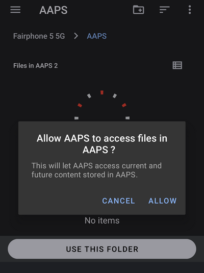
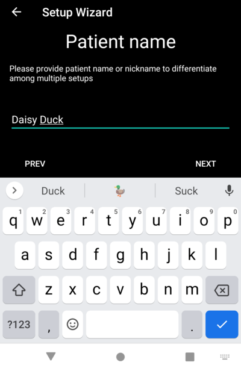

# AAPS Einrichtungsassistent

When you first start **AAPS** you are guided by the "**Setup Wizard**", to quickly setup all the basic configurations of your app in one go. **Setup Wizard** guides you, in order to avoid forgetting something crucial. For example, the **permission settings** are fundamental for setting up **AAPS** correctly.

However, it's not mandatory to get everything completely configured in the first run of using the **Setup Wizard** and you can easily exit the Wizard and come back to it later. There are three routes available after the **Setup Wizard** to further optimise/change the configuration. Diese werden im nächsten Abschnitt erläutert. Deswegen ist es auch OK einige Punkte im Einrichtungsassistenten zu überspringen. Du kannst diese Punkte später (nach-)konfigurieren.

During, and directly after using the **Setup Wizard** you may not notice any significant observable changes in **AAPS**. To enable your **AAPS** loop, you have to follow the **Objectives** to enable feature after feature. You will start **Objective 1** at the end of the Setup Wizard. You are the master of **AAPS**, not the other way around.

```{admonition} Preview Objectives
:class: note
If you are keen to know the structure of the objectives, please read [Completing the objectives](../SettingUpAaps/CompletingTheObjectives.md) but then come back here to run the Setup Wizard first.

```

From previous experience, we are aware that new starters often put themselves under pressure to setup **AAPS** as fast as possible, which can lead to frustration as it is a big learning curve.

So, please take your time in configuring your loop, the benefits of a well-running **AAPS** loop are huge.

```{admonition} Ask for Help
:class: note
If there is an error in the documentation or you have a better idea for how something can be explained, you can ask for help from the community as explained at [Connect with other users](../GettingHelp/WhereCanIGetHelp.md).
```
## Begrüßungstext

Dies ist nur die Begrüßungsnachricht, die Du mit "WEITER" überspringen kannst:


## Lizenzvereinbarung

In the end user license agreement there is important information about the legal aspects of using **AAPS**. Bitte lies diese sorgfältig.

If you don't understand, or can't agree to the end user license agreement please don't use **AAPS** at all!

Wenn Du sie verstehst und zustimmst, klicke auf die "ICH VESTEHE UND STIMME ZU"-Schaltfläche und folge dem Einrichtungsassistenten:


## Erforderliche Berechtigungen

**AAPS** needs some requirements to operate correctly.

In the following screens you are asked several questions you have to agree to, to get **AAPS** working. Der Assistent selbst erklärt, warum er nach der entsprechenden Einstellung fragt.

In diesem Bildschirm geben wir zusätzliche Hintergrundinformationen, übersetzen technischere Ausdrücke in allgemein verständliche Sprache oder erklären den Grund.

Bitte klicke auf "WEITER":


### Notification and battery optimization

Wenn Apps Benachrichtigungen senden möchten, benötigt Android hierfür eine besondere Berechtigung.

While it is a good feature to disable notifications _e.g._ from  social media apps, it is essential that you allow **AAPS** to send you notifications.

Please click the first "ASK FOR PERMISSION" button:


Wähle die "AAPS"-App aus:


Aktiviere "Am Anfang anzeigen" indem Du den Schieberegler nach rechts schiebst:


Der Schieberegler sollte, wenn er aktiviert ist, so aussehen:


Der Akkuverbrauch ist bei Smartphones immer noch ein Thema, da die Akku-Kapazität noch immer ziemlich begrenzt ist. Daher ist das Android-Betriebssystem auf Ihrem Smartphone ziemlich restriktiv, was die Ausführung von Anwendungen und den Verbrauch von CPU-Zeit und damit des Akkus betrifft.

However, **AAPS** needs to run regularly, _e.g._ to receive the glucose readings every few minutes and then apply the algorithm to decide how to deal with your glucose levels, based on your specifications. Deshalb muss es Android erlaubt werden, dies zu tun.

Das tust Du, indem Du die Einstellung bestätigst.

Click the second "ASK FOR PERMISSION" button. Bitte tippe auf "Zulassen":


Klicke auf "WEITER":


### Location

Android verknüpft die Nutzung der Bluetooth-Kommunikation mit der Möglichkeit, Standortdienste zu nutzen. Vielleicht hast Du das bei anderen Apps auch schon bemerkt. Es ist üblich, Standortberechtigung zu benötigen, wenn Du auf Bluetooth zugreifen willst.

**AAPS** uses bluetooth to communicate with your CGM and insulin pump if they are directly controlled by **AAPS** and not another app which is used by **AAPS**. Die Details können je nach Setup variieren.

Click the first "ASK FOR PERMISSION" button:


Das ist wichtig. Otherwise **AAPS** can not work properly at all.

Klicke auf "Bei Nutzung der App":


Click the second "ASK FOR PERMISSION" button:


Select "Allow all the time".

Klicke auf "WEITER":


### Storage permission

**AAPS** needs to log information to the permanent storage of your smartphone. Permanenter Speicher bedeutet, dass es auch nach dem Neustarten Deines Smartphones verfügbar sein wird. Andere Informationen gehen einfach verloren, da sie nicht im permanenten Speicher abgelegt sind.

Click the first "ASK FOR PERMISSION" button:


Klicke auf "Zulassen":


Click "AAPS Directory". This opens the filesystem on your phone and allows you to choose where you want AAPS to store its information. The default directory is **AAPS**, but you can use any dedicated directory of your liking. Create the directory if necessary, enter it, and choose "Use this folder":


Confirm that you wish to grant access to **AAPS** to the selected directory:



Klicke auf "WEITER":


## Master-Passwort

As the configuration of **AAPS** contains some sensitive data (_e.g._ API_KEY for accessing your Nightscout server) it is encrypted by a password you can set here.

The second sentence is very important, please **DO NOT LOSE YOUR MASTER PASSWORD**. Please make a note of it _e.g._ on Google Drive. Google Drive ist eine gute Stelle, da es von Google für Dich gesichert wird. Dein Smartphone oder Dein PC kann abstürzen und Du hast dann möglicherweise keine aktuelle Kopie zur Hand. If you forget your Master Password, it can be difficult to recover your profile configuration and progress through the **Objectives** at a later date.

Nachdem Du das Passwort zweimal eingegeben hast, klicke bitte auf "WEITER":


## Fabric-Upload

Hier kannst Du einen Service einrichten, der automatisiert einen Absturz- und Nutzungsbericht verschickt.

Dieser Service ist nicht verpflichtend, hat sich aber in der Praxis bewährt.

Es hilft den Entwickelnden Deine App-Nutzung besser zu verstehen und informiert sie über die aufgetretenen Abstürze.

Sie bekommen:

1. Die Informationen, die sie sonst nicht bekommen hätten, da ihre eigene App einwandfrei funktioniert, dass die App abgestürzt ist.
1. In den gesendeten Daten (den Absturzinformationen) gibt es Informationen über die Umstände, unter denen der Absturz stattgefunden hat und wie die Konfiguration ausgesehen hat.

Es hilft den Entwickelnden, die App zu verbessern.

Bitte aktiviere den "Fabric-Upload", in dem Du den Schieberegler nach rechts schiebst:


Nur für den Fall, dass die Entwickelnden Rückfragen an Dich haben oder Dich auf dringende Probleme aufmerksam machen möchten, kannst Du Dich damit identifizieren:


Nachdem Du Deine "Kontaktdaten" ausgefüllt hast, klicke auf "OK". Die Kontaktdaten können Dein Nickname auf Facebook, auf Discord etc. sein Es sind die Informationen, mit denen Du am Besten und Einfachsten erreicht werden kannst:


Klicke auf "WEITER":


## Units (mg/dL <-> mmol/L)

Bitte lege fest, ob Deine Glukosewerte in mg/dl oder mmol/dl vorliegen, und klicke dann auf "WEITER":


## Anzeigeeinstellungen

 Hier legst Du den anzuzeigenden Zielbereich für Deine Sensorwerte fest. Zwischen diesen Markierungen wird der Wert als "im Zielbereich" angezeigt. Du kannst die Standarwerte zunächst übernehmen und später ändern.

Die gewählten Werte wirken sich nur auf die Darstellung in Grafik aus. Weitere Auswirkungen haben sie nicht.

Your glucose target _e.g._ is configured separately in your profile.

Der für die Analyse der TIR (Time In Range) relevante Bereich wird separat in Deinem Auswertungsserver festgelegt.

Bitte klicke auf "WEITER":


(SetupWizard-synchronization-with-the-reporting-server-and-more)=
## Synchronisierung (u.a. mit dem Auswertungs- bzw. Berichtsserver)

Hier konfigurierst Du den Daten-Upload zu Deinem Auswertungsserver.

Du kannst hier viele weitere Dinge konfigurieren, aber als Erstes konzentrieren wir uns auf den Auswertungsserver.

Wenn Du die Einrichtung jetzt nicht machen, kannst überspringe sie für den Moment. Du kannst ihn später konfigurieren.

If you select an item here on the left tick box, on the right you can then ticking the visibility (eye) box, which will place this plugin in the upper menu on the **AAPS** home screen. Wenn Du an diesem Punkt Deinen Auswertungsserver (z.B. Nightscout) konfigurierst, sorge auch dafür das Modul oben sichtbar zu machen.

In diesem Beispiel wählen wir Nightscout als Auswertungsserver aus und konfigurieren diesen entsprechend.

```{admonition}  Make sure to choose the correct **NSClient** version for your needs! 
:class: Note

Click [here](#version3200) for the release notes of **AAPS** 3.2.0.0 which explain the differences between the top option **NSClient** (this is "v1", although it is not explicitly labelled) and the second option, **NSClient v3**.

Nightscout users should choose **NSClient v3**, unless you want to monitor or send remote treatments (_e.g._ as a parent or caregiver using **AAPS** for a child) through Nightscout, in which case, choose the first option "**NSClient**" until further notice. 
```
Für Tidepool ist es sogar noch einfacher, da Du nur Deine persönlichen Login-Daten benötigst.

Nachdem Du ausgewählt hast, tippe auf das Zahnrad-Symbol neben dem ausgewählten Element:


Hier konfigurierst Du den Daten-Upload zu Deinem Auswertungsserver.

Bitte tippe auf "Nightscout-URL":


Gib die Nightscout-URL Deines Nightscout-Servers ein. Es ist die URL, die Du selbst erstellt hast oder, die Dir von Deinem Nightscout-Anbieter mitgeteilt wurde.

Bitte tippe auf "OK":


Gib nun Deinen Nightscout Zugangstoken (Zugriffsschlüssel) ein. Das ist der Zugriffsschlüssel, den Du für Deinen Nightscout-Server angelegt hast. Ohne dieses Token, wird der Zugriff nicht funktionieren.

If you don't have it at the moment please check the documentation for setting up the reporting server in the **AAPS** documentation.

After filling in the "**NS access token**" and clicking "OK", please click on the "Synchronization" button:


Wenn Du Nightscout in den vorangegangenen Schritten des Einrichtungsassistenten bereits konfiguriert hast, wähle "Daten zu NS hochladen" aus.

If you have stored profiles on Nightscout and want to download them to **AAPS**, enable "Receive profile store":


Gehe auf den vorherigen Bildschirm zurück und tippe auf "Alarm-Optionen":


Lasse die Schalter vorerst alle deaktiviert. Wir sind nur zu diesem Bildschirm gegangen, um Dich mit den möglichen Optionen vertraut zu machen, die Du zukünftig vielleicht konfigurieren möchtest. Im Moment besteht hierzu noch kein Grund.

Gehe auf den vorherigen Bildschirm zurück und wähle "Verbindungs-Einstellungen" aus.

Hier kannst Du konfigurieren, wie Du Deine Daten auf den Auswertungsserver übertragen möchtest.

Caregivers must enable "use cellular connection" as otherwise the smartphone which serves the dependant/child can not upload data outside of WiFi range _e.g._ on the way to school.

Other **AAPS** users can disable the tranfer via cellular connection if they want to save data or battery.

Im Zweifel lass einfach alles aktiviert.

Gehe auf den vorherigen Bildschirm zurück und wähle "Erweiterte Einstellungen" aus.


Aktiviere "Logge App-Start in Nightscout", wenn Du diese Informationen auf dem Auswertungsserver erhalten und sehen möchtest. Insbesondere als remote betreuende Person kann es wichtig sein, zu wissen ob und wann die App neu gestartet wurde.

It might be interesting to see if **AAPS** is correctly configured now, but later it is usually not that important to be able to see **AAPS** stopping or starting in Nightscout.

Aktiviere "Ankündigungen aus Fehlern generieren" und "Benachrichtigungen aus KH-Vorschlags-Alarmen erzeugen".

Lass "Hochladen verlangsamen" weiterhin deaktiviert. Du würdest es nur in ganz besonderen Situationen (wenn z.B. viele Informationen zum Nightscout-Server übertragen werden müssen und der Nightscout-Server diese Daten nur sehr verzögert verarbeiten kann) aktivieren.

Gehe zweimal zurück zur Liste der Plugins und wähle "WEITER", um zum nächsten Bildschirm zu kommen:


## Name des Patienten

Here you can setup your name in **AAPS**.

Das kann alles sein. Es dient nur zur Unterscheidung von Nutzenden.

Um es einfach zu halten, gib einfach den Vor- und Nachnamen ein.

Drücke auf "WEITER", um zur nächsten Seite zu kommen.



## Patiententyp

Here you select your "Patient type" which is important, as the **AAPS** software has different limits, depending on the age of the patient. Dies ist aus Sicherheits- und Schutzgründen wichtig.

Here is where you also configure the **maximum allowed bolus** for a meal. Das ist der größte Bolus, der üblicherweise zum Abdecken einer Mahlzeit benötigt wird. Diese Sicherheitsfunktion hilft, eine versehentliche Überdosierung beim Bolen einer Mahlzeit zu vermeiden.

Das zweite Limit ist ähnlich konzipiert und bezieht sich auf die maximale zu erwartende Kohlenhydrataufnahme.

Nachdem Du die Werte festgelegt hast, kommst Du mit "WEITER" auf die nächste Seite:


## Verwendetes Insulin

Wähle das Insulin, das Du in der Pumpe nutzt, aus.

Die Insulinnamen sollte selbsterklärend sein.

```{admonition} Don't use the "Free-Peak Oref" unless you know what you are doing
:class: danger
For advanced users or medical studies there is the possibility to define with "Free-Peak Oref" a customised profile of how insulin acts. Please don't use it unless you are an expert, usually the pre-defined values work well for each branded insulin.
```

Tippe auf "WEITER", um zur nächsten Seite zu kommen:


## Blutzucker-Quelle

Wähle die von Dir genutzte BZ-Quelle aus. Please read the documentation for your [BG source](../Getting-Started/CompatiblesCgms.md).

Da es mehrere Optionen gibt, erklären wir hier nicht alle der möglichen Konfigurationen. In unserem Beispiel nutzen wir den Dexcom G6 mit der BYODA-App:


Wenn Du den Dexcom G6 mit BYODA nutzt, hake das Kästchen auf der rechten Seite an, um den zugehörigen Reiter im oberen Menüband sichtbar zu machen.

Nachdem Du Deine Auswahl getroffen hast, tippe auf "WEITER", um auf die nächste Seite zu kommen:


Wenn Du den Dexcom G6 mit BYODA nutzt, tippe auf das "Zahnradsymbol", um die BYODA-Einstellungen zu öffnen.

Aktiviere "Speichere BZ-Werte in Nightscout" und "Speichere Sensorwechsel in Nightscout".

Gehe zurück und tippe auf "WEITER", um zum nächsten Bildschirm zu kommen:


(setup-wizard-profile)=
## Profil

Wir kommen jetzt zu einem sehr wichtigen Bereich des Einrichtungsassistenten.

Please read the documentation about [profiles](../SettingUpAaps/YourAapsProfile.md) before you try to enter your profile details on the following screen.

```{admonition} Working profile required - no exceptions here !
:class: danger
An accurate profile is necessary to control the safe action of **AAPS**

It's required that you have determined and discussed your profile with your doctor, and that it has been proven to work by successful basal rate, ISF and IC testing!

If a robot has an incorrect input it will fail - consistently. **AAPS** can only work with the information it is given. If your profile is too strong, you risk hypoglycemia, and if it is too weak, you risk hyperglycemia. 
```

Drücke auf "WEITER", um zur nächsten Seite zu kommen. Gib einen "Profilnamen" ein:


Auf lange Sicht kannst Du - wenn nötig - mehrere Profile haben. Wir erstellen hier nur eines.

```{admonition} Profile only for tutorial - not for your usage
:class: information
The example profile here is only to show you how to enter data.

It is not intended to be an accurate profile or something very well optimised, because each person's needs are so different.

Don't use it for actually looping!
```

Enter your [Duration of insulin Action (DIA)](#your-aaps-profile-duration-of-insulin-action) in hours. Tippe dann auf "IC":


Enter your [IC](#your-aaps-profile-insulin-to-carbs-ratio) values:


Tippe auf "ISF". Enter your [ISF values](#your-aaps-profile-insulin-sensitivity-factor):


Tippe auf "BAS". Enter your [basal values](#your-aaps-profile-basal-rates):


Tippe auf "ZIEL". Gib Deine Glukosezielwerte ein.

For open looping this target can be a wider range, as otherwise **AAPS** notifies you permanently to change the temporary basal rate or another setting, which can be exhausting.

Im Cloosed Loop hast Du später in der Regel nur einen einzigen Wert (keinen Bereich) für oben und unten. That makes it easier for **AAPS** to hit the target and give you better overall diabetes control.

Gib die Zielwerte ein und bestätige sie:


Speichere das Profil, indem Du auf "SPEICHERN" tippst:


Nach dem Speichern erscheint eine neue Schaltfläche "AKTIVIERE PROFIL".

```{admonition} Several defined but only one active profile
:class: information
Du kannst mehrere Profile definiert haben, aber es kann nur eines davon aktiv sein.
```

Tippe auf "AKTIVIERE PROFIL":


Der Dialog zum Profilwechsel wird angezeigt. In diesem Fall lass alles wie es voreingestellt ist.

```{admonition} Several defined but only one active profile
:class: Information
Später wird erklärt wie Du diesen Dialog nutzt, um das Profil an besondere Situationen wie Krankheit oder Sport anzupassen.
```


Tippe auf "OK":


Es erscheint ein Bestätigungsdialog für den Profilwechsel.

Mit "OK" kannst Du ihn bestätigen. Tippe auf "WEITER", um zur nächsten Seite zu kommen:


Dein Profil wurde jetzt hinterlegt und aktiviert:


## Insulinpumpe


Jetzt wählst Du Deine Insulinpumpe aus.

Du erhälst einen wichtigen Warnhinweis. Bitte lies ihn und drücke dann auf "OK".

Wenn Du Dein Profil bereits in den vorherigen Schritten eingerichtet hast und weißt, wie Du die Pumpe verbinden kannst, lass Dich nicht aufhalten und verbinde sie jetzt.

Otherwise, leave the Setup Wizard, using the arrow in the top left corner and let **AAPS** first show you some blood glucose values. Du kannst jederzeit hierhin zurückkommen oder direkt eines der jeweiligen Konfigurationsmenüs (ohne den Einrichtungsassistenten zu nutzen) aufrufen.

Please read the documentation for your [insulin pump](../Getting-Started/CompatiblePumps.md).

Drücke auf "WEITER", um zur nächsten Seite zu kommen.


In diesem Fall wählen wir die "Virtuelle Pumpe" aus.

Tippe auf "WEITER", um zur nächsten Seite zu kommen:


## APS algorithm

Nutze den OpenAPS SMB-Algorithmus als Deinen APS-Algorithmus. Trotz des Namens ist das SMB-Feature des Algorithmus deaktiviert, bis Du mit AAPS vertraut bist und die ersten Ziele abgeschlossen hast. OpenAPS SMB ist im Vergleich zu OpenAPS AMA neuer und im Allgemeinen auch besser.

Der Grund dafür, dass SMB zu Beginn deaktiviert sind, ist, dass die SMB-Funktion durch einen sogenannten Super Micro Bolus (SMB) eine schnellere Reaktion auf den Anstieg des Glukosewerts ermöglicht und das nicht durch eine prozentuale Erhöhung des Basalwerts erreicht. As in the beginning your profile is in general not as good as after some time of experience the feature is disabled in the beginning.

```{admonition} Only use the older algorithm **OpenAPS AMA** if you know what you are doing
:class: information
OpenAPS AMA is the most basic algorithm which does not support micro boluses to correct high values. There might be circumstances where it is better to use this algorithm but it is not the recommendation.
```

Tippe auf das Zahnrad-Symbol, um die Details anzuzeigen:


Lies nur den Text und ändere hier nichts.

Due to the limitations which are imposed by the **Objectives** you can't use either "closed loop" or "SMB features" at the moment anyway.

Gehe zurück und tippe auf "WEITER", um zum nächsten Bildschirm zu kommen:


## APS-Modus

Lass "Open Loop" ausgewählt.

Tippe auf "WEITER", um zur nächsten Seite zu kommen:


## Empfindlichkeitserkennung

Let "Sensitivity Oref1" the standard for the sensitivity plugins selected.

Tippe auf "WEITER", um zur nächsten Seite zu kommen:


## Starte das erste Ziel (Objective 1)

Du kommst nun zu den Zielen (Objectives). The qualification for access to further **AAPS** features.

Hier beginnen wir jetzt mit dem ersten Ziel (Objective 1), auch wenn unser Setup im Moment noch nicht vollständig ist, um dieses Ziel erfolgreich abzuschließen.

Aber das ist der Beginn.

Tippe auf das grüne "START", um Ziel 1 zu starten:


Du erkennst, dass Du schon Fortschritt gemacht hast, aber auch, dass es in anderen Bereichen noch etwas zu tun gibt.

Tippe auf "ABSCHLIESSEN", um zur nächsten Seite zu gelangen.


You are coming to the home screen of **AAPS**.

Here you find the information message in **AAPS** that you set your profile.

Dies ist beim Wechsel zu unserem neuen Profil erfolgt.

Du kannst auf "SCHLUMMERN" tippen und sie wird veschwinden.


If you accidentally leave the Setup Wizard at any point, you can either simply re-start the Wizard, or change the [configuration of the AAPS loop](../SettingUpAaps/ChangeAapsConfiguration.md) manually.

If your **AAPS** loop is now fully setup, please move on to the next section ["Completing the objectives"](../SettingUpAaps/CompletingTheObjectives.md).