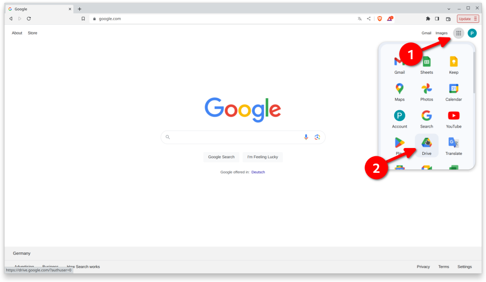

# AAPS auf Dein Smartphone übertragen und installieren

Im vorherigen Abschnitt [**AAPS** erstellen](../SettingUpAaps/BuildingAaps.md), hast Du die **AAPS**-App (eine .apk-Datei) auf einem Computer erstellt (gebaut).

Die nächsten Schritte sind, die **AAPS**-APK-Datei (sowie andere Apps, die Du eventuell benötigst, wie BYODA, xDrip+ oder eine andere CGM-App) auf Dein Android-Smartphone zu **übertragen** und sie dann zu **installieren**.

Nachdem Du **AAPS** auf dem Smartphone installiert hast, können wir dann mit der [**Konfiguration des AAPS-Loop**](../SettingUpAaps/SetupWizard.md) weiter machen.

Es gibt mehrere Möglichkeiten, **AAPS**-APK-Datei von Deinem Computer auf das Smartphone zu übertragen. Hier erklären wir zwei davon:

* Option 1 -  Google-Laufwerk (Goggle Drive) verwenden
* Option 2 - USB-Kabel verwenden

Bitte beachte, dass die Übertragung per E-Mail zu Schwierigkeiten führen kann und daher nicht empfohlen wird.

## Option 1. Google-Laufwerk zum Übertragen von Dateien verwenden

Öffne in einem Webbrowser [Google.com](https://www.google.com/) und logge Dich in Dein Google-Konto ein.

Wähle in der rechten oberen Ecke im Google-Menü die Drive-App aus.



Nach einem Rechtsklick der Maus in einem freien Bereich unter Dateien / Ordner wähle "Dateien hochladen" aus.


Die APK-Datei sollte jetzt auf Google Drive hochgeladen werden.


### Use the Google Drive app to execute the apk file for installation

Wechsel zu Deinem Mobilgerät und starte dort die Google Drive-App. Es handelt sich um eine vorinstallierte App und Du findest sie dort wo auch die anderen Google-Apps sind oder Du suchst mit dem App-Namen danach.


Starte die APK-Installation durch Doppelklick auf den Dateinamen in der Google Drive App des Smartphones.


Falls Du eine Sicherheitswarnung bekommst, die besagt, dass Du nicht berechtigt bist Apps von Google Drive zu installieren, erteile die Erlaubnis bitte für diesen kurzen Moment und entziehe diese anschließend wieder, da es ein Sicherheitsrisiko darstellt, diese permanent aktiviert zu lassen.


Nach Abschluss der Installation bist Du mit diesem Schritt fertig.

Du solltest das **AAPS**-Icon nun sehen und die App öffnen können.

```{warning}
**WICHTIGER SICHERHEITSHINWEIS**
Hast Du daran gedacht, die Installation über Google Drive wieder zu verbieten?
```

Bitte mache jetzt mit der [Konfiguration des AAPS-Loop](../SettingUpAaps/SetupWizard.md) weiter.

## Option 2. USB-Kabel zum Übertragen von Dateien verwenden
Die zweite Möglichkeit, die AAPS-APK-Datei zu übertragen, ist mit einem  [USB-Kabel](https://support.google.com/android/answer/9064445?hl=en).

Übertrage die Datei von Deinem Computer in den "Downloads"-Ordner auf dem Smartphone.

Auf dem Smartphone musst Du die Installation aus unbekannten Quellen zulassen. Erläuterungen dazu findest Du im Internet (_z.B._ [hier](https://www.expressvpn.com/de/support/vpn-setup/enable-apk-installs-android/) oder [hier](https://www.androidcentral.com/unknown-sources)).

Sobald Du die Datei per Drag & Drop übertragen hast, kannst Du sie installieren. Öffne dazu den "Downloads"-Ordner auf dem Smartphone und tippe auf die AAPS-apk. Wählen dann "installieren" aus. Du kannst jetzt mit dem nächsten Schritt fortfahren, dem [Einrichtungsassistent](../SettingUpAaps/SetupWizard.md)en, der Dir hilft, die **AAPS**-App und den Loop auf Deinem Smartphone einzurichten.

Bitte mache jetzt mit der [Konfiguration des AAPS-Loop](../SettingUpAaps/SetupWizard.md) weiter.