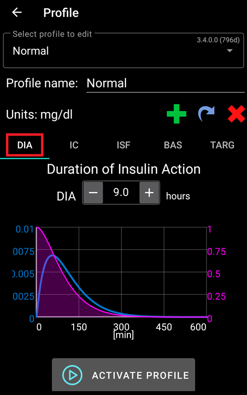
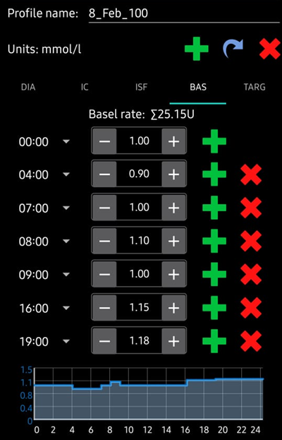

# Dein AAPS-Profil

Dein **AAPS-Profil** hat fünf wichtige Parametern, die definieren, wie **AAPS** Insulin als Reaktion auf Deine Sensorglukosewerte abgeben soll. Dies sind die Hauptparameter auf denen **AAPS** aufbaut. Während Du Dich durch die **Ziele** arbeitest, wirst Du weitere einstellbare Parameter (wie SMB-Einstellungen) freischalten. Die Wirksamkeit dieser Funktionen hängt aber hauptsächlich davon ab, dass Dein zugrundeliegendes **Profil** korrekt ist. Das **Profil** enthält:
* [Insulinwirkdauer](#duration-of-insulin-action-dia) (DIA; engl. duration of insulin action),
* [Glukoseziele](#glucose-targets),
* [Basalraten](#basal-rates) (BR),
* [Insulinempfindlichkeits- / Korrekturfaktoren](#insulin-sensitivity-factor-isf) (ISF; engl. insulin sensitivity factors) und
* [Mahlzeitenfaktoren / KH-Faktoren](#insulin-to-carb-ratio-icr) (IC oder ICR; engl. insulin-to-carb ratios).

Im Rahmen des **AAPS**-Managements sollten Nutzende ihre **Profil-**-Einstellungen kontinuierlich auf ihre Passgenauigkeit anschauen und bewerten. Es wird empfohlen, die Einstellungen in der Reihenfolge vorzunehmen, wie es hier dargestellt ist. Stelle sicher, dass die Einstellung wirklich richtig ist, bevor Du die jeweils nächste in Angriff nimmst. Taste dich in kleinen Schritten voran, statt zu viele Änderungen auf einmal vorzunehmen. Vergiss nicht nach jeder Änderung Dein Profil auch zu aktivieren. Sichere [Deine **Profil**](#YourAapsProfile_Profile-backup)-Einstellungen regelmäßig, in dem Du die Einstellungen exportierst.

Deine **Profil**-Einstellungen hängen voneinander ab - Du kannst u. U. „schiefe“ Einstellungen haben, die in bestimmten Situationen gut zueinander passen, aber in anderen Situationen überhaupt nicht funktionieren. Wenn zum Beispiel ein zu hohes Basal auf einen zu hohen (schwachen) **CR** (Mahlzeit-Faktor) trifft. Das bedeutet, dass Du die Einstellungen individuell betrachten und überprüfen musst, ob sie unter den verschiedenen Bedingungen gut funktionieren.

Du kannst [Autotune](https://autotuneweb.azurewebsites.net/) zwar als Ausgangspunkt für Deine Überlegungen verwenden, solltest ihm aber nicht blind vertrauen: Es funktioniert unter Berücksichtigung aller individuellen Einflüsse möglicherweise bei Dir nicht gut genug.

```{admonition} Your diabetes may vary
:class: information
**Profile** unterscheiden sich von Person zu Person sehr.

Für die restlichen drei Parameter Basalrate (BR), Insulinempfindlichkeitsfaktoren (ISF) und Insulin-Kohlenhydrat-Verhätnisse bzw. Mahlzeitenfaktoren (IC oder ICR), variieren die absoluten Werte und Trends Deines Insulinbedarfs. Der Insulinbedarf ist dabei abhängig von Deiner Biologie, Geschlecht, Alter, Fitnessgrad usw., aber auch von vorübergehenden Einflüssen wie Krankheit und sportlicher Aktivitität und variiert mitunter erheblich. Für tiefere Einblicke in das Thema wird das englischsprachige Buch [“Brights Spots and Landmines”](https://diatribe.org/bright-spots-and-landmines/) von Adam Brown empfohlen.

```

Die vier letzten Parameter (Glukoseziele, Basalraten, Insulinempfindlichkeitsfaktoren und Mahlzeitfaktoren) können auf unterschiedliche Werte eingestellt werden, die bei Bedarf stündlich wechseln.


**AAPS**-Screenshots eines _Beispiel_-Profils sind unten zu sehen. Dieses Beispielprofil enthält sehr viele Zeitfenster. Wenn Du mit **AAPS** startest, hast Du wahrscheinlich ein deutlich einfacheres Profil.

(your-aaps-profile-duration-of-insulin-action)=
## Insulinwirkdauer (DIA)

### Beschreibung

Die Zeit, die das Insulin braucht, bis es keine Wirkung mehr zeigt.

Da Deine Pumpe nur ein Insulinart abgibt, ist die Insulinwirkdauer in **AAPS** auch nur durch einen Wert festgelegt.


In Kombination mit dem [Insulintyp](#Config-Builder-insulin) führt das zu einem [Insulinprofil](#AapsScreens-insulin-profile), wie es im obigen Bild dargestellt ist. Wichtig zu beachten ist, dass der Abbau, d.h. die **Wirkung deutlich länger anhält** (sog. „long tail“), als gemein hin angenommen wird. Wenn Du Deine Pumpe bisher manuell eingesetzt hast, bist Du wahrscheinlich von wesentlich kürzeren Insulinwirkdauern (etwa 3,5 Stunden) ausgegangen. Allerdings spielt der langsamere Abbau beim Loopen eine wichtige Rolle, da die Berechnungen deutlich präziser sind und sich diese geringen Mengen unter den rekursiven Berechnungen des **AAPS**-Algorithmus aufsummieren. **AAPS** verwendet daher einen **DIA**-Wert von mindestens 5 Stunden.

Ausführlichere Lektüren zum Thema Insulinwirkdauer und warum diese relevant ist:
* [Understanding the New IOB Curves Based on Exponential Activity Curves](https://openaps.readthedocs.io/en/latest/docs/While%20You%20Wait%20For%20Gear/understanding-insulin-on-board-calculations.html#understanding-the-new-iob-curves-based-on-exponential-activity-curves) in der OpenAPS-Dokumentation.
* [Why we are regularly wrong in the duration of insulin action (DIA) times we use, and why it matters…](https://www.diabettech.com/insulin/why-we-are-regularly-wrong-in-the-duration-of-insulin-action-dia-times-we-use-and-why-it-matters/) auf Diabettech.
* [Exponential Insulin Curves + Fiasp](https://web.archive.org/web/20220630154425/http://seemycgm.com/2017/10/21/exponential-insulin-curves-fiasp/) auf See My CGM (Archiv).
* [Revised Humalog model in a closed loop](https://bionicwookiee.com/2022/04/13/revised-humalog-model-in-a-closed-loop/) und weitere Artikel auf Bionic Wookie, empfehlen einen DIA-Wert von 9 Stunden für Lyumjev, Fiasp, Novorapid, Humalog.


### Auswirkung

Ein zu kurze Insulinwirkdauer (**DIA**) kann zu niedrigen Glukosewerten führen. Und umgekehrt.

Wenn die Insulinwirkdauer (**DIA**) zu kurz ist, errechnet **AAPS**, dass das Restinsulin zu früh verbraucht ist und gibt im Falle eines hohen **Glukosewerts** dann zu viel Insulin ab. (Tatsächlich wartet AAPS nicht die volle Insulinwirkdauer ab, sondern sagt die Entwicklung der Glukosewerte vorher und gibt entsprechend Insulin ab oder nicht). Dies führt im Wesentlichen zu einem „Insulin-Stau“ (engl. Insulin-Stacking), von dem **AAPS** nichts weiß. Das ist besonders Nachts sichtbar, wenn Du negatives IOB erkennst, für das alle anderen Erklärungen, außer einer noch anhaltenden Wirkung des letzten Bolus, ausscheiden.

Ein Beispiel für einen zu kurzen **DIA** ist ein **hoher Glukosewert**, der durch die **AAPS**-Überkorrektur in einem **niedrigen Glukosewert** endet.

### Wie es eingestellt wird

Die **Abbildung unten** zeigt ein Beispiel einer im **AAPS**-Profil gesetzten Insulinwirkdauer (**DIA**).



Der **DIA**-Wert wird zu Beginn häufig zu klein gewählt. Eine **DIA** mit 6 oder 7 ist wahrscheinlich ein guter Ausgangspunkt. Für immer mehr Menschen scheint ein **DIA** von 8 bis 9 Stunden gut zu funktionieren. Schau Dir hierzu die oben erwähnte weiterführende Lektüre an.

(profile-glucose-targets)=
## Glukoseziele

### Beschreibung

Dein **Glukoseziel** ist der zentrale Wert. Alle **AAPS**-Berechnungen basieren darauf. Er ist nicht der Zielbereich, in dem Du normalerweise versuchst Deine Glukosewerte zu halten. Das Glukoseziel wird in **AAPS**-Berechnungen verwendet: Wenn **AAPS** voraussagt, dass Dein **Glukosewert** außerhalb des Zielbereichs landen wird, wird es Maßnahmen ergreifen, um wieder in den Bereich zurückzukommen.

The targets can be defined within those boundaries :

|         | _Unteres_ Ziel         | _Oberes_ Ziel            |
| ------- | ---------------------- | ------------------------ |
| Minimum | 4 mmol/l oder 72 mg/dl | 5 mmol/l or 90 mg/dL     |
| Maximum | 10 mmol/l or 180 mg/dL | 15 mmol/l oder 225 mg/dl |

### Auswirkung

Wenn das Glukoseziel in Deinem **Profil** sehr breit ist (sagen wir, 3 oder mehr mmol/l [50 mg/dl oder mehr), wird **AAPS** selten eingreifen. Das liegt daran, dass der vorhergesagte **Glukosewert** innerhalb des weiten Bereichs befindet und es daher unwahrscheinlich ist, dass **AAPS** mit Änderungen der temporären Basalrate reagieren wird.

### Wie es eingestellt wird

Die **Abbildung unten** zeigt ein Beispiel wie im **AAPS**-Profil das Glukoseziel hinterlegt werden kann.


**Glukoseziele** werden so gesetzt, dass sie zu Deinen eigenen Wünschen und Anforderungen passen. Wenn Du beispielsweise Angst vor nächtlichen Hypos hast, kannst Du Dein Glukoseziel von 21.00 - 07.00 Uhr auf 117 mg/dl setzen (6,5 mmol/l) setzen. Wenn Du erreichen möchtest, dass Du vor dem Frühstücksbolus am Morgen bereits genügend aktives Insulin (IOB) im Körper hast, könntest Du für die Zeit von 07.00 - 08.00 Uhr ein niedrigeres Ziel von 81 mg/dl (4,5 mmol/dl) setzen.

Wenn Du im [Open Loop](#Preferences-pen-loop) und insbesondere beim Durchlaufen der [ersten Ziele](../SettingUpAaps/CompletingTheObjectives.md) bist, gerade lernst wie sich **AAPS** verhält und/oder Du Dein **Profil** anpasst, kann es helfen den Zielbereich etwas größer zu wählen.<br/> Sobald Du in den [Closed Loop](#preferences-closed-loop) (beginnend mit dem **[Zie 6](#objectives-objective6)**) wechselst, wird empfohlen den Zielbereich für jeden Tagsabschnitt bis auf einen einzelnen Zielwert (_unteres_ Ziel = _oberes_ Ziel) zu verkleinern. Damit kann **AAPS** sofort **Glukosewert**-Schwankungen.

(your-aaps-profile-basal-rates)=

## Basalraten

### Beschreibung

Deine Basalrate ist die Insulinmenge (Einheiten pro Stunde), die abgegeben wird, um Deinen Glukosewert ohne Nahrung und Sport stabil zu halten

Die Insulinpumpe liefert alle paar Minuten kleine Mengen schnell wirkendes Insulins, um die durch die Leber abgegebene Glukose entsprechend in die Körperzellen zu bringen. Basalinsulin macht typischerweise 40 - 50% Deines täglichen Gesamtinsulinbedarfs (TDD) aus und ist abhängig von Deinen Ernährungsgewohnheiten. Es folgt üblicherweise Deinem Biorhythmus (cirkadianes Muster) mit einer Spitze und einem Tal im täglichen Insulinbedarf. For more information, chapter 6 of [“Think like a Pancreas”](https://amzn.eu/d/iVU0RGe) by Gary Scheiner is very useful.

Die meisten Diabetes-Teams (und Menschen mit Typ-1-Diabetes!), stimmen darin überein, dass Basalraten vor ISF und ICR optimiert werden sollten.

### Auswirkung

Saubere Basalraten ermöglichen Dir Morgens mit Werten im Zielbereich wachzuwerden, Mahlzeiten auszulassen, früher oder später essen zu können ohne hohe oder niedrige Werte zu bekommen.

Eine zu hohe Basalrate kann zu niedrigen Glukosewerten führen. Und umgekehrt.

Die Standard-Basalrate ist der Referenzwert für **AAPS**. Wenn die Basalrate zu hoch ist, führt ein 'zero temp' (temporäres Abschalten der Basalrate durch AAPS) zu einem höheren negativen IOB (insulin on board - im Körper aktives Insulin) als es sollte. Dies wird dazu führen, dass **AAPS** häufiger korrigiert als es tatsächlich notwendig wäre, um am Ende IOB auf Null zu bringen.

Eine zu hohe Basalrate führt also zu niedrigen **Glukosewerten** sowohl durch die Standard-Basalrate als auch später durch die Korrekturen von **AAPS** auf den Zielwert.

Umgekehrt kann eine zu niedrige Basalrate zu zu hohen Glukosewerten führen und AAPS daran hindern, diese wieder in den Zielbereich zu bringen.

### Wie es eingestellt wird

Die **Abbildung unten** zeigt ein Beispiel, wie im **AAPS**-Profil die Basalrate hinterlegt werden kann.



Die richtige Basalrate zu finden ist ein „Trial and Error“-Prozess, und sollte in Abstimmung mit Deinem Diabetes-Team erfolgen.

Basalraten-Tests bringen es normalerweise mit sich, während einer 24-stündigen Fastenperiode die Basalrate und den Insulinbedarf zu beobachten. Auch wenn die Basalrate für einen ganzen Tag getestet werden muss, ist es nicht empfehlenswert 24 Stunden am Stück zu fasten. Das liegt daran, dass der Körper über spezielle Mechanismen versuchen wird das Fasten (z. B. durch Hormonausschüttung) auszugleichen. Eine empfohlene Methode ist 3 Mal für einen Zeitraum von 8 Stunden zu fasten.

Die empfohlene Vorgehensweise ist, den Loop zu pausieren, sodass auf die Standard-Basalrate „zurückgefallen“ wird. Beobachte wie sich Dein **Glukosewert** entwickelt: Sinkt er, ist die Basalrate zu hoch. Und umgekehrt.<br/> Eine andere (möglicherweise schwierigere) Methode ist, den Loop aktiv zu lassen und zu beobachten, wie sich das **IOB** verändert. Wenn das **IOB** negativ ist, ist Deine Basalrate zu hoch. Und umgekehrt. Beachte, dass diese Methode den **ISF** nutzt, um damit den **Glukosewert** zu korrigieren. Damit hängt der Erfolg von mehreren Variablen (und nicht nur von der Basalrate) ab.<br/> Eine weitere Möglichkeit die Basalrate anzuzupassen ist, die Loop-Aktionen während der Nacht, wenn keine Kohlenhydrate mehr aktiv sind, zu beobachten. Diese Methode ist besonders für Kinder, für die Fasten oft schwierig ist oder deren Insulinbedarf sich oft ändert, geeignet. [Dr. Saleh Adi von Tidepool](https://www.youtube.com/watch?v=-fpWnGRhLSo) bietet hilfreiche Wege, wie Du nächtliche Glukoseverläufe analysieren kannst und daraus Optimierungen der Basalrate ableiten kannst, an.

Wenn Du Veränderungen aus dem Basalratentest umsetzen möchtest, sollten die Änderungen im **Profil** eine Stunde vor dem Zeitpunkt des beobachteten Steigens oder Fallens vorgenommen werden. Wiederhole den Test so lange, bis Du mit Deiner **Basalraten**-Einstellungen zufrieden bist.

(your-aaps-profile-insulin-sensitivity-factor)=

## Insulinempfindlichkeitsfaktor ("Korrekturfaktor")

### Beschreibung

Der Insulinempfindlichkeitsfaktor (manchmal auch Korrekturfaktor genannt) ist ein Maß dafür, wie viel der Glukosewert durch eine Insulineinheit gesenkt wird.

**In mg/dl-Einheiten:** Wenn Dein **ISF** 40 ist, senkt jede Insulineinheit Deinen Glukosewert um ca. 40 mg/dl (z. B. von 140 mg/dl auf 100 mg/dl).

**In mmol/l-Einheiten:** Wenn Dein **ISF** 1,5 ist, senkt jede Insulineinheit Deinen Glukosewert um 1,5 mmol/l (z. B. von 8 mmol/l auf 6,5 mmol/l).

An diesen Beispielen kannst Du erkennen, dass _kleinerer_ **ISF**-Werte geringere Insulinempfindlichkeit bedeutet. Wenn Du also Deinen ISF von 40 auf 35 (mg/dl) oder 1,5 auf 1,3 (mmol/l) senkst, wird dies oft als verstärken des **ISF** bezeichnet. Umgekehrt schwächt die Erhöhung des **ISF**-Wertes von 40 auf 45 (mg/dl) oder von 1,5 auf 1,8 mmol/l) Deinen **ISF**.

### Auswirkung

Eine **niedrigerer / stärkerer ISF** (z. B. 40 statt 50) bedeutet, dass das Insulin Deinen **Glukosewert** mit einer Einheit weniger stark senkt. Dies führt dazu, dass der Loop mit **mehr Insulin** aggressiver / stärker korrigiert. Ist Dein **ISF** zu stark (kleiner Wert), kann das zu niedrigen **Glukosewerten** führen.

Ein **höherer / schwächerer ISF** (z. B. 45 statt 35) bedeutet, dass das Insulin Deinen **Glukosewert** mit einer Einheit stärker senkt. Dies führt zu einer weniger aggressiven / schwächeren Korrektur des Loops mit **weniger Insulin**. Ist Dein **ISF** zu schwach (großer Wert), kann dies zu hohen **Glukosewerten** führen.

**Beispiel:**
* Der **Glukosewert** ist 190 mg/dl (10,5 mmol/l) und das Ziel ist 100 mg/dl (5,6 mmol/l).
* Du möchtest also eine Korrektur um `190 - 110 = 90 mg/dl` oder `10,5 - 5,6 = 4,9 mmol/l`
* Wenn `ISF = 30` -> `90 / 30 = 3` oder `ISF = 1,3` -> `4,9 / 1,63 = 3`: 3 Einheiten Insulin
* Wenn `ISF = 45` -> `90 / 45 = 2` oder `ISF = 2,45` -> `4,9 / 2,45 = 2`: 2 Einheiten Insulin

Ein zu niedriger **ISF** (und daher zu aggressiver; nicht unüblich) kann zu „Überkorrekturen“ führen. **AAPS** errechnet, dass mehr Insulin benötigt wird, um einen hohen **Glukosewert** zu korrigieren. Dies kann (besonders während des Fastens) zu einem „Achterbahn“-Verlauf der Glukosewerte führen, so wie es auf dem Bild unten dargestellt ist. In diesen Situationen sollte der **ISF**-Wert erhöht werden, um **AAPS** so weniger aggressiv zu machen. Dadurch wird sichergestellt, dass **AAPS** kleinere Korrekturdosen abgibt, und vermeidet damit die Überkorrektur eines hohen **Glukosewertes**, die einen niedrigen **Glukosewert** zur Folge haben würde.


Umgekehrt kann ein zu hoher **ISF** zu zu schwachen Korrekturen führen. Dies bedeutet, dass Deine Glukosewerte - besonders in der Nacht - oberhalb Deines Zielwertes bleiben.

### Wie es eingestellt wird

Die **Abbildung unten** zeigt an einem Beispiel, wie ISF-Werte in einem **AAPS**-Profil eingetragen werden können.


Eine Möglichkeit einen ersten Wert für den ISF am Tage zu ermitteln, nutzt Deinen tägliches Gesamtinsulinbedarf (TDD) und die 1700- bzw. 94-Regel. Für weitere Informationen ist das Kapitel 7 des englischsprachigen Buches [“Think like a Pancreas”](https://amzn.eu/d/iVU0RGe) von Gary Scheiner lesenswert.

    1700 (wenn Du in in mg/dl misst) oder 94 (mmol/l) / TDD = ca.
    
    Beispiel: TDD = 40 IE
    Ungefährer ISF (mg/dl) = 1700/40 = 43
    Ungefährer ISF (mmol/l) = 94/40 = 2,4

Wenn Du der Meinung bist, dass Deine Basalrate passt, kannst Du sie testen, indem Du den Loop pausierst, sicherstellst, dass das **IOB** Null ist, und Du Deinen Glukosewert z. B. mit Traubenzucker auf ein hohes und stabiles Niveau bringst.

Gebe dann die Deinem Korrekturfaktor entsprechende Menge Insulin ab, um wieder zu Deinem Zielwert zu gelangen.

Sei vorsichtig, da die Korrektur oftmals zu aggressiv eingestellt ist. D.h. eine Einheit Insulin senkt den BZ stärker als Du denkst.

(your-aaps-profile-insulin-to-carbs-ratio)=

## Insulin-Kohlenhydrat-Verhältnis (insulin to carb ratio - ICR)

### Beschreibung

Der **ICR** ist ein Maß dafür, wie viele Gramm Kohlenhydrate von einer Insulineinheit abgedeckt werden. Ergänzung: Im Deutschen werden diese manchmal auch Mahlzeitenfaktoren genannt.

Teilweise wird auch **I:C** statt **ICR** als Abkürzung verwendet oder vom Kohlenhydratverhältnis (carb ratio - **CR**) gesprochen.

Zum Beispiel bedeutet ein Insulin-Kohlenhydrat-Verhältnis von 1 zu 10 (1:10), dass Du eine Einheit Insulin pro 10g Kohlenhydrate benötigst. Ein Essen mit 25 g Kohlenhydraten würde 2,5 Einheiten Insulin benötigen.

Wenn Du einen schwächeren **ICR**-Wert (hoher Wert) hast, z. B. 1:20, würdest Du nur 0,5 IE Insulin zum Abdecken von 10 g Kohlenhydraten benötigen. Ein Essen mit 25g Kohlenhydraten würde 25/20 = 1,25 IE Insulin benötigen.

Aufgrund von Hormonen und sportlichen Aktivitäten ist es normal, über den Tag verteilt unterschiedliche **ICR**-Werte zu haben. Viele Menschen haben rund um die Frühstückszeit ihren niedrigsten/stärksten **ICR**, da es dort potenziell stärkere Insulinresistenzen gibt. So könnte für einen Erwachsenen zum Beispiel der **ICR**-Wert 1:8 zum Frühstück, 1:10 zum Mittagessen und 1:10 zum Abendessen sein. Doch dieses Muster lässt sich nicht verallgemeinern. Einige Menschen sind zum Abendessen insulinresistenter und benötigen dann ein stärkeres/kleineres **ICR**.

> **HINWEIS:**
> 
> In manchen Europäischen Ländern wurden sog. Broteinheiten (BE) genutzt um festzulegen, wie viel Insulin für Lebensmittel benötigt wird. Zu Beginn entsprach eine BE 12g Kohlenhydraten, später haben manche dies auf 10g Kohlenhydrate geändert.
> 
> Bei diesem Modell war die Menge der Kohlenhydrate fix während die Insulinmenge variierte. ("Wie viel Insulin benötige ich für eine BE?")
> 
> Beim **ICR** hingegen ist die Insulinmenge fix und die Menge der Kohlenhydrate variiert. ("Wie viele Gramm Kohlenhydrate können mit einer Einheit Insulin abgedeckt werden?")
> 
> Beispiel:
> 
> BE-Faktor (BE = 12g KH): 2,4 IE/BE -> Du benötigst 2,4 Einheiten Insulin, wenn Du eine BE isst.
> 
> Dazu passender **ICR**: 12 g / 2,4 IE = 5,0 g/IE -> Du kannst 5,0 g Kohlenhydrate essen, wenn Du sie mit einer Einheit Insulin abdeckst.
> 
> BE-Faktor 2,4 IE / 12 g   ===>   IC = 12 g / 2,4 IE = 5,0 g/IE
> 
> Umrechnungstabellen finden sich online z.B. [hier](https://www.mylife-diabetescare.com/files/media/03_Documents/11_Software/FAS/SOF_FAS_App_KI-Verha%CC%88ltnis_MSTR-DE-AT-CH.pdf).

### Auswirkung

Eine **niedrigeres / stärkeres ICR** bedeutet weniger Nahrung pro Einheit, d.h. Du erhältst mehr Insulin für eine feste Kohlenhydratmenge. Man kann dies auch als "aggressiver" bezeichnen. Wenn der IC-Wert zu stark ist, bekommst Du zu viel, was niedrige **Glukosewerte** nach sich ziehen kann.

Ein **höheres / schwächeres ICR** = mehr Kohlenhydrate pro Insulineinheit, d.h. Du bekommst für eine gleichbleibende Kohlenhydratmenge weniger Insulin. Man kann dies auch als "schwächer" oder "weniger aggressiv" bezeichnen. Wenn Dein IC-Wert zu schwach ist, bekommst Du weniger Insulin als Du tatsächlich brauchst. Das kann hohe **Glokusewerte** zur Folge haben.

### Wie es eingestellt wird

Die **Abbildung unten** zeigt beispielhaft das **ICR** einer Person und wie es in einem **AAPS-Profil** eingetragen werden kann. Bei der Eingabe dieser Werte geben wir einfach den letzten Teil des Verhältnisses ein, sodass ein Insulin-zu-Koherlnhudrat-Verhältnis von 1:3,5 als „3,5“ eingegeben wird.


Wenn ein Essen verdaut wurde und das **IOB** auf Null zurückgekehrt ist, Dein **Glukosewert** aber höher als vor dem Essen bleibt, ist es wahrscheinlich, dass Dein **ICR** zu schwach ist (_d. h. _ der Wert ist zu hoch und sollte schrittweise gesenkt werden). Im umgekehrten Fall, der **Glukosewert** ist niedriger als vor der Mahlzeit, ist das **ICR** ist zu stark (_d. h._ der Wert ist zu klein und sollte schrittweise erhöht werden).

Wenn Du annimmst, dass Deine Basalrate stimmt, Dein **IOB** Null ist und Du im Zielbereich bist, dann kannst Du - basierend auf Deinen aktuellen Einstellungen - den ICR-Wert testen. Iss eine genau bekannte Kohlenhydratmenge und gib die Insulinmenge ab, die sich aus Deinem aktuellen Mahlzeitfaktor (ICR) ergibt. Am besten isst Du Nahrungsmittel, die Du zu dieser Tageszeit üblicherweise isst und bestimmst deren Kohlenhydratmenge präzise.

## Häufige zum Profil auftretende Fragen

```{contents} Common questions related to the Profile
:depth: 1
:local: true
```

### About the importance of getting your profile right

**Warum sollte ich versuchen, meine Profileinstellungen richtig zu haben? Kann sich der Loop nicht darum kümmern?**

Ein Hybrid Closed Loop _kann_ versuchen, die Insulinzufuhr anzupassen, um eine schlechte glykämische Kontrolle, die die Folge aus falschen **Profil**werten ist, zu verbessern. It can do this, for example, by withholding insulin delivery if you are going to hypo. Du kannst eine deutlich bessere glykämische Kontrolle erreichen, wenn Deine **Profil**werte so nah wie möglich am Bedarf Deines Körpers sind. Dies ist einer der Gründe, warum **AAPS** abgestufte Ziele für den Übergang vom Open Loop zum Hybrid Closed Loop setzt. Zusätzlich gibt es Situationen (Sensor-Aufwärmphase, Sensorfehler _etc._), in denen der Loop geöffnet bzw. unterbrochen werden muss. Manchmal passiert das mitten in der Nacht und Du wirst dann für die richtigen Einstellungen dankbar sein.

Wenn Du von einem anderen Open oder Closed Loop Pumpensystem auf **AAPS** umsteigst, hast Du vermutlich schon eine recht gute Vorstellung von Deiner Basalrate (**BR**), Deinen Insulinempfindlichkeitsfaktoren (**ISF**) und Deinen Insulin-Kohlenhydrat-Faktoren bzw. Mahlzeitenfaktoren (**ICR**).

Wenn Du von der Pen-Therapie (z. B. ICT) zu **AAPS** wechselst, solltest Du Dich zunächst mit dem Umstieg vom Pen auf die Insulinpumpe beschäftigen, bevor Du den wohlüberlegten Wechsel gemeinsam mit Deinem Diabetes-Team angehst. [„Pumping insulin“](https://amzn.eu/d/iaCsFa2) von John Walsh & Ruth Roberts und [„Think like a Pancreas“](https://amzn.eu/d/iVU0RGe) von Gary Scheiner sind sehr lesenswert.

### Was sind die Ursachen hoher postprandialer Peaks im Closed Loop?
Zuerst solltest du deine Basalrate prüfen und einen Basalratentest ohne Kohlenhydrate machen. Wenn Deine Basalrate korrekt ist und Dein **Glukosewert** nach voller KH-Absorption auch wieder bis zu Deinem Zielwert fällt, versuche einmal das temporäre Ziel „Bald Essen“ in **AAPS** einige Zeit vor der Mahlzeit zu setzen oder überlege zusammen mit Deinem Diabetologen oder Deiner Diabetologin, welcher Spritz-Ess-Abstand (SEA) geeignet wäre. <br/> Wenn Dein **Glukosewert** nach dem Essen zu hoch ist und nach der vollständigen Verstoffwechselung der Kohlenhydrate immer noch zu hoch ist, denke gemeinsam mit Deinem Diabetes-Team über einen kleineren / stärkeren **ICR**-Wert nach. Wenn bei aktiven Kohlenhydraten (**COB**) Deine **Glukosewerte** zu hoch und nach der vollständigen Verstoffwechselung zu niedrig sind, denke gemeinsam mit Deinem Diabetes-Team über einen größeren / schwächeren **ICR**-Wert und einen geeigneten SEA nach.

### Ich stecke in hohen Werten fest und der Loop bringt mich nicht herunter
Die möglichen Gründe dafür, dass **AAPS** nicht genug Insulin abgibt, sind:
* **ISF** ist nicht stark genug
* Das Basal könnte zu schwach sein
* Eine Sicherheitseinstellung (z. B. **maxIOB**) kann ausgelöst haben. Oder **SMB** sind zu diesem Zeitpunkt ausgeschaltet. Das ist von Deinen Einstellungen abhängig.
* Eine Automatisierung ist aktiv und hat die **AAPS**-Entscheidung überschrieben.

### Ich habe negatives IOB, ist das ein Problem?
Negatives **IOB** bedeutet, dass die Gesamtmenge des in Deinem Körper aktiven Insulins (Basal + Bolus) kleiner ist als das Basal. Das wird dazu führen, dass **AAPS**, sobald die **Glukosewerte** steigen mehr Insulin abgeben wird, um das vorher zurückgehaltene Insulin „aufzuholen“. Das kann in der Folge dann zu niedrigen **Glukosewerten** führen.

Hier jetzt einige Gründe für das Entstehen negativen IOBs und mögliche Reaktionen darauf:
* Ein zu starkes Basal: Optimiere Dein **Profil**
* Ein zu großer Mahlzeiten-Bolus: Optimiere Dein **Profil** oder überprüfe, ob Du zum richtigen Zeitpunkt bolst.
* DIA ist zu kurz und führt zu „Insulin Stacking“: Passe Dein **Profil** an
* Bewegung: Beim nächsten Mal solltest Du während (eventuell bereits vor) der Aktivität ein reduziertes [prozentuales Profil](../DailyLifeWithAaps/ProfileSwitch-ProfilePercentage.md) nutzen, um so der höheren Insulin-Empfindlichkeit gerecht zu werden.

## Deine Profile verwalten

```{contents} Operations that you can perform on your **Profiles** in **AAPS**
:depth: 1
:local: true
```
(your-aaps-profile-create-and-edit-profiles)=
### Profile erstellen und bearbeiten

Der **Profil**-Reiter ist, abhängig von Deinen [Einstellungen in der Konfiguration](../SettingUpAaps/ConfigBuilder.md), entweder im oberen Menü oder im Hamburger Menü, zu finden.


Schaltflächen:

- grünes Plus: hinzufügen
- rotes X: löschen
- blauer Pfeil: duplizieren

Bei Änderungen an Deinem **Profil**, achte darauf, dass Du sie an dem richtigen **Profil** vornimmst. Beim Wechsel zum **Profil**-Tab wird nicht immer das aktuell genutzte Profil angezeigt. Wenn Du z. B. einen Profilwechsel über den Startbildschirm durchgeführt hast, wird ggf. im Profil-Tab ein anderes Profil angezeigt.

(your-aaps-profile-profile-from-scratch-for-a-kid)=
### Ein völlig neues Profil für ein Kind erstellen

Der [Profil-Helfer](#aaps-screens-profile-helper) -Tab kann Dir beim Erstellen eines Profils für Kinder bis 18 Jahren helfen.

**Wichtiger Hinweis:**

**Profil-Helfer soll Dich dabei unterstützen, das anfängliche Profil für Dein Kind zu finden. Auch wenn es auf Datensätzen von zwei verschiedenen Krankenhäusern basiert, besprich es immer mit Deinem medizinischen Team, bevor Du ein neues Profil benutzt!**

Profil-Helfer bietet Datensätze von zwei verschiedenen Kinderkrankenhäusern an, um ein anfängliches Profil für Dein Kind (bis 18 Jahre) zu finden.


1. Achte darauf, dass Du im **Profil 1** bist.
2. Als **Profil-Typ**, wählst Du „Standard-Profil“ aus.
3. Passe das Standardprofil (basierend auf dem Krankenhausdatensatz) an, indem Du das Alter des Kindes eingibst sowie entweder das Gesamt-TDD **oder** das Gewicht eingibst.
4. Wechsle durch das Tippen auf **Profil 2** oben rechts auf den anderen Bildschirm.
5. Tippe auf **Profil-Typ** und wähle das „DPV-Standard-Profil“ aus.
6. Passe das DPV-Standardprofil (basierend auf einem anderen Krankenhausdatensatz) an, indem Du das Alter des Kindes, den Prozentsatz der Basalrate sowie entweder das Gesamt-TDD **oder** das Gewicht eingibst.
7. Tippe unten auf dem Bildschirm auf **Profile vergleichen**. Ein Vergleich der beiden angepassten Profile wird angezeigt (siehe Screenshot unten).
8. Um Dein Profil auf Basis einer dieser Vorschläge zu optimieren, tippe auf den **Klonen**-Button des **Profil 1** oder **Profil 2**.


### Profil wechseln

Mehr Informationen findest Du im Abschnitt [Profilwechsel & Prozentuale Profilanpassung](../DailyLifeWithAaps/ProfileSwitch-ProfilePercentage.md).

(your-aaps-profile-clone-profile-switch)=
### Einen Profilwechsel in ein neues Profil klonen


Auf dem Reiter [Behandlungen](#aaps-screens-treatments) werden alle durchgeführten **Profilwechsel** angezeigt. Wenn Du auf den Sub-Reiter **Profilwechsel** gehst, kannst Du dort einen bereits erfolgten **Profilwechsel** als Basis für ein neues **Profil** nutzen. Zeitverschiebung und Prozentsatz des Profilwechsels werden in das lokale neue Profil übernommen. Tippe auf **Klonen** in Zeile **1**.

Du kannst jetzt auf den [Profil-Reiter](#your-aaps-profile-create-and-edit-profiles) wechseln und dort das neu erstelle Profil bearbeiten.

(YourAapsProfile_Profile-backup)=
### Sicherung Deines Profils

Die Profile sind die wichtigste Einstellung Deines Loop-Systems. Die **Profile** sind höchst empfindlich und etwas, was Du auf keinen Fall verlieren möchtest.

* Deine **Profile** werden in der **AAPS**-Datenbank gespeichert.
* Falls aktiviert, werden **Profile** auch zu Nightscout hochgeladen. Die Einstellungen findest Du unter [Einstellungen > Nightscout-Client > Synchronisierung > Daten zu NS hochladen](#Preferences-nsclient).


* Sie sind auch in den [exportierten Einstellungen](../Maintenance/ExportImportSettings.md) enthalten. Stelle also sicher, dass Du immer ein Backup an einem sicheren Ort hast.

### Profile über Nightscout bearbeiten

Wenn aktiviert, kommen **Profil**änderungen, die direkt in Nightscout vorgenommen wurden, auch in **AAPS** an. Die Einstellungen findest Du unter [Einstellungen > Nightscout-Client > Synchronisierung > Gespeicherte Profile abrufen](#Preferences-nsclient).

Wenn Du gravierende Änderungen an einem umfangreichen **Profil** vorgenommen hast, kann diese Funktion hilfreich sein. Es ist in der Regel deutlich einfacher diese Änderungen, _z.B._ Daten aus einem Arbeitsblatt zu kopieren, über das Web-Interface zu machen.

Es ist dabei wichtig, den gesamten **-Datenbank-Datensatz**, der aus mehreren Profilen im Nightscout-Editor besteht (blauer Pfeil auf dem Screenshot unten), zu klonen. Der neue Datensatz enthält dann das aktuelle Datum. Nach dem Speichern kann das geänderte/neue **Profil** in **AAPS** mit einem regulären [Profilwechsel](../DailyLifeWithAaps/ProfileSwitch-ProfilePercentage.md) aktiviert werden.


(your-aaps-profile-compare-profiles)=
### Vergleiche zwei Profile

Du kannst den [Profil-Helfer](#aaps-screens-profile-helper) auch verwenden, um Profile oder [Profilwechsel](../DailyLifeWithAaps/ProfileSwitch-ProfilePercentage.md) (um einen Prozentsatz geändertes Profil) miteinander zu vergleichen.


1. Achte darauf, dass Du im **Profil 1** bist.
2. Wähle im **Profil-Typ** „Verfügbares Profil" aus und wähle aus allen gespeicherten **Profilen** aus.
3. Wähle das **Profil** aus, gegen das Du vergleichen möchtest.
4. Wechsle durch das Tippen auf **Profil 2** oben rechts auf den anderen Bildschirm.
5. Wähle im **Profil-Typ** „Profilwechsel“ aus, um im Verlauf aus allen **erfolgten Profilwechseln** auszuwählen.
6. Wähle das **Profilwechsel** aus, gegen den Du vergleichen möchtest.
7. Tippe unten auf dem Bildschirm auf **Profile vergleichen**. Ein Vergleich der beiden angepassten Profile wird angezeigt (siehe Screenshot unten).


