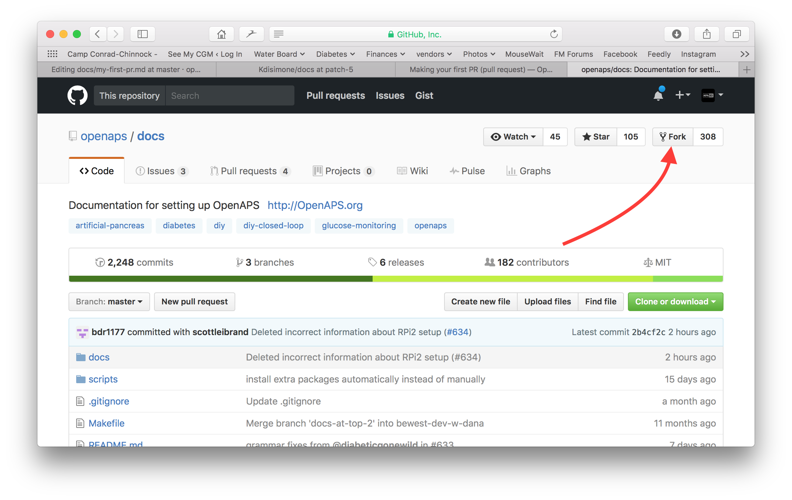
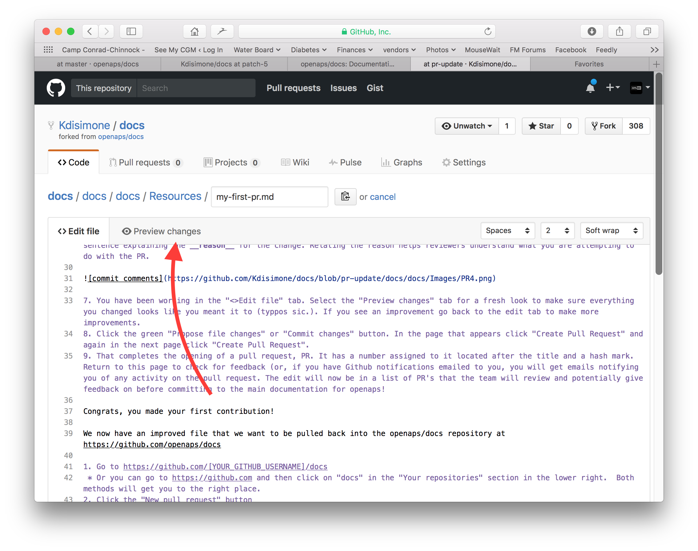
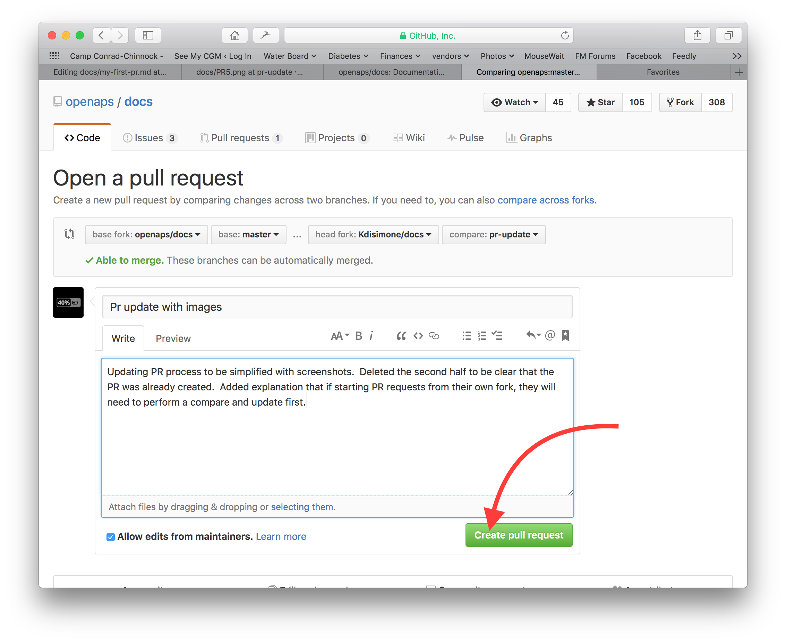

# Wie man die Dokumentation bearbeitet

**An dieser Stelle wird nur die Bearbeitung der englischen Dokumentation erläutert. Alle neuen Informationen müssen zuerst in Englisch eingegeben werden. Falls du diese in eine andere Sprache übersetzen willst (Danke dafür!), nutze bitte [crowdin](https://crowdin.com/project/androidapsdocs).**

Hinweise zum Formatieren von Texten (Überschriften, fett...) und zum Setzen von Links findest Du weiter unten auf dieser Seite im Bereich ["Code-Syntax"](./make-a-PR#code-syntax).

## Allgemein

Bei Fragen, Feedback oder neuen Ideen für die Dokumentation erreichst Du das Dokumentations-Team über [Discord](https://discord.gg/4fQUWHZ4Mw).

Irgendwann wird vorgeschlagen, dass Du einen Pull-Request (PR) erstellst, der dafür sorgt, dass Deine Verbesserungen der Dokumention auch auf den AAPS Webseiten, die in GitHub gespeichert sind, sichtbar werden. Es ist eigentlich nicht allzu schwer und eine gute Möglichkeit, Deinen Beitrag zu leisten. Du kannst genau diese Dokumentation lesen, weil Leute wie Du solche PRs erstellt haben. Mach dir keine Sorgen einen Fehler zu machen oder irgendwie die falschen Dokumente zu bearbeiten. Deine Änderungen werden immer durch eine zweite Person Korrektur gelesen, bevor sie in die "finale" AAPS-Dokumentation integriert werden. Auch wenn Du Fehler bei der PR-Erstellung machen solltest, kannst Du die Originalversion nicht versehentlich kaputt machen. Die allgemeine Vorgehensweise ist:

- Mache Änderungen und Verbesserungen am Code oder der Dokumentation, indem du das bestehende Dokument veränderst.
- Vergewissere dich, dass die Änderungen gut aussehen.
- Füge Notizen hinzu, damit andere die Änderungen verstehen können.
- Erstelle einen Pull-Request, durch den die Administratoren aufgefordert werden deine Änderungen zu verwenden.
- Sie werden sich das anschauen und entweder (1) deine Änderungen übernehmen (2) deine Änderungen kommentieren oder (3) ein neues Dokument mit deinen Änderungen erstellen.

(Randbemerkung: Wenn Du ein visueller Lerner bist, gibt es [hier](https://youtu.be/4b6tsL0_kzg) ein YouTube Video, das den PR-Prozess darstellt.)

In unserem Beispiel nehmen wir nun eine Änderung an der AndroidAPS-Dokumentation vor. Es kann auf jedem Windows-PC, Mac, etc. erfolgen. (jedem Computer mit Internet-Zugang).

1. Gehe zu <https://github.com/openaps/AndroidAPSdocs> und klicke auf "Fork" oben rechts, um Deine eigene Kopie des Repositories (dt. Quellcode) zu machen.



2. Wechsle zu einer beliebigen Seite und navigiere zu der Seite, die du bearbeiten möchtest. Du kannst oben rechts in der Ecke auf den „Edit in GitHub"-Link klicken. Das ausschließlich für die englisch-sprachigen (Original-) Seiten möglich. 


Oder klicke auf das Stift-Symbol, das in der oberen Leiste der zu bearbeitenden Seiteninhalte erscheint. Du musst in Deinem GitHub-Konto angemeldet sein, um dies zu tun (falls Du noch keines hast, kannst Du es problemlos einrichten).


3. Beide Optionen in Schritt 2 führen dazu, dass ein neuer Branch in DEINEM kopierten Repository erstellt wird, wo die Änderungen gespeichert werden sollen. Editiere die Datei.

Wir verwenden Markdown für die Dokumentation. Die Datei hat das Suffix ".md". Die Markdown-Spezifikation ist nicht fixiert und wir verwenden im Moment den myst_parser für unsere Markdown-Dateien. Achte auf die [unten](#code-syntax) beschriebene richtige Syntax.


4. Du arbeitest im "<>Edit file" Reiter. Wechsle zum „Preview changes“-Reiter, um auf die Vorschau einen Blick zu werfen, damit alles, was Du geändert hast, so aussieht, wie Du es wolltest (Rechtschreibfehler prüfen). Wenn du etwas entdeckst, das ausgebessert werden muss, wechsle wieder zum edit Reiter, um die Ausbesserungen vorzunehmen. 



5. Wenn du mit deinen Änderungen fertig bist, scrolle zum Seitenende. In der Box am Seitenende solltest du deine Kommentare im Textfeld namens "Add an optional extended description..." einfügen. Der Standardtitel beinhaltet den Dateinamen. Versuche einen Satz dazu zu schreiben, **warum** du etwas geändert hast. Die Angabe des Grundes hilft den Admins zu verstehen, was du mit deinem PR bezweckst.


6. Klicke auf den grünen "Propose file changes" (Änderungen vorschlagen) oder "Commit changes" (Änderungen integrieren) Button. Auf der Seite, die dann erscheint, klicke auf "Create Pull Request" und auf der dann erscheinenden Seite klicke auf "Create Pull Request".



7. Das war der letzte Schritt zur Erstellung eines pull requests, PR. GitHub ordnet dem PR eine Nummer, die du nach dem Titel findest, zu und einen Hashtag. Rufe diese Seite wieder auf, um Feedback zu erhalten (oder du erhältst automatisch E-Mail Benachrichtigungen über Aktivitäten bei deinem PR, wenn du Github entsprechend konfiguriert hast). Die Änderung wird nun in einer Liste von PRs enthalten sein, die das Team überprüfen wird. Es wird gegebenenfalls Rückmeldungen dazu geben, bevor die Änderung in die Hauptdokumentation für AAPS einfließt! Wenn du den Fortschritt des PR überprüfen willst, kannst du auf das Logo mit der Glocke in der oberen rechten Ecke deines GitHub-Kontos klicken, wo du dann alle deine PRs siehst.


PS: dein Fork und Branch befinden sich nach wie vor auf deinem persönlichen GitHub Konto. Nachdem du die Benachrichtigung erhalten hast, dass dein PR integriert wurde, kannst du deinen Branch löschen, wenn du damit fertig bist (der Benachrichtigungsbereich in Schritt 8 stellt dir einen Link zur Verfügung, um den Branch zu löschen, wenn er geschlossen oder integriert wurde). Künftige Änderungen werden immer mit einer aktuellen Version des AndroidAPS Repositories beginnen, wenn du diese Vorgehensweise verwendest. Wenn du eine andere Methode verwendest, um einen PR zu starten (z.B. du fängst mit einem lokalen Fork des Master Branches an), musst du sicherstellen, dass dein Repository aktuell ist, indem du erst ein "compare" ausführst und damit alle Updates integrierst, die seit dem letzten Update deines Forks stattgefunden haben. Da häufig vergessen wird, die eigenen Repositories auf dem aktuellen Stand zu halten, empfehlen wir, den PR Prozess wie oben beschrieben zu verwenden, bis du dich mit der Ausführung von "compares" vertraut gemacht hast.

(edit-the-docs-code-syntax)=

## Code-Syntax

Wir verwenden Markdown für die Dokumentation. Die Dateien haben die Endung "*.md".

Markdown ist eine sehr einfache Textformatierungssprache, die Inhalte von der Formatierung trennt.

Der Autor markiert z.B. eine Überschrift als Überschrift 1 und in der Markdown-Verarbeitung wird daraus der entsprechende HTML Code erzeugt, der diese Textstelle wie gewünscht formatiert.

Die Idee dahinter ist, dass

- der Autor sich auf den Text konzentrieren kann und weniger auf die Formatierung,
- der Markdown-Text offen für den Austausch zwischen verschiedenen Markdown-Tools ist und nicht von proprietären Tools wie Microsoft Windows abhängt und
- mehrere Ausgabeformate aus einer Markdown-Datei erzeugt werden können.

Markdown ist kein 100%iger fester Standard und wir versuchen, so nah wie möglich an diesem Standard zu bleiben, um

- fllexibel im Hinblick auf einen möglichen, durch Innovationen erzwungenen Wechsel, des Markdown-Tools und des Markdown SaaS-Services zu bleiben und
- Übersetzungsdienste für die Übersetzung des englischen Textes in eine Zielsprache wie Französisch oder Deutsch nutzen zu können. Diese arbeiten mit Markdown zusammen, allerdings können diese Dienste nicht mit komplexen Formatierungen umgehen. Da sie nicht zwischen Inhalt und Formiertung unterscheiden können, kann das Ergebnis mitunter fatal sein.

### Überschriften

- Überschrift 1: `# Überschrift`
- Überschrift 2: `## Überschrift`
- Überschrift 3: `### Überschrift`
- Überschrift 4: `### Überschrift`

Wir versuchen uns auf diese Überschriften zu beschränken.

### Textformatierung

- **fett**: `**text**`
- *kursiv*: `*text*`
- ***fett kursiv***: `***text***`

### Nummerierte Liste

    1. erste
    1. zweite
    1. dritte
    

1. erste
2. zweite
3. dritte

### Ungeordnete Liste

    - ein Element
    - ein anderes Element
    - und ein anderes Element
    

- ein Element
- eine andere HTML-Element.
- und ein anderes Element

### Liste mit mehreren Ebenen

Um Listen in Listen einfügen, rückst Du die nächste Ebene mit 4 zusätzlichen Leerzeichen zur vorangegangenen Ebene nach rechts ein.

    1. erste
    1. zweite
    1. dritte
      1. ein Element
      1. ein anderes Element
      1. und ein anderes Element.
    1. vier
    1. fünf
    1. sechs
    

1. erste
2. zweite
3. dritte 
    1. ein Element
    2. eine andere HTML-Element.
    3. und ein anderes Element
4. vier
5. fünf
6. sechs

### Bilder

Um Bilder einzubinden, verwenden Sie diese Markdown-Syntax.

- Bilder: ``

Der Bildtyp sollte PNG oder JPEG sein.

Bildnamen sollten einer der folgenden Namenskonventionen folgen. Im Beispiel benutze ich png als Dateiendung. Falls Du JPEG verwendest, nutze als Dateiendung jpeg.

- `filename-image-xx.png` wobei xx is eine eindeutige zweistellige Zahl für die Bilder in der Datei ist.
- `filename-image-xx.png` wobei xx ein sprechender Name für den Dateiauthor der md-Datei ist.

Bilder befinden sich im 'images'-Ordner der englischen Dokumentation und werden von Crowdin automatisch in die anderen Sprachen überführt. Du musst hier nichts tun!

Derzeit übersetzen wir keine Bilder und Grafiken: Bilder sollten **so wenig Text wie möglich** enthalten, um die Inhalte damit auch nicht englischsprachigen Menschen zugänglich zu machen.

(make-a-PR-image-size)= Verwende eine sinnvolle Bildauflösung, die auf PC, Tablet und Mobiltelefonen lesbar ist.

- Screenshots von Webseiten sollten bis zu **1050 Pixel breit** sein.
- Prozessdiagramme sollten bis zu **1050 Pixel breit** sein.
- Screenshots aus der App sollten bis zu **500 Pixel breit** sein. Platziere sie nicht nebeneinander, wenn es nicht unbedingt notwendig ist.

### Links

#### Externe Links

Externe Links sind Links auf externe Webseiten.

- externe Links: `[Linktext](www.url.tld)`

#### Interne Links auf den Anfang einer md-Datei

Interne Links auf Seiten, sind Links auf den Anfang einer md-Datei, die auf unserem eigenen Server abgelegt sind.

- Interne Links zu .md Seiten: `[Linktext](.../folder/file.md)`

#### Interne Links auf bestimmte Textstellen (Textanker)

Textanker sind Links auf eine beliebige Textstelle in einer md-Datei auf unseren eigenen Servern, die als Sprungziel (Anker) festgelegt wurden.

Setze einen Textanker an die Stelle in der Zieldatei, an die gesprungen werden soll.

`(name-of-my-md-file-this-is-my-fancy-named-reference)=`

Der Textanker muss innerhalb aller AndroidAPSDocs md-Dateien eindeutig sein und nicht nur in der verwendeten md-Datei!

Es hat sich daher bewährt, als Namen den Dateinamen und eine zusätzliche Referenz zu wählen.

Verwende ausschließlich Kleinbuchstaben und verbinde Wörter mit Bindestrichen.

Mit der folgenden Schreibweise kannst Du den Link in Deinem Text setzen.

- Link auf einen Textanker: `[alt text](name-of-my-md-file-this-is-my-fancy-named-reference)`

### Notizen, Warnungen, Ausklappinformationen

Du kannst Notizen und Warnboxen zur Dokumentation hinzufügen.

Zusätzlich kannst Du ausklappbare Hinweise für Detail- und Zusatzinformationen hinzufügen. Damit wird ein besserer Lesefluss für nicht Interessierte erreicht. Um die Dokumentation leicht lesen zu können, nutze Notizen, Warnungen und Detailinformationen sehr dosiert.

#### Notiz

    ```{admonition} Notizüberschrift
    :class: note
    Das ist eine Notiz.
    ```
    

```{admonition} Notizüberschrift :class: note Das ist eine Notiz.

    <br /><br />#### Warnings
    
    ````
    ```{admonition} Warning
    :class: warning
    This is a warning.
    

    ```{admonition} Warnungsüberschrift 
    :class: warning
    Dies ist eine Warnung.
    ```
    
    #### Aufklappbare Notizen
    
    

    W{admonition} Weiterführende Informationen für interessierte Lesende
    :class: dropdown
    
    Dieser Abschnitt wurde eingeklappt,
    d.h. Du kannst längere Formularinhalte hinzufügen, 
    ohne dass sie in der Dokumentation einen zu großen Raum einnehmen.
    

````

```{admonition} Weiterführende Informationen für interessierte Lesende :class: dropdown Dieser Abschnitt wurde eingeklappt, d.h. Du kannst längere Formularinhalte hinzufügen, ohne dass sie in der Dokumentation einen zu großen Raum einnehmen.

```

## Tabellen

Vermeide lange Textpassagen in Tabellen, da der Inhalt in Markdown schwer umzusetzen ist. In der Regel passen sie nicht in eine Bildschirmbreite des Smartphones und werden nach der Übersetzung wahrscheinlich anders dargestellt.

## Styleguide

### Inhalt

1. Schreibtipps für die englische Sprache

2. AAPS-spezifische Schreibhinweise

3. Nützliche Referenzen

###  1\. Schreibtipps für die englische Sprache

#### Verwende eine Sprache, die für den Leser geeignet ist

Benutze einfaches Englisch wo immer es möglich ist. Dies hilft nicht-native Lesern und hilft auch bei der Übersetzung von AAPS-Dokumenten in andere Sprachen. Schreibe wie in einer Konversation mit jemand, der Dir gegenüber sitzt. Bedenke - die meisten AAPS-Benutzer haben keine Programmier-Kenntnisse. Die Diabetes-Fachsprache hat auch eine Menge Jargon und Abkürzungen. Denke daran, dass einige, erst kürzlich diagnostizierte Diabetiker, eventuell nicht so erfahren mit dem Diabetes sein werden wie du; vielleicht haben sie sogar eine ganz andere Diabetesschulung erhalten. Wenn Du ein Stichwort oder eine Abkürzung verwendest, schreibe es beim ersten Mal vollständig aus und die Abkürzung direkt danach in Klammern wie „SuperMikroBolus (SMB)“. Verweise außerdem auf das Glossar. Technische Begriffe, die dem Leser vielleicht nicht bekannt sind, können auch in Klammern eingefügt werden.

Anstelle von: *„Was verursacht hohe postprandiale Blutzuckerspitzen beim "Closed Loop"?“*

Verwende: *„Was verursacht eine hohe Blutzuckerspitze **nach dem Essen** (postprandial) beim "Closed Loop"? "*

##### Benutze einfache Worte, die jeder verstehen kann

Hier findest Du alternative Wörter von A-Z, die ein verständliches Schreiben leichter machen:

<https://www.plainenglish.co.uk/the-a-z-of-alternative-words.html>

#### Datenschutz/Lizenz Angelegenheiten:

Achte besonders darauf, dass Du bei Videoaufnahmen oder Screenshots keine persönlichen Informationen (Passwörter oder Deinen API-Schlüssel) preisgibst. YouTube-Inhalte sollten nur über einen Link aus der Dokumentation aufrufbar und nicht öffentlich gelistet sein. Vermeide es, die Aufmerksamkeit auf urheberrechtsverletzendes Material (BYODA etc) zu lenken.

#### Nutze kurze und präzise Sätze

- Ein gut verständlicher Schreibstil hat eine durchschnittliche Satzlänge mit 15 bis 20 Worten.

- Das soll nicht heißen, dass jeder Satz gleich lang sein sollte. Sei auf den Punkt. Schreibe abwechslungsreich, indem Du kürzere (wie den letzten Satz) und längere Sätze (wie diesen hier) miteinander mischt.

- Bleibe in einem Satz bei einem Hauptgedanken und ergänze ihn mit maximal einem weiteren relevanten Punkt.

- Du wirst Dich vielleicht dabei ertappen, insbesondere bei der Erklärung komplizierter Punkte, seltsame lange Sätze zu schreiben. Die meisten langen Sätze lassen sich in irgendeiner Weise aufteilen und verkürzen.

- Lösche "schwache" Wörter wie „Du kannst“, „Dort sind/waren“, „um zu“.

- Nutze Schlüsselwörter direkt am Anfang eines Titels, Satzes oder Abschnitts.

- Visualisiere! Verwende wann immer es möglich ist, einfache Diagramme, Screenshots oder Videos.

#### Keine Angst vor klaren Anweisungen

Befehle sind der schnellste Weg, um Anweisungen zu geben. Manchmal sträuben sich Autoren Befehle zu geben und schreiben anstelle von „tue dies“, „Du solltest nun dies tun“. Vielleicht befürchten Menschen zu streng zu klingen. Durch ein "bitte" davor kannst Du das abmildern. Wenn etwas erledigt werden muss, verzichte auf ein "bitte", da der Lesende sonst damit die Möglichkeit bekommt es nicht zu tun.

Anstelle von: *Du solltest darüber nachdenken, ob dies eine vollständige Aussage ist.*

Verwende: *„Nimm es als vollständige Aussage.“*

#### Verwende aktive Verben anstelle des Passiv

Beispiel eines **aktiven Verbs**:

- *„Die Pumpe (Subjekt) liefert (Verb) das Insulin (Objekt).“*

"liefern" ist hier ein Aktivverb. Der Satz sagt, was getan wird (liefern), bevor er sagt, was geliefert wird.

Beispiel eines **passiven Verbs**:

- *„Das Insulin (Subjekt) wird (Verb) von der Pumpe (Objekt) geliefert“*

*„wird geliefert“* ist hier passiv. Das Subjekt und das Objekt sind im Vergleich zum Aktivsatz vertauscht. Wir mussten den Satz verlängern, indem wir "wird" und "von der" hinzufügten. Es kann auch mit dem aktiven Verb begonnen werden.

Anstatt: *„Du können Ihre Pumpe über das AAPS-Pumpenmenü mit dem Smartphone verbinden, und es stehen Dir eine Reihe von Pumpen zur Verfügung, mit denen Du sie verbinden kannst.“*

Verwende: *„Verbinde die gewünschte Pumpe über das AAPS-Pumpenmenü mit dem Smartphone.“*

Passivverben können zu Problemen führen:

- Sie können verwirrend sein.

- Sie machen das Schreiben oft umständlicher.

- Sie machen das Schreiben weniger lebendig.

##### Gute Verwendung des Passivs

Es gibt Situationen, in denen es richtig sein kann, das Passiv zu verwenden.

- Um etwas weniger feindlich zu machen - 'diese Rechnung wurde nicht bezahlt' (passiv) ist weicher als 'du hast diese Rechnung nicht bezahlt' (aktiv).

- Um die Schuld zu vermeiden - 'ein Fehler wurde gemacht' (passiv) anstatt 'Du hast einen Fehler gemacht' (aktiv).

- Wenn Sie nicht wissen, wer oder was der Handelnde ist - 'das englische Team wurde ausgewählt'.

- Wenn es einfach besser klingt.

#### Vermeide Substantivierungen

Eine Substantivierung ist der Name von etwas, das kein physisches Objekt ist, wie ein Prozess, eine Technik oder eine Emotion ist. Substantivierungen (Nominalisierungen) werden aus Verben gebildet.

Zum Beispiel:

| Verb          | Nominalisierung   |
| ------------- | ----------------- |
| abgeschlossen | Abgeschlossenheit |
| einführen     | Einführung        |
| bereitstellen | Bereitstellung    |
| scheitern     | Fehlschlag        |

Sie werden oft **anstelle** der Verben, von denen sie abgeleitet sind, <0>verwendet</0>. Sie klingen allerdings so als würde nichts passieren. Zu viele davon machen das Schreiben zäh und langweilig.

Anstelle von: *„Die Umsetzung der Methode wurde von einem Team durchgeführt.“*

Verwende: *„Ein Team hat die Methode implementiert.“*

#### Verwende Listen, wenn es passt

Die Listen eignen sich hervorragend zum Aufteilen von Informationen. Es gibt zwei Hauptarten:

- Einen durchgehenden Satz mit einzelnen hervorgehobenen Punkten am Anfang, in der Mitte oder am Ende.

- Getrennte Aufzählungspunkte mit einer einleitenden Aussage.

In der obigen Aufzählung ist jeder Punkt ein vollständiger Satz, daher beginnen sie alle mit einem Großbuchstaben und enden mit einem Punkt. Verwende Aufzählungszeichen anstelle von Zahlen oder Buchstaben. Diese lenken die Aufmerksamkeit auf jeden Punkt lenken, ohne diese mit Zusatzinformationen zu überladen.

#### Entzauberte Mythen

- Du kannst einen Satz mit **und, aber, weil, so oder wie dem auch sei** beginnen.

- Du kannst Infinitive teilen. Du kannst also **“to boldly go”** sagen.

- Du kannst einen Satz mit einer Präposition beenden. Im Engl.: In fact, it is something **we should stand up for**.

- Und **Du** kannst dasselbe **Wort** zweimal in einem Satz verwenden, wenn **Du** kein besseres **Wort** findest.

#### Bewusste Optimierung des Schreibstils

Um die Dokumentation übersichtlich und kurz zu halten, schreiben wir verschiedene Abschnitte der Dokumentation in verschiedenen Stilen.

Ein "Erklärstil" wird für die Abschnitte der Einleitung, Hintergründe und Wissensaufbau verwendet.

Ein Anleitungsstil (mit sehr wenigen Erklärungen) wird für den Aufbau, die AAPS Konfiguration und einige der Problembehandlungsabschnitte verwendet.

Ein Tutorial hilft dem Schüler grundlegende Kompetenzen zu erwerben. Der Benutzer wird **durch praktisches Tun lernen**.


#####  Anleitungen (z. B. einem Kind beibringen, Eiweiß zu schlagen)

- Der Erzähler spricht direkt mit dem Lesenden: In diesem Tutorial wirst **Du** (wir) könnte verwendet werden, um die Haltung "wir sitzen im gleichen Boot" zu betonen

- Zukunftsform -> um den Zielzustand zu beschreiben

- Imperativ -> um die Aufgaben zu erledigen -> Konkrete Schritte - abstrakte Konzepte vermeiden

- Vergangenheit -> um abgeschlossene Aufgaben zu zeigen -> Schnelle und sofort sichtbare Ergebnisse

- Minimale Erklärungen -> streng notwendig, um die Aufgabe abzuschließen - **was und warum**

- Ignoriere Optionen/Alternativen/…. Keine Mehrdeutigkeit

- Schrittübergänge: Einen Schritt mit einem Satz beenden, der als logischer Ablauf zum nächsten Schritt führt. Beispiel: *Du hast nun den Let's Encrypt-Client installiert, aber bevor Du Zertifikate erhälst, musst Du sicherstellen, dass alle erforderlichen Ports geöffnet sind. Dazu wirst Du im nächsten Schritt Deine Firewall-Einstellungen anpassen.*

- **Anleitung** Titel (Level 1 Überschrift)

- Einleitung (keine Überschrift)

- Voraussetzungen (Level 2 Überschrift)

- Schritte:

- Schritt 1 – Das Erste tun (Level 2 Überschrift)

- Schritt 2 – Das Nächste tun (Level 2 Überschrift)

- Schritt n — Das Letzte tun (Level 2 Überschrift)

- Fazit (Level 2 Überschrift)
    
    - **Die Sprache in Tutorials**
        
        *In diesem Tutorial wirst Du …*
        
        Beschreibe, was der Lernende am Ende erreichen wird (Anmerkung - nicht: „Du wirst lernen …“).
        
        *Mache als erstes X. Jetzt mache y. Jetzt, wo y erledigt ist, mache z.*
        
        Lasse keinen Raum für Mehrdeutigkeit oder Zweifel.
        
        *Wir müssen immer x tun, bevor wir y tun, weil… (siehe Erklärung für weitere Details).*
        
        Gib eine sehr kurze Erklärung der Aktionen in der einfachst möglichen Sprache. Verlinke auf detailliertere Erklärungen.
        
        *Das Ergebnis sollte in etwas so aussehen ...*
        
        Vermittle den Lernenden eine klare Erwartung.
        
        *Beachte, dass… Denke daran, dass…*
        
        Gib den Lernenden viele Hinweise, aus denen sie erkennen können, dass sie auf dem richtigen Weg sind und sich selbst orientieren können.
        
        *Du hast eine sichere, dreischichtige hylomorphe Stasis-Engine… gebaut*
        
        Beschreibe (und wertschätze in einer vorsichtigen Form), was Deine Lernenden erreicht haben (beachte - nicht: „Du hast ... gelernt“)

#####  Anleitungen (z.B. Rezepte)

Eine Anleitung soll dem bereits kompetenten Anwender helfen, eine bestimmte Aufgabe korrekt zu erledigen.

- Anleitung

- Erzähler spricht direkt mit dem Lesenden: In diesem Tutorial wirst **Du**

- Zukunftsform -> um den Zielzustand zu beschreiben

- Konditionaler Imperativ -> um X dazu zu bringen y zu machen -> Konkrete Schritte - abstrakte Konzepte vermeiden

- Minimale Erklärungen -> Unbedingt notwendig, um die Aufgabe abzuschließen - **was und warum**

- Ignoriere Optionen/Alternativen/…. Keine Mehrdeutigkeit, aber Du kannst auf einen Referenzeintrag oder einen Erklärungseintrag verweisen

- **Anleitung** Titel (Level 1 Überschrift)

- Einleitungstext

- Optionale Voraussetzungen (Absatz oder Level 2 Überschrift, wenn mehr als 1)

- Schritte:

- Schritt 1 – Das Erste tun (Level 2 Überschrift)

- Schritt 2 – Das Nächste tun (Level 2 Überschrift)

- Schritt n — Das Letzte tun (Level 2 Überschrift)

- Zusammenfassender Abschnitt
    
    - **Die Sprache in Anleitungen**
        
        *Diese Anleitung zeigt Dir, wie ...*
        
        Benenne das mit der Anleitung zu lösende Problem oder die Aufgabe sehr klar
        
        *Wenn Du x erreichen möchtest, mache y. Um w zu erreichen, tue z.*
        
        Verwende konditionale Imperative.
        
        *Eine vollständige Liste aller Optionen findest Du Referenzen--Anleitung.*
        
        Halte Deine praktische Anleitung frei von allen möglichen Dingen, die der Benutzer im Zusammenhang mit X machen könnte.

#####  Erklärung (z. B. wissenschaftlicher Hintergrund, warum Eiweiß beim Schlagen steif wird)

Eine Erklärung klärt, vertieft und erweitert das Verständnis des Lesenden für ein Thema.

- WARUM

- Starte mit **Über**

- Gib den Kontext mit und stelle ALLE Referenzen zur Verfügung

- Diskutiere Optionen/Alternativen

- Keine einzelnen Anweisungen oder Referenzen (verlinke auf die Quelle)

- Besprich das Unbekannte oder sich noch verändernde Zielsetzungen…

- **Über** Titel (Level 1 Überschrift)

- Einleitung (keine Überschrift)

- Optionale Voraussetzungen (Level 2 Überschrift)

- Unterthema 1 (Level 2 Überschrift)

- Fazit (Level 2 Überschrift)
    
    - **Die Sprache in Erklärungen**
    
    *Der Grund für x ist historisch, y…*
    
    Erkläre.
    
    *W ist besser als z, weil…*
    
    Biete Einschätzungen oder sogar Meinungen an, wo sie sinnvoll erscheinen.
    
    *Ein x in System y ist analog zu einem w in System z. Allerdings…*
    
    Gib den Kontext, der dem Lesenden hilft, mit.
    
    *Einige Benutzende bevorzugen w (weil z). Dies kann ein guter Ansatz sein, aber…*
    
    Wäge die Alternativen ab.
    
    *Ein x interagiert mit einem y wie folgt:…*
    
    Lege die inneren Geheimnisse der Maschine offen, um zu verstehen, warum etwas tut, was es tut.

### 2\. AAPS-spezifische Schreib- und Aktualisierungshinweise

#### Autor & Lektor

Um die AAPS-Dokumentation zu schreiben/zu aktualisieren, sind zwei Schritte notwendig. Diese können - zu unterschiedlichen Zeitpunkten - von derselben Person oder verschiedenen Person durchgeführt werden.

Ein **Autor (z.B. Du!)** schreibt einen Abschnitt der Dokumentation in knapper Umgangssprache und übergibt ihn dann an einen Lektor.

Der **Lektor (z. B. ein AAPS-Nutzender oder die Person, die die Pull-Request erhält)** überprüft die Einhaltung des Style-Guides und editiert den Abschnitt, um ihn noch klarer und zugänglicher zu machen, indem so viele Wörter wie möglich entfernt werden (insbesondere für Tutorials/Anleitungen). Lautes Vorlesen hilft dabei manchmal.

#### Allgemeine AAPS-Punkte

- Bei Glukosewerten verwende immer sowohl mg/dl als auch mmol/l (wenn möglich auch bei Screenshots).

- Aus Konsistenzgründen verwende “AAPS” an Stelle von “Android APS”.

- Beschreibe klar, auf welche Android Studio/AAPS-Version sich Dein Text oder sich ein Screenshot bezieht.

### 3\. Nützliche Referenzen

<https://dev.readthedocs.io/en/latest/style-guide.html>

[Diátaxis (diataxis.fr)](https://diataxis.fr/)

[Technical Writer Style Guide Examples | Technical Writer HQ](https://technicalwriterhq.com/writing/technical-writing/technical-writer-style-guide/)

[](https://www.digitalocean.com/community/tutorials/digitalocean-s-technical-writing-guidelines)

[](https://learn.microsoft.com/en-us/style-guide/top-10-tips-style-voice?source=recommendations)

<https://www.plainenglish.co.uk/how-to-write-in-plain-english.html>

<https://developers.google.com/style>

<https://www.mongodb.com/docs/meta/style-guide/screenshots/screenshot-guidelines/>