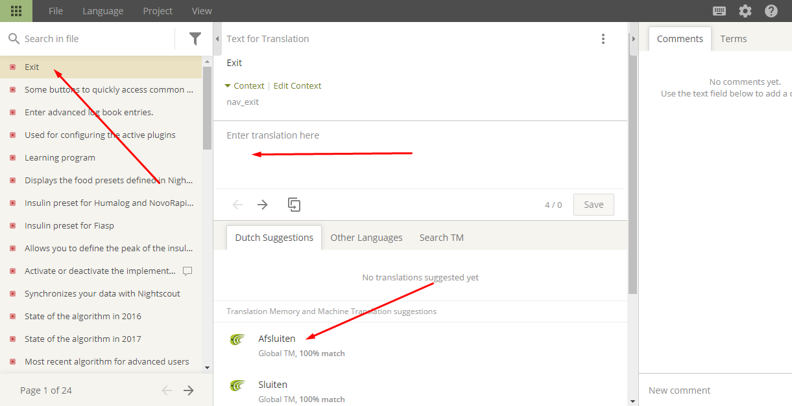

# Wie man Textabschnitte für die AAPS-App oder die Dokumentation übersetzt

* Für die Zeichenketten, die in der App verwendet werden, gehe zu <https://crowdin.com/project/androidaps> und melden Dich mit Deinem GitHub Konto an
* Für die Dokumentation besuche bitte <https://crowdin.com/project/androidapsdocs> und melde Dich mit Deinem GitHub Account an

* Sende Deinen Beitrittswunsch an das Docs-Team. Klicke dazu auf die Fahne der gewünschten Sprache und dann auf der nächsten Seite rechts oben auf den Button "Join". Gib die gewünschte(n) Sprach(n) an, ein paar Infos zu Dir und Deiner AAPS Erfahrung und auch, ob Du als Übersetzer oder Lektor (nur Personen mit Übersetzungs- und längerer AAPS-Erfahrung) unterstützen möchtest.

```{admonition} Zeit für die Freigabe :class: note

Die Genehmigung ist ein manueller Schritt. Als gemeinnützige Organisation stellen wir keine SLAs zur Verfügung, aber im Allgemeinen erfolgt die Genehmigung in < 1 Tag. Falls nicht, kontaktiere bitte das Doc Team über Facebook oder Discord.

    <br />* Wenn wir Dich aufnehmen, klicke auf die Flagge
       
    
    ## Übersetzung der App
    
    (translations-translate-strings-for-AAPS-app)=
    ### Zeichenketten für die AAPS-App übersetzen
    
    * Wenn Du keine von Dir speziell ausgewählten Zeichenketten übersetzen willst, wähle einfach die Schaltfläche „Translate All“, um zu starten. Es zeigt Dir direkt die Zeichenketten, die übersetzt werden müssen.
    
       
    
    * Wenn Du eine einzelne Datei übersetzen möchtest, suche bitte die Datei über den Suchdialog oder die Baumstruktur und klicke auf den Dateinamen, um die Übersetzungsarbeit an den Zeichenketten in dieser Datei zu starten.
    
       
    
    * Übersetze Sätze auf der linken Seite durch die Eingabe einer eigenen neuen Übersetzung oder bearbeite einen Übersetzungsvorschlag 
    
       
    
    
    ### Strings (Zeichenketten) der AAPS-App korrekturlesen
    
    * Korrekturlesende starten das Korrekturlesen, indem Sie auf dem Startschirm des Projekts „Proofread“ aufrufen.
    
        
    
    
      und genehmige übersetzte Texte 
    
       
    
    Wenn ein Korrekturlesender eine Übersetzung genehmigt, wird diese zur nächsten AAPS-Version hinzugefügt.
    
    (translations-translation-of-the-documentation)=
    ## Übersetzung der Dokumentation
    
    * Klicke zum Start der Übersetzung auf den Namen der Seite der Dokumentation, die Du übersetzen willst
    
    
    
    
    * Übersetze Satz für Satz
    
        1. Der gelbe Text ist der Text, an dem Du gerade arbeitest.
    
        1. Der grüne Text ist bereits übersetzt. Du musst dies nicht nochmals tun.
    
        1. Der rote Text ist der verbleibende Text, der übersetzt werden muss.
    
        1. Dies ist der Quelltext, an dem Du gerade arbeitest. Dies ist die Übersetzung, die Du gerade vorbereitest. Du kannst den Text von oben kopieren oder einen der folgenden Vorschläge auswählen.
    
        1. Dies sind die Vorschläge für eine Übersetzung. Vor allem kannst Du sehen, wie sehr Crowdin dies als passend bewertet, oder ob es schon als Übersetzung für diesen Text verwendet in der Vergangenheit verwendet wurde und die neue Übersetzung nur durch Textverschiebungen hervorgerufen wurde, aber nicht durch Änderungen der Inhalte.
        1. Drücke die Schaltfläche "Speichern", um einen Vorschlag für die Übersetzung zu speichern. Er wird dann zu einem Proofreader zur abschließenden Freigabe gegeben.
    
    
    
    * Eine übersetzte Seite wird nicht veröffentlicht, bevor 
    
        1. für die Übersetzung ein Proofread (Korrekturlesen) durchgeführt wurde
    
        1. die Synchronisierung zwischen Crowdin und Github durchgeführt wurde (einmal pro Stunde), wodurch ein PR für Github erstellt wird.
    
        1. der PR in Github genehmigt wurde.
    
    In der Regel erfolgt die Freigabe innerhalb von 1 - 3 Tage, kann aber in Urlaubszeiten auch einmal etwas länger dauern.
    
    ### Übersetzen von Links
    
    ```{admonition} Links werden nicht mehr übersetzt
    :class: note
    
    Links werden nicht mehr übersetzt. In der Vergangenheit hatten wir hier ein Thema, aber mit der Migraton nach Markdown und den myst_parser erzeugen wir im englischen Text  explizite Labels , die nicht übersetzt werden.
    
    

Wenn Du einen Text mit einem Link übersetzt, Achte darauf den Link **nicht** zu entfernen, der durch ein Paar `<0></0>` Tags dargestellt wird oder mit einer anderen Zahl, falls mehrere Links in einem Absatz enthalten sind.

Es ist die Aufgabe des Proofreaders, einen besonderen Blick darauf zu haben!

### Korrekturlesen

* Proofreader müssen zum Proofreading-Modus wechseln
    
    
    
    und geben übersetzte Texte frei.
    
    

* Wenn ein Korrekturleser eine Übersetzung annimmt, wird sie in die nächste Dokumentations-Version hinzugefügt, die in keinem festen Zeitplan erstellt, sondern bei Bedarf etwa einmal pro Woche außer während der Feiertage. Um den Prozess zu beschleunigen, kannst Du das Docs-Team über neue Übersetzungen informieren.